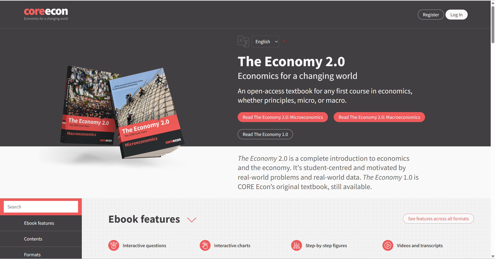
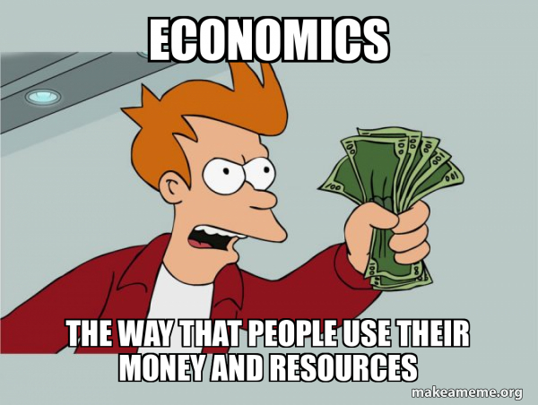
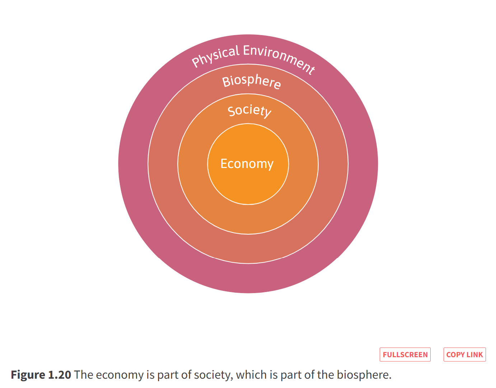
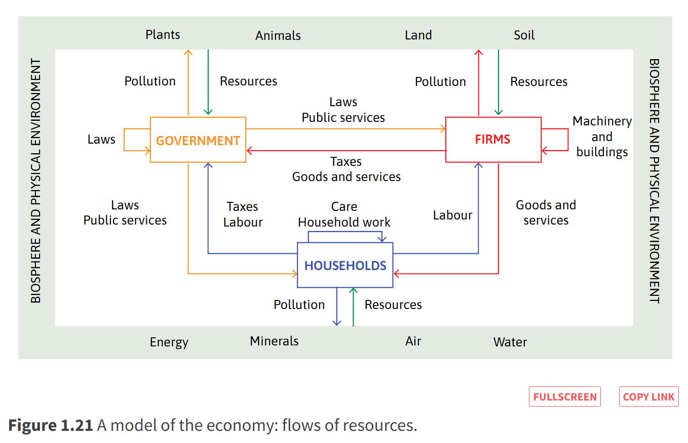
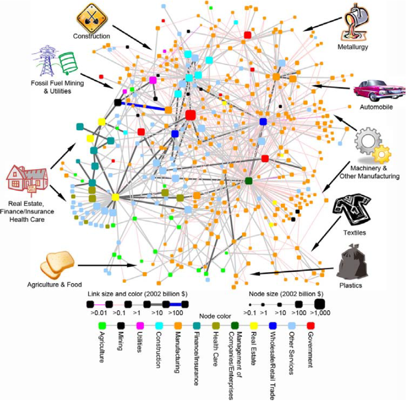
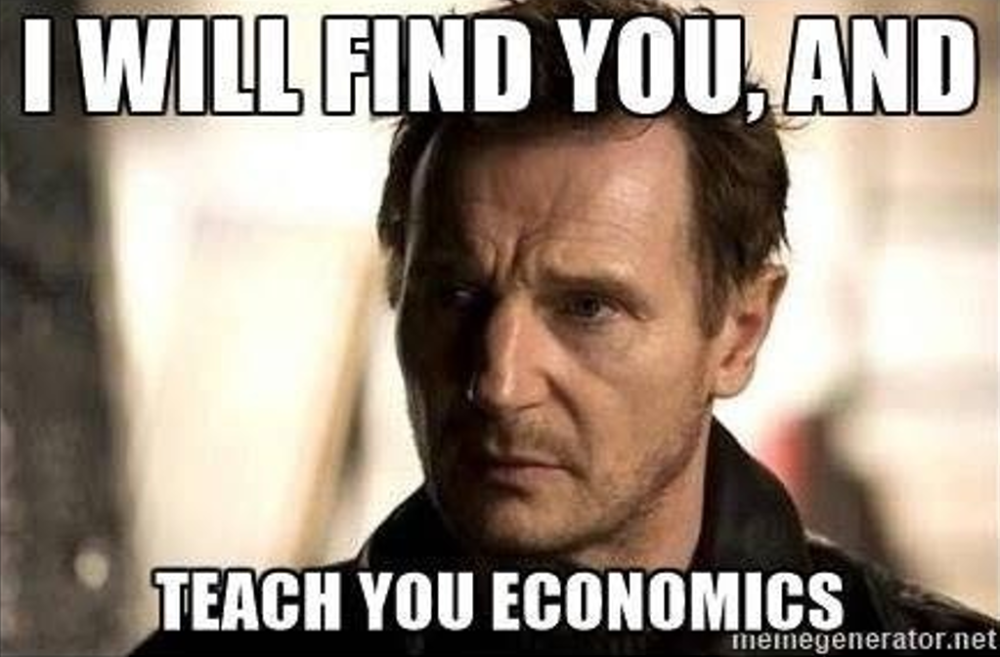

<style>
@media print{
  body, html, .remark-slides-area, .remark-notes-area {
    height: 100% !important;
    width: 100% !important;
    overflow: visible;
    display: inline-block;
    }
</style>

<style type="text/css">
.remark-slide-content {
    font-size: 34px;
    padding: 1em 4em 1em 4em;
}
</style>

<style type="text/css">
.my-one-page-font {
  font-size: 28px;
}
</style>

<style type="text/css">
.my-one-page-font-table {
  font-size: 24px;
}
</style>

<style>
.tiny { font-size: 60%; }      /* class you can reuse anywhere */
</style>

<style>
.remark-slide-content {
  position: relative;
  z-index: 1;
}

.remark-slide-content::before {
  content: "";
  position: absolute;
  top: 50%;
  left: 50%;
  width: 600px;          /* adjust size */
  height: 600px;
  background-image: url("1. 교장(Seal_Positive).png");  /* place logo file in same folder */
  background-repeat: no-repeat;
  background-position: center;
  background-size: contain;
  opacity: 0.05;         /* watermark transparency */
  transform: translate(-50%, -50%);
  pointer-events: none;
  z-index: 0;
}
</style>


```{r setup, include = FALSE}
library(tidyverse)
library(knitr)

opts_chunk$set(fig.width = 10, 
               message = FALSE, 
               warning = FALSE,
               echo = FALSE)
```

```{r xaringan-themer, include=FALSE, warning=FALSE}
#install.packages("xaringanthemer")
library(xaringanthemer)
style_mono_accent(
  base_color = "#851a10",
  header_font_google = google_font("Josefin Sans"),
  text_font_google   = google_font("Montserrat", "500", "550i"),
  code_font_google   = google_font("Fira Mono"),
  colors = c(
  red = "#f34213",
  purple = "#3e2f5b",
  orange = "#ff8811",
  green = "#136f63",
  white = "#FFFFFF"
)
)
```


# Welcome!

## Introduction to International Commerce

I’m **Iegor Vyshnevskyi**, and I’ll be your instructor this semester.

Today, you will:

- Meet some of your classmates

- Make your first economic decision

- Discover how economics helps us understand international commerce

- Learn how the course will work

.center[**No previous economics knowledge is expected. Questions are always welcome.**]

.tiny[Please sit where you can work with three nearby classmates.]

---
# Today’s Questions

1. **What is economics**, and how does it help us understand international commerce?

2. **What will you learn**, and how will this course work?

3. **What should you do** before our next class?

---
# Meet Your Island Team

Form a group of **four students** with people sitting near you.

Take about **30 seconds each** to share:

- Your preferred name

- Your major and year of study

- Your previous experience with economics

You will work with this group on the next activity.

---
# Desert Island Economics

You are stranded on a desert island with your classmates.

Your group must survive for **seven days**, but you may select only **three items**:

1. Unlimited instant noodles

2. A Bluetooth speaker

3. A fishing net

4. A box of chocolate

5. A tent

6. A solar charger

Choose three items and prepare to explain your decision.

---
# Discuss Your Choice

In your group, discuss:

1. What is your main objective?

2. Why did you select these three items?

3. What did you sacrifice by not selecting the other items?

4. Did everyone in the group have the same preferences?

5. Would your choices change if you had to remain on the island for one month?

Use the same group. You have **5 minutes**.

---
# Economics Begins with Choice

The island problem contains several basic economic ideas:

- **Scarcity**: You cannot have everything.

- **Constraint**: You may select only three items.

- **Preferences**: Different people value different things.

- **Trade-offs**: Choosing one item means giving up another.

- **Opportunity cost**: The cost of a choice is the best alternative you give up.

- **Uncertainty**: You do not know exactly what conditions you will face.

---
# Was Your Choice Rational?

A rational choice is not necessarily the most survival-focused choice.

A choice can be rational if it:

- Reflects the person's objectives and preferences

- Respects the available constraints

- Uses the available information consistently

- Weighs expected benefits against expected costs

Someone may rationally value comfort or enjoyment as well as survival.

**Economics does not tell everyone what to choose. It helps us understand how choices are made.**

---


class: inverse, center, middle

# 1. Introduction

---

# Course Information

- **Course Title**: Introduction to International Commerce (TIS1002)

- **Credit**: 3

- **Semester**: Fall 2026

- **Class Time**: Tue & Thu, 10:30–11:45

- **Location**: TBD

- **Instructor**: Iegor Vyshnevskyi, Ph.D.

- **Office Hours**: Tue/Thu 15-16:30 and Wed 10–12 (or by appointment) 

- **Office**: J721

- **TA**: TBD

---
# Economics for International Commerce

International commerce connects the choices of **people, firms, governments, and countries**.

This course builds the economic foundation needed to understand those connections. We will use economics to investigate questions such as:

- Why do people and countries exchange goods and services?

- How do firms compete, set prices, and respond to incentives?

- Why can a disruption in one country affect production, prices, and jobs elsewhere?

- How do inflation, unemployment, and government policy shape international business?

By the end of the course, you will have a toolkit for analyzing commerce in an interconnected world.

---
# About me

.pull-left[
My name is Iegor Vyshnevskyi, Ph.D.

- Assistant Professor [(link)](https://elic.sogang.ac.kr/lic.en/lic_en_01_04_05.html), Sogang University

- Background: International banking & central banking

- Research interests: central banking, computational data science

]


.pull-right[
Some Info:

- email: ievysh@sogang.ac.kr

- office: J721

- Communication preference:

  * LMS for most questions about course content
  * Email mainly for meeting requests and urgent issues

- [My page](https://iegor-vy.github.io/)

- Outside the classroom: family and martial arts
]

---
# Your Economics Background

Please complete the short anonymous LMS survey:

1. I have never studied economics.

2. I studied some economics in high school.

3. I completed one university economics course.

4. I completed introductory microeconomics and macroeconomics.

5. I am a business or economics student with several economics courses.

This information will help me organize activities and adjust explanations.

---
# Who Is This Course For?

This is a **first-year economics course** designed for students with no previous university-level economics.

- We begin with foundational concepts.

- We develop them carefully through explanation, application, and practice.

- The pace will remain appropriate for students encountering economics for the first time.

- Students from any major are welcome if this foundation matches their academic needs.

---

# If You Have Prior Economics Experience

If you have already completed university-level introductory economics, microeconomics or macroeconomics:

- Many core concepts will be familiar, although some cases and applications may be new.

- You must still complete all preparation, activities, and assessments; there are no exemptions or reduced requirements.

- Assessments require you to **apply concepts and explain your reasoning**. Familiarity with definitions alone will not make this an easy course or guarantee a high grade.

- The pace will remain appropriate for students learning economics for the first time.

Because much of the foundation may repeat what you have studied, your time may be better invested in a course that offers substantial new content.

**I strongly recommend choosing a more advanced course before the registration-change deadline.**

---

# Our TA

*Name*: TBD

*Email*: TBD

---

class: inverse, center, middle

# 2. Course Overview

---

# Course Description

This course introduces **basic principles of economics** crucial to international commerce.  

We focus on:  
- Decision-making of consumers & firms 

- Market structures & price theory  

- Aggregate economic activity  

- Macroeconomic policy tools  

- Case studies on prosperity, inequality, sustainability, etc.  

---

# Course Objectives

- **Explain** core economic concepts in clear language  

- **Apply** economic tools to decisions in international commerce  

- **Analyze** the behavior of consumers, firms, markets, and governments  

- **Evaluate** claims about sustainability, technology, and inequality using evidence  

- **Solve** problems and **communicate** economic reasoning individually and in teams  

---

# What We Cover

.pull-left[
### **Core Curriculum**
- Key economic **concepts & theories**  

- Understanding global markets  

- Real-life **case studies**  

- Problem-solving frameworks  

- Applying economics to **business & policy**
]

.pull-right[
### **Beyond the Classroom**
- **Critical thinking** & adaptability  

- **Teamwork** & cooperation  

- Clear **communication** of ideas  

- Professional **standards & values**  

- Practice through debates & discussions  
]


.center[
**Goal:** Not only knowledge, but also the **skills employers value** in the job market.
]

---

# How This Course Works

## Before Class

- Complete assigned readings or short videos
- Review the key concepts
- Complete any assigned preparation task

## During Class

- Apply concepts to problems and cases
- Participate in group activities
- Discuss alternative explanations
- Ask and answer questions

## After Class

- Review difficult concepts
- Complete assignments and problem sets
- Identify questions for the next class


---
# Why Preparation Matters

This course uses elements of a **flipped classroom**.

Class time will not simply repeat all assigned materials.

If you arrive prepared, you will be able to:

- Follow the activities

- Contribute to your group

- Ask more useful questions

- Identify what you do not yet understand

Preparation may be reflected in your participation and assignment grades.

---

# Course Materials

- **Core textbook**: Bowles, Carlin, Stevens, Tipoe (2024). *The Economy 2.0: Economics for a Changing World*  
  - Free online: [core-econ.org/the-economy](https://www.core-econ.org/the-economy/)  


<div style="flex: 1; text-align: center;">
    
  </div>

- Lecture videos and slides (Cyber Campus)

---


# Grading

- *Class Participation*: 10%

- *Individual Assignments*: 10%

- *Group Activities*: 20%

- *Midterm Examination (Week 8)*: 30%

- *Final Examination (Week 16)*: 30%

- **Total**: 100%


Grades will be determined by relative ranking, with the top 40% of the class receiving an A, the next 40% a B, and the remaining 20% a C or below.

Detailed instructions and assessment criteria will be provided before each graded task.

Grades will reflect your demonstrated achievement under those published criteria.


---
# Participation in a Large Class

Participation does not mean that every student must speak in front of the entire class every week.

Participation includes:

- Arriving prepared

- Completing in-class tasks

- Contributing to group discussions

- Answering polls and short questions

- Submitting brief written responses

- Asking relevant questions

- Helping your group work effectively

**Quality, preparation, and consistency matter more than speaking frequently.**

---

# Individual Accountability in Group Work

Group activities require active contributions from **every member**.

- Each group assignment will include a brief record of the work completed.

- Individual contributions will be documented and reported.

- Simply being listed as a group member does not earn activity points.

- Students who do not make a documented contribution will not receive credit for that activity.

- If contribution problems arise, report them promptly rather than waiting until the end of the semester.

**Group work is collaborative, but activity credit requires individual effort.**

---

# Communication

- Check the **LMS regularly** for materials, announcements, and deadlines.

- Use the LMS discussion board for course-content questions.

- You may approach me before or after class.

- Use email primarily for meeting requests, private matters, and urgent issues.

---
# Our Goals and Principles

## Our goals

- Learn the economic foundations of international commerce
- Apply economic ideas to real-world situations
- Discover that economics can be interesting and useful

## Our principles

- Learning by doing
- Mutual respect
- Genuine effort

My role is to guide, mentor, and facilitate your learning. Your suggestions are always welcome.


---

# Questions About the Course?

- Any questions about the course?

- Any questions about the syllabus?

---

class: inverse, center, middle

# 3. Why study economics?

---

# Is Economics Only About Money?

.center[]

.center[**Money matters—but economics studies choices, incentives, institutions, and how resources are used.**]

.tiny[Image: *Futurama* meme; created via Makeameme.org.]

---

# Why Economics?

- Economics studies how people interact and make decisions when resources are limited.

- How do individuals, firms, and governments choose among alternatives?

- How do markets, organizations, and rules coordinate those choices?

- Who receives the benefits, who bears the costs, and how might the outcome change?

**Economics gives us models and evidence with which to investigate these questions.**

---
class: my-one-page-font

# How Should We Picture an Economy?

.center[**What does each picture reveal—and what does it leave out?**]

<div style="display: flex; align-items: center; justify-content: space-between; gap: 14px; text-align: center;">
  <div style="width: 27%;">
    
    <br><strong>1. A nested system</strong>
  </div>
  <div style="width: 43%;">
    
    <br><strong>2. Flows among actors</strong>
  </div>
  <div style="width: 27%;">
    
    <br><strong>3. An interconnected network</strong>
  </div>
</div>

.tiny[Sources: CORE Econ, *The Economy 2.0*, Figures 1.20–1.21; Xu et al. (2011), “Interconnectedness and Resilience of the U.S. Economy,” *Advances in Complex Systems*, 14(5), 649–672.]

---

# Why study economics?

- Economics is not primarily a collection of facts to memorize.

- Instead, think of economics as a collection of questions to answer or puzzles to work. 

- Most importantly, economics provides the tools to solve those puzzles.

---

# Sum up

- Economics = **decisions under scarcity**  

- Explains global issues: **prosperity, inequality, sustainability, climate change, poverty, conflict**  

- Builds skills for **informed citizenship**: voting, debating, evaluating policies  

- Makes you a **better thinker**: distinguish sense from nonsense in news, politics, business  

- Provides a foundation for careers in **business, finance, government, NGOs**  

**In short:** Economics helps you understand the world *and* make smarter choices.  

---
# Economics Is Everywhere

.center[]

.center[**During this course, we will learn to find economics in everyday decisions, business, and public policy.**]

.tiny[Image: meme using a still from *Taken* (2008); created via MemeGenerator.net.]

---
# Before Our Next Class

## Thursday, September 3 at 10:30

1. Open the free CORE Econ textbook and locate **Unit 1: Prosperity, Inequality, and Planetary Limits**.

2. Read through the unit before class.

3. Bring one example of a difference in prosperity that you would like economics to explain.

---
# One-Minute Exit Ticket

Before you leave, submit a brief response:

1. Give one example of **scarcity** from today’s island activity.

2. What was the **opportunity cost** of one item your group selected?

3. Name one question about the economy that you hope this course will help you answer.

---
class: inverse, center, middle

# Economics Begins with Choices

## This semester, we will learn to analyze those choices systematically.

## Questions?

### Thank you—see you Thursday.

---
class: inverse, center, middle

# Appendix: Course Details

---

# Our Textbook: *The Economy 2.0*

### Why this book?

- Written by leading economists from around the world  

- Free, interactive, and regularly updated online  

- Connects theory with inequality, climate change, AI, and financial crises  

- Uses case studies, data, and visuals instead of long abstract mathematics  

- Designed for first-year students: accessible yet rigorous  

- Develops critical thinking, problem-solving, and communication skills  

---
# Course Policies

## Academic Integrity

- All submitted work must follow Sogang University's academic-integrity requirements.
- Plagiarism, unauthorized collaboration, and other forms of academic dishonesty are prohibited.
- Suspected violations will be handled according to university regulations.
- Penalties may include a zero on the relevant assessment and additional disciplinary consequences.

## Recording and Privacy

- Do not photograph, record, or distribute material involving classmates without permission.
- Lecture slides will normally be provided through the LMS.

---
class: my-one-page-font-table

# Course Roadmap

| Week | Topic |
|------|-------|
| 1 | Prosperity, inequality, and planetary limits |
| 2 | Technology and incentives |
| 3 | Scarcity, wellbeing, and working hours |
| 4 | Strategic interactions and social dilemmas |
| 5 | Rules of the game: who gets what and why |
| 6 | The firm and its employees |
| 7 | The firm and its customers |
| 8 | *Midterm examination* |
| 9 | Supply and demand |
| 10 | Lenders, borrowers, and wealth differences |
| 11 | Market successes and failures |
| 12 | Unemployment and real wages |
| 13 | Aggregate demand and the multiplier |
| 14 | Inflation and unemployment |
| 15 | Macroeconomic policy |
| 16 | *Final examination* |

Tentative schedule; it may be adjusted based on class progress.

---
# Office Hours and Email

## Office Hours

- Tuesday and Thursday: 15:00–16:30
- Wednesday: 10:00–12:00
- Office: J721
- Other times by appointment

## Meeting Requests

- Use the course name and purpose in the email subject line.
- Briefly explain what you would like to discuss.
- Suggest at least two possible meeting times.
- Please allow up to two business days for a response.

---
# Study Suggestions

1. Complete assigned preparation before class.
2. Participate in discussions, polls, and group activities.
3. Ask questions when something is unclear.
4. Review the material regularly instead of cramming before examinations.


# Common Challenges

## English is difficult

Prepare before class, review key vocabulary, use the LMS, and ask for clarification.

## Mathematics makes you anxious

The course starts from the basics. Regular practice is more effective than last-minute study.

## Personal circumstances affect your studies

Contact me early so that we can discuss the available support.

---
# Your Feedback Matters

Constructive feedback can help improve:

- The pace of the course
- The clarity of explanations
- The balance between lectures and activities
- The usefulness of readings and assignments

You may provide feedback through the LMS or by email.
