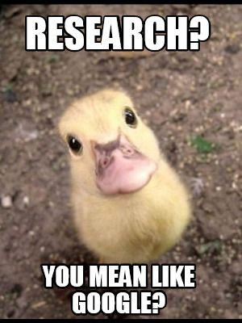
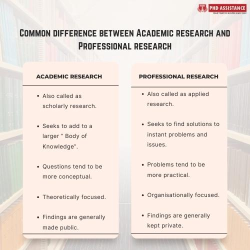
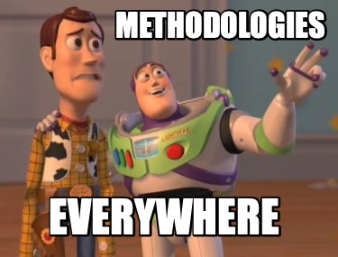
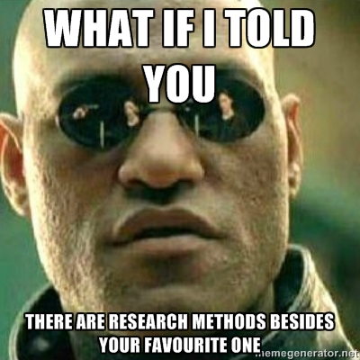
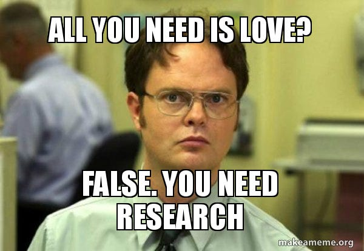

<style>
@media print{
  body, html, .remark-slides-area, .remark-notes-area {
    height: 100% !important;
    width: 100% !important;
    overflow: visible;
    display: inline-block;
    }
</style>

<style type="text/css">
.remark-slide-content {
    font-size: 34px;
    padding: 1em 4em 1em 4em;
}
</style>

<style type="text/css">
.my-one-page-font {
  font-size: 28px;
}
</style>

<style type="text/css">
.my-one-page-font-table {
  font-size: 24px;
}
</style>

<style>
.tiny { font-size: 60%; }      /* class you can reuse anywhere */
</style>

<style>
.remark-slide-content {
  position: relative;
  z-index: 1;
}

.remark-slide-content::before {
  content: "";
  position: absolute;
  top: 50%;
  left: 50%;
  width: 600px;          /* adjust size */
  height: 600px;
  background-image: url("1. 교장(Seal_Positive).png");  /* place logo file in same folder */
  background-repeat: no-repeat;
  background-position: center;
  background-size: contain;
  opacity: 0.05;         /* watermark transparency */
  transform: translate(-50%, -50%);
  pointer-events: none;
  z-index: 0;
}
</style>


```{r setup, include = FALSE}
library(tidyverse)
library(knitr)

opts_chunk$set(fig.width = 10, 
               message = FALSE, 
               warning = FALSE,
               echo = FALSE)
```

```{r xaringan-themer, include=FALSE, warning=FALSE}
#install.packages("xaringanthemer")
library(xaringanthemer)
style_mono_accent(
  base_color = "#851a10",
  header_font_google = google_font("Josefin Sans"),
  text_font_google   = google_font("Montserrat", "500", "550i"),
  code_font_google   = google_font("Fira Mono"),
  colors = c(
  red = "#f34213",
  purple = "#3e2f5b",
  orange = "#ff8811",
  green = "#136f63",
  white = "#FFFFFF"
)
)
```

# Welcome!

## Research Method of Data Science

I’m **Iegor Vyshnevskyi**, and I’ll be your instructor this semester.

.box[
**Our central question:** How can we turn a feasible idea into a credible, transparent, and useful research study?
]

???
Welcome students at the door. Keep this slide visible while they settle in.

---

# Opening challenge

## Which headline should you trust?

**A.** Students who use AI receive higher grades.

**B.** Countries with more internet access are more democratic.

**C.** Remote work makes employees more productive.

**D.** None—yet.

Vote first. Then tell a partner: **What evidence would you need?**

???
Timing: 4 minutes. First take a show-of-hands vote. Then pair discussion. Do not resolve yet.

---

# The problem with a convincing claim

Each headline may be:

- true in one setting but not another;

- an association rather than a causal effect;

- sensitive to how concepts are measured;

- based on selective evidence;

- impossible to reproduce;

- written confidently despite serious uncertainty.

.box[
**Research begins when “That sounds right” is no longer enough.**
]

---

# Four questions for every claim

1. **Question:** What exactly is being asked?

2. **Evidence:** What observations, texts, cases, or data support it?

3. **Method:** Why can that evidence answer the question?

4. **Credibility:** What else could explain the result, and can we verify it?

.center[
### Question → Evidence → Method → Claim
]

We will use this framework throughout the semester.

---

class: inverse, center, middle

# Welcome to Research Method of Data Science!

---

# Today’s agenda

**Today — Week 1, Meeting 1**

1. Introduction

2. Course Overview

3. How the Course Works

4. What Is Research?

5. Research Approaches and Purposes

6. Research in Action

7. Next Class

Appendix

???
Target timing: opening 6 min; introductions 10; research foundations 20; application 15; course design 18; closing 6.

---


class: inverse, center, middle

# 1. Introduction

---

# Course Information

- **Course Title**: Research Method of Data Science (TIC3002)

- **Credit**: 3

- **Semester**: Fall 2026

- **Class Time**: Tue & Thu, 13:30–14:45

- **Meetings**: Two 75-minute classes per week

- **Location**: TBD

- **Instructor**: Iegor Vyshnevskyi, Ph.D.

- **Office Hours**: Tue/Thu 10-10:30 and 15-16:30 and Wed 10–12 (or by appointment) 

- **Office**: J721

- **TA**: TBD

---

# About me

.pull-left[
My name is Iegor Vyshnevskyi, Ph.D.

- Assistant Professor [(link)](https://elic.sogang.ac.kr/lic.en/lic_en_01_04_05.html), Sogang University

- Background: International banking & central banking

- Research interests: central banking, computational data science

]


.pull-right[
Some Info:

- email: ievysh@sogang.ac.kr

- office: J721

- Communication preference:

  * LMS for most questions about course content
  * Email mainly for meeting requests and urgent issues

- [My page](https://iegor-vy.github.io/)

- Outside the classroom: family and martial arts
]

---

# About you: research speed meetings

Form pairs. You have **2 minutes each**.

Ask your partner:

1. What name should we use for you?

2. What is your major or academic interest?

3. What prior experience do you have with statistics, research, Python, or qualitative methods?

4. What question about the world would you genuinely like to investigate?

Then introduce your partner in **30 seconds**.

???
Timing: 8–10 minutes for 12 students. Emphasize that “no Python/GitHub experience” is useful information, not a failure.

---

# Our class as a research community

With **12 students**, we can do things a large lecture cannot:

- discuss each student’s question;

- inspect one another’s evidence;

- receive frequent feedback;

- work through mistakes together;

- build a complete study step by step.

.box[
You are not competing to sound certain. You are learning to make uncertainty visible and manageable.
]

---

class: inverse, center, middle

# 2. Course Overview

---

# Course description and objectives

This course teaches you to conduct a **complete and credible research study**.

You will learn to:

- formulate a researchable question;

- locate and synthesize literature;

- choose evidence and methods that fit the question;

- use qualitative and quantitative approaches;

- document data, code, decisions, and AI assistance;

- interpret results without overstating them;

- write, present, and defend a full research paper.

---

# What this course is not

It is **not**:

- a Python-from-zero programming course;

- a second introductory statistics survey;

- a course in which “data science” means only machine learning;

- a sequence of disconnected techniques;

- a place where software output substitutes for reasoning.

.box[
**The research question chooses the method—not the other way around.**
]


---

# Course & Job Market

   - **Research skills** are essential for academic and professional success

   - **Data analysis** is a key skill in today's job market

   - **Research methods** are used in various fields, including business, economics, public policy, and social sciences

   - **Quantitative analysis** is in high demand in many industries

   - **Research experience** can enhance your resume and career prospects

---

class: inverse, center, middle

# 3. How the Course Works

## From research reasoning to a complete individual study

---

# Tuesday + Thursday rhythm

.pull-left[
## Tuesday

- Core research concept

- Worked examples

- Discussion and diagnosis

- Method choice
]

.pull-right[
## Thursday

- Research studio

- Guided practical work

- Coding or evidence analysis

- Peer/instructor feedback

- Project milestone
]

.box[
Class time is for **doing research**, not only hearing about it.
]

---

# The semester at a glance

.small[
| Phase | Weeks | Main output |
|---|---:|---|
| Foundations | 1–2 | researchable question |
| Literature | 3–4 | search log, evidence matrix, proposal |
| Qualitative research | 5–6 | design and coding exercise |
| Quantitative design | 7–9 | valid design, documented dataset |
| Analysis | 10–13 | reproducible evidence and interpretation |
| Complete study | 14 | full draft and reproducibility check |
| Communicate and revise | 15–16 | presentation, Q&A, final paper |
]

---

# One individual project, built in stages

Your final examination assignment is an **individual research project**.

It includes:
.pull-left[
1. Introduction and research question

2. Motivation and contribution

3. Literature review and research gap

4. Conceptual or theoretical framework

5. Data/evidence and methods
]
.pull-right[
6. Results

7. Discussion

8. Conclusion and limitations

9. References and AI-use disclosure

10. Reproducible supporting materials
]
---

# Project milestones

.small[
| When | Milestone |
|---|---|
| Week 2 | preliminary research question |
| Week 3 | documented literature search and evidence matrix |
| Week 4 | literature review and research proposal |
| Week 6 | qualitative research exercise |
| Week 7 | research design and validity review |
| Week 9 | data/evidence source log |
| Weeks 10–13 | analysis, interpretation, and verification |
| Week 14 | complete paper draft |
| Weeks 15–16 | full-study presentation, Q&A, revision, submission |
]

**You will not begin the final project in Week 14. You begin today.**

---

# Assessment

| Component | Weight |
|---|---:|
| Class participation | 10% |
| Individual assignments | 10% |
| Group activities | 20% |
| Midterm examination — Week 8 | 25% |
| Final individual research project — Week 16 | 35% |
| **Total** | **100%** |

.tiny[Detailed task instructions and grading criteria will be provided before each assessed component.]

Grades will reflect your demonstrated achievement under those published criteria.

---

# How the final presentation works

You present the **complete study**, not only results.

- Weeks 15–16 are divided into three presentation groups.

- Each presentation is followed immediately by Q&A.

- The Q&A is a short research defense: explain your choices, evidence, interpretation, and limitations.

- You then use the feedback to revise the final paper.

.box[
The goal is not to defend every choice as perfect. It is to show that you understand its consequences.
]

---

# Tools we will use

- **Slides** and **notebooks** for instruction and demonstration

- **Google Colab:** run notebooks in a browser

- **Python:** prepare, analyze, and visualize data

- **GitHub:** access course materials and maintain transparent versions

- **Cyber Campus:** official announcements, deadlines, grades, and required submissions

- **Reference/search tools:** locate and organize scholarly literature

- **AI tools:** only where permitted, disclosed, and verified

- **DataCamp:** optional for additional practice

Prior Git or GitHub experience is **not required**.

---

# If GitHub is completely new to you

- **Git** records versions of files.

- **GitHub** stores and shares version-controlled projects online.

- A **repository** is a project folder plus its history.

- A **commit** is a named saved version.

- **Colab** lets you run a notebook in your browser.

We begin with a browser-only workflow. Command-line Git is optional at first.

.box[
Saving a notebook in Google Drive does **not** automatically update GitHub.
]

---

# Responsible use of AI

When an assignment permits AI:

- disclose how you used it;

- verify every factual claim and citation in the original source;

- test and understand generated code;

- check statistical interpretations;

- document important prompts, changes, and verification;

- remain responsible for every submitted word and result.

Fabricated sources, data, results, or hidden AI-generated work are academic misconduct.

**The midterm is AI-free unless explicitly stated otherwise.**

---

# Course working principles

1. **Question before technique**

2. **Evidence before confidence**

3. **Interpretation before output**

4. **Documentation before memory**

5. **Verification before submission**

6. **Revision before perfection**

> Mutual respect and learning by doing are more important than appearing to know everything.

We will treat mistakes as evidence about what needs to be improved—not something to conceal.

---

# Course policies

.small[
- **Academic integrity:** University rules apply to all work. Cite sources and disclose permitted AI assistance.

- **Privacy and ethics:** Do not upload personal identifiers, confidential interviews, restricted data, passwords, or API keys to public repositories.

- **Reproducibility:** Submitted analysis must run from the documented starting point, subject to legitimate data restrictions.

- **Participation:** Come prepared to explain your choices and give specific, respectful peer feedback.

- **Communication:** Use Cyber Campus for routine course questions; email for meetings, private matters, or urgent issues.

- **Accessibility:** Contact me or the relevant university support office early if a barrier affects your learning.

- **Recording:** Do not routinely photograph or record class; approved accommodations will be honored.
]

---

class: inverse, center, middle

# 4. What Is Research?

---

# What is research?

.box[
**Research is a systematic, transparent, and ethical process for answering a question with evidence while making uncertainty and limitations explicit.**
]

Research is more than searching for information or running an analysis.

It requires:
.pull-left[
- a question that can be investigated;

- evidence appropriate to that question;

- a reasoned and documented method;

- a claim no stronger than the design permits.
]
.pull-right[
<div>
.center[]
]

---

# Academic Research vs Business Research

<div>
.center[]

Source: [What is the difference between academic research and professional research?](https://www.phdassistance.com/blog/what-is-the-difference-between-academic-research-and-professional-research/)]


---

# What counts as research evidence?

| Evidence | Possible use |
|---|---|
| Scholarly literature | locate debates, theory, gaps, prior findings |
| Interviews or focus groups | understand experiences, meanings, mechanisms |
| Documents and public texts | study framing, institutions, discourse, change |
| Cases and observations | analyze processes and context |
| Numerical datasets | describe patterns, test relationships, estimate effects |
| Text as data | combine interpretation with computational analysis |

**Different evidence answers different questions.**

---

# Our course framework

.center[
### Question → Literature → Design → Evidence → Analysis → Claim
]

At every stage, ask:

- Is the choice appropriate for the question?

- What assumptions are we making?

- What could go wrong?

- What have we documented?

- Could another person verify or reproduce the work?

---

class: inverse, center, middle

# 5. Research Approaches and Purposes

---

# Two dimensions of a study

Research labels do not belong in one undifferentiated list.

| Dimension | Categories | What it tells us |
|---|---|---|
| **Approach** | qualitative, quantitative, mixed methods | the form of evidence and analysis |
| **Purpose** | descriptive, explanatory, causal, predictive, applied | the kind of claim being pursued |

.box[
A study makes choices on **both dimensions**.
]

For example: **quantitative + descriptive** or **mixed methods + explanatory**.

---

# Dimension 1: research approach

.small[
| Approach | Main emphasis | Typical evidence |
|---|---|---|
| **Qualitative** | meaning, experience, context, process | interviews, observations, documents, cases |
| **Quantitative** | magnitude, distribution, relationships, effects, prediction | numerical measurements and structured data |
| **Mixed methods** | integration of complementary evidence | a planned combination of qualitative and quantitative evidence |
]

Mixed methods is not simply “using two datasets.” The parts must jointly answer the question.

---

# Dimension 2: research purpose

.small[
| Purpose | Central question | Example |
|---|---|---|
| **Descriptive** | What is happening, to whom, where, or when? | How often do students use AI? |
| **Explanatory** | Why or through what process does it happen? | Why do students use AI in different ways? |
| **Causal** | What would change if we intervened on X? | Does AI-tutor access improve later unaided performance? |
| **Predictive** | How accurately can known information predict an unknown Y? | Can study behavior predict course completion? |
| **Applied** | How knowledge can be used to solve some real world problem | How can AI be used to improve student learning? |
]

Different purposes require different designs and support different conclusions.

---

# Explanation, causation, and prediction

- An **explanation** proposes why or how a pattern occurs.

- A **causal claim** asks a counterfactual question: what would have happened under a different treatment or exposure?

- A **prediction** may be accurate without identifying a cause or explaining a mechanism.

.box[
High predictive accuracy does **not** by itself establish causality.
]

---


# Why Study RMDS?

<div>
.center[]

Source: Web meme

---


# Why Study RMDS? (cont)


<div>
.center[]

Source: Web meme

---

# Why Study RMDS? (cont)

<div>
.center[]

Source: Web meme

---


class: inverse, center, middle

# 6. Research in Action

---

# Return to our opening claim

.center[
## “Countries with more internet access are more democratic.”
]

This sounds testable—but it is not yet a good research question.

In groups of three, diagnose the claim using:

### Question → Evidence → Method → Claim

???
Form four groups of three. Give each group a worksheet or shared document.

---

# Group roles

Choose:

- **Questioner:** makes vague words precise

- **Skeptic:** looks for alternative explanations and bias

- **Designer:** proposes feasible evidence and a method

You have **8 minutes**.

At the end, every group gives a **60-second research pitch**.

---

# Your task

.small[
1. Rewrite the statement as one precise research question.

2. Define **internet access** and **democracy**.

3. Specify the population, setting, and time period.

4. Identify evidence you would need.

5. Choose a feasible method.

6. Name two alternative explanations or sources of bias.

7. State the strongest claim your design could support.

8. Identify one ethical or privacy risk.
]

**Do not try to sound sophisticated. Make every choice explicit.**

---

# 60-second report template

> We ask whether **[precise exposure/intervention]** is related to or affects **[precise outcome]** among **[population]** in **[setting/time]**.
>
> We would use **[evidence]** and **[method]** because **[reason]**.
>
> A major threat is **[alternative explanation/bias]**.
>
> Therefore, our design could support the claim **[carefully bounded conclusion]**, but not **[overclaim]**.

---

# Debrief: one headline, many studies

Possible questions include:

- How does internet access relate to democracy in 2026?

- How does internet access relate to democracy in 2006?

- How does internet access relate to democracy in countries with a history of authoritarian rule?

- How does internet access relate to democracy in countries with a history of democratic rule?

- How does internet access relate to democracy in countries with a history of authoritarian rule, controlling for GDP?

.box[
Changing the question changes the evidence, method, and defensible claim.
]

---

# Methods are tools, not rankings

| Question | Possible method |
|---|---|
| How does internet access relate to democracy in 2026? | cross-sectional analysis |
| How does internet access relate to democracy in 2006? | historical analysis |
| How does internet access relate to democracy in countries with a history of authoritarian rule? | comparative case study |
| How does internet access relate to democracy in countries with a history of democratic rule? | comparative case study |
| How does internet access relate to democracy in countries with a history of authoritarian rule, controlling for GDP? | regression analysis |

No method is automatically “better.” **Fit for purpose** matters.

---

# What would make the study credible?

- precise concepts and transparent measurement;

- a design aligned with the question;

- appropriate comparison or counterfactual reasoning;

- documented evidence and analytical decisions;

- attention to ethics, selection, missingness, and bias;

- cautious interpretation;

- reproducible materials;

- honest limitations.

These are not decorations added after analysis. They are the research.

---

class: inverse, center, middle

# From the example to your own project

---

# Individual question seed — 4 minutes

Write one question you may want to investigate this semester.

Use this structure:

> I want to understand **[phenomenon or relationship]** among/in **[population, place, or context]**, because **[why it matters]**.

Then add:

- one type of evidence that might help;
- one concern about feasibility;
- one thing you would need to learn.

This is a starting point, not a commitment.

---

# Pair feedback — 4 minutes

Exchange question seeds with a partner.

Give feedback using only these prompts:

1. **I understand the question as…**

2. **A word or concept that needs clarification is…**

3. **One feasible source of evidence might be…**

4. **One possible difficulty is…**

5. **What makes you personally curious about this?**

Do not redesign your partner’s project for them.

---

# Exit ticket — 3 minutes

Submit before leaving:

1. Your current research-question seed

2. One distinction from today that changed how you think about research

3. Your current comfort level:
   - academic literature: 1–5
   - statistics: 1–5
   - Python/Colab: 1–5
   - Git/GitHub: 1–5
   - qualitative research: 1–5

4. One question or concern about the course

Your self-ratings are diagnostic, not graded.

---

class: inverse, center, middle

# 7. Next Class

---

# Next class: research workflow studio

## Week 1, Meeting 2

We will:

- enter the course repository;

- create or verify a GitHub account;

- open a notebook in Google Colab;

- run and edit a simple code cell;

- save a personal copy;

- learn where files actually live;

- complete a short reproducibility test.

Bring a laptop and make sure you can access your Google account.

---

# Before Thursday

1. Read the **Start Here** page on the course repository.

2. Create or sign in to GitHub using a professional username.

3. Verify your GitHub email address.

4. Confirm access to your Google account and Google Drive.

5. Bring your research-question seed.

If setup fails, record the exact step and what you see. We will solve it together.

---

class: inverse, center, middle

# Questions?

# Thank you!

---

class: inverse, center, middle

# Appendix

## Course details for reference

---

# Full weekly course map

.tiny[
| Week | Tuesday | Thursday |
|---:|---|---|
| 1 | Research types and course orientation | Colab, GitHub, notebooks, reproducibility |
| 2 | Problems, questions, theory, concepts, contribution | Individual question clinic |
| 3 | Finding and evaluating literature | Documented literature-search lab |
| 4 | Synthesis, gaps, conceptual frameworks | Literature review and proposal workshop |
| 5 | Introduction to qualitative research | Design, sampling, protocols, ethics |
| 6 | Coding and interpreting qualitative evidence | Qualitative coding lab |
| 7 | Quantitative research design and validity | Individual design clinic |
| 8 | Midterm practical assessment | Official midterm arrangement |
| 9 | Finding and documenting quantitative data | Data-source lab |
| 10 | Data preparation and descriptive research | Cleaning and visualization studio |
| 11 | Bivariate analysis and inference | Simulation and inference lab |
| 12 | Regression as a research method | Regression and diagnostics lab |
| 13 | Causal reasoning, prediction, text as data | Method choice and AI verification |
| 14 | Writing the complete paper | Full-draft and reproducibility workshop |
| 15 | Presentations and Q&A: Group 1 | Presentations and Q&A: Group 2 |
| 16 | Presentations and Q&A: Group 3 | Revision workshop and final submission |
]

Tentative schedule; subject to change. All readings and assignments will be posted on Cyber Campus.
---

# Research project: minimum standard

Your project must be:

- **researchable:** a bounded question rather than a broad topic;

- **grounded:** connected to relevant scholarly literature;

- **aligned:** evidence and method fit the question;

- **ethical:** privacy, consent, access, and risks considered;

- **transparent:** important choices and AI use documented;

- **reproducible where possible:** another person can follow the workflow;

- **appropriately modest:** conclusions do not exceed the design.

---

# How to ask for help

Useful questions include:

- “I expected **X**, but I observed **Y** after step **Z**.”

- “My question is **…**; I am unsure whether this evidence fits because **…**.”

- “This code produces **this error**; here is the smallest example.”

- “I found two conflicting sources; how should I evaluate them?”

- “I used AI for **…** and verified **…**, but I am still uncertain about **…**.”

Specific questions make useful feedback possible.


???
1. To print pdf slides
https://stackoverflow.com/questions/54968311/xaringan-export-slides-to-pdf-while-preserving-formatting

pagedown::chrome_print("W1_IIC.html") # but not all pictures are visible

2. Option: https://stackoverflow.com/questions/54968311/xaringan-export-slides-to-pdf-while-preserving-formatting

install.packages("remotes")
remotes::install_github("jhelvy/xaringanBuilder")
remotes::install_github("jhelvy/renderthis@v0.0.9")

library(xaringanBuilder)
build_pdf("DVC.html")

3. Option
writeBin(as.raw(c()), "favicon.ico") # create an empty favicon.ico file
install.packages("renderthis")
remotes::install_github('rstudio/chromote')
library(renderthis)

renderthis::to_pdf("W1_RMDS.html")

getwd()
setwd("C:\\Users\\vyshn\\OneDrive - kdis.ac.kr\\Documents\\GitHub\\Sogang\\2026\\Fall\\Research Method of Data Science\\W1")
