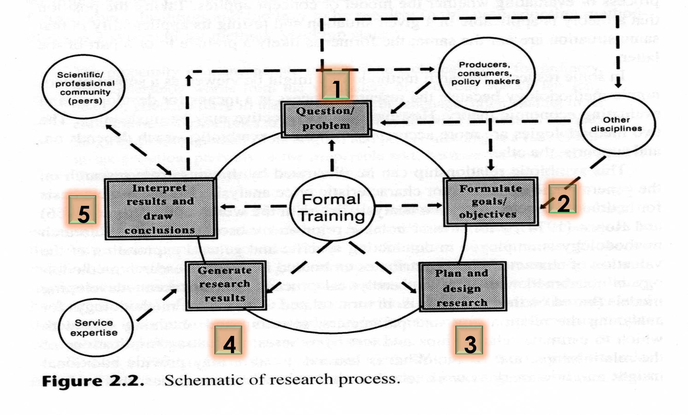
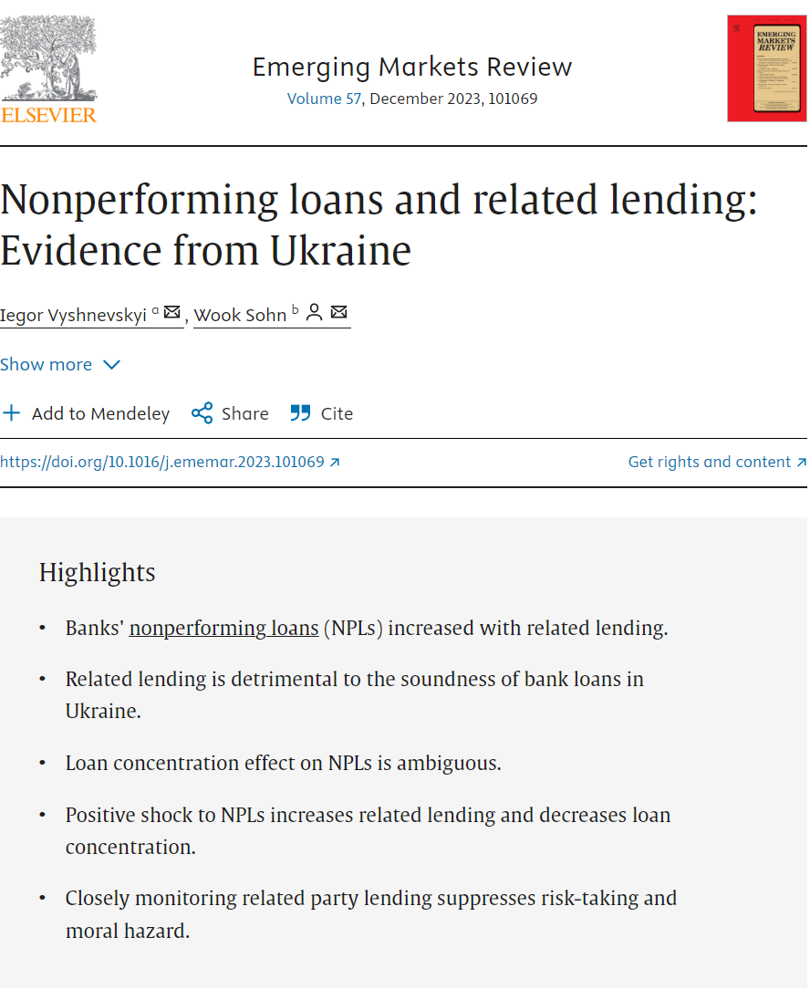

<style>
@media print{
  body, html, .remark-slides-area, .remark-notes-area {
    height: 100% !important;
    width: 100% !important;
    overflow: visible;
    display: inline-block;
    }
</style>

<style type="text/css">
.remark-slide-content {
    font-size: 34px;
    padding: 1em 4em 1em 4em;
}
</style>

<style type="text/css">
.my-one-page-font {
  font-size: 28px;
}
</style>

<style type="text/css">
.my-one-page-font-table {
  font-size: 24px;
}
</style>

<style>
.tiny { font-size: 60%; }      /* class you can reuse anywhere */
</style>

<style>
.remark-slide-content {
  position: relative;
  z-index: 1;
}

.remark-slide-content::before {
  content: "";
  position: absolute;
  top: 50%;
  left: 50%;
  width: 600px;          /* adjust size */
  height: 600px;
  background-image: url("1. 교장(Seal_Positive).png");  /* place logo file in same folder */
  background-repeat: no-repeat;
  background-position: center;
  background-size: contain;
  opacity: 0.05;         /* watermark transparency */
  transform: translate(-50%, -50%);
  pointer-events: none;
  z-index: 0;
}
</style>


```{r setup, include = FALSE}
library(tidyverse)
library(knitr)

opts_chunk$set(fig.width = 10, 
               message = FALSE, 
               warning = FALSE,
               echo = FALSE)
```

```{r xaringan-themer, include=FALSE, warning=FALSE}
#install.packages("xaringanthemer")
library(xaringanthemer)
style_mono_accent(
  base_color = "#851a10",
  header_font_google = google_font("Josefin Sans"),
  text_font_google   = google_font("Montserrat", "500", "550i"),
  code_font_google   = google_font("Fira Mono"),
  colors = c(
  red = "#f34213",
  purple = "#3e2f5b",
  orange = "#ff8811",
  green = "#136f63",
  white = "#FFFFFF"
)
)
```

# Welcome to Week 2!

## From a Broad Topic to a Researchable Question

.box[
**This week’s output:** A preliminary question that is clear, meaningful, and feasible enough to investigate.
]

---

class: inverse, center, middle

# Meeting 1

## Understanding the logic of a research question

---

# Opening diagnostic

Which is the strongest **research question**?

**A.** Social media and mental health

**B.** Is social media bad for students?

**C.** How is daily social-media use associated with self-reported anxiety among Sogang undergraduates during Fall 2026?

**D.** How can we solve social-media addiction?

Vote first. Then explain **why**.

???
Timing: 4 minutes. C is the most research-ready, but it still requires definitions, evidence access, an ethical plan, and a design that does not overclaim causality.

---

# Agenda

**Week 2 — Meeting 1**

1. From Week 1 to Week 2

2. The Research Process

3. From Topic to Contribution

4. Developing a Researchable Question

5. From Question to Evidence

6. Real-Life Research Example

7. Meeting 1 Summary

Appendix

---

# Learning objectives

By the end of this meeting, you should be able to:

1. explain why research is iterative;

2. connect a topic, problem, question, objective, and contribution;

3. formulate a bounded research question;

4. distinguish a concept from its measurement;

5. evaluate a question using **FINER**;

6. identify evidence aligned with the intended claim.

---

class: inverse, center, middle

# 1. From Week 1 to Week 2

---

# Our course framework

.center[
### Question → Literature → Design → Evidence → Analysis → Claim
]

In Week 1, we learned that:

- the question constrains the evidence and method;

- research **approach** and research **purpose** are different dimensions;

- methods are tools—not rankings;

- the claim must not be stronger than the design permits.

.box[
**This week asks: Where does a good research question come from?**
]

---

# Return to the Week 1 claim

> “Students who use AI receive higher grades.”

To investigate it, we must decide:

- what counts as **AI use**;

- which **students**, courses, and period;

- what counts as **academic performance**;

- whether we seek description, explanation, causation, or prediction;

- what evidence and comparison could support that claim.

One broad statement can produce many different studies.

---

class: inverse, center, middle

# 2. The Research Process

---

# Research is systematic—but iterative

.center[
### Problem ↔ Literature ↔ Question ↔ Design ↔ Evidence ↔ Analysis ↔ Claim
]

Researchers often move backward:

- literature shows that the question is already answered;

- available evidence requires a narrower question;

- measurement problems force us to redefine a concept;

- preliminary analysis exposes a design weakness;

- results require a more modest interpretation.

.box[
Revision is part of rigorous research—not evidence that the research failed.
]

---

# A practical research cycle

1. Identify an important problem or puzzle.

2. Examine relevant literature and theory.

3. Formulate and refine the research question.

4. Clarify concepts, objectives, and expected contribution.

5. Select a defensible design and appropriate evidence.

6. Obtain, document, and manage evidence ethically.

7. Analyze and challenge the interpretation.

8. Communicate claims, uncertainty, and limitations.

9. Revise and preserve a reproducible record.

---

# The Process of Research

<div>
.center[]

Source: Open web materials

---


# Quick interaction: where would you go back?

What should the researcher reconsider?

1. The literature reveals an almost identical published study.

2. The desired survey population cannot be accessed.

3. The available variable measures income, not wealth.

4. The analysis shows association, but the draft says “causes.”

For each case, name the earlier research decision that must be revisited.

???
Timing: 4 minutes. Suggested answers: 1 contribution/question; 2 population/evidence/question; 3 concept/measure/question; 4 claim/design/question.

---

class: inverse, center, middle

# 3. From Topic to Contribution

---

# One connected chain

.center[
### Topic → Problem / Puzzle → Research Question → Objective → Contribution
]

Each element answers a different question:

| Element | Central question |
|---|---|
| **Topic** | What broad area interests us? |
| **Problem / puzzle** | What is not adequately understood? |
| **Research question** | What exactly will this study answer? |
| **Objective** | What will the study do to answer it? |
| **Contribution** | What new value could the answer add? |

---

# Element 1: Topic—choose the territory

A topic names a broad area:

- generative AI in education;
- climate finance;
- inequality;
- nonperforming loans;
- migration and labor markets.

A useful topic usually comes from:

- personal or professional experience;
- prior reading or coursework;
- a real policy or organizational concern;
- a surprising empirical observation.

.box[
A topic tells us **where to look**, but not yet **what to answer**.
]

---

# Element 2: Problem or puzzle—identify the uncertainty

A research problem is not merely “something bad.” It is a gap in understanding.

Examples:

- an important outcome remains unexplained;

- studies reach conflicting conclusions;

- a known relationship may not hold in a different context;

- an established measure may be inadequate;

- a policy changed, but its consequences are unclear;

- we observe a surprising pattern that current explanations do not resolve.

> The problem explains **why a research question is needed**.


---

# Where do literature and theory enter?

They connect the topic to the problem.

**Literature helps us establish:**

- what is already known;

- where findings disagree;

- which contexts, groups, mechanisms, or methods remain underexamined.

**Theory helps us explain:**

- why concepts may be connected;

- which mechanism and comparison matter;

- what we should expect to observe.

---

# Element 3: Research question—state the answer sought

A research question converts the problem into a bounded inquiry.

It normally identifies:

- the phenomenon or relationship;

- the unit, population, or cases;

- the context or place;

- the period, when relevant;

- the intended type of claim.

> The wording of the question should match the claim the design can support.


---

# Concepts inside the question

Consider:

> Does institutional quality increase economic development?

What do we mean by:

- **institutional quality**?

- **economic development**?

- **increase**?

- national or subnational institutions?

- short-run or long-run change?

.box[
**Conceptualization:** What exactly do we mean? 

**Operationalization:** How will we observe or measure it?
]

---

# Element 4: Objective—state what the study will do

The objective translates the question into a research task.

**Question**

> How is daily social-media use associated with self-reported anxiety among Sogang undergraduates?

**Objective**

> To estimate and interpret the association between daily social-media use and self-reported anxiety in a sample of Sogang undergraduates.

Use verbs that match the purpose: **describe, explore, compare, explain, estimate, evaluate, or predict**.

---

# Question and objective must align

| If the question asks… | The objective might be… |
|---|---|
| What is happening? | to describe the pattern or distribution |
| How is X related to Y? | to estimate and interpret an association |
| Why or how does it occur? | to examine mechanisms or explanations |
| What is the effect of X? | to estimate a causal effect |
| What will happen? | to develop and evaluate a prediction |

.box[
An objective should not promise more than the question or design permits.
]

---

# Element 5: Contribution—state the value added

A contribution explains what becomes known or possible because of the study.

It may provide:

- evidence from an understudied context;

- a better measure or dataset;

- a more credible design;

- evidence about a mechanism or subgroup;

- a test of whether an established finding travels;

- integration of previously separated perspectives;

- a carefully documented contradictory or null result.

Contribution is always judged **relative to existing literature**.

---

# Follow one example through the chain

.small[
| Element | AI-learning example |
|---|---|
| **Topic** | generative AI in university education |
| **Problem** | higher AI-assisted task scores may not represent retained learning |
| **Question** | Does access to an AI tutor affect students’ later unaided test performance? |
| **Objective** | estimate the effect of AI-tutor access on later unaided performance |
| **Contribution** | distinguish immediate task assistance from retained learning |
]

.box[
The five elements are not five unrelated labels. Each one narrows and justifies the next.
]

---

# Two-minute chain test

With a partner, complete the missing elements:

| Element | Draft |
|---|---|
| Topic | remote work |
| Problem | ? |
| Question | ? |
| Objective | ? |
| Contribution | ? |

There is no single correct answer—but the five elements must form one coherent study.

???
Timing: 3 minutes in pairs and 2 minutes debrief. Ask one pair to present its chain and another to identify any break in alignment.

---

class: inverse, center, middle

# 4. Developing a Researchable Question

---

# Anatomy of a researchable question

For a relationship:

> How / why / to what extent does **[X]** relate to, explain, affect, or predict **[Y]** among **[population]** in **[context/period]**?

For an experience or process:

> How do **[participants/cases]** experience, interpret, or respond to **[phenomenon]** in **[context]**?

For a descriptive question:

> What is the distribution, pattern, or change in **[phenomenon]** among **[units]** in **[context/period]**?

---

# Association is not causation

**Associational question**

> How is AI use associated with students’ grades?

**Causal question**

> What is the effect of access to an AI tutor on later unaided test performance?

The causal wording implies a counterfactual comparison and a much stronger design requirement.

.box[
Avoid **affects, impacts, leads to, improves, reduces, or causes** unless the design can defend a causal interpretation.
]

---

# Use FINER to test the question

| Criterion | Ask yourself |
|---|---|
| **Feasible** | Can I complete it with my time, skills, access, and available evidence? |
| **Interesting** | Will the answer sustain my effort and interest a relevant audience? |
| **Novel** | What does it add, test, extend, or clarify? |
| **Ethical** | Can it be investigated without inappropriate risk or data use? |
| **Relevant** | Why does the answer matter theoretically, empirically, or practically? |

.tiny[See [Covvey et al. (2024)](https://pmc.ncbi.nlm.nih.gov/articles/PMC11129835/) for a discussion of FINER criteria.]

---

# Warning signs

- It is only a topic.

- It asks several major questions at once.

- It contains undefined judgments: “good,” “bad,” “effective,” “successful.”

- It presumes the answer.

- It uses causal language without a defensible comparison.

- It requires inaccessible, confidential, or nonexistent evidence.

- It is too broad for one semester.

- Its answer would add nothing beyond what is already known.

---

class: inverse, center, middle

# 5. From Question to Evidence

---

# Evidence follows the question

| Question | Plausible evidence |
|---|---|
| How do students experience AI-supported learning? | interviews, focus groups, or diaries |
| How common is weekly AI use? | a defensibly sampled survey or administrative records |
| How do university AI policies differ? | policy documents and systematic coding |
| Is AI use associated with grades? | measures of use, outcomes, and relevant covariates |
| Does access affect unaided performance? | experimental or credible quasi-experimental evidence |

Convenient data are not necessarily appropriate evidence.

---

# Primary and secondary evidence

| Type | Meaning | Examples |
|---|---|---|
| **Primary** | collected by you or your team for the present study | your survey, interview, observation, experiment |
| **Secondary** | previously collected by someone else or for another purpose, then reused | official statistics, archives, existing surveys, administrative records |

.box[
The distinction depends on your relationship to the original collection—not the file format.
]

An interview transcript is primary for the team that conducted it, but secondary for a researcher reusing an archive.

---

# Before choosing evidence

Ask:

1. Does it represent the concepts, population, context, and period in the question?

2. Who produced it, why, and how?

3. What is missing or excluded?

4. What permissions, licenses, or ethical restrictions apply?

5. Can it support the intended claim?

6. Can the workflow be documented and reproduced?

.tiny[The [UK Data Service](https://ukdataservice.ac.uk/app/uploads/intro_to_effective_-and_practical_rdm_2026-05-15.pdf) emphasizes provenance, documentation, quality control, ethics, and appropriate reuse.]

---

# Scope for this week

For your preliminary question, identify only:

- what evidence would be required in principle;

- whether a plausible source or collection route exists;

- the largest access, ethical, or measurement obstacle.

You do **not** need to download, scrape, clean, or analyze the final data this week.

> Literature searching begins in Week 3. Detailed data sourcing returns in Week 9.

---

class: inverse, center, middle

# 6. Real-Life Research Example

---

# Real-life example

<div style="display: flex; align-items: center;">
  <div style="flex: 1;">
    
  </div>
  <div style="flex: 2;">
    <h3>Research Questions:</h3>
    <ul>
      <li>What are the determinants of nonperforming loans in Ukraine?</li>
      <li>How do these nonperforming loans affect banking sector and macroeconomic stability?</li>
    </ul>
    <p>Title: <a href="https://www.sciencedirect.com/science/article/abs/pii/S1566014123000742">Nonperforming loans and related lending: Evidence from Ukraine</a></p>
  </div>
</div>

---
# Topic and problem

**Topic**

> Nonperforming loans in Ukrainian banks

**Broad problem**

> Ukrainian banks accumulated exceptionally high NPLs, threatening bank soundness and financial stability.

**Research problem narrowed by the literature**

> The role of related lending in the accumulation of bank-level NPLs—and the dynamic relationship between the two—required further investigation in the Ukrainian context.

---

# Questions and objectives

**Research questions represented by the study**

1. How are related lending and other bank-specific factors associated with banks’ NPLs in Ukraine?

2. How do shocks to NPLs relate dynamically to subsequent related lending?

**Corresponding objectives**

1. Estimate the relationship between related lending, bank-specific factors, and NPLs.

2. Examine the dynamic response of related lending to shocks in NPLs.

---

# Concepts, theory, and evidence

**Concepts:** nonperforming loans, related lending, bank soundness, risk-taking.

**Theoretical tension:**

- relationships can provide an information advantage;

- conflicts of interest can weaken screening and monitoring.

**Evidence and design:**

- unbalanced quarterly panel of 207 Ukrainian banks;

- Q2 2008–Q4 2020;

- bank-level quantitative evidence and dynamic analysis.

---

# Contribution and bounded claim

**Contribution**

- evidence from an understudied institutional context;

- explicit focus on related lending;

- analysis of the relationship in both directions;

- a regulatory implication for monitoring related-party lending.

**Bounded finding**

> NPLs increased with related lending, while a positive shock to NPLs substantially increased related lending.

.tiny[Vyshnevskyi, I., & Sohn, W. (2023), “Nonperforming loans and related lending: Evidence from Ukraine,” *Emerging Markets Review*, 57, 101069. [Abstract and citation](https://ideas.repec.org/a/eee/ememar/v57y2023ics1566014123000742.html).]

---

# The complete chain

.center[
### Topic → Problem → Question → Objective → Contribution
]

Then:

.center[
### Concepts + Theory → Design + Evidence → Analysis → Claim
]

.box[
The first chain explains **what the study is for**.  

The second explains **how the answer becomes credible**.
]

---

class: inverse, center, middle

# 7. Meeting 1 Summary

---

# What to remember

1. A topic is not a research question.

2. The problem explains why the question is needed.

3. Literature and theory help define the problem and expected contribution.

4. The question states what the study will answer.

5. The objective states what the study will do.

6. The contribution states what new value the answer could add.

7. Concepts, evidence, method, and claim must align with the question.

8. A feasible, modest question is better than an impressive but impossible one.

---

# Prepare for Meeting 2

Bring:

- your Week 1 question seed;

- a laptop;

- one broad topic you genuinely care about;

- one possible problem or puzzle within it;

- any preliminary source, dataset, case, or context that inspired the idea.

You do not need a polished question. Meeting 2 is designed to create one.

---

class: inverse, center, middle

# Meeting 2

## Research Question Studio

---

# Agenda

**Week 2 — Meeting 2**

1. Rapid Recap

2. Individual Brainstorming

3. Build the Five-Element Chain

4. Peer Stress Test

5. Small-Group Research Clinic

6. Individual Revision

7. Assignment Submission

---

# Today’s outcome

By the end of class, each student will submit:

- a working topic;

- a problem or puzzle;

- one preliminary research question;

- an aligned objective;

- a provisional contribution;

- key concepts requiring clarification;

- plausible evidence;

- a FINER self-assessment;

- one unresolved risk or uncertainty.

.box[
This is an **individual research project**. Peer work improves your reasoning, but the submitted decisions must be your own.
]

---

class: inverse, center, middle

# 1. Rapid Recap

---

# Reconstruct the chain — 3 minutes

Without looking at your notes, arrange these elements:

- contribution;

- research question;

- topic;

- objective;

- problem or puzzle.

Then explain what each transition accomplishes.


???
Answer: Topic → Problem/Puzzle → Research Question → Objective → Contribution. Emphasize that literature and theory inform the problem/question/contribution rather than forming an isolated sixth box.

---

class: inverse, center, middle

# 2. Individual Brainstorming

---

# Brainstorm alone — 8 minutes

Write freely. Do not edit yet.

1. What broad issue repeatedly interests or bothers you?

2. What have you observed that seems surprising, inconsistent, or insufficiently explained?

3. Who or what is affected?

4. In which place, institution, case, or period?

5. What would you genuinely like to know—not merely prove?

6. What evidence might exist?

7. Why might the answer matter?

Generate **at least three possible question directions**.

---

# Select one direction — 4 minutes

For each candidate, give a quick score:

| Candidate | Interest | Feasibility | Possible contribution |
|---|---:|---:|---:|
| 1 | 1–3 | 1–3 | 1–3 |
| 2 | 1–3 | 1–3 | 1–3 |
| 3 | 1–3 | 1–3 | 1–3 |

Select one direction to develop today.

.box[
Do not automatically choose the most ambitious question. Choose the one you can turn into credible research.
]

---

class: inverse, center, middle

# 3. Build the Five-Element Chain

---

# Complete your chain — 10 minutes

.small[
| Element | Your draft |
|---|---|
| **Topic** | Broad area |
| **Problem / puzzle** | What is not adequately understood—and why it matters |
| **Research question** | The precise answer sought |
| **Objective** | What the study will do |
| **Contribution** | What the answer may add relative to current knowledge |
]

Underline any statement that currently depends on an assumption rather than verified literature.

---

# Add the alignment layer — 5 minutes

Below your chain, add:

- **Purpose:** exploratory, descriptive, explanatory, causal, or predictive;

- **Approach:** likely qualitative, quantitative, or mixed methods;

- **Key concepts:** two or three terms requiring definition;

- **Evidence:** what would be needed in principle;

- **Claim boundary:** what the design probably could not establish.

These are provisional choices. The literature may change them.

---

class: inverse, center, middle

# 4. Peer Stress Test

---

# Work in pairs — 10 minutes

Student A explains the chain for **2 minutes**. Student B asks:

1. Where does the chain stop being logical?

2. Which concept is ambiguous?

3. Does the objective answer the question?

4. Is the proposed contribution actually new—or merely assumed to be new?

5. Does the evidence match the population and claim?

6. Is the question feasible in one semester?

Switch roles after **5 minutes**.

---

# Feedback rule

Do not say only:

- “It is interesting.”

- “It is too broad.”

- “I like it.”

Give actionable feedback:

> “Your question includes two outcomes. I suggest choosing **X** because your proposed evidence does not measure **Y**.”

> “The question says **affect**, but the proposed cross-sectional data appear able to show only association.”

---

class: inverse, center, middle

# 5. Small-Group Research Clinic

---

# Groups of three — 12 minutes

Form four groups. Each student receives **4 minutes**:

1. **60 seconds:** Present your revised chain.

2. **2 minutes:** Group members identify the single largest weakness.

3. **60 seconds:** Decide what you will revise.

Assign rotating roles:

- **Logic checker:** tests the five-element chain;

- **Feasibility checker:** tests access, scope, time, and ethics;

- **Claim checker:** tests purpose, design, and causal language.

---

# Instructor checkpoint

Before final revision, be prepared to answer:

- What is the problem—not merely the topic?

- What exactly is the question?

- What will you do to answer it?

- What might the answer add?

- Which claim is beyond your likely design?

- What is your greatest feasibility risk?

???
Circulate during group work. Prioritize students with inaccessible populations, multiple questions, unclear outcomes, or unsupported causal language.

---

class: inverse, center, middle

# 6. Individual Revision

---

# FINER stress test — 5 minutes

| Criterion | Score: 1–3 | One-sentence justification |
|---|---:|---|
| **Feasible** |  |  |
| **Interesting** |  |  |
| **Novel** |  |  |
| **Ethical** |  |  |
| **Relevant** |  |  |

Circle the lowest score and revise accordingly.

Do not claim novelty as a fact before the literature review. Write what you **expect to investigate or add**.

---

# Final individual revision — 8 minutes

Revise your complete page using the feedback.

Final check:

- Is the problem clear?

- Is there exactly one main question?

- Do the objective and question match?

- Are the main concepts visible?

- Is causal language justified?

- Is plausible evidence available?

- Is the proposed contribution appropriately provisional?

- Can this be completed in one semester?

---

class: inverse, center, middle

# 7. Assignment Submission

---
class: my-one-page-font

# Preliminary Research Question

Submit one page containing:

1. working title;

2. topic;

3. problem or puzzle (2–3 sentences);

4. preliminary research question;

5. research objective;

6. provisional expected contribution;

7. intended purpose and likely approach;

8. key concepts requiring clarification;

9. plausible evidence and access route;

10. FINER self-assessment;

11. most important unresolved concern.

---

# What happens next?

This question is **preliminary**, not permanent.

In Week 3, you will use it to:

- construct literature-search terms;

- locate relevant scholarly work;

- assess what is already known;

- test whether the proposed contribution is credible;

- revise the problem, question, concepts, or scope.

.box[
Good research questions are developed through informed revision—not produced perfectly in one sitting.
]

---

class: inverse, center, middle

# Next Week

## Finding and evaluating literature

---

# Prepare for Week 3

Bring your submitted preliminary question.

We will convert it into:

- core search concepts;

- synonyms and related terms;

- documented search strings;

- inclusion and exclusion decisions;

- a literature evidence matrix.

The literature will help determine whether your problem and proposed contribution are defensible.

---

class: inverse, center, middle

# Questions?

# Thank you!

---

class: inverse, center, middle

# Appendix

## Reference material

---

# Research classifications: keep dimensions separate

.tiny[
| Dimension | Examples |
|---|---|
| **Purpose** | exploratory, descriptive, explanatory, causal, predictive |
| **Approach** | qualitative, quantitative, mixed methods |
| **Knowledge aim** | theoretical, empirical; basic, applied |
| **Time structure** | cross-sectional, time series, repeated cross-section, panel/longitudinal |
| **Design/method** | experiment, survey, case study, interview, observation, document analysis |
| **Evidence origin** | primary, secondary |
]

These labels may be combined. For example: an **applied, quantitative, explanatory study using secondary panel data**.

---

# Exploratory research and pilot studies

- **Exploratory research** investigates a poorly understood phenomenon and helps clarify concepts, questions, mechanisms, or hypotheses.

- A **pilot study** is a small preliminary test of procedures intended for a later, larger study.

- A **feasibility study** asks whether and how a proposed study or intervention can be carried out.

They may overlap, but they are **not synonyms**.

---

# Explanatory and causal questions

- **Explanatory research** seeks to understand why or how a phenomenon occurs.

- **Causal research** seeks to estimate what would change under a different treatment, exposure, or intervention.

- A causal study is explanatory in a broad sense, but not every explanatory study identifies a causal effect.

Avoid the combined label **“causal/explanatory”** when the distinction matters.

---

# Time structures

- **Cross-sectional:** multiple units observed at one time or within a short reference period.

- **Time series:** repeated observations on one aggregate unit or variable over time.

- **Panel/longitudinal:** the same units observed repeatedly over time.

.box[
Panel data track multiple units across time; they are not simply another name for time-series data.
]

---

# Primary evidence: main considerations

- tailored measurement;

- sampling and recruitment;

- informed consent;

- participant burden and risk;

- privacy and data minimization;

- secure storage and access;

- required ethical review or instructor approval.

Primary data are not automatically better; they create substantial design and ethical responsibilities.

---

# Secondary evidence: main considerations

- provenance and original purpose;

- population and temporal coverage;

- measurement definitions and changes;

- missingness, revision, and selection;

- license and access conditions;

- privacy and disclosure risk;

- fit with the new research question.

Even public data require critical evaluation and proper citation.

---

# Source notes

.tiny[
- Covvey JR, McClendon C, Gionfriddo MR. Back to the basics: Guidance for formulating good research questions. Res Social Adm Pharm. 2024 Jan;20(1):66-69. doi: 10.1016/j.sapharm.2023.09.009. Epub 2023 Oct 12. PMID: 37838572; PMCID: PMC11129835. [Open article](https://pmc.ncbi.nlm.nih.gov/articles/PMC11129835/)

- UK Data Service (2026). *Introduction to Effective and Practical Research Data Management*. [Workshop material](https://ukdataservice.ac.uk/app/uploads/intro_to_effective_-and_practical_rdm_2026-05-15.pdf)

- Vyshnevskyi, I., & Sohn, W. (2023). Nonperforming loans and related lending: Evidence from Ukraine. *Emerging Markets Review*, 57, 101069. [Abstract and citation](https://ideas.repec.org/a/eee/ememar/v57y2023ics1566014123000742.html)

- National Academies of Sciences, Engineering, and Medicine (2019). *Reproducibility and Replicability in Science*. [Report](https://nap.nationalacademies.org/catalog/25303/reproducibility-and-replicability-in-science)
]


???
1. To print pdf slides
library(renderthis)

renderthis::to_pdf("W2_RMDS.html")

getwd()
setwd("C:\\Users\\vyshn\\OneDrive - kdis.ac.kr\\Documents\\GitHub\\Sogang\\2026\\Fall\\Research Method of Data Science\\W2")
