<style>
@media print{
  body, html, .remark-slides-area, .remark-notes-area {
    height: 100% !important;
    width: 100% !important;
    overflow: visible;
    display: inline-block;
    }
</style>

<style type="text/css">
.remark-slide-content {
    font-size: 34px;
    padding: 1em 4em 1em 4em;
}
</style>

<style type="text/css">
.my-one-page-font {
  font-size: 28px;
}
</style>

<style type="text/css">
.my-one-page-font-table {
  font-size: 24px;
}
</style>

<style>
.tiny { font-size: 60%; }      /* class you can reuse anywhere */
</style>

<style>
.remark-slide-content {
  position: relative;
  z-index: 1;
}

.remark-slide-content::before {
  content: "";
  position: absolute;
  top: 50%;
  left: 50%;
  width: 600px;          /* adjust size */
  height: 600px;
  background-image: url("1. 교장(Seal_Positive).png");  /* place logo file in same folder */
  background-repeat: no-repeat;
  background-position: center;
  background-size: contain;
  opacity: 0.05;         /* watermark transparency */
  transform: translate(-50%, -50%);
  pointer-events: none;
  z-index: 0;
}
</style>


```{r setup, include = FALSE}
library(tidyverse)
library(knitr)

opts_chunk$set(fig.width = 10, 
               message = FALSE, 
               warning = FALSE,
               echo = FALSE)
```

```{r xaringan-themer, include=FALSE, warning=FALSE}
#install.packages("xaringanthemer")
library(xaringanthemer)
style_mono_accent(
  base_color = "#851a10",
  header_font_google = google_font("Josefin Sans"),
  text_font_google   = google_font("Montserrat", "500", "550i"),
  code_font_google   = google_font("Fira Mono"),
  colors = c(
  red = "#f34213",
  purple = "#3e2f5b",
  orange = "#ff8811",
  green = "#136f63",
  white = "#FFFFFF"
)
)
```

# Welcome to Week 3!

## Finding, Evaluating, and Synthesizing Literature

.box[
**This week’s output:** a documented search log and an evidence matrix that begin testing your Week 2 research problem and proposed contribution.
]

---

class: inverse, center, middle

# Meeting 1

## What a literature review does—and how to build one

---

# Opening diagnostic

Which passage is closer to a literature review?

**A.** Kim (2022) studied X. Lee (2023) studied Y. Park (2024) studied Z.

**B.** Existing studies disagree about whether X changes Y. One group emphasizes mechanism A, while another finds that the relationship depends on context B. However, both rely on...

Discuss with a partner:

1. What does B do that A does not?
2. What evidence would be needed to complete B honestly?

???
Timing: 5 minutes. Elicit synthesis, comparison, evaluation, and a defensible gap—not merely smoother prose.

---

# Agenda

**Week 3 — Meeting 1**

1. The Role of Literature in Your Research

2. What a Literature Review Is—and Is Not

3. A Researcher’s Reading and Note-Taking Workflow

4. From Sources to Synthesis

5. Zotero and Reference Management

6. Meeting 1 Synthesis

Appendix

???
Pacing: opening 5; role of literature 8; definition and discussion 17; reading workflow 20; synthesis 12; Zotero 8; close 5 minutes.

---

# Learning objectives

By the end of this meeting, you should be able to:

1. explain how literature reshapes a research problem and question;

2. distinguish a literature review from an annotated list;

3. search, screen, and read articles strategically;

4. organize evidence by themes, debates, methods, and limitations;

5. use Zotero to preserve sources and citation information;

6. formulate a provisional—not invented—research gap.

---

class: inverse, center, middle

# 1. The Role of Literature in Your Research

---

# Week 2 gave us a provisional chain

.center[
### Topic → Problem → Question → Objective → Contribution
]

This week, literature tests every link:

- Is the problem already understood?

- How have researchers defined the concepts?

- Which explanations and methods already exist?

- Where do findings agree or conflict?

- What can your study genuinely add?

.box[
A question formed without literature is a **starting hypothesis about the field**, not yet a justified research contribution.
]

---

# The literature review belongs to the whole study

<div style="float:left; width:50%;">
<ul>
<li><strong>Introduction:</strong> problem, question, significance</li>
<li><strong>Literature review:</strong> knowledge, debates, gap, framework</li>
<li><strong>Data and methods:</strong> choices justified by prior work</li>
<li><strong>Results:</strong> findings compared with expectations</li>
<li><strong>Discussion and conclusion:</strong> contribution and limits</li>
</ul>
</div>

<div style="float:right; width:50%;">
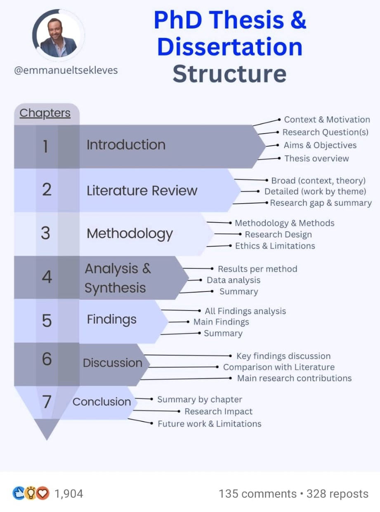
</div>

---

class: inverse, center, middle

# 2. What a Literature Review Is—and Is Not

---

# A literature review is a reasoned synthesis

It identifies, evaluates, interprets, and connects relevant scholarly work.

- **Interpretation:** What does each study mean for the problem?

- **Synthesis:** How do studies relate, agree, conflict, or build on one another?

- **Evaluation:** How credible, relevant, and limited is the evidence?

- **Positioning:** Where does your study enter the conversation?

.box[
A literature review is a **critical argument about existing knowledge**, organized around your research problem—not around the order in which you found papers.
]

.tiny[Adapted from Fink (1998), Merriam (1988), Obenzinger (2005), and Randolph (2009).]

---

# Why write one?

<div style="float:left; width:50%;">
<ul>
<li>establish what is already known;</li>

<li>clarify concepts and theories;</li>

<li>identify methods, variables, and evidence;</li>

<li>locate disagreements and limitations;</li>

<li>justify why your study is needed;</li>

<li>define a credible contribution.</li>
</ul>
</div>

<div style="float:right; width:50%;">
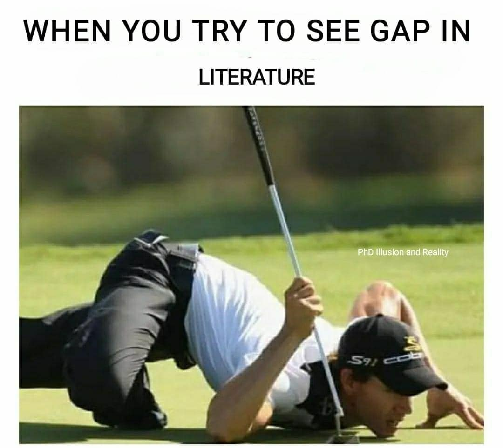
</div>

---

# Literature supplies the meaningful context

Without literature, a project may remain disconnected observation or number-crunching.

The review should help readers understand:

- why the research needs to be conducted;

- how it differs from existing studies;

- where it fits within current knowledge;

- what it may contribute;

- which findings would confirm, extend, qualify, or challenge prior work.

.tiny[Based on Obenzinger, H. (2005), *What Can a Literature Review Do for Me?*]

---

# Reading the literature changes the researcher

It can help you:

- acquire the field’s vocabulary;

- see the main theories and mechanisms;

- discover important concepts and variables;

- learn which designs have succeeded or failed;

- identify data sources and measures;

- recognize assumptions you had not noticed;

- reinterpret or narrow your original question.

---

# What a literature review is not

- a list of studies with one summary per paragraph;

- everything ever written about a broad topic;

- background definitions without scholarly debate;

- a collection selected only because it agrees with you;

- an AI-generated narrative whose sources you have not read;

- proof that “nobody has ever studied this.”

.box[
Select sources because they help explain the **problem, debate, method, evidence, or gap** relevant to your study.
]

---

# Brief discussion: your experience

In groups of three, discuss:

1. Have you written a literature review before?

2. How did you find sources?

3. What was most difficult: searching, reading, organizing, or writing?

4. How did you decide that a source was trustworthy and relevant?

5. Did you synthesize across studies—or mainly summarize them separately?

???
Timing: 7 minutes, followed by a 3-minute class debrief.

---

class: inverse, center, middle

# 3. A Researcher’s Reading and Note-Taking Workflow

---

# Feeling overwhelmed is normal

If you are suffering or feeling perplexed while reviewing literature, you are not alone.

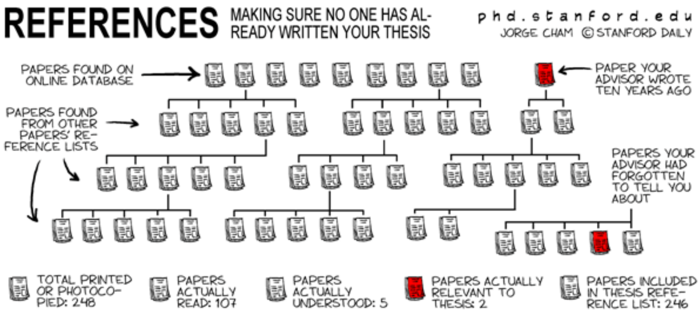

---

# Advice from a mentor

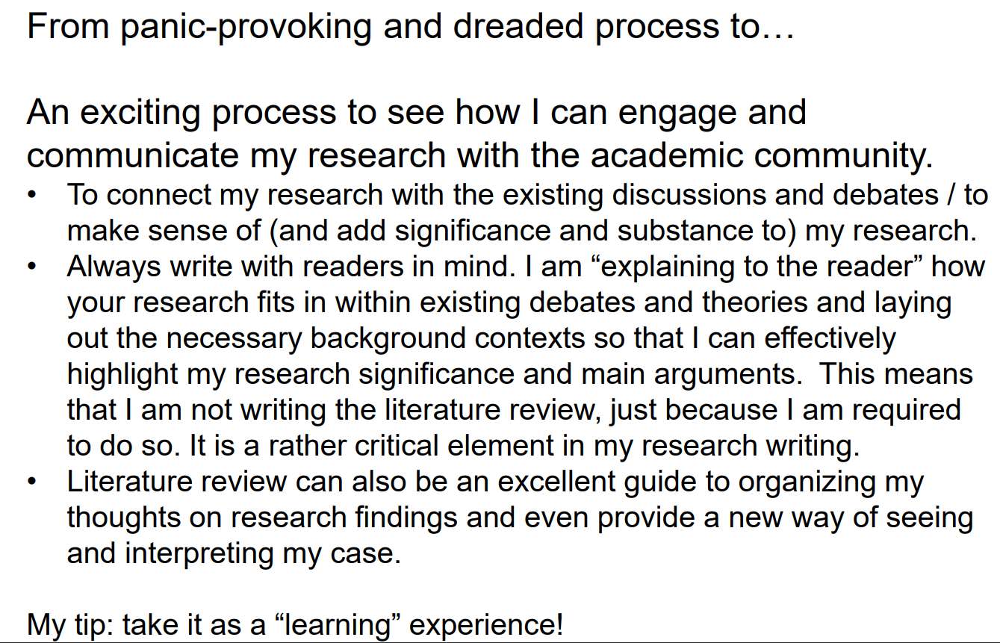

---
class: my-one-page-font
# Step 1: search and select deliberately

Begin with sources that are:

- directly relevant to your question or case;
- influential or repeatedly cited in the relevant debate;
- recent enough to represent current knowledge;
- methodologically useful;
- published in credible outlets;
- able to introduce a different interpretation or contradictory finding.

Use journal standing and citation counts as **signals**, not automatic quality scores. Read the work itself.

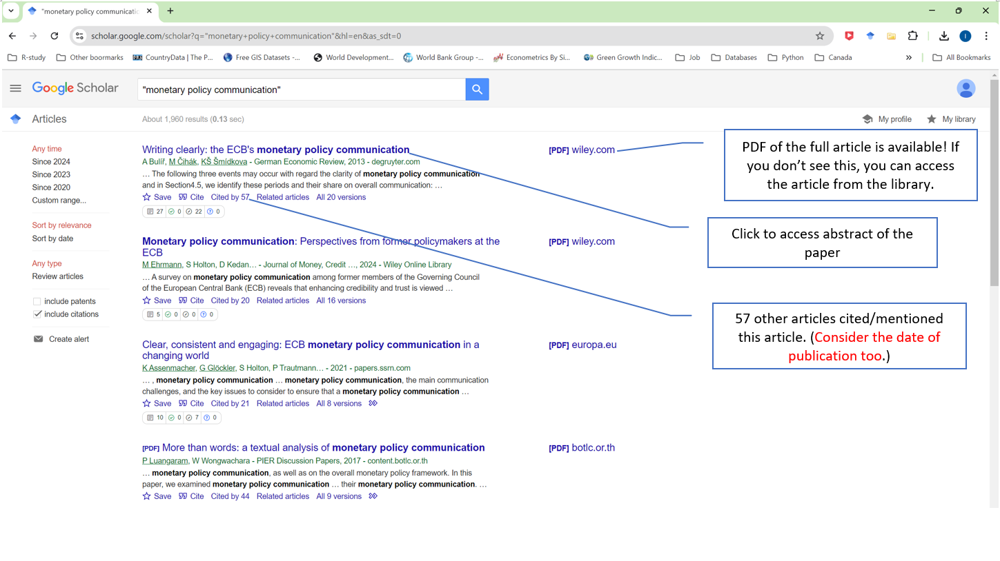

---

# Step 2: read strategically, not mechanically

Start with the title, abstract, introduction, figures or tables, and conclusion.

Then decide:

1. **Stop:** it is outside your scope.
2. **Target:** read the theory, methods, or findings relevant to your question.
3. **Deep read:** it is central enough to examine completely.

While reading, ask:

- What question is answered?
- What claim is made?
- What evidence and method support it?
- What assumptions and limitations matter?

---

# Step 3: capture evidence, not impressions

For every retained source, record:

| Field | What to capture |
|---|---|
| Question | the problem and answer sought |
| Context | population, cases, place, period |
| Concepts/theory | definitions, mechanisms, expectations |
| Evidence/method | data, design, analysis |
| Findings | what the results actually support |
| Limitations | boundaries and unresolved issues |
| Relevance | how it changes your project |

.box[
Record page numbers for important passages. Separate the authors’ claims from your own interpretation.
]

---

# Step 4: let patterns—not papers—organize the review

Group studies by:

- competing explanations;

- shared themes or concepts;

- agreement versus contradictory findings;

- methods or evidence types;

- populations, places, or periods;

- development of the debate over time;

- limitations that motivate your study.

Keep adding and revisiting papers until new searches add little important conceptual information—not merely until you feel tired.

---

# Step 5: find the story and write

Your review should explain:

1. what readers need to know about the debate;

2. what is well established;

3. what remains contested, uncertain, or limited;

4. why that matters;

5. how your question and design respond.

.box[
You are **situating your research** within a scholarly conversation—not reporting everything you read.
]

---

# A review demonstrates field knowledge

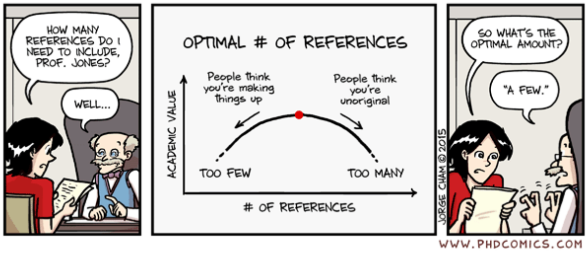

.small[
It should demonstrate informed command of the field’s vocabulary, theories, central phenomena, methods, evidence, and history—while remaining focused on your question.
]

.tiny[Randolph, J. J. (2009), “A Guide to Writing the Dissertation Literature Review.”]

---

# What comes after a draft?

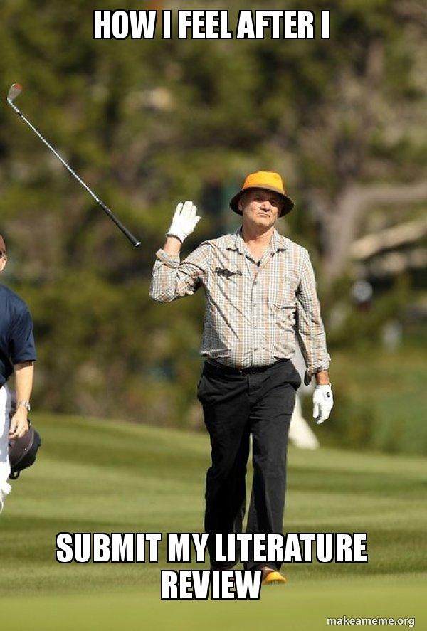

.center[
### Re-read → test the argument → verify citations → revise
]

---

class: inverse, center, middle

# 4. From Sources to Synthesis

---

# Five useful organizing patterns

.small[
| Pattern | Organizing logic |
|---|---|
| **Swiss cheese** | establish current knowledge, identify a consequential gap, show how the study addresses it |
| **Battlebots** | compare rival explanations or conflicting findings and position the study within the debate |
| **Guilt by association** | construct context from adjacent literature when direct research is scarce |
| **Road map** | trace how knowledge or methods developed over time toward the current question |
| **How-to book** | evaluate methodological choices relevant to the planned design |
]

.tiny[These memorable labels come from the recovered course materials. In formal writing, use headings that name the substantive themes—not these labels.]

---

# Reviewing literature is not yet writing the review

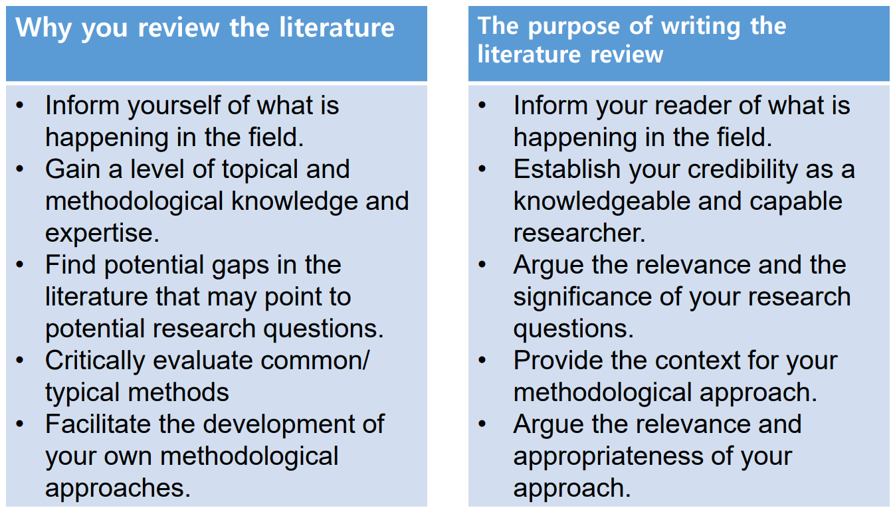

---

# Move from summaries to synthesis

**Paper-by-paper writing**

> A finds X. B finds Y. C examines Z.

**Thematic synthesis**

> Studies offer two explanations for X. The first emphasizes mechanism A and is supported mainly in..., whereas the second emphasizes B. Their conflicting results may reflect differences in measurement and context. Neither directly examines...

.box[
A synthesis paragraph needs a **claim about the literature**, evidence from several sources, comparison or evaluation, and a connection to your study.
]

---

# A gap is an argument—not a missing keyword

Possible gaps include:

- conflicting findings that have not been reconciled;

- a mechanism that is proposed but not tested;

- weak or inappropriate measurement;

- a design that cannot support the claims being made;

- an important population, institution, context, or period not covered;

- disconnected literatures that should be brought together.

.box[
Avoid: **“There are few studies, therefore my study is important.”** Explain why the missing knowledge has meaningful consequences.
]

---

class: inverse, center, middle

# 5. Zotero and Reference Management

---

# Zotero preserves your research trail

<div style="float:left; width:50%;">
<ul>
<li>collect bibliographic records and PDFs;</li>

<li>organize sources in collections;</li>

<li>attach notes, tags, and page references;</li>

<li>insert citations while writing;</li>

<li>generate and update a bibliography;</li>

<li>synchronize across devices.</li>
</ul>
</div>

<div style="float:right; width:50%;">
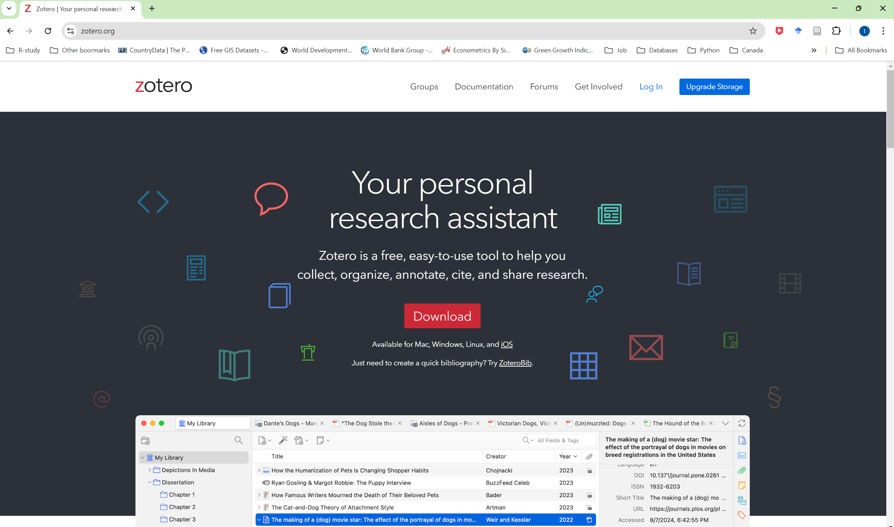
</div>

.tiny[Zotero is free and open-source. See https://www.zotero.org/]

---

# Add sources—and check the metadata

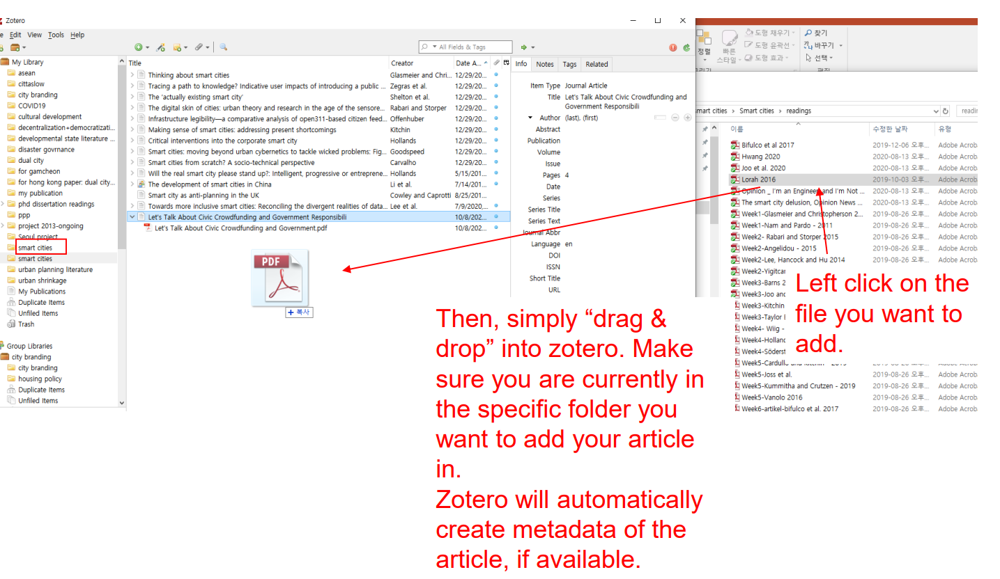

.box[
After importing, verify the authors, title, year, journal, volume, pages, DOI, and capitalization. Automatic metadata can be incomplete or wrong.
]

---

# Create citations and a bibliography

<div style="float:left; width:50%;">
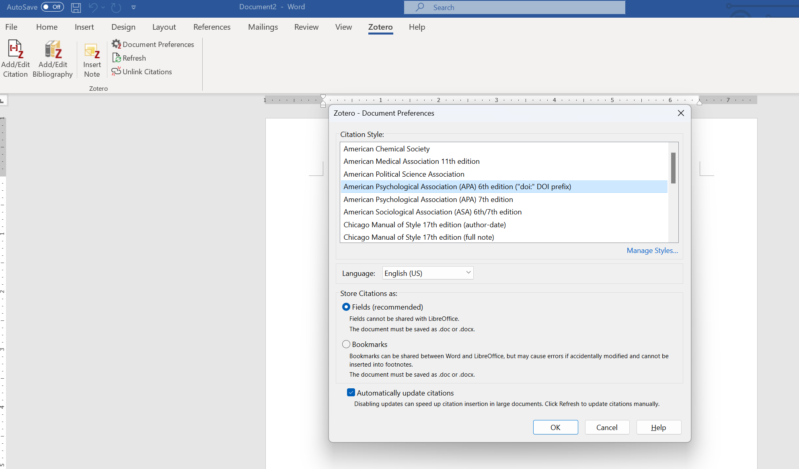
</div>
<div style="float:right; width:50%;">
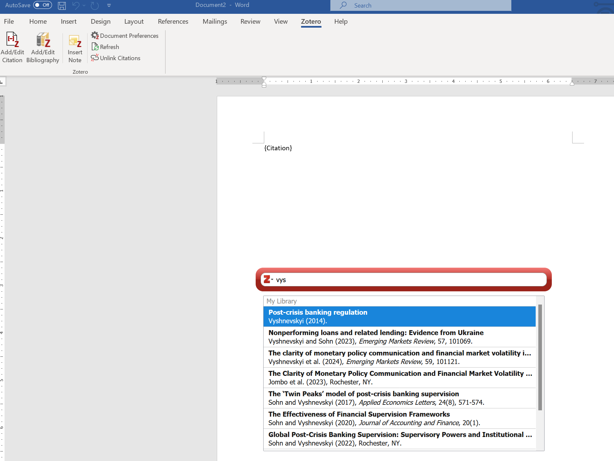
</div>

.small[
Use the Zotero word-processor plugin so citations and the bibliography update together. Pasting a static bibliography is less reliable when sources change.
]

---

class: inverse, center, middle

# 6. Meeting 1 Synthesis

---

# The classic workflow still matters

.center[
### Question → Search → Screen → Read → Extract → Organize → Synthesize → Revise
]

1. Search decisions must be documented.

2. Important claims must come from papers you inspected.

3. Notes must distinguish source content from your interpretation.

4. Synthesis is organized by ideas—not by filenames.

5. A research gap must be demonstrated relative to the literature.

6. Zotero manages citations; it does not evaluate evidence for you.

---

# Prepare for Meeting 2

Bring:

- your Week 2 preliminary question;
- a laptop;
- access to Google Scholar and Zotero;
- one seed paper, if you already have one;
- your course search-log and evidence-matrix templates.

Meeting 2 will compare conventional searching, AI-assisted discovery, and citation-network exploration.

---

class: inverse, center, middle

# Meeting 2

## Modern Literature Discovery and AI-Assisted Synthesis

---

# Agenda

**Week 3 — Meeting 2**

1. What AI Changes—and What It Does Not

2. A Tool for Each Research Task

3. A Verifiable AI-Assisted Workflow

4. Literature Search and Evidence-Matrix Studio

5. Submission and Next Week

???
Pacing: opening and recap 5; what AI changes 10; tool selection 15; verification workflow 10; studio 30; close 5 minutes. If discussion runs long, assign the peer check after class.

---

# Today’s outcome

By the end of class, each student should have:

- a documented conventional search;

- an AI-assisted search or discovery route;

- at least three verified scholarly sources;

- a Zotero collection;

- initial evidence-matrix entries;

- one tentative theme, disagreement, or gap;

- an AI-use and verification record.

---

class: inverse, center, middle

# 1. What AI Changes—and What It Does Not

---

# Search has moved beyond exact keywords

**Conventional search** retrieves papers using keywords, metadata, citations, filters, and database ranking.

**AI-assisted search** may interpret a natural-language question, expand it into related concepts, rank semantically related papers, or summarize retrieved material.

.box[
AI can accelerate **discovery and organization**. It does not establish that the search is complete, the source exists, the summary is accurate, or the inference is defensible.
]

---

# Keep the conventional route

Translate the research question into concept groups:

> (central bank communication OR monetary policy communication)  
> AND (market volatility OR exchange-rate volatility)  
> AND (clarity OR readability OR complexity)

Then use:

- quotation marks for phrases;
- `OR` for synonyms;
- `AND` for concept groups;
- date, field, and document-type filters;
- backward citations (references) and forward citations (“cited by”).

.box[
Record the exact query, database, date, filters, and selection decision in your search log.
]

---

# Google Scholar and Scholar Labs serve different purposes

| Google Scholar | Google Scholar Labs |
|---|---|
| keyword and phrase searching | detailed natural-language research questions |
| familiar ranked results | AI identifies papers across multiple aspects of the question |
| citations, versions, dates, related articles | experimental AI-assisted relevance search |
| easier to reproduce with an exact query | results may evolve and access may be limited |

.tiny[Scholar Labs was introduced by Google in November 2025 and remains experimental. Access: https://scholar.google.com/scholar_labs/search]

???
[Sources] https://blog.google/products-and-platforms/products/education/google-scholar-labs/ ; https://scholar.googleblog.com/2025/11/scholar-labs-ai-powered-scholar-search.html

---

# AI can support different stages

.small[
| Research task | Possible tools | Human responsibility |
|---|---|---|
| Broad semantic discovery | Scholar Labs, Semantic Scholar, Elicit, Consensus | test coverage and relevance |
| Citation-network exploration | ResearchRabbit, Connected Papers | inspect why papers connect |
| Bibliometric mapping | VOSviewer | select valid data and interpret clusters |
| Citation-context evaluation | scite | read the citing and cited papers |
| Reference management | Zotero | verify metadata and sources |
| Drafting or questioning documents | Z.ai/GLM-5.2, ThesisAI, other LLMs | supply verified sources; check every claim and citation |
]

.box[
Choose a tool because it fits a **specific research task**, not because it promises to “write the literature review.”
]

---

class: inverse, center, middle

# 2. A Tool for Each Research Task

---

# Semantic discovery tools

- **Google Scholar Labs:** explores a detailed scholarly question from multiple angles.

- **Semantic Scholar:** AI-supported discovery, recommendations, and paper metadata.

- **Elicit:** semantic search, screening, and structured extraction.

- **Consensus:** question-based searching and synthesis linked to research papers.

Use more than one route when coverage matters. Different systems index and rank different material.

.tiny[Official sites: https://scholar.google.com/scholar_labs/search · https://www.semanticscholar.org/ · https://elicit.com/ · https://consensus.app/]

---

# General-purpose AI and drafting systems

Tools such as **Z.ai (GLM-5.2)** and **ThesisAI** may help with:

- generating search-term alternatives;

- questioning user-supplied papers;

- comparing evidence-matrix entries;

- proposing thematic structures;

- testing paragraph coherence;

- identifying claims that still need evidence.

They must not be treated as independent bibliographic authorities.

.box[
If the system names a paper, locate the original record and read the relevant original text before using it.
]

.tiny[Official sites: https://z.ai/ · https://www.thesisai.io/]

---

# ResearchRabbit explores citation networks

Start with one or more verified seed papers, then explore:

- related work;

- earlier and later work;

- influential authors;

- clusters and connections;

- papers missing from the keyword search.

Network proximity is a discovery clue—not proof of quality or relevance.

.tiny[https://www.researchrabbit.ai/]

???
[Sources] https://www.researchrabbit.ai/ ; Cole, V. et al. (2023), ResearchRabbit, Journal of the Medical Library Association.

---

# Connected Papers: another discovery route

<div style="float:left; width:50%;">
<ul>
<li>begin with a verified seed paper;</li>

<li>inspect related prior and derivative works;</li>

<li>look for important papers missed by keyword search;</li>

<li>verify each candidate independently.</li>
</ul>
</div>

<div style="float:right; width:50%;">
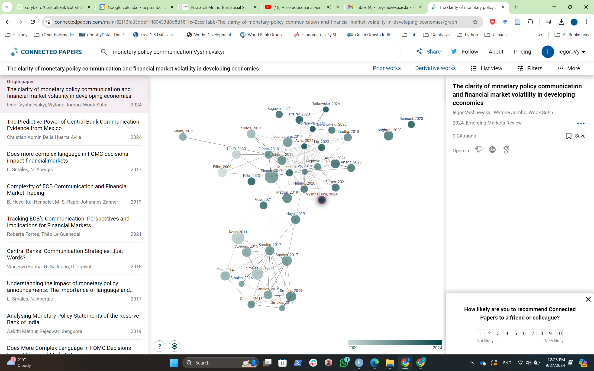
</div>

.tiny[https://www.connectedpapers.com/]

---

# VOSviewer maps a body of literature

VOSviewer is free software for constructing and viewing bibliometric networks, including:

- co-authorship;

- citation and co-citation;

- bibliographic coupling;

- keyword co-occurrence.

It is most useful when you have a sufficiently large, well-defined bibliographic dataset. A colorful map does not itself establish a theme or research gap.

.tiny[For class, prefer VOSviewer Online: https://app.vosviewer.com/. As of September 7, 2026, the official site displays a security notice concerning a Windows installer downloaded during a specified period on August 31. Official site: https://www.vosviewer.com/ · van Eck & Waltman (2010), *Scientometrics*, 84, 523–538.]

???
[Sources] https://www.vosviewer.com/ ; https://pmc.ncbi.nlm.nih.gov/articles/PMC2883932/

---

# scite examines citation context

Citation counts answer: **How often was this work cited?**

Citation contexts help ask:

- Was the finding supported, contrasted, or merely mentioned?

- Which part of the paper was cited?

- Did later research qualify the original claim?

.box[
Automated citation classifications are leads for inspection. Read the relevant citing passage and original paper before drawing conclusions.
]

.tiny[https://scite.ai/]

---

# Do not turn the course into a tool catalogue

For this week, use a compact stack:

1. **Google Scholar** for a documented conventional search;

2. **Scholar Labs or Elicit/Semantic Scholar** for semantic discovery;

3. **ResearchRabbit or Connected Papers** for citation expansion;

4. **Zotero** for organization;

5. **your evidence matrix** for understanding and synthesis.

VOSviewer, scite, ThesisAI, Z.ai, and other tools are useful when their specific function matches the project.

---

class: inverse, center, middle

# 3. A Verifiable AI-Assisted Workflow

---

# Use AI around verified evidence—not instead of it

.center[
### Question → Search log → Candidate papers → Original texts → Evidence matrix → Thematic synthesis
]

AI may assist at several points, but the researcher must preserve:

- the exact question or prompt;

- the tool and date;

- the candidate sources returned;

- inclusion and exclusion decisions;

- passages used as evidence;

- corrections made after verification.

---

# Safe uses of AI during a literature review

- propose synonyms and adjacent concepts for search;

- classify **your verified notes** into possible themes;

- compare methods or findings entered in your matrix;

- challenge a proposed gap by suggesting alternative explanations;

- identify unsupported sentences in your draft;

- improve clarity after the scholarly argument is established.

Risk increases when AI is asked to search, interpret, cite, and draft the final prose in one invisible step.

---

# A verification protocol for every AI-supported claim

1. **Existence:** Does the source exist with correct authors, title, year, and outlet?

2. **Access:** Can you open the original abstract or full text?

3. **Entailment:** Does the cited passage support the sentence you wrote?

4. **Context:** Are population, period, method, and limitations represented accurately?

5. **Independence:** Did you verify it outside the AI-generated response?

6. **Traceability:** Can another person reconstruct how the source entered your review?

.box[
Never cite the AI summary as though you had read the paper.
]

---

# Prompt from your own evidence matrix

**Better prompt**

> Using only the verified evidence-matrix entries below, propose two possible thematic structures. For each, identify agreements, contradictions, differences in method or context, and cells that do not contain enough evidence. Do not add studies or claims.

**Then you must:**

- inspect every proposed connection;

- return to the original papers where necessary;

- select the structure that best answers your research question;

- write and defend the synthesis yourself.

---

# AI cannot decide your contribution for you

An AI system may propose that “few studies examine X,” but this is not evidence of a gap.

To defend a contribution, you must show:

- what search routes were used;

- which closely related studies were found;

- what those studies actually cover;

- what remains unresolved;

- why resolving it matters;

- how your design can address it.

---

# Optional video demonstrations

The following instructor-selected videos illustrate current AI-assisted literature-review workflows:

1. https://youtu.be/O9TE-3V9m58
2. https://youtu.be/1PSMmwQkqME
3. https://youtu.be/uur5MmjTe5I

.box[
Treat demonstrations as **workflow ideas**, not as evidence that a tool’s output is complete or reliable. Tool interfaces and capabilities change quickly.
]

---

class: inverse, center, middle

# 4. Literature Search and Evidence-Matrix Studio

---

# Studio overview

Work individually on your own research project. You may discuss search strategies with classmates.

1. Translate the question into search concepts.

2. Run and document a conventional search.

3. Run one AI-assisted or citation-network search.

4. Compare the results.

5. Verify and save at least three sources.

6. Begin the evidence matrix.

7. Write one provisional synthesis statement.

???
Total studio time: approximately 38 minutes. Instructor circulates throughout.

---

# Step 1 — Build the search plan

Write:

- your current research question;

- 2–4 central concepts;

- synonyms and related terms for each concept;

- proposed boundaries: population, place, period, language, and study type;

- provisional inclusion and exclusion criteria.

Then construct one reproducible Google Scholar query.

???
Timing: 7 minutes.

---

# Step 2 — Compare two discovery routes

**Route A:** Google Scholar using your exact documented query.

**Route B:** Scholar Labs, Elicit, Semantic Scholar, ResearchRabbit, or Connected Papers.

Record:

- tool, date, query or seed paper;

- filters used;

- promising sources found by both routes;

- useful sources found by only one route;

- irrelevant or suspicious results;

- how the second route changed your search vocabulary.

???
Timing: 10 minutes.

---

# Step 3 — Verify and preserve three sources

For each candidate:

1. locate the original publication record;

2. verify bibliographic metadata and DOI, when available;

3. read at least the abstract, introduction, and conclusion;

4. decide whether to include, exclude, or postpone;

5. record the reason;

6. add included sources to Zotero.

Do not select a paper only because an AI system summarized it confidently.

???
Timing: 10 minutes.

---
class: my-one-page-font
# Step 4 — Begin the evidence matrix

For at least three verified sources, record:

- full citation;

- research question;

- context and evidence;

- method;

- main finding;

- relevant theory or mechanism;

- limitation;

- relevance to your project;

- theme or debate;

- location of the verified original source.

???
Timing: 8 minutes. Completing all entries becomes homework if necessary.

---

# Step 5 — Write one synthesis statement

Complete one of these structures:

> Existing studies generally agree that **…**, but disagree about **…**, partly because **…**.

> Research has established **…** in **[contexts]**, but it remains unclear whether **…** in **[your context]**.

> Two explanations dominate the literature: **…** and **…**. Existing evidence cannot yet distinguish them because **…**.

Label it **provisional**. Three papers rarely establish an entire field.

???
Timing: 3 minutes.

---

# Peer check

Exchange your search log and synthesis statement with one partner.

Check:

- Can you reproduce the conventional search?

- Are all three papers verifiable?

- Does the statement synthesize rather than list?

- Does it accurately represent the evidence recorded?

- Is the proposed gap cautious enough?

- Is any AI assistance disclosed?

???
Timing: 5 minutes if class progress permits; otherwise use as the submission self-check.

---

class: inverse, center, middle

# 5. Submission and Next Week

---

# Literature search package

Upload to **Cyber Campus**:

1. your current research question;

2. search log with one conventional and one modern discovery route;

3. inclusion and exclusion logic;

4. at least five verified sources saved in Zotero;

5. evidence-matrix entries for at least five sources;

6. one provisional theme, disagreement, or gap;

7. one draft synthesis paragraph;

8. AI-use log, if any AI tool was used;

9. one paragraph explaining how the literature changed your Week 2 question.

---

# What happens in Week 4?

Week 3 finds and evaluates individual sources.

Week 4 will turn the evidence matrix into:

- thematic organization;

- a critical literature synthesis;

- a defensible research gap;

- a conceptual or theoretical framework;

- a revised question, objective, and contribution;

- the literature-review component of your research proposal.

---

# Prepare for Week 4

Complete the search log and evidence matrix.

Revisit:

1. Randolph, J. J. (2009). “A Guide to Writing the Dissertation Literature Review.” *Practical Assessment, Research, and Evaluation*, 14, Article 13.
2. Obenzinger, H. (2005). *What Can a Literature Review Do for Me? How to Research, Write, and Survive a Literature Review.*

Bring the full texts of your five most relevant sources and be ready to explain why each belongs in your review.

---

# The standard is simple

.center[
### AI may help you discover, organize, compare, and revise.

### You remain responsible for searching, reading, reasoning, verifying, and writing.
]

---

class: inverse, center, middle

# Appendix

---

# Additional recovered experience slides

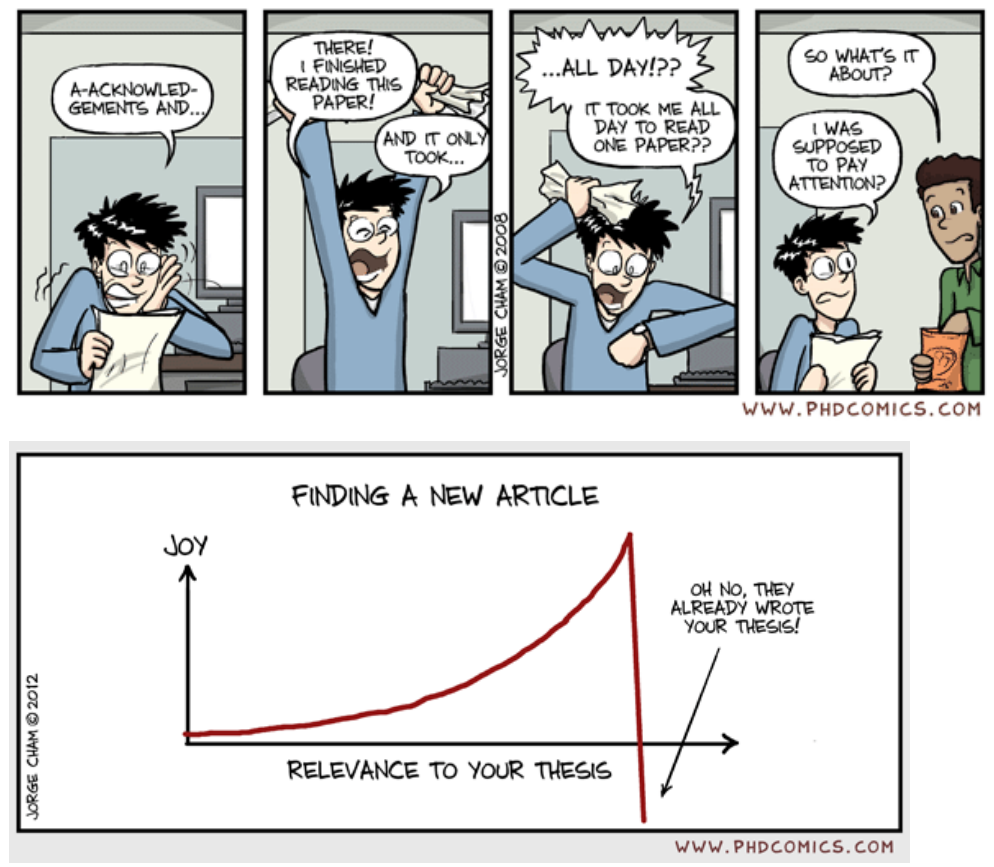

---

# Additional recovered experience slides

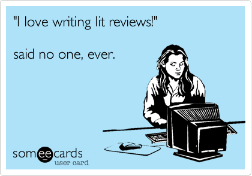

---

# Additional Zotero screenshots

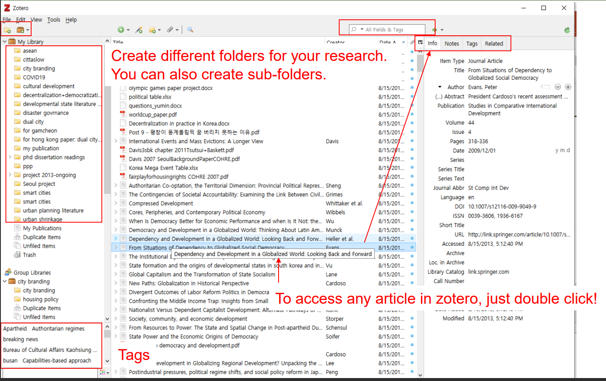

---

# Additional Zotero screenshots

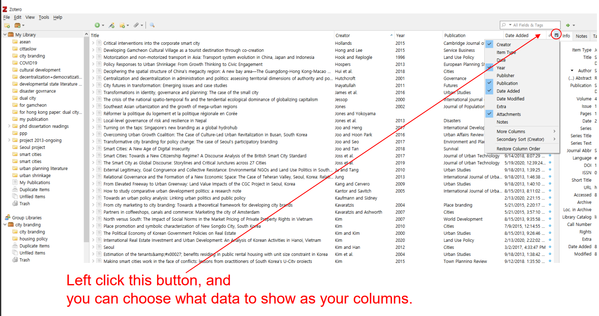

---

# Adding sources: recovered screenshots

<div style="float:left; width:50%;">
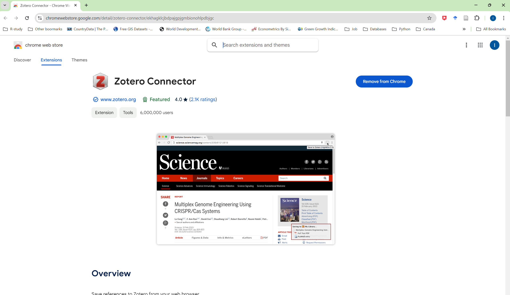
</div>
<div style="float:right; width:50%;">
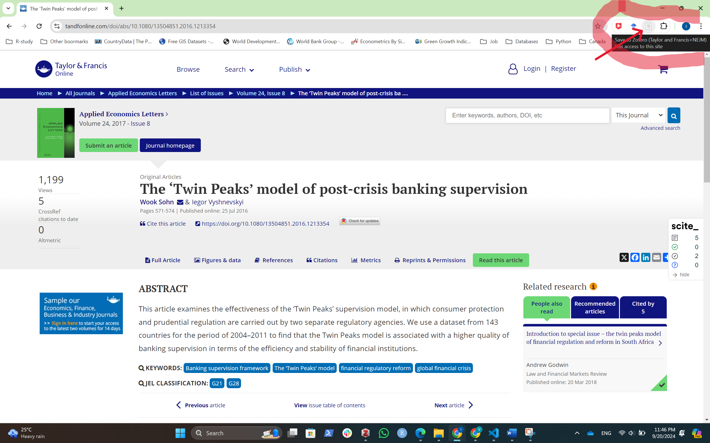
</div>

---

# A phenomenological literature-review approach

.small[
One specialized approach treats research reports as the unit of analysis and seeks the essence of researchers’ empirical experiences with a phenomenon:

1. identify the phenomenon and bracket the reviewer’s prior position;

2. define inclusion criteria and collect relevant reports;

3. identify meaningful statements;

4. interpret and group statements into categories;

5. construct a rich description of the phenomenon across the reports.
]

.box[
This is one specialized review methodology—not the default structure required for every course project.
]

---

# Source and tool references

.tiny[
- Fink, A. (1998). *Conducting Research Literature Reviews.*

- Obenzinger, H. (2005). *What Can a Literature Review Do for Me?*

- Randolph, J. J. (2009). “A Guide to Writing the Dissertation Literature Review.”

- van Eck, N. J., & Waltman, L. (2010). “Software survey: VOSviewer.” *Scientometrics*, 84, 523–538.

- Google Scholar Labs: https://scholar.google.com/scholar_labs/search

- Google Scholar Labs announcement: https://scholar.googleblog.com/2025/11/scholar-labs-ai-powered-scholar-search.html

- Zotero: https://www.zotero.org/

- ResearchRabbit: https://www.researchrabbit.ai/

- Connected Papers: https://www.connectedpapers.com/

- VOSviewer: https://www.vosviewer.com/

- Semantic Scholar: https://www.semanticscholar.org/

- Elicit: https://elicit.com/

- Consensus: https://consensus.app/

- scite: https://scite.ai/

- Z.ai: https://z.ai/

- ThesisAI: https://www.thesisai.io/
]

---

class: inverse, center, middle

# Questions?


???
1. To print pdf slides
library(renderthis)

renderthis::to_pdf("W3_RMDS.html")

getwd()
setwd("C:\\Users\\vyshn\\OneDrive - kdis.ac.kr\\Documents\\GitHub\\Sogang\\2026\\Fall\\Research Method of Data Science\\W3")
