<style>
@media print{
  body, html, .remark-slides-area, .remark-notes-area {
    height: 100% !important;
    width: 100% !important;
    overflow: visible;
    display: inline-block;
    }
</style>

<style type="text/css">
.remark-slide-content {
    font-size: 34px;
    padding: 1em 4em 1em 4em;
}
</style>

<style type="text/css">
.my-one-page-font {
  font-size: 28px;
}
</style>

<style type="text/css">
.my-one-page-font-table {
  font-size: 24px;
}
</style>

<style>
.tiny { font-size: 60%; }      /* class you can reuse anywhere */
</style>

<style>
.remark-slide-content {
  position: relative;
  z-index: 1;
}

.remark-slide-content::before {
  content: "";
  position: absolute;
  top: 50%;
  left: 50%;
  width: 600px;          /* adjust size */
  height: 600px;
  background-image: url("1. 교장(Seal_Positive).png");  /* place logo file in same folder */
  background-repeat: no-repeat;
  background-position: center;
  background-size: contain;
  opacity: 0.05;         /* watermark transparency */
  transform: translate(-50%, -50%);
  pointer-events: none;
  z-index: 0;
}
</style>


```{r setup, include = FALSE}
library(tidyverse)
library(knitr)

opts_chunk$set(fig.width = 10, 
               message = FALSE, 
               warning = FALSE,
               echo = FALSE)
```

```{r xaringan-themer, include=FALSE, warning=FALSE}
#install.packages("xaringanthemer")
library(xaringanthemer)
style_mono_accent(
  base_color = "#851a10",
  header_font_google = google_font("Josefin Sans"),
  text_font_google   = google_font("Montserrat", "500", "550i"),
  code_font_google   = google_font("Fira Mono"),
  colors = c(
  red = "#f34213",
  purple = "#3e2f5b",
  orange = "#ff8811",
  green = "#136f63",
  white = "#FFFFFF"
)
)
```

# Welcome to Week 5!

## Qualitative research. Design approaches in qualitative inquiry

.box[
**This week’s output:** Clear understanding of the 5 design approaches in qualitative research and how they can be applied to your own research project.
]

---

# Agenda

1. What is qualitative research?

2. Introducing 5 design approaches in qualitative research

3. Some examples with published journal articles

4. In-class activity

5. Class activity/discussion: why and how your research could benefit from qualitative research

6. Next class reading assignment

---

class: inverse, center, middle

# 1. What is qualitative research?

---

# What is qualitative research?

- Concerns with “what,” “why,” and “how” questions rather than “how many.”

- Aims are directed at providing an in-depth and interpreted understanding of the social world. 

- Usually data are rich and complex and involve words or images rather than numbers. 

- Analysis retains complexity and nuance and respects uniqueness of each case. 

- Hypotheses are commonly generated from analysis of the data rather than stated at the outset.

---

# Introduction to qualitative research

*How to study social world: key philosophical issues.*

- Ontology: the nature of the world and what there is to know about it.
   - Realism: an external reality exists independent of our beliefs or understanding.
      - Critical realism: reality exists independently but is only accessible through the perceptions and interpretation of individuals.  
   - Idealism: no external reality exists independent of our beliefs and understandings.

- Epistemology: how we can know or find out about the social world and the limits to that knowledge.
   - Inductive logic: involves building knowledge from the bottom up through observations of the world, which in turn provide the basis for developing theories or laws.
   - Deductive logic: a top-down approach to knowledge. Starts with a theory from which a hypothesis is derived and applied to observations about the world. Hypothesis is to be confirmed or rejected.

---

# Introduction to qualitative research

Doing qualitative research: 
- Usually involves balance between inductive and deductive approaches across the research process, including the analysis and developing interpretations of data.
   - At the start of a research project: typically use existing theory and research to help plan and design the study, develop a sampling approach and create fieldwork tools.
   - In the field & early analysis: seek to obtain as much detailed information as possible and focus more on understanding and exploring participants’ views and experiences.
   - Near the end of analysis: findings are often put back into the context of other theories or existing knowledge. 

---

# Introduction to qualitative research

Classification of the potential functions of social research:
- *Contextual*: identifying what exists in the social world and the way it manifests itself.
   - Qualitative methods can describe and display phenomena as experienced by the study population, in fine-tuned detail and in the study participants’ own terms.
- *Explanatory*: why phenomena occur and the forces and influences that drive their occurrence.
   - Qualitative methods allow examination of subjects in depth to understand what lies behind a decision, attitude, behavior, etc.
- *Evaluative*: how well things work. Usually requires a mix of quantitative and qualitative enquiry.
   - Qualitative methods can uncover the dynamics of how things operate and reveal many factors (that are not accessible through quantitative methods) that shape a policy.
- *Generative*: aid the development of theories, or policy strategies/actions.
   - Qualitative methods allow original or creative thoughts to emerge.

---

# Introduction to qualitative research

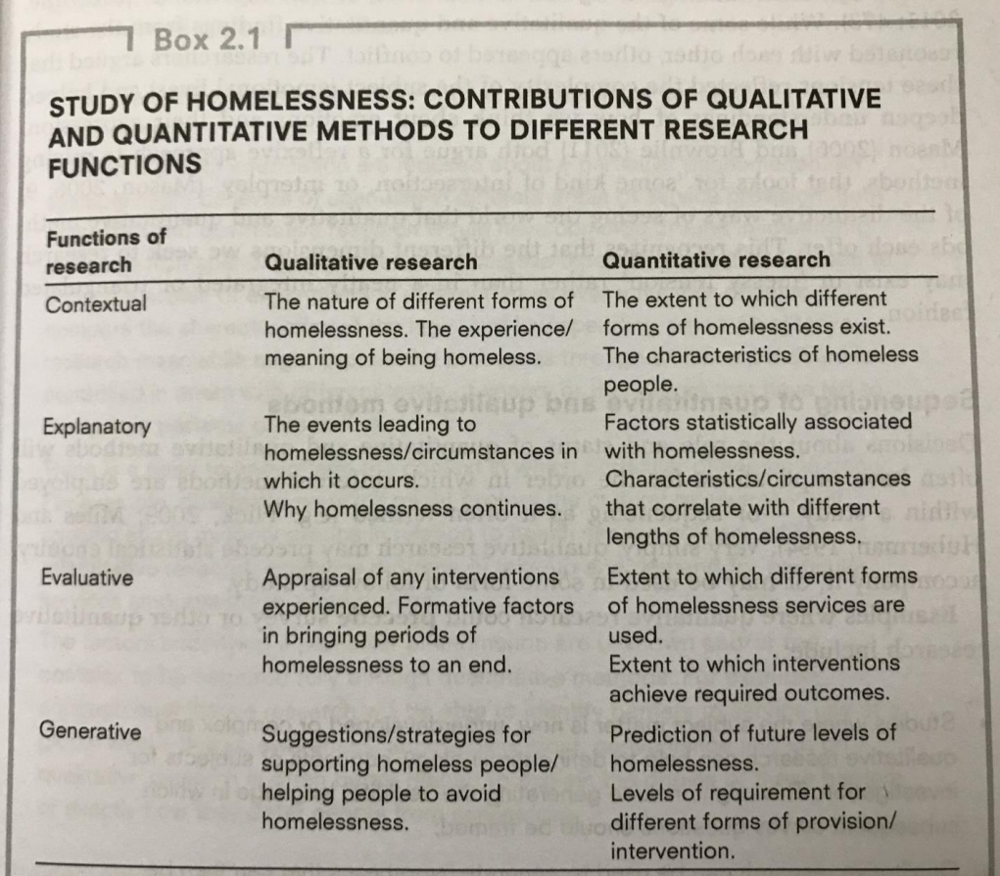

---

# Introduction to qualitative research

## Why qualitative research matters?

- Qualitative research is often used to explore new phenomena and to gain a deeper understanding of complex issues.

- It is particularly useful when the researcher wants to understand the meanings people attach to their experiences, beliefs, and actions.

- It is also useful when the researcher wants to understand the context in which people live and work.

---

# Introduction to qualitative research

## Mixed methods research

- Aims and outputs of quantitative and qualitative methods are quite different, but can provide powerful evidence in combination. 
- To provide a fuller picture of phenomena, by understanding through the use of multiple perspectives that can reveal different dimensions or multifaceted nature of the social world.
- Breadth (quantitative) and depth (qualitative)

## Sequencing of qualitative methods:
- Preceding: new or complex subjects, to generate hypotheses, to typologize.
- In tandem: to examine both the number and nature of a phenomenon. 
   - Factors underlying a phenomenon are too complex or unknown to be fully captured in quantitative methods.
   - Requires understanding of “why” and “how.”
   - Requires understanding of the context in which phenomena occur. 
- Follow-up: when further explanation of a phenomenon is needed, beyond the results of the quantitative research.

---

class: inverse, center, middle

# 2. Introducing 5 design approaches in qualitative research

---

# Why identify an approach to qualitative inquiry?

*Consider the two scenarios:*

1. The paper does not identify any specific approach to qualitative research used.
   - The methods discussion is limited to the collection of face-to-face interviews.
   - The findings are presented as a thematic workup of major categories of information collected during the interviews.

2. A specific approach to qualitative research is adopted. (e.g., narrative approach).
   - The methods discussion is detailed *describing the meaning of such an approach, why it was used, and how it informed the procedures of the study*.
   - The findings convey the specific story of an individual, and it is told chronologically, highlighting some of the tensions in the story. Details about the specific organization in which the individual’s story takes place provide important contextual information.
---

# Five qualitative approaches

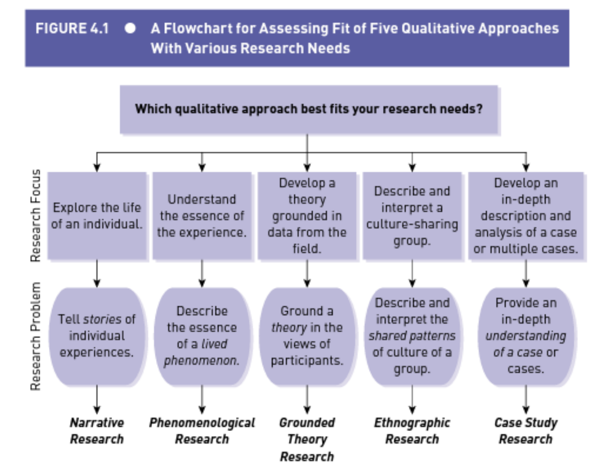

---

# Narrative

- Narrative inquiry is the interdisciplinary study of the activities involved in **generating and analyzing stories of life experiences** (e.g., life histories, narrative interviews, journals, diaries, memoirs, autobiographies, biographies) and reporting that kind of research (Schwandt, 2007). 

- Need to **attend to the context** in which the narrative is embedded.

- A collaborative process between researcher and participants. They negotiate the meaning of the stories, adding a validation check to the analysis. 

---

# Phenomenology

- Phenomenology is the way in which human beings come to understand the world/phenomenon through direct **experience**. 

- If you want to know what “love” is, you would not ask psychologists, you would tap into your own *experiencesn* (Littlejohn & Koss, 2011).

- A phenomenon to be explored is phrased in terms of a single concept or idea.

- Need to develop two descriptions: 1) **textural description** of the experiences of the persons (what they experienced). 2) **structural description** (how they experienced it in terms of the conditions, situations, or context).

- Textural + structural = overall “**essence**” of the phenomenon.

---

# Grounded theory

- Grounded theory is a systematic methodology in the social sciences involving the construction of theory through methodic gathering and analysis of data (i.e., theory is generated **“grounded” in data** from the field.

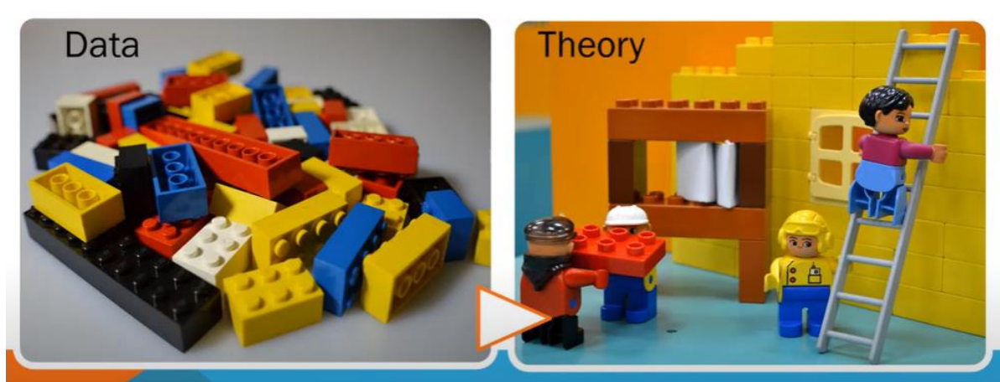


---

# Grounded theory

- Focuses on a process or an action that has distinct steps or phases that occur over time.

-  *Data and analysis procedures* are undertaken *simultaneously and iteratively*. Constantly comparing data with ideas about emerging theory. Going back and forth between the participants, gathering new interviews and then returning to the evolving theory to fill in the gaps and to elaborate.

- Interview questions should be focused on understanding how individuals experience the process and identify the steps in the process. (What was the process and how did it unfold?)

- A theory emerged is often portrayed in a visual model.

---

# A brief introduction to coding


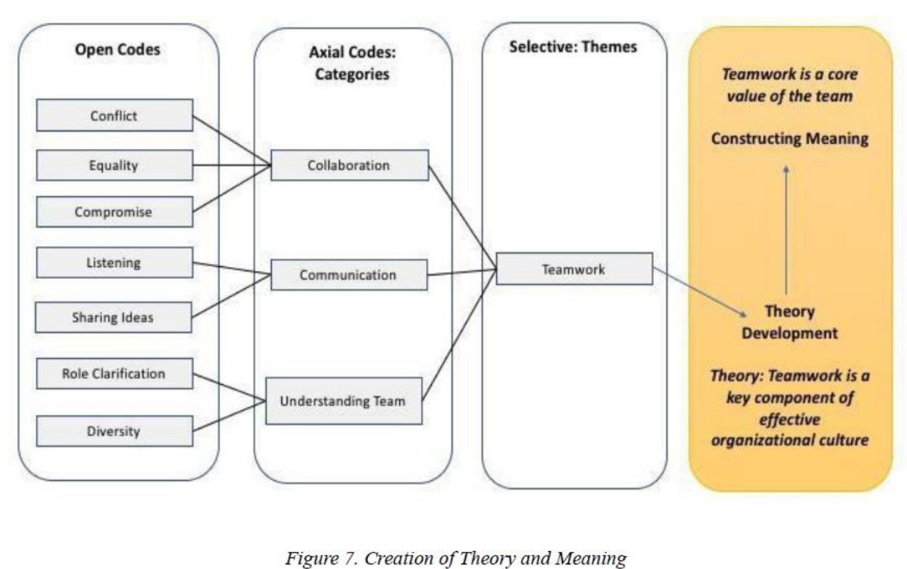

---

# Ethnographic

- Examines the shared patterns of an entire **culture-sharing group**.

- Focuses on a particular site that provide the researcher with a context in which to study both the setting and the participants who inhabit it. 

- The participants are observed as they take part in naturally occurring activities within the setting. 

- Ethno: people or folk; Graphy: describe something.

- =Ethnography: describing and understanding another way of life from the native point of view (Neuman, 2007).

---

# Case study

- Case study focuses on the **detailed, in-depth exploration** of phenomena that occur **within a bounded system** (e.g., an organization, community, event, program, etc.), involving multiple sources of information.

- Can answer both descriptive questions (e.g., what happened?) and explanatory questions (e.g., how or why did something happen?)

- Types of case: **intrinsic case**: a case that has unusual interest in and of itself and needs to be studied; **instrumental case**: a case is selected to best understand a problem.

- In multiple cases, it is important to identify *quitain* upfront to guide case selection. (*quitain*: “object or phenomenon to be studied.”)


---

# Summary of methods and data collection


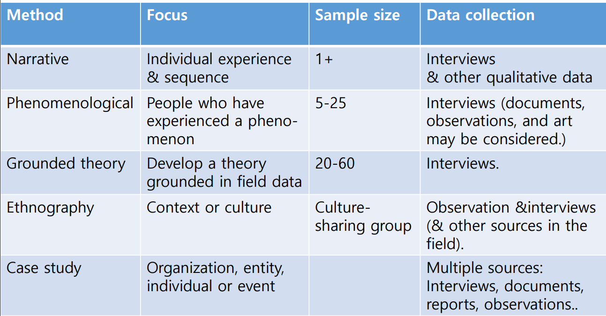


---

# Summary of methods and data collection


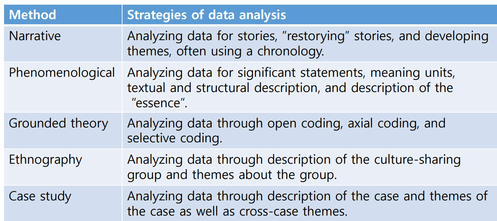

---

# Challenges

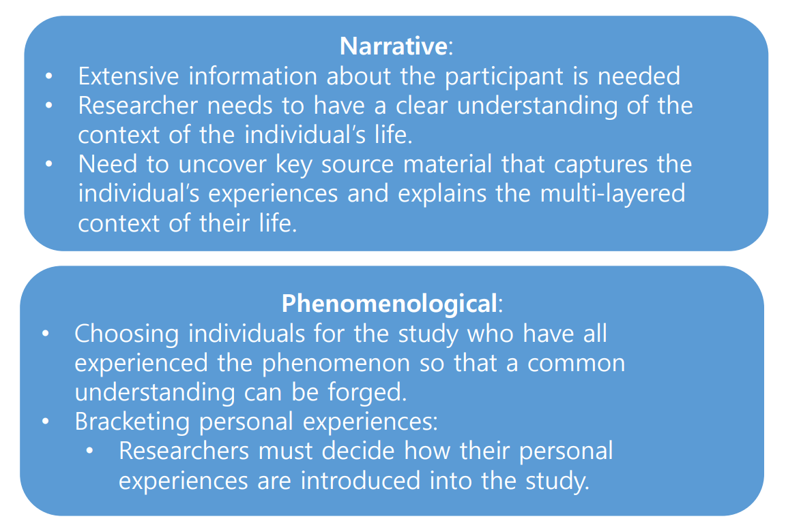


---

# Challenges

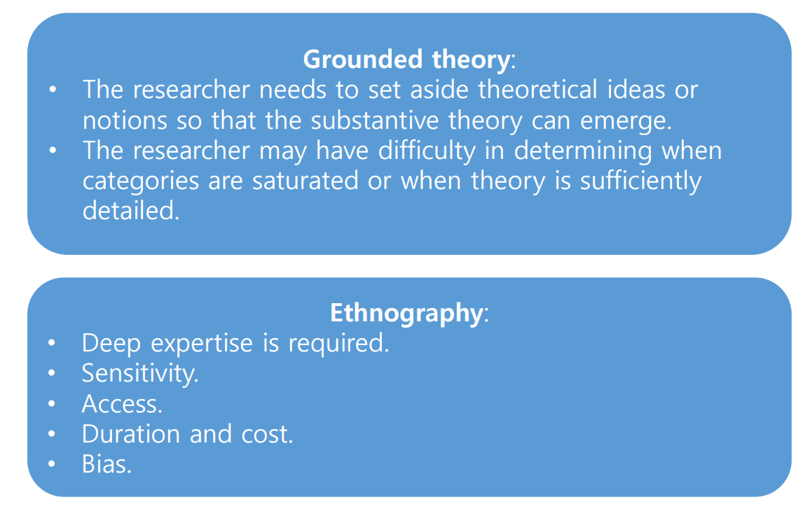

---

# Challenges

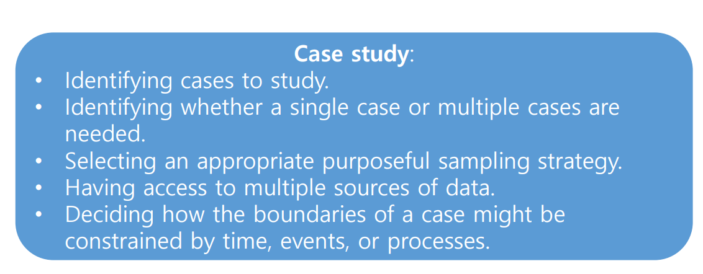

---

class: inverse, center, middle

# 3. Some examples with published journal articles

---

# Narrative approach example


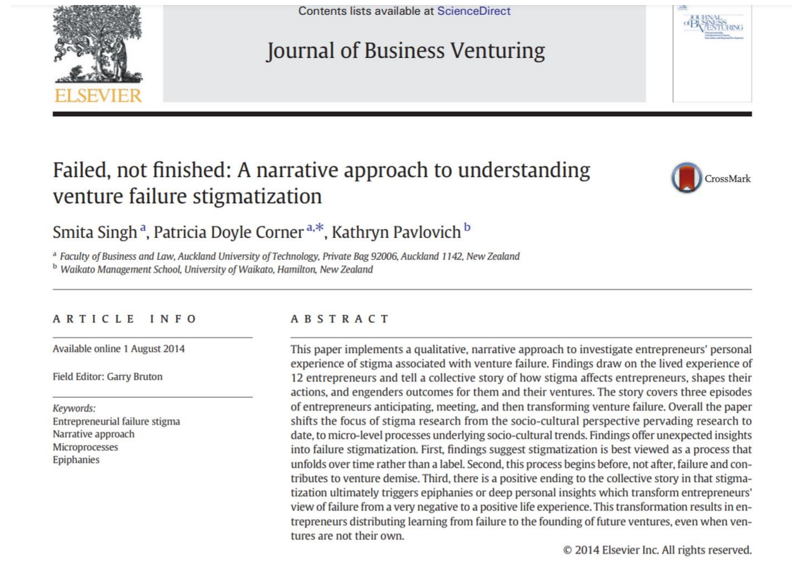

---

# Narrative approach example


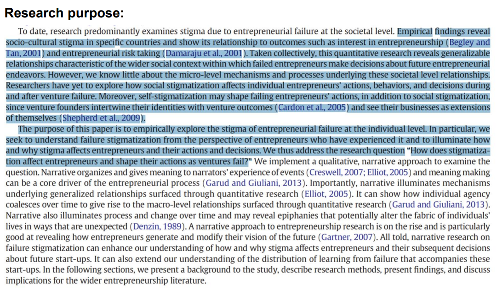

---

# Narrative approach example

Methodology: 

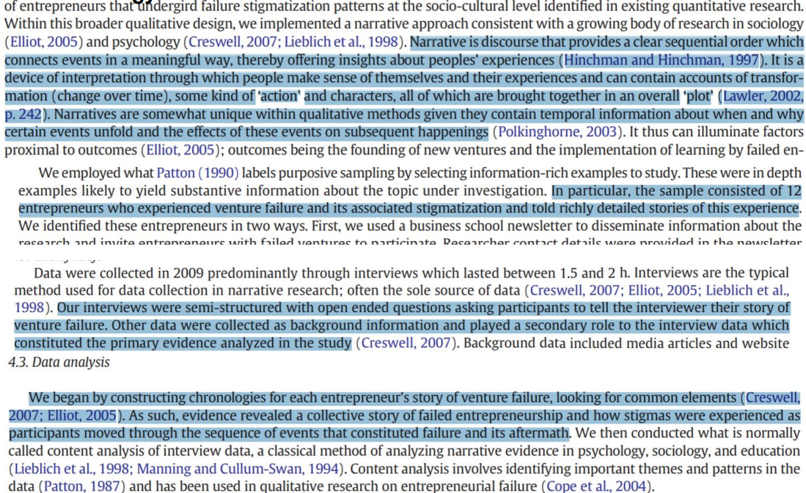

---

# Phenomenological approach example

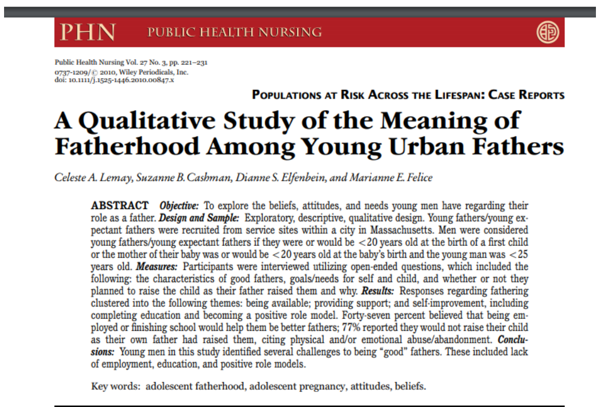

---

# Phenomenological approach example

- Research purpose:
   - The present study was designed to *explore the beliefs, attitudes, and needs* that current and expectant adolescent fathers and young men who are fathers of children born to adolescent mothers have regarding *their role as a father*. *Understanding young fathers’ views of their roles, their goals, their needs, and the difficulties they encounter, as well as their hopes for themselves and their children*, can increase the likelihood that programs will help these young men play a positive role in their children’s growth and development. This may improve the likelihood that children born to adolescents will develop into healthy and well-developed adults.

- Methodology:
   - *Phenomenology* enhances the understanding of the context of the lived experience of the individual as well as what that experience means to him or her (Husserl, 1970). Additionally, phenomenology incorporates the concept of bracketing, requires the setting aside of preconceived notions, stereotypes, or biases in an attempt to collect information, and analyze data without prejudice (Porter, 1998). *This approach also calls for data collection to be conducted through individual interviews* (Issel, 2004).

---

# Phenomenological approach example

From March 2005 to May 2006, young fathers or young expectant fathers were recruited from multiple health and human service sites within a city in central Massachusetts. … , 30 young men were self-referred from three sites: a young father’s support group sponsored by the Teen Tot Connection Clinic and facilitated by the MSPCC (n =17), the SAMS Program (n =11), and the Teen Tot Connection Clinic (n = 2). 

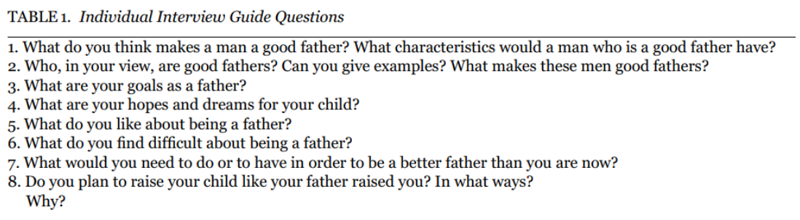

---

# Phenomenological approach example

Data were categorized using content analysis techniques. This research method uses a set of coding procedures for making replicable inferences from data to their context and identifying emergent themes.

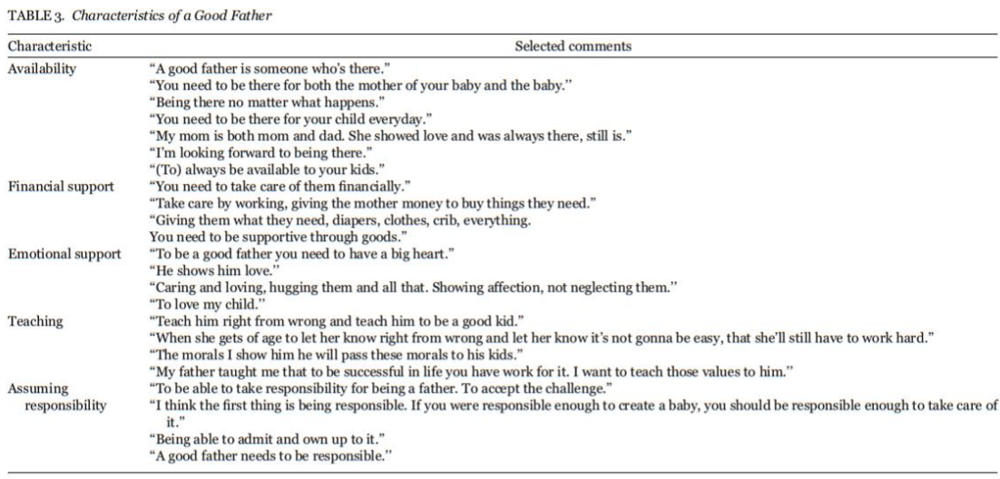

---

# Phenomenological approach example

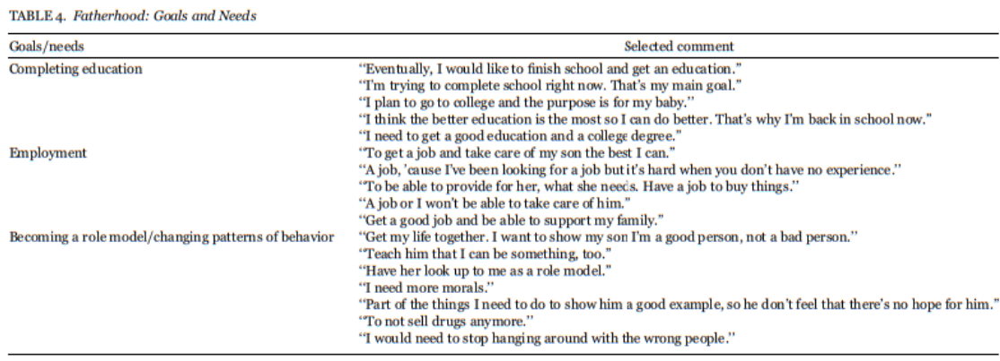

---

# Grounded theory approach example

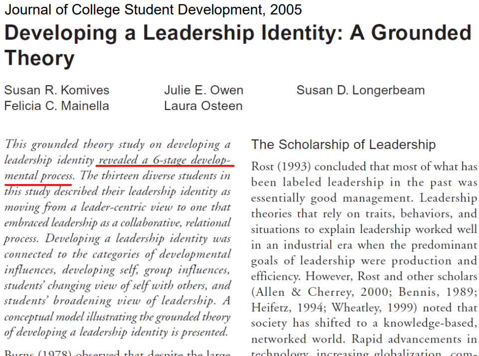

---

# Grounded theory approach example

**Research purpose**:

   - Most leadership development scholarship focuses on skill-building or short-term interventions such as retreats or courses, rather than on the process of how leadership capacity or leadership identity is created or changes over time. Although there were conceptual models of leadership development (Brungart, 1996; Velsor & Drath, 2004) at the time of this study **there was no known research on how leadership identity was formed**. *Understanding the process of creating a leadership identity is central to designing leadership programs and teaching leadership*. The purpose of this study was to understand the processes a person experiences in creating a leadership identity.

   - Because the purpose of the study was to understand how a leadership identity develops, a grounded theory methodology was chosen.

---

# Grounded theory approach example

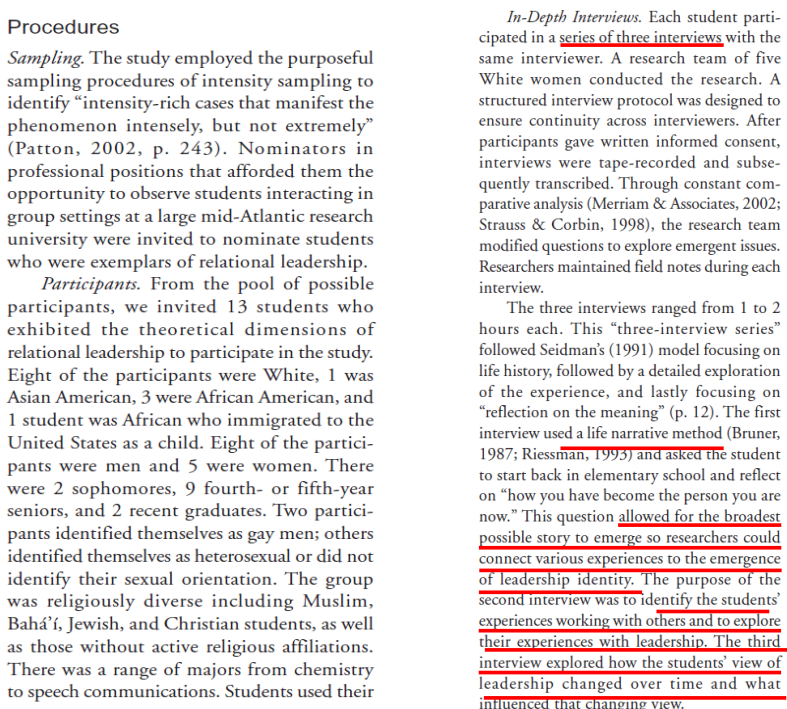

---

# Grounded theory approach example

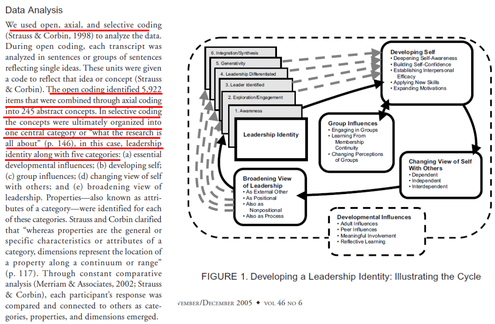

---

# Ethnographic approach example

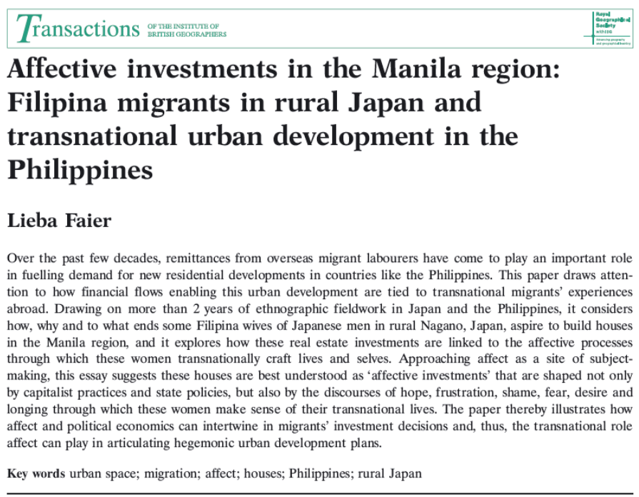

---

# Ethnographic approach example

**Research purpose**:
This essay examines one such set of trajectories: a transnational flow of capital and affect now constituting the Manila region of the Philippines, what many scholars and planners have called a ‘megaurban region’ (MUR). Specifically, **I consider how and why** some Filipina wives of Japanese men in Central Kiso, a region of mountain towns and villages in Nagano, Japan, participate in the making of this urban agglomeration through the houses they build there for themselves and their Filipino families. **By ethnographically exploring the reasons these women build these homes**, I draw attention to a **key, but often overlooked**, way in which transmigrant women’s experiences abroad both facilitate and condition the development of urban ‘remittance landscapes’ (McKay 2005).

---

# Ethnographic approach example

**Methodology**:

My argument is based on ethnographic fieldwork undertaken in Japan and the Philippines between September 1998 and August 2000 with the **more than 60 Filipina women who had married Japanese men in Central Kiso and their Japanese and Filipino families and communities**. It is also based on follow-up research in Japan in 2005, 2006, 2007 and 2010, and in the Philippines in 2007. During the course of my stays, I **conducted over 100 formal interviews** with Filipina women, their Japanese community members, local government officials, and women’s families and recruiters in the Philippines. I also had **countless informal conversations** with members of these groups. I **regularly visited women’s homes and the bars in which they worked, and I attended local Japanese government-sponsored events for them as well as prayer meetings and social gatherings the women organised. I lived with** three Filipina–Japanese families in Central Kiso and visited six Filipina women’s homes in the Manila area.

---
class: my-one-page-font
# Ethnographic approach example

this essay tells a story of the development of the Manila region as articulated through the experiences of individual transmigrant Filipina women in an out-of-the-way place called Central Kiso. …

Filipina migrants in Central Kiso are among the hundreds of thousands of Filipina women who went to work in hostess bars in Japan between the 1980s and the mid-2000s, and the tens of thousands of Filipina women who have married Japanese men over the past three decades (see, for example, Suzuki 2002; Tyner 2004). Like many Filipina wives of Japanese men, the overwhelming majority of these women – upwards of 90 per cent – **were working in hostess bars** when they met their Japanese husbands, who were their customers. Other Filipina wives in the area had ** ‘mediated marriages’,** meeting their Japanese husbands through friends or relatives married to Japanese men or, in at least one case, professionals who arranged ‘group marriage tours’ to the Philippines for Japanese men. Both these migration paths are **highly stigmatised**. Most Filipina migrant labourers in Japan do not have postsecondary education and lack other opportunities for working abroad. Metro Manila was the centre of the recruitment and training industry for Filipina entertainers (Ballescas 1992; Tyner 2000), and by the estimation of my interlocutors (and several Filipina ⁄ o clergy who counselled these women) at least 50 per cent of Filipina women in Central Kiso **came from informal urban settlements** in the city (what the women themselves called ‘squatter areas’). Many of those who were not from urban settlements came from poor, landless rural families, often in provinces around Metro Manila that are now included in the MUR. I consistently heard from these women that they had initially decided to **come to Japan so that they could ‘find a better life’ for their households in the Philippines**. For many, building a house in the Manila region was part of these plans.

---

# Ethnographic approach example

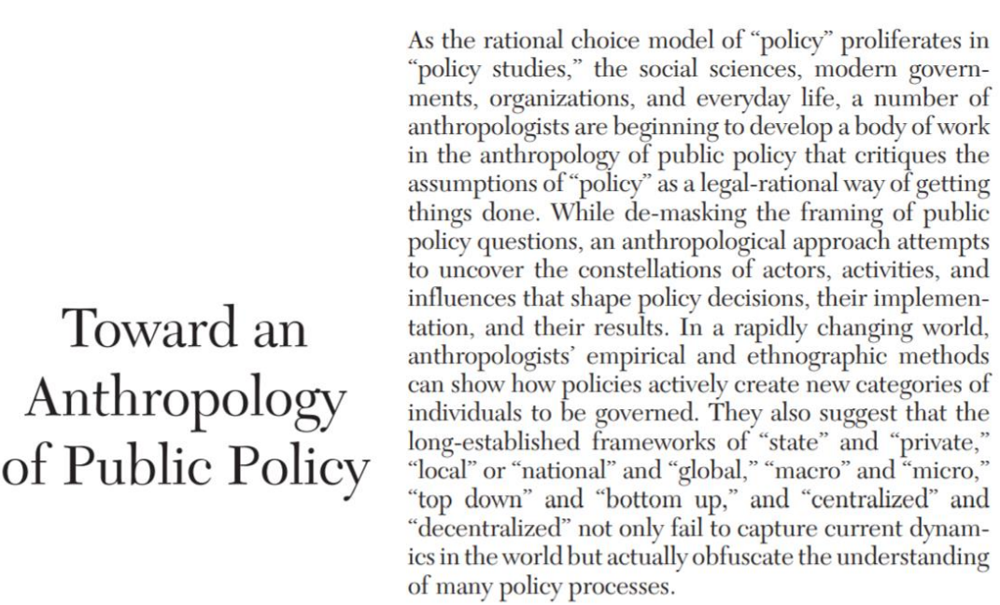

---

# Case study approach example

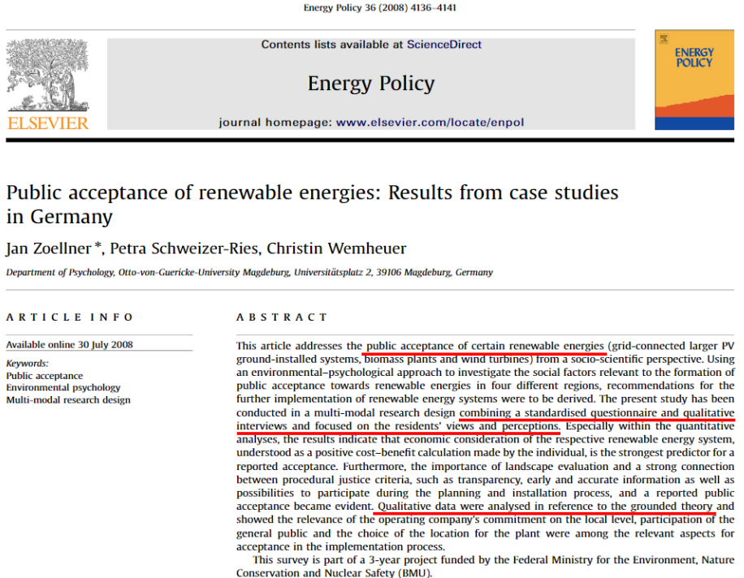

---

# Case study approach example

**Research purpose**:

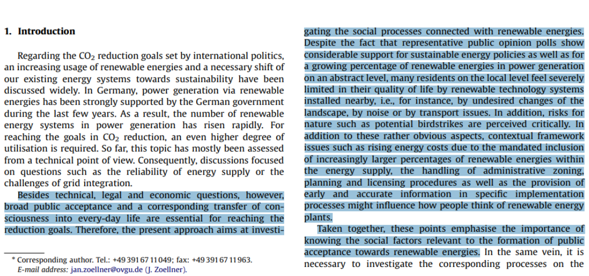

---

# Case study approach example

**Methodology**:

<div style="float: left; width: 50%; font-size: 30px;">
        <div class="small-font">

         The qualitative study consists of two phases. In the first phase, qualitative interviews have been conducted with members of local authorities, operating companies of PV ground-installed systems, nature protection organizations, and members of citizens’ initiatives. This phase aims at understanding the wide range of social parameters that determine renewable energy processes in communities. 
         The second phase will explore the subject on a rather detailed and intra-individual level. The interviews have been conducted in conformity with a specifically developed guideline. They have been recorded, transcribed and interpreted according to the Grounded Theory (Glaser and Strauss, 1967). Open and axial coding (Strauss and Corbin, 1990/1996) were used to categorize the data.
      </div>
   </ul>
</div>


<div style="float: right; width: 50%;">
      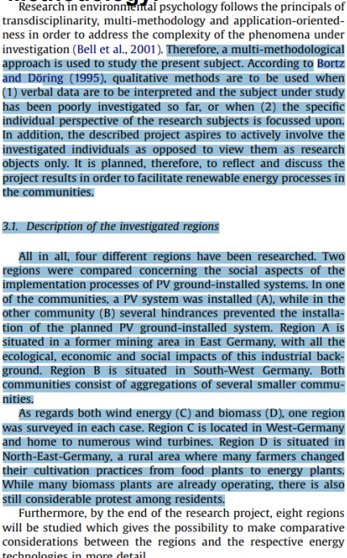
</div>

---

# Case study approach example

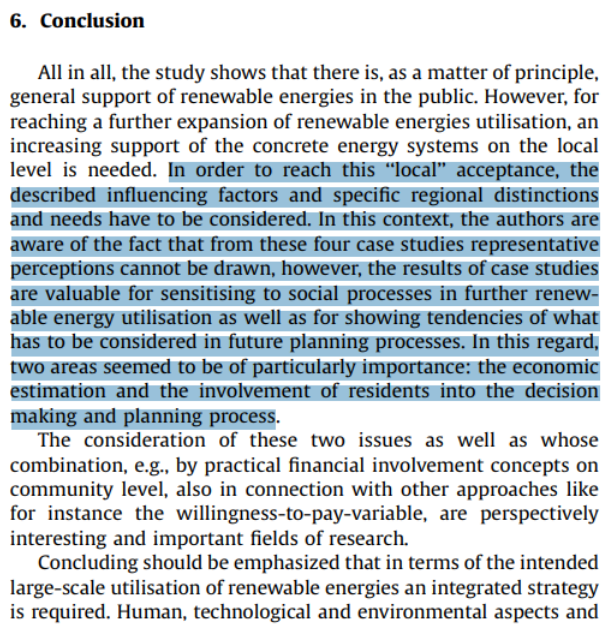


---

class: inverse, center, middle

# 4. In-class activity

---

# Qualitative research and your study.

## Class activity

1. Think about your research project. 
   - What kind of qualitative research approach would be most suitable for your study?
   - Why do you think this approach would be the most suitable?

2. Write down your thoughts in 1-2 paragraphs.

3. In groups of 2-3, discuss your thoughts and share your ideas with your group members.

4. Each group will select one person to present their thoughts to the class.

5. *Remember to upload your individual memos to the Cyber Campus Classroom!*

*Deadline*: Tuesday 14:45 pm, (October 1st, 2026)
*Max score*: 10 points

---

class: inverse, center, middle

# 6. Next class reading assignment

---

# Will be uploaded to the Cyber Campus Classroom by Friday, October 2nd, 2026.


---

# Credits

- The content of this lecture is based on the following sources:
   - Creswell, J. W. (2014). Research design: Qualitative, quantitative, and mixed methods approaches. Sage publications.
   - Prof. Joo Yu Min lecture materials

---

class: inverse, center, middle

# Any QUESTIONS?

---

class: inverse, center, middle

# Thank you!

???
1. To print pdf slides
library(renderthis)

renderthis::to_pdf("W5_RMDS.html")

getwd()
setwd("C:\\Users\\vyshn\\OneDrive - kdis.ac.kr\\Documents\\GitHub\\Sogang\\2026\\Fall\\Research Method of Data Science\\W5")

