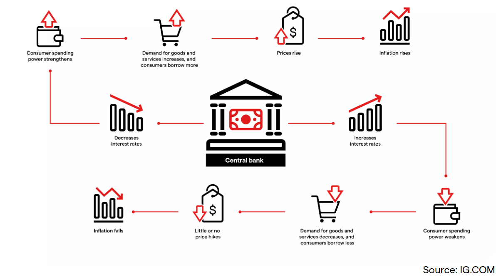

<style>
@media print{
  body, html, .remark-slides-area, .remark-notes-area {
    height: 100% !important;
    width: 100% !important;
    overflow: visible;
    display: inline-block;
    }
</style>

<style type="text/css">
.remark-slide-content {
    font-size: 34px;
    padding: 1em 4em 1em 4em;
}
</style>

<style type="text/css">
.my-one-page-font {
  font-size: 28px;
}
</style>

</style>

<style type="text/css">
.my-one-page-font-table {
  font-size: 24px;
}
</style>

<style>
.tiny { font-size: 60%; }      /* class you can reuse anywhere */
</style>

<style>
.remark-slide-content {
  position: relative;
  z-index: 1;
}

.remark-slide-content::before {
  content: "";
  position: absolute;
  top: 50%;
  left: 50%;
  width: 600px;          /* adjust size */
  height: 600px;
  background-image: url("1. 교장(Seal_Positive).png");  /* place logo file in same folder */
  background-repeat: no-repeat;
  background-position: center;
  background-size: contain;
  opacity: 0.05;         /* watermark transparency */
  transform: translate(-50%, -50%);
  pointer-events: none;
  z-index: 0;
}
</style>


```{r setup, include = FALSE}
library(tidyverse)
library(knitr)

opts_chunk$set(fig.width = 10, 
               message = FALSE, 
               warning = FALSE,
               echo = FALSE)
```

```{r xaringan-themer, include=FALSE, warning=FALSE}
#install.packages("xaringanthemer")
library(xaringanthemer)
style_mono_accent(
  base_color = "#851a10",
  header_font_google = google_font("Josefin Sans"),
  text_font_google   = google_font("Montserrat", "500", "550i"),
  code_font_google   = google_font("Fira Mono"),
  colors = c(
  red = "#f34213",
  purple = "#3e2f5b",
  orange = "#ff8811",
  green = "#136f63",
  white = "#FFFFFF"
)
)
```

# Agenda  

1. Central Banks 

2. The Money Supply Process

3. Class Activity

---

class: inverse, center, middle

# 1. Central Banks  

---

# Central Banks: An Introduction

## What is a Central Bank?

- A central bank is the institution that manages a country's currency, money supply, and interest rates.

  - It serves as the government's bank and the lender of last resort to the banking sector.
  - It regulates and supervises commercial banks to ensure financial stability.
  - It also implements monetary policy to achieve macroeconomic objectives.
  - Central banks are typically independent from political influence to ensure effective policy implementation.

- Examples: Federal Reserve (U.S.), ECB (Eurozone), Bank of England, Bank of Korea.

---

## Key Functions of Central Banks

1. **Monetary policy implementation**

2. **Currency issuance**

3. **Lender of last resort**

4. **Foreign exchange management**

5. **Maintaining financial stability**

6. **Regulation and supervision of commercial banks**

7. **Payment systems oversight**

.tiny[Notes: Often share supervisory responsibility with other regulators.]

---

# Why Do We Need Central Banks?

## Without a central bank:
- Who controls inflation?
- Who helps in a financial crisis?
- Who supervises commercial banks?

.center[]


---

# Historical Perspective

## Evolution of Central Banking:
- 17th century: Sweden’s Riksbank – first central bank

- 1694: Bank of England

- 20th century: Rise of modern independent central banks

- Post-2008: unconventional monetary policy (QE, forward guidance) 

- Post-COVID: large balance sheets, inflation resurgence, tightening cycle

- Geopolitical tensions (War in Ukraine, Middle East conflicts): impact on energy prices, inflation, and central bank responses

---

# Objectives of Central Banks

1. **Price stability** (control inflation)

2. **Full employment** (indirectly through monetary policy)

3. **Stable financial system**

4. **Exchange rate stability** (for some countries)

<div class="illustration">
<strong>Illustration</strong>: ECB's mandate focuses almost solely on price stability, while the Fed has a dual mandate (price stability + maximum employment).
</div>

---

# Tools of Monetary Policy

1. Policy interest rate (primary tool)

2. Open market operations

3. Forward guidance

4. Balance sheet policies (QE/QT)

5. Reserve requirements (secondary / rarely used)

---

# Monetary Policy in Action

.flex-container[
.flex-item[
### When inflation is high:
- Central banks increase interest rates
- Tighten financial conditions
- Affect borrowing costs and expectations
- Slow down borrowing and spending

### When recession hits:
- Lower interest rates
- Inject liquidity
- Stimulate demand
],
.flex-item[
.center[]
]
]

<style>
.flex-container {
  display: flex;
  justify-content: space-between;
  align-items: center;
}
.flex-item {
  width: 48%;
}
</style>

---

# Central Bank Independence

## Why is it important?
- Insulates from political pressure
- Helps maintain credibility
- Anchors inflation expectations
  - Credibility helps anchor inflation expectations
- Time inconsistency problem (Kydland & Prescott)

## Forms of independence:
- Goal independence
- Instrument independence

<div class="illustration">
<strong>Example</strong>: Bundesbank was historically independent, influencing ECB's design.
</div>

.tiny[Notes: Time inconsistency: policymakers may have an incentive to deviate from announced policy, leading to higher inflation expectations and worse outcomes.]
---

# Case Study: The Federal Reserve

- Dual mandate: price stability + full employment

- 12 regional banks + Board of Governors

- FOMC meets 8 times/year

- Sets the federal funds rate

---

# Case Study: The European Central Bank

- Primary mandate: price stability

- Governing Council (ECB + 20 central banks)

- Uses OMOs, MROs, and LTROs

<div class="illustration">
<strong>Illustration</strong>: ECB response during the Eurozone crisis
</div>

---

# The Role During Crises

## Global Financial Crisis 2008
- Central banks cut rates to near-zero
- Quantitative easing (QE)
- Liquidity support to banks
- Emergency lending facilities
- Support for shadow banking system (e.g., money market funds)

## COVID-19
- Pandemic response: liquidity support
- Rate cuts, asset purchases
- Coordination with fiscal policy
- Large-scale fiscal-monetary coordination

---

# Challenges Facing Central Banks Today

1. Bringing inflation back to target without causing recession

2. Higher-for-longer rates and uncertainty about the neutral rate

3. Financial stability risks in banks and non-bank financial institutions

4. Large public debt, fiscal pressure, and still-expanded balance sheets

5. CBDCs, payment system modernization, and cyber risk

.tiny[Examples in 2025-2026: sticky services inflation, tariff and energy-price shocks, commercial real estate stress, sovereign debt concerns, and debate over central bank independence.]

---

class: inverse, center, middle

# 2. The Money Supply Process

---

# Three Players in the Money Supply Process

- **The Central bank**  
  - Oversees the banking system and conducts monetary policy

- **Banks (Depository Institutions)**  
  - Accept deposits and make loans

- **Depositors**  
  - Hold deposits in banks

Illustration: Picture of central bank, commercial bank, and depositors linked in a triangle

---

# The Fed’s Balance Sheet

.center[]

- **Liabilities**:
  - Currency in circulation (held by public)
  - Reserves (bank deposits at the Fed + vault cash)
  - Increases in either increase money supply
  - Fed liabilities + Treasury liabilities = **Monetary base**

- **Reserves**:
  - Required and excess reserves

> In many countries (e.g., U.S.), reserve requirements are no longer binding, so excess reserves can be large.

---

# Fed's Assets and Impact

.center[]

- **Assets**:
  - **Securities**: Mainly Treasury; purchases increase reserves
  - **Loans**: Discount loans to banks → increase reserves

- Importance:
  - Affects monetary base and money supply
  - Fed earns income from these assets

---

# Control of the Monetary Base

- **Monetary base** (MB) = Currency in circulation (C) + Reserves (R)

$\text{MB} = C + R$

- Controlled via **open market operations**:
  - Purchases increase MB
  - Sales decrease MB

---

# Open Market Operations

- **Open Market Purchase** = Fed buys bonds from primary dealers

- **Open Market Sale** = Fed sells bonds

- **Impact**:
  - Purchase → ↑ Reserves, ↑ MB
  - Sale → ↓ Reserves or ↓ Currency, ↓ MB

---

# Open Market Purchase from a Bank

.center[]

- Fed buys $100m in bonds from a primary dealer
- Bank reserves ↑ $100m
- MB ↑ $100m

---

# Open Market Sale

- Fed sells $100m in bonds

- MB decreases by $100m

- **Reserves decrease** if banks pay via reserves

---

# Shifts from Deposits to Currency

.center[]

- Depositors convert deposits into currency
- Reserves ↓, Currency ↑, MB constant
- **Fed controls MB more than reserves**
- This reduces the money multiplier

---

# Loans to Financial Institutions

.center[]

- Fed lends to a bank (e.g., $100m)
- Reserves ↑, MB ↑ by same amount

---

# Other Influences on MB

- **Float** (temporary increase in reserves due to check clearing)

- **Treasury deposits at Fed** (when Treasury spends, it reduces its deposit, increasing reserves)

- **Foreign exchange operations** (e.g., interventions can affect reserves and MB)

---

# Fed Control of Monetary Base

- MB = BR (borrowed reserves) + MBₙ (nonborrowed base)

$MB = MB_n + BR$

- MBₙ: fully controlled by Fed (via open market ops)
- BR: depends on bank borrowing decisions

In plain terms: Fed controls the nonborrowed base, but banks can choose to borrow reserves, which also affects the total monetary base.

---

# Multiple Deposit Creation: Basic Idea

- Fed adds $1 in reserves → multiple deposit creation
- A single bank lends excess reserves → new deposits

.center[]


.tiny[Notes: This is a simplified model; real-world money creation is driven by lending demand and bank balance sheet decisions.]
---

# System-Wide Deposit Creation

.center[]

- Loans at one bank → deposits at another
- Process continues if no excess reserves held
- Deposit creation = geometric series

---

# Total Increase in Deposits

- Reserve requirement = 10%
- Simple deposit multiplier:

$\Delta D = \frac{1}{r} \times \Delta R$

- $100m reserves → $1,000m deposits
> Rarely holds exactly in practice
---

# Table 1: Deposit Creation Summary

.center[]

- Process stops when no more excess reserves
- Simple multiplier depends on **r**

---

# Deposit Creation Limits

- Loans or securities purchases create same deposit expansion

- System vs individual bank:
  - System: total reserves stay in system
  - Single bank: reserves lost if loans transferred

---

# Final Deposit Expansion Equation

$D = \frac{1}{r} \times R$
$\Delta D = \frac{1}{r} \times \Delta R$

- Equilibrium: no excess reserves remain
- Total R = Required R when deposit creation stops

In other words, the total increase in deposits is the initial increase in reserves multiplied by the simple deposit multiplier (1/r), assuming all excess reserves are lent out and there are no currency holdings by the public.

---

# Critique of Simple Model

- **Not all excess reserves are lent out**

- **Depositors may hold cash** → stops deposit expansion

- **Banks may hold excess reserves**

- Real-world multiplier < simple multiplier

- Banks are not reserve-constrained in modern systems

- Central banks supply reserves elastically to meet demand at the policy rate
---

# Determinants of Money Supply

| Factor                       | Effect on Money Supply        |
|-----------------------------|-------------------------------|
| ↑ Nonborrowed MB (MBₙ)      | ↑ Money supply                |
| ↑ Borrowed reserves (BR)    | ↑ Money supply                |
| ↑ Required reserve ratio (r)| ↓ Money supply                |
| ↑ Excess reserves           | ↓ Money supply                |
| ↑ Currency holdings         | ↓ Money supply                |

---

# Money Multiplier

$M = m \times MB$

- M = money supply (M1)
- m = money multiplier

$m = \frac{1+c}{r+e+c}$
- c = currency ratio, e = excess reserve ratio, r = reserve ratio

Multiplier shows how much money supply changes for a given change in MB, but it is not constant.

> Multiplier is unstable over time because c, e, and r can change with economic conditions and policy changes.
---

# Multiplier Intuition (Example)

- c = 0.5, e = 0.001, r = 0.1

$m = \frac{1+0.5}{0.1 + 0.001 + 0.5} = \frac{1.5}{0.601} \approx 2.5$

- Less than 10 (simple multiplier)
- Currency doesn't multiply

* Interpretation: For every $1 increase in MB, M1 increases by about $2.5, given the current ratios.

---

# Quantitative Easing (QE)

- Post-2007: Fed bought long-term securities to increase MB

- MB ↑ 350% → M1 ↑ only 100%

- Why? **Money multiplier ↓**:
  - Excess reserve ratio ↑↑↑

In plain terms: QE increased the monetary base significantly, but the money supply (M1) did not increase proportionally because banks chose to hold a large amount of excess reserves instead of lending them out, which reduced the money multiplier.

> QE works mainly through asset prices, yields, and expectations — not just through reserves
---

# COVID-19 Crisis: Similar QE Patterns

- Fed again engaged in QE

- MB ↑, but M1 ↑ less due to rising excess reserves

- Interest on excess reserves incentivized banks to hold them

In plain terms: During the COVID-19 crisis, the Fed's QE led to a large increase in the monetary base, but the money supply (M1) did not increase as much because banks preferred to hold excess reserves, especially since the Fed paid interest on those reserves.

> Fiscal stimulus + QE created strong money growth and later inflation pressure
---

# Figure: M1 and Monetary Base (2007–2020)

.center[]

---

# Figure: Excess Reserves & Currency Ratio (2007–2020)

.center[]

---

# Summary

- Central banks influence money supply and financial conditions primarily through interest rates and expectations, not direct control

- Reserves → deposit creation → **multiplied money supply**

- Final supply depends on:
  - Reserve ratio
  - Currency preferences
  - Excess reserves

$M = \frac{1+c}{r+e+c} \times MB$


---


class: inverse, center, middle

# 3. Class Activity

---

# Central Bank Strategy Lab

Please see the Week 10 folder for the Central Bank Strategy Lab activity.

---

# Next Class

- (May 14) 
  - *Chap 16.* Tools of Monetary Policy  
  - *Chap 17.* The Conduct of Monetary Policy: Strategy and Tactics

---

class: inverse, center, middle

# Any QUESTIONS?

## Thank You for Your Attention and Participation! 


???
1. To print pdf slides
https://stackoverflow.com/questions/54968311/xaringan-export-slides-to-pdf-while-preserving-formatting

pagedown::chrome_print("W1_ME.html") # but not all pictures are visible

2. Option: https://stackoverflow.com/questions/54968311/xaringan-export-slides-to-pdf-while-preserving-formatting

install.packages("remotes")
remotes::install_github("jhelvy/xaringanBuilder")
remotes::install_github("jhelvy/renderthis@v0.0.9")

library(xaringanBuilder)
build_pdf("DVC.html")

3. Option
writeBin(as.raw(c()), "favicon.ico") # create an empty favicon.ico file
install.packages("renderthis")
remotes::install_github('rstudio/chromote')
library(renderthis)

renderthis::to_pdf("W10_FIS.html")
1
getwd()
setwd("C:\\Users\\vyshn\\OneDrive - kdis.ac.kr\\Documents\\GitHub\\Sogang\\2026\\Spring\\Financial Institutions and System\\Week 10")
