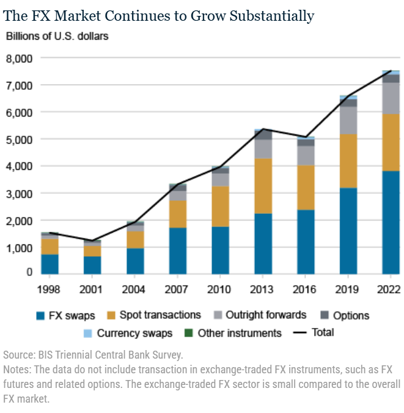
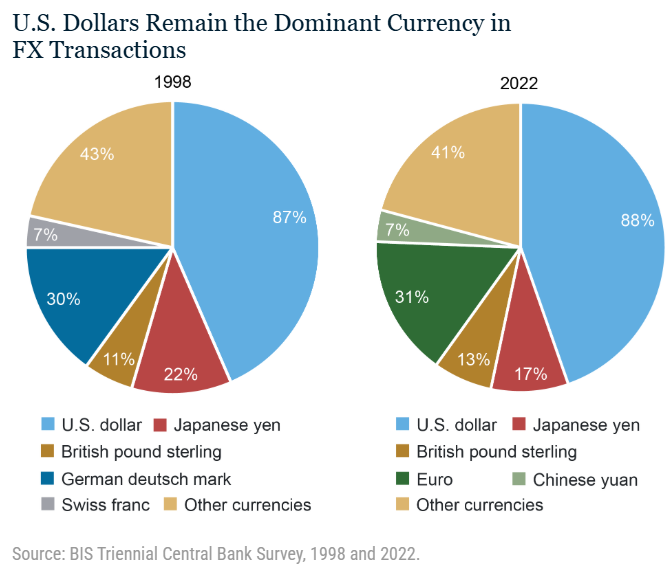
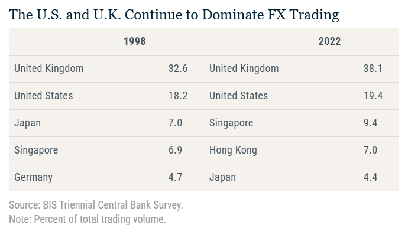
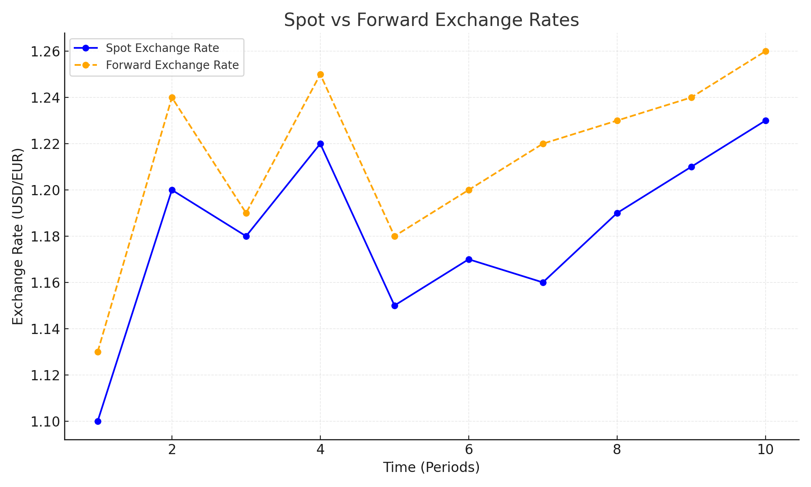
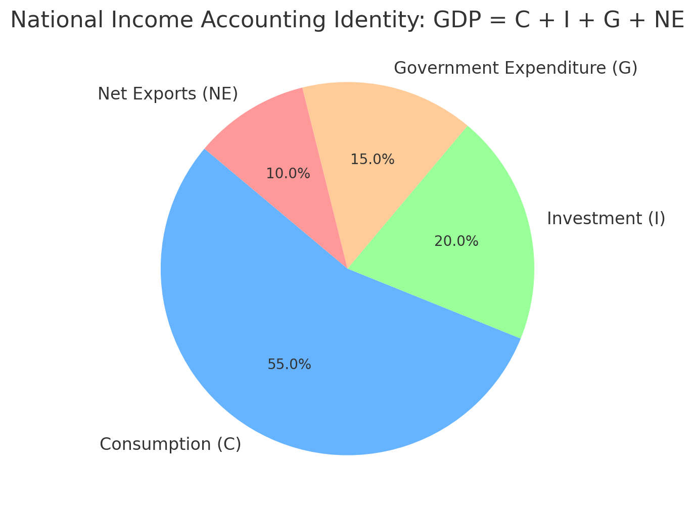
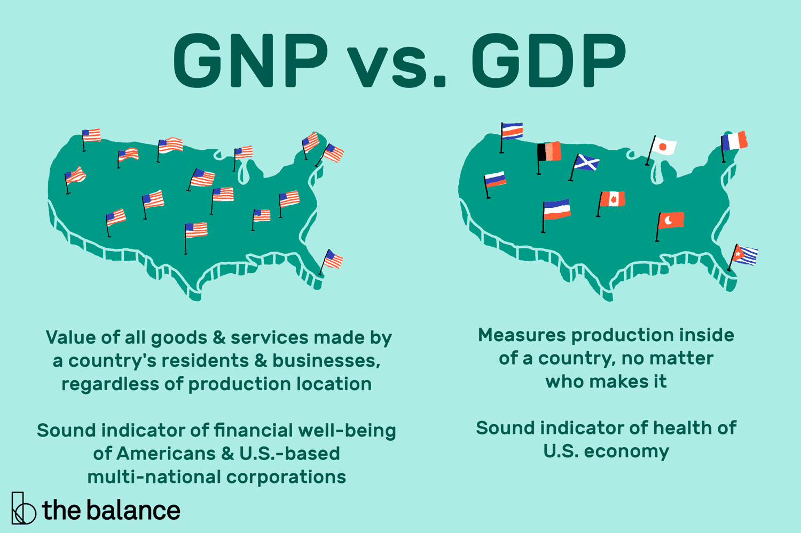
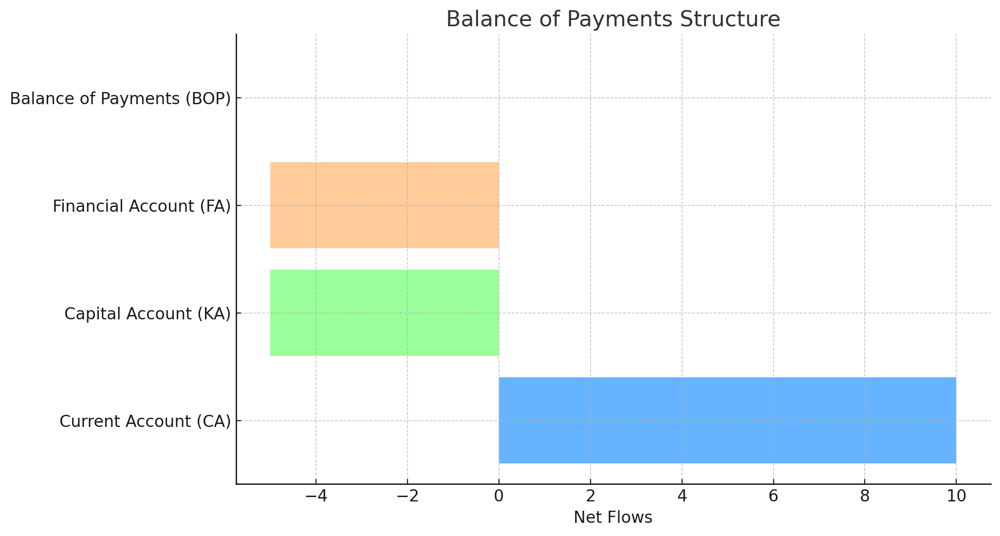
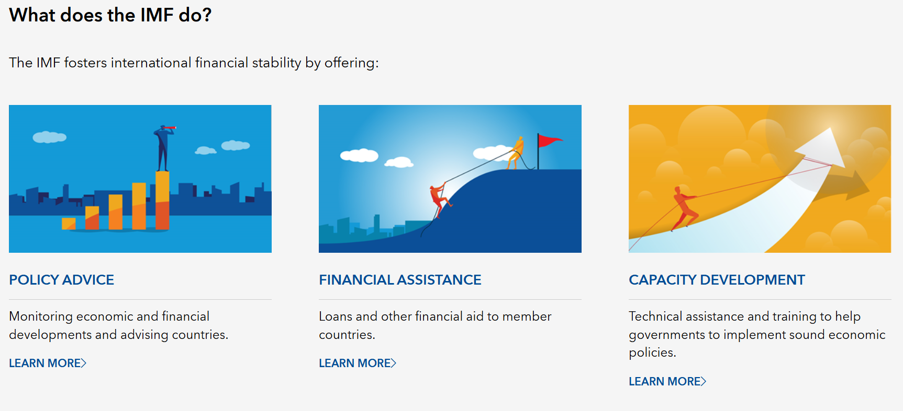

<style>
@media print{
  body, html, .remark-slides-area, .remark-notes-area {
    height: 100% !important;
    width: 100% !important;
    overflow: visible;
    display: inline-block;
    }
}
</style>

<style type="text/css">
.remark-slide-content {
    font-size: 34px;
    padding: 1em 4em 1em 4em;
}
</style>

<style type="text/css">
.my-one-page-font {
  font-size: 28px;
}
</style>

<style type="text/css">
.my-one-page-font-table {
  font-size: 24px;
}
</style>

<style>
.tiny { font-size: 60%; }      /* class you can reuse anywhere */
</style>

<style>
.remark-slide-content {
  position: relative;
  z-index: 1;
}

.remark-slide-content::before {
  content: "";
  position: absolute;
  top: 50%;
  left: 50%;
  width: 600px;          /* adjust size */
  height: 600px;
  background-image: url("1. 교장(Seal_Positive).png");  /* place logo file in same folder */
  background-repeat: no-repeat;
  background-position: center;
  background-size: contain;
  opacity: 0.05;         /* watermark transparency */
  transform: translate(-50%, -50%);
  pointer-events: none;
  z-index: 0;
}
</style>


```{r setup, include = FALSE}
library(tidyverse)
library(knitr)

opts_chunk$set(fig.width = 10, 
               message = FALSE, 
               warning = FALSE,
               echo = FALSE)
```

```{r xaringan-themer, include=FALSE, warning=FALSE}
#install.packages("xaringanthemer")
library(xaringanthemer)
style_mono_accent(
  base_color = "#851a10",
  header_font_google = google_font("Josefin Sans"),
  text_font_google   = google_font("Montserrat", "500", "550i"),
  code_font_google   = google_font("Fira Mono"),
  colors = c(
  red = "#f34213",
  purple = "#3e2f5b",
  orange = "#ff8811",
  green = "#136f63",
  white = "#FFFFFF"
)
)
```

# Agenda  

1. The Foreign Exchange Market    

2. The International Financial System 

3. In-Class Activity and Roadmap

---

class: inverse, center, middle

# 1. The Foreign Exchange Market

---

# Introduction

**Welcome to the Foreign Exchange Market!**

- How does the exchange rate affect international trade?

- What determines exchange rates in the long run and short run?

- What role do interest rates play in exchange rate movements?

---

# Definition and Importance

.center[
**What is the Foreign Exchange Market?**
]

- A market where different currencies are traded.

- Composed of banks, corporations, governments, and traders.

- Major transactions include:
  - Spot transactions: Immediate exchange of currencies.
  - Forward transactions: Agreement to exchange currencies at a future date.

- Facilitates international trade and investment by allowing for currency exchange.
- Influences import/export prices, financial flows, and investment decisions.
- Affects inflation, interest rates, and economic growth.
- FX markets operate 24 hours across global financial centers.

> The FX market is the largest financial market globally, with turnover far exceeding global stock markets.
---

class: my-one-page-font

# Size and composition of the FX Market

.center[]
- Average daily turnover increased from $1.5 to $7.5 trillion between 1998 and 2022, with the increase occurring across both FX spot and FX derivatives. [link](https://libertystreeteconomics.newyorkfed.org/2024/01/towards-increasing-complexity-the-evolution-of-the-fx-market/) 

.tiny[Source: Liberty Street Economics]
???
FX swaps are the largest segment of the market.

.tiny[Note: FX swaps are agreements to exchange currencies at a future date, often used for hedging and liquidity management.]
---
class: my-one-page-font

# USD dominance in the FX Market

.center[]
- The U.S. dollar (USD) is the most traded currency, accounting for 88% of all FX transactions. [link](https://libertystreeteconomics.newyorkfed.org/2024/01/towards-increasing-complexity-the-evolution-of-the-fx-market/) 

.tiny[Source: Liberty Street Economics]
???
> USD dominance reflects its role as a reserve currency, invoicing currency, and funding currency.
---

# UK and US dominance in the FX Market
.center[]
- The UK and US are the two largest FX trading centers, accounting for 38% and 19% of global FX turnover, respectively. [link](https://libertystreeteconomics.newyorkfed.org/2024/01/towards-increasing-complexity-the-evolution-of-the-fx-market/)

.tiny[Source: Liberty Street Economics]

> London dominates partly because of time-zone advantages between Asia and North America.

---

# Participants in the FX Market

- Retail Traders

- Commercial Banks

- Central Banks

- Corporations

- Governments

- Investment Banks

- Hedge Funds


.center[
**Who benefits the most and why?**
]

> High-frequency trading firms now account for a meaningful share of short-term FX trading volume.


---

# Key Terminologies

- **Exchange Rate (E):** The price of one currency in terms of another.

- **Spot Exchange Rate:** Rate for immediate exchange.

- **Forward Exchange Rate:** Rate for future exchange.

- **Effective Exchange Rate Index:** Weighted average of exchange rates with major trading partners.

---

# Spot vs. Forward Exchange Rates

.center[]

- Forward exchange rates are closely linked to interest rate differentials through covered interest parity.

.tiny[Note: Covered interest parity states that the forward exchange rate should incorporate the interest rate differential between two countries to prevent arbitrage opportunities.]
---

# Types of FX Transactions

- **Spot Transactions:** Immediate exchange of currencies at the current rate.

- **Forward Transactions:** Agreement to exchange currencies at a future date.

- **FX Swaps:** involve exchanging currencies today and reversing the transaction later at a predetermined rate.

- **Options:** Contracts granting the right to buy/sell at a specific rate.

.center[
**Why might a firm prefer a forward over a spot transaction?**
]

---
# Real vs. Nominal Exchange Rates

**Nominal Exchange Rate (E):** The price of one currency in terms of another.

**Real Exchange Rate (Er):** Adjusts the nominal rate for price level differences.

$$E_r = \frac{E \times P_{HC}}{P_{ROW}}$$

Where:
- $E$ = Nominal Exchange Rate, foreign currency per unit of home currency
- $P_{HC}$ = Price level in Home Country
- $P_{ROW}$ = Price level in Rest of the World

---

# Example: Real Exchange Rate Calculation

- HC: USA, ROW: Japan
- Exchange Rate (E): 150 yen/USD
- Price of U.S. wheat: 2 USD per bushel
- Price of Japanese wheat: 400 yen per bushel

$$ E_r = \frac{150 \times 2}{400} = 0.75 $$

Interpretation: 1 bushel of U.S. wheat costs 0.75 bushels of Japanese wheat.

---

# Purchasing Power Parity (PPP)

- PPP states that identical goods should cost the same in different countries when expressed in a common currency.

$$E \times P = P_{ROW}$$
- PPP works better as a long-run tendency than as a short-run predictor.

Example: Big Mac Index

- If a Big Mac costs $5 in the USA and 500 yen in Japan, the implied PPP exchange rate is 500 / 5 = 100 yen/USD.
- Transportation costs, tariffs, taxes, and non-tradable goods prevent exact PPP.
---

# Covered Interest Rate Parity (CIP)

**Definition:** The forward exchange rate fully incorporates the interest rate differential, leaving no arbitrage profit.

$$F = S \times \frac{1 + i_{HC}}{1 + i_{ROW}}$$

Or equivalently:

$$\frac{F - S}{S} \approx i_{HC} - i_{ROW}$$

Where $F$ = forward rate, $S$ = spot rate, $i_{HC}$ = home interest rate, $i_{ROW}$ = foreign interest rate.

- Uses the **forward exchange rate** — no exchange rate risk remains.
- A pure **arbitrage** relationship enforced by covered carry trades.
- Holds very closely in normal market conditions; broke down during 2008 GFC and COVID-19.

> CIP says: lock in the forward rate today → no risk, no excess return.

---

# Uncovered Interest Rate Parity (UIP)

**Definition:** The expected change in the spot exchange rate equals the interest rate differential between two countries.

$$i_{HC} - i_{ROW} = \frac{E[S_{t+1}] - S_t}{S_t}$$

Rearranging for the expected future spot rate:

$$E[S_{t+1}] = S_t \times \left(1 + i_{HC} - i_{ROW}\right)$$

Where $E[S_{t+1}]$ = expected future spot rate, $S_t$ = current spot rate.

- Relies on **exchange rate expectations** — exchange rate risk is not hedged.
- If $i_{HC} > i_{ROW}$: the home currency is expected to **depreciate**.
- Empirically weak in the short run: the **"forward premium puzzle"** — high-interest currencies often appreciate rather than depreciate.

> UIP says: higher rates today predict depreciation tomorrow — but markets frequently disagree.

---

# CIP vs UIP: Key Comparison

.pull-left[
**Covered (CIP)**

- Uses forward rate $F$
- No exchange rate risk
- Arbitrage enforced
- Holds tightly in practice

$$\frac{F - S}{S} \approx i_{HC} - i_{ROW}$$
]

.pull-right[
**Uncovered (UIP)**

- Uses expected spot rate $E[S_{t+1}]$
- Exchange rate risk remains
- Expectation based
- Fails often short-run

$$\frac{E[S_{t+1}] - S_t}{S_t} \approx i_{HC} - i_{ROW}$$
]

> Both conditions share the same right-hand side — the interest rate differential — but differ in whether exchange rate risk is hedged.

---

# Wrap-Up and Discussion

- What determines exchange rates in the short run and long run?

- How do interest rates and inflation impact exchange rates?

- How can businesses hedge against exchange rate risks?

- Exchange rates are strongly influenced by expectations and capital flows.

---

# Closing and Q&A

- Key Takeaways:
  - FX markets are essential for global trade and investment.
  - Exchange rates are influenced by interest rates, inflation, and market expectations.
  - PPP and interest parity provide frameworks but have limitations.


.center[
**Questions?**
]

---
class: inverse, center, middle

# 2. The International Financial System

---

# Introduction to the International Financial System

- Overview of National Income and Product Accounting in an Open Economy

- Understanding the Balance of Payments

- Role of the International Monetary Fund (IMF)

---

# National Income and Product Accounting for an Open Economy

- Distinguish between GNP and GDP:

  - **GNP**: Total value of final goods/services produced using HC-owned factors of production.
  - **GDP**: Total value of final goods/services produced within the borders of the HC.

- Key Formula:
  
  `GNP(T) = GDP(T) + NFP(T)`

  - **NFP(T)**: Net factor payments from ROW to HC.


> Modern international statistics often use GNI (Gross National Income) instead of GNP.
---

.center[]

---

.center[]
[Link](https://www.thebalancemoney.com/what-is-the-gross-national-product-3305847)
.tiny[Source: the balance]

---

# National Income Accounting Identity

- National Income Accounting Identity:
  
  `GDP(T) = C(T) + I(T) + G(T) + NE(T)`

- Key Terms:
  - **C(T)**: Consumption Expenditure
  - **I(T)**: Investment Expenditure
  - **G(T)**: Government Expenditure
  - **NE(T)**: Net Exports (EX - IM)

---

# Example of GNP and GDP Calculation

- Suppose a country produces:
  - $100 million worth of goods/services domestically (GDP)
  - $20 million received as income from abroad
  - $10 million paid to foreign factors

- GNP Calculation:

  `GNP = 100 + (20 - 10) = 110 million`

---

# Balance of Payments: Definition and Structure

- BOP Accounts:

  1. Current Account (CA): Net exports, factor income, transfers
  2. Capital and Financial Account (KFA): Asset transfers and financial transactions
  3. Official Reserve Transactions

- Simplified teaching identity:

  `CA + KFA ≈ 0`

  where `KFA` groups capital, financial, and reserve-related balancing flows.

---

# Balance of Payments: Accounting Identity (Advanced)

In full accounting form:

$$
CA + KA + FA + ORT + EO = 0
$$

Where:

- $CA$: current account balance
- $KA$: capital account balance
- $FA$: financial account balance
- $ORT$: official reserve transactions
- $EO$: errors and omissions (statistical discrepancy)

Interpretation:

- The balance of payments must sum to zero once all recorded and unrecorded transactions are included.
- A deficit in one component must be offset by a surplus in other components and/or reserve changes.

---

.center[]

---
class: my-one-page-font
# Role of the International Monetary Fund (IMF)

- Established in 1944 as part of the Bretton Woods Agreement

- Key Functions:
  - Promote international monetary cooperation
  - Provide financial stability
  - Offer financial assistance to member countries
  - Monitor economic policies and provide technical assistance

.center[]

  [Link](https://www.imf.org/en/About/Factsheets/IMF-at-a-Glance)

> The IMF increasingly focuses on financial stability, climate risk, and debt sustainability.
---

# IMF Controversies and Criticism

- Criticisms of IMF Interventions:
  - Criticism that IMF austerity measures may deepen recessions
  - Moral hazard concerns
  - Perceived economic imperialism
  - Concerns about social costs and political backlash

- Discuss: Do you agree with these criticisms? Why or why not?

---

# Conclusion

- National Income and Product Accounting is essential for understanding a country's economic performance in a global context.

- The Balance of Payments provides insight into a country's financial position relative to the world.

- The IMF plays a critical role in maintaining international financial stability.


---

class: inverse, center, middle

# 3. In-Class Activity & Discussion

---

class: inverse, center, middle

# Course Roadmap

---
class: my-one-page-font
# Looking Ahead: Course Roadmap

We are entering the final phase of the course. Here's what's coming:

## Session Schedule & Topics

- **(May 21) ESG and Sustainable Finance**
  - The role of financial institutions in promoting sustainability
  - Reading will be assigned

- **(May 28) FinTech Revolution**
  - Guest Speaker (in-person)
  - How technology is reshaping financial services

- **(June 4) AI & Machine Learning in Finance**
  - Guest Speaker (online)
  - Final Exam Review Session

- **(June 11) Student Project Presentations**
  - Showcase your applied research and insights

- **(June 18) Final Examination**
  - Comprehensive assessment of course material

---

class: inverse, center, middle

# Any Questions?

## Thank you for your attention and participation! 


???
1. To print pdf slides
https://stackoverflow.com/questions/54968311/xaringan-export-slides-to-pdf-while-preserving-formatting

pagedown::chrome_print("W11_FIS.html") # but not all pictures are visible

2. Option: https://stackoverflow.com/questions/54968311/xaringan-export-slides-to-pdf-while-preserving-formatting

install.packages("remotes")
remotes::install_github("jhelvy/xaringanBuilder")
remotes::install_github("jhelvy/renderthis@v0.0.9")

library(xaringanBuilder)
build_pdf("W11_FIS.html")

3. Option
writeBin(as.raw(c()), "favicon.ico") # create an empty favicon.ico file
install.packages("renderthis")
remotes::install_github('rstudio/chromote')
library(renderthis)

renderthis::to_pdf("W11_FIS.html")

getwd()
setwd("C:\\Users\\vyshn\\OneDrive - kdis.ac.kr\\Documents\\GitHub\\Sogang\\2026\\Spring\\Financial Institutions and System\\Week 11")
