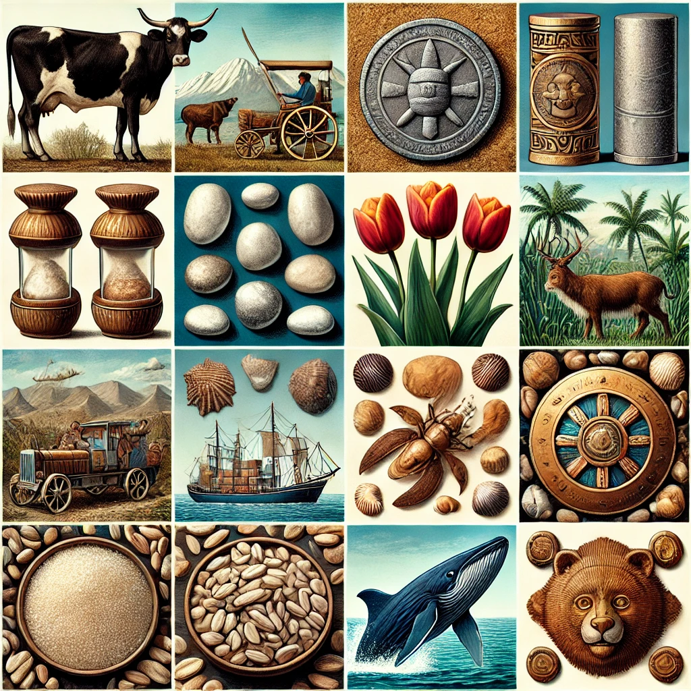
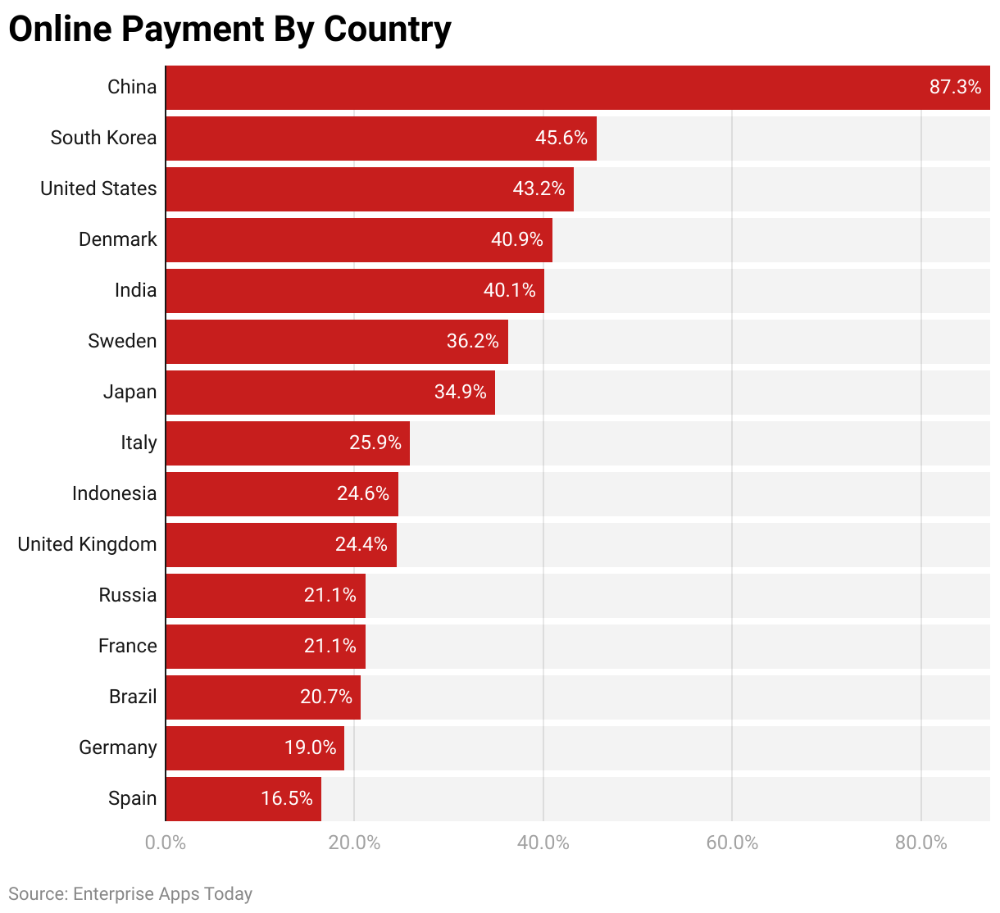
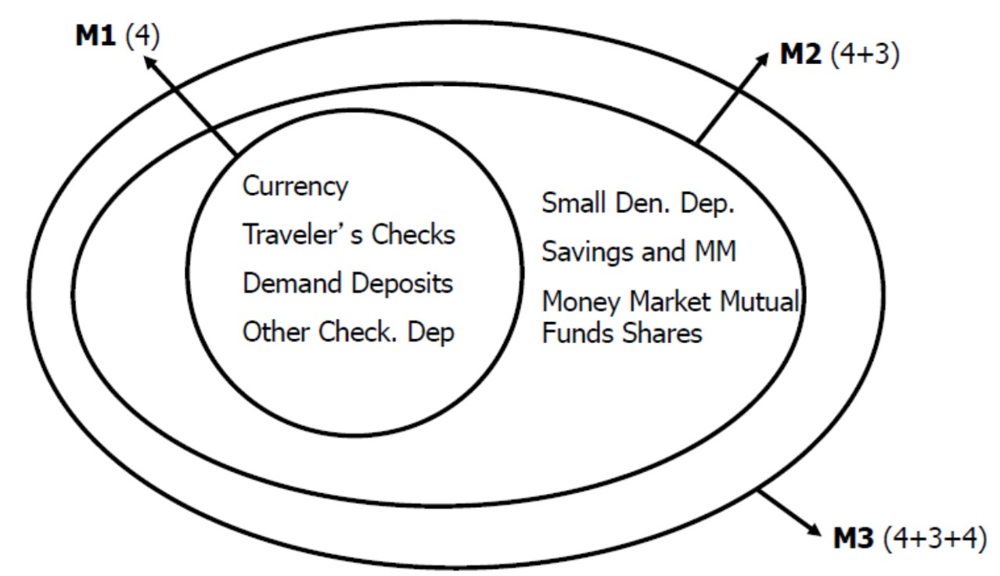
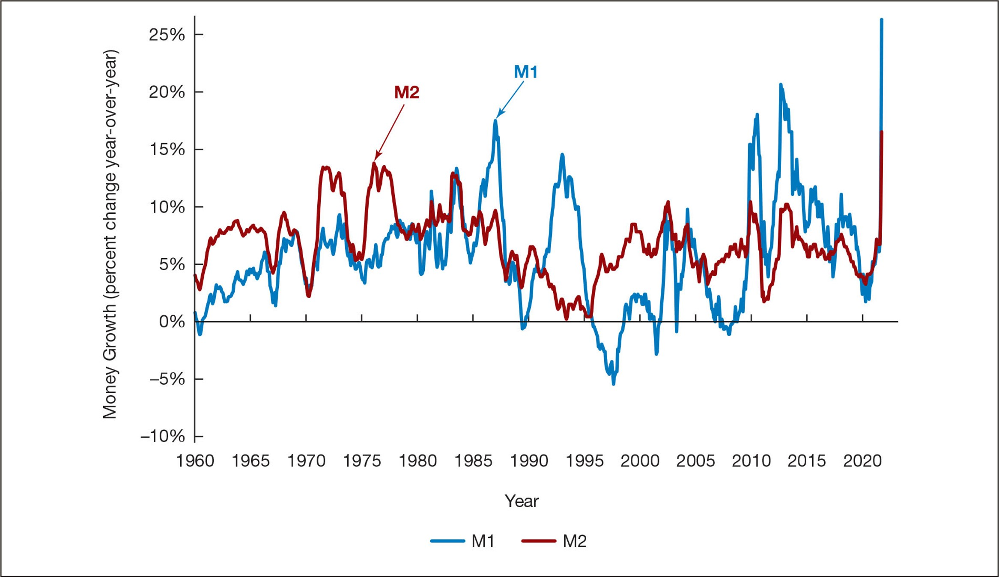

<style>
@media print{
  body, html, .remark-slides-area, .remark-notes-area {
    height: 100% !important;
    width: 100% !important;
    overflow: visible;
    display: inline-block;
    }
</style>

<style type="text/css">
.remark-slide-content {
    font-size: 34px;
    padding: 1em 4em 1em 4em;
}
</style>

<style type="text/css">
.my-one-page-font {
  font-size: 28px;
}
</style>

</style>

<style type="text/css">
.my-one-page-font-table {
  font-size: 24px;
}
</style>

<style>
.tiny { font-size: 60%; }      /* class you can reuse anywhere */
</style>

<style>
.remark-slide-content {
  position: relative;
  z-index: 1;
}

.remark-slide-content::before {
  content: "";
  position: absolute;
  top: 50%;
  left: 50%;
  width: 600px;          /* adjust size */
  height: 600px;
  background-image: url("1. 교장(Seal_Positive).png");  /* place logo file in same folder */
  background-repeat: no-repeat;
  background-position: center;
  background-size: contain;
  opacity: 0.05;         /* watermark transparency */
  transform: translate(-50%, -50%);
  pointer-events: none;
  z-index: 0;
}
</style>


```{r setup, include = FALSE}
library(tidyverse)
library(knitr)

opts_chunk$set(fig.width = 10, 
               message = FALSE, 
               warning = FALSE,
               echo = FALSE)
```

```{r xaringan-themer, include=FALSE, warning=FALSE}
#install.packages("xaringanthemer")
library(xaringanthemer)
style_mono_accent(
  base_color = "#851a10",
  header_font_google = google_font("Josefin Sans"),
  text_font_google   = google_font("Montserrat", "500", "550i"),
  code_font_google   = google_font("Fira Mono"),
  colors = c(
  red = "#f34213",
  purple = "#3e2f5b",
  orange = "#ff8811",
  green = "#136f63",
  white = "#FFFFFF"
)
)
```

# Agenda  

1. What is Money?  

2. Class Discussion: The Evolution of Money

3. Class Activity: The Evolution of Money & Trust in Currency

---

class: inverse, center, middle

# 1. What is Money? 

---

## What can be similar between these objects?
 

<div>
.center[]

---

# Throughout thousands of years of human civilization, many strange things have been used as money.

<div style="display: flex; justify-content: space-between; gap: 2em;">

<div style="width: 45%;">
<strong>Cows</strong> in ancient Egypt.<br><br>
<strong>Salt</strong> in ancient Rome.<br><br>
<strong>Cigarettes</strong> in POW camps.<br><br>
<strong>Rai stones</strong> in Micronesia.<br><br>
<strong>Cheese</strong> in Italy.<br><br>
<strong>Tulips</strong> in the Netherlands.<br><br>
<strong>Whale teeth</strong> in Fiji.<br><br>
</div>

<div style="width: 45%;">
<strong>Cowrie shells</strong> in Africa and Asia.<br><br>
<strong>Beaver pelts</strong> in Canada.<br><br>
<strong>Cocoa beans</strong> in Mesoamerica.<br><br>
<strong>Feathers</strong> in New Guinea.<br><br>
<strong>Tea bricks</strong> in Siberia.<br><br>
<strong>Wampum</strong> in North America.<br><br>
<strong>Tobacco</strong> in the American colonies.<br><br>
</div>

</div>


???
Salt is one of the world’s oldest forms of payment. 
In fact, the word salary derives from the Latin “salarium,” which was the money paid to Roman soldiers to buy salt. 
It was the main form of currency in the Sahara Desert during the Middle Ages, and was used extensively throughout East Africa. 
Typically, one would lick a salt block to make sure it was real and break off pieces to make change.

---

## **Meaning of Money**  

**Definition**: Money (or the “money supply”) is **anything that is generally accepted** as a payment for goods, services, or debt repayment.  

**Forms of Money**:  
- **Currency** (paper money and coins)
- **Checking Deposits** (bank money)
- **Electronic Payment Systems** (debit cards, mobile payments)
- **Cryptocurrencies** (a separate digital asset class) 

**Money vs. Other Concepts:**  
- **Wealth**: Total collection of valuable assets (property, investments).  
- **Income**: Flow of earnings over time (a rate, not a stock).  

---

## **Functions of Money**  

**1. Medium of Exchange**  
- Eliminates the need for a **double coincidence of wants**.  
- Reduces **transaction costs** and promotes **specialization**.  

**Requirements of a Good Medium of Exchange:**  
- Easily standardized  
- Widely accepted  
- Divisible  
- Portable  
- Durable
- Limited supply  

> Spanish explorers flooded Europe with silver in the 16th century, contributing to inflation known as the Price Revolution.
---
## **Functions of Money** (Cont'd)   

**2. Unit of Account**  
- Standardizes the measurement of **value** in an economy.  
- Reduces **transaction costs**.  

**3. Store of Value**  
- Saves **purchasing power over time**.  
- Other assets (real estate, stocks) also store value.  
- **Money loses value with inflation**.  

> Money is usually a poor store of value compared to assets like stocks or real estate because inflation reduces purchasing power.

---

## **Evolution of the Payments System**  

1. **Commodity Money**: Precious metals, cigarettes, other physical valuables. 

2. **Fiat Money**: Government-issued currency with no intrinsic value.  

3. **Bank Money**: Checking deposits, demand deposits.

4. **Electronic Payment Systems**: Online banking, bill payments.  

5. **Digital Currencies**: Cryptocurrencies (Bitcoin, Ethereum) and Central Bank Digital Currencies (CBDCs).

---

## **Online Payment Statistics By Country** in 2022

<div>
.center[]
</div>

---

## **Are We Headed for a Cashless Society?**  

Predictions of a cashless society have been around for **decades**, but why hasn’t it happened yet?  

**Barriers to a fully cashless economy:**  
- **High setup costs** for digital payment infrastructure.  
- **Security & privacy risks** with electronic transactions.  

- **Cash is still widely used in many advanced economies for small payments.**

**Cash is resilient during crises and power outages.**

**Cash protects privacy in transactions.**

**Many central banks deliberately preserve access to cash for financial inclusion.**

However, **e-money usage is increasing** and is likely to grow further.  

> In the U.S., more than 90 percent of money exists as bank deposits rather than physical currency.

---

## **Will Bitcoin Become the Money of the Future?**  

**Bitcoin & Cryptocurrencies**:  
- A decentralized form of **e-cash** secured through cryptography.  
- **Created in 2009**, Bitcoin is mined by solving cryptographic puzzles.  

**Pros & Cons of Bitcoin as Money:**  

✅ **Advantages**  
- Low transaction fees  
- Anonymity & decentralization  

❌ **Disadvantages**  
- High **price volatility**  
- Limited use as a **unit of account** and **store of value**  
- **Volatility remains the main obstacle to functioning as money.**
- **Transaction fees are not always low; they vary depending on network congestion.**

> Bitcoin is rarely used as a unit of account/exchange but rather as a speculative asset. Prices are almost always quoted in national currency.

*Does Bitcoin meet all the criteria to function as money?*  

---
class: my-one-page-font

## **Why Do Central Banks Care About Money?**  

1. **Monetary Policy & Economic Control**  
  - Interest-rate policy shapes inflation, employment, and growth.  

2. **Inflation & Price Stability**  
  - Too much money raises inflation; too little raises deflation risk.  

3. **Financial Stability & Asset Prices**  
  - Excess liquidity can fuel bubbles, so central banks monitor systemic risk.  

4. **Economic Growth & Investment**  
  - Money supply affects credit conditions for firms and households.  

5. **Exchange Rates & Global Trade**  
  - Money conditions influence currency value, trade competitiveness, and capital flows.  

---
class: my-one-page-font

## **Why Are Central Banks Developing Digital Currencies?**  

**Central Bank Digital Currencies (CBDCs) are reshaping the future of money. But why?**  

1. **Greater Control & Policy Efficiency**  
  - CBDCs can improve policy transmission and payment-system visibility.  

2. **Financial Inclusion & Access**  
  - Digital wallets can expand access for unbanked users.  

3. **Lower Transaction Costs & Efficiency**  
  - CBDCs can support faster, cheaper domestic and cross-border payments.  

4. **Security & Fraud Prevention**  
  - Digital design can reduce counterfeiting and improve traceability.  

5. **Strengthening International Payments**  
  - They may reduce settlement frictions and reliance on intermediaries.  

*Will digital currencies replace cash completely?*  

> As of 2024–2025, more than 130 countries are exploring CBDCs. However, only a few have fully launched them (for example the Bahamas Sand Dollar and Nigeria eNaira).

---

## **Measuring Money: Monetary Aggregates**  

**How do we measure money?**  

1. **M1 (Most Liquid Assets)**  
  - **Currency + Traveler’s Checks + Demand Deposits + Other Checkable Deposits**  

2. **M2 (Less Liquid Assets)**  
  - **M1 + Savings Deposits + Small-Time Deposits + Money Market Accounts + Mutual Funds**  

> In the United States, M1 increased from about 4 trillion dollars in early 2020 to more than 18 trillion dollars after the statistical redefinition (in 2020 the Federal Reserve reclassified savings deposits into M1).

---

## **The Federal Reserve’s Monetary Aggregates**  

<div>
.center[]

---

## **Monetary Aggregates Over Time**  

<div>
.center[]
</div>
<div>
.tiny[M3 is the broadest measure of a country's money supply, encompassing highly liquid cash (M1) and near-money (M2) plus less liquid assets like Large Time Deposits, Institutional Money Market Funds, Repurchase Agreements, and Eurodollar Deposits.]
</div>

**M1 vs. M2: Why does it matter?**  
- If M1 and M2 move **together**, choosing a measure is less important.  
- But when they diverge, **monetary policy decisions become more complex**.  

*Conclusion*: the choice of monetary aggregate is important for policymakers.

---

## **Growth Rates of M1 & M2 (1960-2020)**  

<div>
.center[]


---

class: inverse, center, middle

# 2. Class Discussion: The Evolution of Money

---

### **Discussion & Brainstorming**  
**Topic:** *The Evolution of Money*  

**Key Questions:**  
1. Looking at historical examples (cows, salt, shells, etc.), what characteristics made them function as money?  
2. Which of these forms of money do you think was the most effective? Why?  
3. Why did societies move from commodity money (gold, salt, etc.) to fiat money (paper currency)?  
4. Could any of the ancient money forms still work today in certain economies?  
5. Why was wampum valuable to some societies but meaningless to others?  
6. Do you think the perception of cryptocurrency is cultural, just like historical money?  
7. Will central bank digital currencies (CBDCs) replace cash?  
8. If you had to design a new form of money, what qualities would it need to be widely accepted?  
9. What lessons can we learn from historical money that might help us understand Bitcoin & cryptocurrencies?  

---

class: inverse, center, middle

# 3. Class Activity: The Evolution of Money & Trust in Currency

---

# Next Class

- (Mar 26) Chapt. 4: The Meaning of Interest Rates

---

class: inverse, center, middle

# Any QUESTIONS?

## Thank you for your attention and participation!  


???
1. To print pdf slides
https://stackoverflow.com/questions/54968311/xaringan-export-slides-to-pdf-while-preserving-formatting

pagedown::chrome_print("W1_ME.html") # but not all pictures are visible

2. Option: https://stackoverflow.com/questions/54968311/xaringan-export-slides-to-pdf-while-preserving-formatting

install.packages("remotes")
remotes::install_github("jhelvy/xaringanBuilder")
remotes::install_github("jhelvy/renderthis@v0.0.9")

library(xaringanBuilder)
build_pdf("DVC.html")

3. Option
writeBin(as.raw(c()), "favicon.ico") # create an empty favicon.ico file
install.packages("renderthis")
remotes::install_github('rstudio/chromote')
library(renderthis)

renderthis::to_pdf("W3_FIS.html")

getwd()
setwd("C:\\Users\\vyshn\\OneDrive - kdis.ac.kr\\Documents\\GitHub\\Sogang\\2026\\Spring\\Financial Institutions and System\\Week 3")
