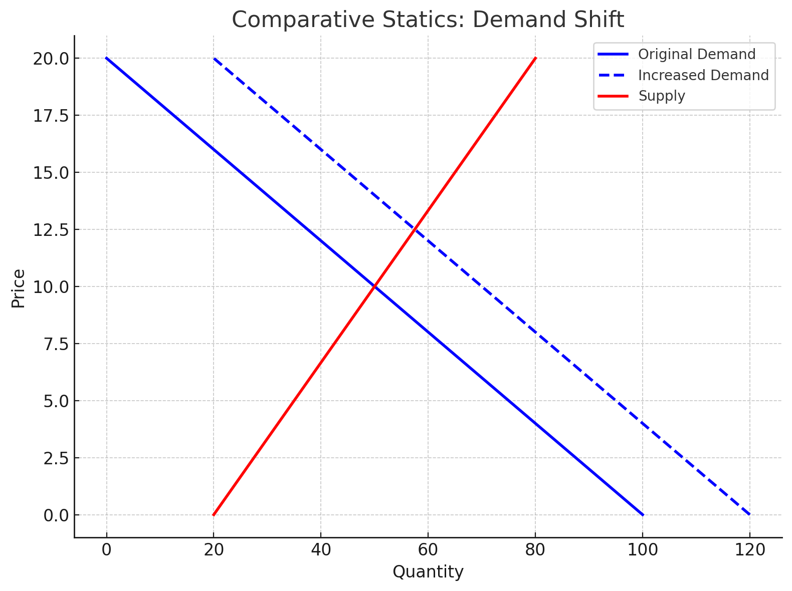

<style>
@media print{
  body, html, .remark-slides-area, .remark-notes-area {
    height: 100% !important;
    width: 100% !important;
    overflow: visible;
    display: inline-block;
    }
}
</style>

<style type="text/css">
.remark-slide-content {
    font-size: 34px;
    padding: 1em 4em 1em 4em;
}
</style>

<style type="text/css">
.my-one-page-font {
  font-size: 28px;
}
</style>

<style type="text/css">
.my-one-page-font-table {
  font-size: 24px;
}
</style>

<style>
.tiny { font-size: 60%; }      /* class you can reuse anywhere */
</style>

<style>
.remark-slide-content {
  position: relative;
  z-index: 1;
}

.remark-slide-content::before {
  content: "";
  position: absolute;
  top: 50%;
  left: 50%;
  width: 600px;          /* adjust size */
  height: 600px;
  background-image: url("1. 교장(Seal_Positive).png");  /* place logo file in same folder */
  background-repeat: no-repeat;
  background-position: center;
  background-size: contain;
  opacity: 0.05;         /* watermark transparency */
  transform: translate(-50%, -50%);
  pointer-events: none;
  z-index: 0;
}
</style>


```{r setup, include = FALSE}
library(tidyverse)
library(knitr)

opts_chunk$set(fig.width = 10, 
               message = FALSE, 
               warning = FALSE,
               echo = FALSE)
```

```{r xaringan-themer, include=FALSE, warning=FALSE}
#install.packages("xaringanthemer")
library(xaringanthemer)
style_mono_accent(
  base_color = "#851a10",
  header_font_google = google_font("Josefin Sans"),
  text_font_google   = google_font("Montserrat", "500", "550i"),
  code_font_google   = google_font("Fira Mono"),
  colors = c(
  red = "#f34213",
  purple = "#3e2f5b",
  orange = "#ff8811",
  green = "#136f63",
  white = "#FFFFFF"
)
)
```

# Happy May, everyone! 🌸

I hope you had a pleasant weekend and are enjoying the extra rest.

Here is some fun economic math to make it even better.

---

# Before we start...

## Midterm exam scores are now available on the LMS.

Summary statistics:

| Metric | Value |
|---|---:|
| Total points | 100 |
| Average | 77.0 |
| Standard deviation | 20.78 |
| Maximum | 99 |
| Median | 86.5 |
| Minimum | 23 |

Grades have already been uploaded to the SAINT system. If you have any questions about your score, please contact me by email.

---

# Why It Matters in Economics, Business & Finance

> Comparative statics analyzes how equilibrium values change. 
It is an essential technique used to understand how changes in **policy, shocks, or parameters** affect outcomes in economic models.

- In **macroeconomics**, we can predict how national income responds to a change in government spending or taxation.
- In **finance**, understanding multipliers helps estimate how economic indicators respond to policy adjustments.
- In **microeconomics**, it shows how supply and demand curves shift in response to taxes, subsidies, or preferences.

It allows decision-makers to simulate "what if" scenarios and make **informed, strategic choices**.

---

# Learning Objectives

By the end of this class, you should be able to:

- Derive the **reduced form** of macroeconomic models

- Compute **national income multipliers**

- Interpret **qualitatively** how changes in parameters affect outcomes

- Use **quantitative** multiplier analysis

- Apply **multipliers** in a simple one-good market model

- Distinguish between **endogenous** vs **exogenous** variables

---

# Agenda  

1. Comparative Statics (5.3)  

2. Individual Assignment

---

class: inverse, center, middle

# 1. Comparative Statics (5.3)

---

# Structural Form → Reduced Form

### Example:

Suppose:
$$
Y = C + I + G
$$
$$
C = a + b(Y - T)
$$

This is the **structural form**.

We substitute $C$ into the $Y$ equation:

$$
Y = a + b(Y - T) + I + G
$$

Solve for $Y$ → this is the **reduced form**.

---

# Solving for Y

Start with:
$$
Y = a + b(Y - T) + I + G
$$
Distribute:
$$
Y = a + bY - bT + I + G
$$
Group terms:
$$
Y - bY = a - bT + I + G
$$
Factor:
$$
Y(1 - b) = a - bT + I + G
$$
Solve:
$$
Y = \frac{1}{1 - b}(a - bT + I + G)
$$

This is the **reduced form**: it shows $Y$ as a function of **exogenous variables**

---

# Endogenous vs Exogenous Variables

- **Endogenous variables** are determined *inside* the model.
  - In our income model, $Y$ (and $C$ in structural form) is endogenous.
  - In a supply-demand model, equilibrium $P^*$ and $Q^*$ are endogenous.

- **Exogenous variables** are determined *outside* the model and treated as given.
  - In our reduced form, $a, b, T, I, G$ are exogenous inputs.
  - Economic examples: fiscal policy ($G$, tax rate $T$), world interest rates, technology shocks, and weather shocks in agriculture.

If an exogenous variable changes, how do endogenous outcomes respond? 
For example, if $G$ increases, how much does $Y$ increase? 

---

# Multiplier Concept

From the reduced form:
$$
Y = \frac{1}{1 - b}(a - bT + I + G)
$$

- The **multiplier** is $\frac{1}{1 - b}$
- It shows how **sensitive** $Y$ is to a change in **G**, **I**, etc.

If $b = 0.8$, multiplier = $\frac{1}{1 - 0.8} = 5$

So:
- $\Delta G = 10$ → $\Delta Y = 5 \times 10 = 50$

From an economic perspective, this means that a 1-unit increase in $G$ increases $Y$ by 5 units.

---

# Practice Problem

Given:
- $a = 20$, $b = 0.75$
- $T = 10$, $I = 30$, $G = 40$

1. Write reduced form for $Y$

2. Compute multiplier

3. Calculate $Y$

4. If $G$ increases to 50, what is the new $Y$?

---

# Solution

1. Reduced form:
$$
Y = \frac{1}{1 - 0.75}(20 - 0.75 \cdot 10 + 30 + 40) = 4(20 - 7.5 + 30 + 40) = 4(82.5)
$$

2. Multiplier = $\frac{1}{1 - 0.75} = 4$

3. $Y = 330$

4. New $G = 50$ →
$$
Y = 4(20 - 7.5 + 30 + 50) = 4(92.5) = 370
$$

---

# Market Model Example

Supply and demand:
$$
Q_d = 100 - 5P \quad Q_s = 20 + 3P
$$

Equilibrium: $Q_d = Q_s$

Solve:
$100 - 5P = 20 + 3P \Rightarrow 80 = 8P \Rightarrow P^* = 10 \Rightarrow Q^* = 100 - 5 \cdot 10 = 50$

Now increase demand:
$$
Q_d = 120 - 5P
$$

→ Solve again:
$120 - 5P = 20 + 3P \Rightarrow 100 = 8P \Rightarrow P^* = 12.5, Q^* = 120 - 5 \cdot 12.5 = 57.5$

This illustrates how a change in **parameters** shifts equilibrium. Here, the parameter shift is an intercept increase in demand (a demand shock).

---

# Plot: Comparative Statics in Supply & Demand

.center[]


---

# Summary

- Comparative statics helps **evaluate how equilibrium changes** with a shift in exogenous variables

- Multiplier tells us the **magnitude of change**

- We derived **reduced form** from structure

- We applied the concept to:
  - National income
  - Market models


---

class: inverse, center, middle

# 2. Individual Assignment: Comparative Statics Lab

---

# Individual Assignment: Comparative Statics Lab

## Instructions

- Work individually.
- Show all steps.
- Provide an economic interpretation for each result.
- You may use a calculator.

---

# Task 1: Reduced Form and Multiplier

Given:
$$
Y = C + I + G, \quad C = 15 + 0.8(Y - T)
$$

Parameters:
$$
T = 10, \quad I = 25, \quad G = 30
$$

Questions:

- Derive the reduced form.
- Compute the multiplier.
- Find equilibrium $Y$.
- If $G$ increases by 10, find the new $Y$.

---

# Task 2: Sensitivity Analysis

Using:
$$
Y = \frac{1}{1 - b}(a - bT + I + G)
$$

Compare:

- Case A: $b = 0.6$
- Case B: $b = 0.9$

Questions:

- Compute the multipliers.
- Which economy reacts more to policy?
- Explain why.

---

# Task 3: Market Comparative Statics

Initial market:
$$
Q_d = 100 - 4P, \quad Q_s = 20 + 2P
$$

Questions:

- Find equilibrium $P^*$ and $Q^*$.
- After a demand shock,
$$
Q_d = 120 - 4P
$$
find the new equilibrium.
- Explain what changed.
- Explain why both $P$ and $Q$ increased.

---

# Task 4: Interpretation Challenge

Short answers:

- Why does a higher $b$ increase the multiplier?
- Is a large multiplier always good? Why or why not?

???

# Suggested Solutions (Instructor)

## Task 1

Reduced form:
$$
Y = \frac{1}{1 - 0.8}(15 - 0.8 \cdot 10 + 25 + 30)
= 5(15 - 8 + 25 + 30)
= 5(62)
= 310
$$

If $G$ increases to 40:
$$
Y = 5(15 - 8 + 25 + 40) = 5(72) = 360
$$

#---

# Suggested Solutions (Instructor)

## Task 2

- Case A: $\frac{1}{1 - 0.6} = 2.5$
- Case B: $\frac{1}{1 - 0.9} = 10$

The economy with $b = 0.9$ reacts more because stronger consumption feedback creates a larger multiplier.

## Task 3

Initial equilibrium:
$$
100 - 4P = 20 + 2P
\Rightarrow 80 = 6P
\Rightarrow P^* = 13.33
$$
$$
Q^* = 100 - 4(13.33) = 46.67
$$

After demand shock:
$$
120 - 4P = 20 + 2P
\Rightarrow 100 = 6P
\Rightarrow P^* = 16.67
$$
$$
Q^* = 120 - 4(16.67) = 53.33
$$

## Task 4

- Higher MPC ($b$) creates more rounds of spending, increasing the multiplier.
- A large multiplier is not always good; it can raise inflationary pressure and macroeconomic instability.

---

## Next Classes

- (May 7) Unconstrained Optimization (5.4)

---

class: inverse, center, middle

# Any QUESTIONS?

## Thank you for your attention and participation!

???
1. To print pdf slides
https://stackoverflow.com/questions/54968311/xaringan-export-slides-to-pdf-while-preserving-formatting

pagedown::chrome_print("W1_ME.html") # but not all pictures are visible

2. Option: https://stackoverflow.com/questions/54968311/xaringan-export-slides-to-pdf-while-preserving-formatting

install.packages("remotes")
remotes::install_github("jhelvy/xaringanBuilder")
remotes::install_github("jhelvy/renderthis@v0.0.9")

library(xaringanBuilder)
build_pdf("DVC.html")

3. Option
writeBin(as.raw(c()), "favicon.ico") # create an empty favicon.ico file
install.packages("renderthis")
remotes::install_github('rstudio/chromote')
library(renderthis)

renderthis::to_pdf("W10_1_ME.html")

getwd()
setwd("C:\\Users\\vyshn\\OneDrive - kdis.ac.kr\\Documents\\GitHub\\Sogang\\2026\\Spring\\Mathematical Methods for International Commerce\\Week 10_1")
