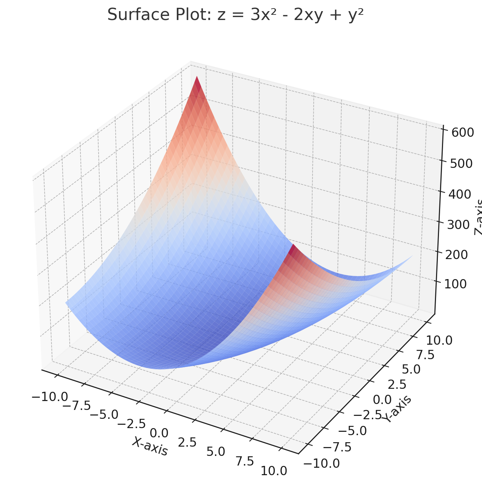

<style>
@media print{
  body, html, .remark-slides-area, .remark-notes-area {
    height: 100% !important;
    width: 100% !important;
    overflow: visible;
    display: inline-block;
    }
}
</style>

<style type="text/css">
.remark-slide-content {
    font-size: 34px;
    padding: 1em 4em 1em 4em;
}
</style>

<style type="text/css">
.my-one-page-font {
  font-size: 28px;
}
</style>

<style type="text/css">
.my-one-page-font-table {
  font-size: 24px;
}
</style>

<style>
.tiny { font-size: 60%; }      /* class you can reuse anywhere */
</style>

<style>
.remark-slide-content {
  position: relative;
  z-index: 1;
}

.remark-slide-content::before {
  content: "";
  position: absolute;
  top: 50%;
  left: 50%;
  width: 600px;          /* adjust size */
  height: 600px;
  background-image: url("1. 교장(Seal_Positive).png");  /* place logo file in same folder */
  background-repeat: no-repeat;
  background-position: center;
  background-size: contain;
  opacity: 0.05;         /* watermark transparency */
  transform: translate(-50%, -50%);
  pointer-events: none;
  z-index: 0;
}
</style>


```{r setup, include = FALSE}
library(tidyverse)
library(knitr)

opts_chunk$set(fig.width = 10, 
               message = FALSE, 
               warning = FALSE,
               echo = FALSE)
```

```{r xaringan-themer, include=FALSE, warning=FALSE}
#install.packages("xaringanthemer")
library(xaringanthemer)
style_mono_accent(
  base_color = "#851a10",
  header_font_google = google_font("Josefin Sans"),
  text_font_google   = google_font("Montserrat", "500", "550i"),
  code_font_google   = google_font("Fira Mono"),
  colors = c(
  red = "#f34213",
  purple = "#3e2f5b",
  orange = "#ff8811",
  green = "#136f63",
  white = "#FFFFFF"
)
)
```

# Why It Matters in Economics & Business

- Optimization helps firms maximize profit by adjusting inputs or pricing.

- It allows for strategic decision-making in pricing, production, and resource allocation.

- Applications in:
  - Cost minimization (minimizing production costs)

  - Profit maximization (maximizing revenue)

  - Price discrimination (optimizing prices in different markets)

  - Resource allocation (optimizing the use of limited resources)

  - Risk management (optimizing investment portfolios)

---

# Learning Objectives

By the end of this class, you should be able to:

- Use first-order partial derivatives to find stationary points.

- Use second-order partial derivatives to classify stationary points.

- Maximize the profit of a firm producing two goods.

- Optimize profit for a firm using price discrimination in different markets.

---

# Agenda  

1. Unconstrained Optimization (5.4)

2. Class Activity

---
class: my-one-page-font
# Finding Stationary Points

- Our first step is to find the stationary points of a function.
  - A stationary point is where the first derivative (or partial derivative) is zero.
- Why? - Because it indicates a potential maximum or minimum.
- We can find stationary points using the first-order conditions.

For a function of two variables $f(x, y)$, the first-order partial derivatives are:

$$
f_x = \frac{\partial f}{\partial x}, \quad f_y = \frac{\partial f}{\partial y}
$$

Stationary points occur where both derivatives equal zero:

$$
f_x = 0 \quad \text{and} \quad f_y = 0
$$

Stationary points are candidates for extrema or saddle points.

**Example:**  
Let $f(x, y) = 3x^2 - 2xy + y^2$  
1. Calculate $f_x$ and $f_y$.  
2. Set $f_x = 0$ and $f_y = 0$ to find the stationary points.

.tiny[Note: The function is a quadratic form, which often has a single stationary point that can be classified as a maximum, minimum, or saddle point based on the second-order conditions.]

---

# Solution: Stationary Points

1. First-order derivatives:

$$
f_x = 6x - 2y, \quad f_y = -2x + 2y
$$

Setting them to zero:

$$
6x - 2y = 0 \
-2x + 2y = 0
$$

Solving simultaneously:

- From $6x - 2y = 0$, we get $y = 3x$.  
- From $-2x + 2y = 0$, we get $y = x$.  
- Equating them gives $3x = x$, so $x = 0$ and therefore $y = 0$.  

Stationary point: $(x, y) = (0, 0)$.

It means that at this point, the slope of the function is zero in both directions.
- This is a candidate for a local maximum, minimum, or saddle point.

---

class: my-one-page-font

# Second-Order Partial Derivatives and Hessian Matrix

To classify the stationary points, we use the second-order partial derivatives:

$f_{xx}, f_{yy}, f_{xy}$

The determinant of the Hessian matrix $D$ is given by:

$D = f_{xx} \cdot f_{yy} - (f_{xy})^2$

- If $D > 0$ and $f_{xx} > 0$: Local Min  
- If $D > 0$ and $f_{xx} < 0$: Local Max  
- If $D < 0$: Saddle Point  
- If $D = 0$: Inconclusive  

Note 1: The Second-order conditions provide sufficient conditions for local extrema when D≠0.
- They help us classify the nature of the stationary point.
- If $D = 0$, we cannot conclude anything about the nature of the stationary point.
- We may need to use higher-order derivatives or other methods to classify the point.

Note 2: The second-order conditions are based on the assumption that the function is twice differentiable.
- If the function is not twice differentiable, we may need to use other methods to classify the point.

---

class: my-one-page-font

# Second-Order Partial Derivatives and Hessian Matrix (cont'd)

## Hessian Matrix

### What is the Hessian Matrix?

- The Hessian matrix, denoted by $H_x$, is a square matrix of second-order partial derivatives of a scalar-valued function $f(x_1, x_2)$.
- It provides information about the **curvature** of the function and helps in determining the nature of stationary points.
- The determinant of the Hessian matrix is used to classify stationary points.

### Definition:

$$
H_x = 
\begin{bmatrix}
\frac{\partial^2 f}{\partial x_1^2} & \frac{\partial^2 f}{\partial x_1 \partial x_2} \\
\frac{\partial^2 f}{\partial x_1 \partial x_2} & \frac{\partial^2 f}{\partial x_2^2}
\end{bmatrix}
$$

### Explanation:
- **Diagonal Elements:** Measure the curvature with respect to each variable independently.
- **Off-Diagonal Elements:** Measure how the function curvature changes when both variables interact.

---

# Second-Order Partial Derivatives and Hessian Matrix (cont'd)

## Hessian Matrix


### Why is it Important?
- The Hessian matrix helps to determine the nature of stationary points:
  
  - Positive determinant and positive diagonal elements: **Local minimum**.
  
  - Positive determinant and negative diagonal elements: **Local maximum**.
  
  - Negative determinant: **Saddle point**.
  
  - Zero determinant: **Inconclusive test**.


---

# Example: Classification

Continuing from the previous example:

Second-order derivatives:

$f_{xx} = 6, \quad f_{yy} = 2, \quad f_{xy} = -2$

Determinant:

$$
D = (6)(2) - (-2)^2 = 12 - 4 = 8
$$

Since $D > 0$ and $f_{xx} > 0$, the point $(0, 0)$ is a **local minimum**.
It means that the function has a minimum value at this point.
- The function is locally convex (positive definite Hessian).
- The function is increasing in both directions away from this point.
- The function is "bowl-shaped" at this point.
- The function has a unique minimum value at this point.

---

# Visualizing the Function

.center[]

- The blue regions indicate lower values of z, while the red regions indicate higher values.
- The shape is not symmetric due to the interaction term -2xy, creating a slanted surface.
- The surface is bowl-shaped with a minimum at (0,0), confirming our analytical result.

---

# Economic Application (1): Profit Maximization

A firm produces two goods $Q_1$ and $Q_2$ with profit function:

$\Pi(Q_1, Q_2) = 200Q_1 + 300Q_2 - 50Q_1^2 - 75Q_2^2 - 30Q_1Q_2$

1. Determine the profit-maximizing quantities.

2. Classify the stationary points using the second-order derivatives.

---

# Solution: Profit Maximization

1. First-order derivatives:

$$
\Pi_{Q_1} = 200 - 100Q_1 - 30Q_2
$$

$$
\Pi_{Q_2} = 300 - 150Q_2 - 30Q_1
$$

Setting to zero:

$$
200 - 100Q_1 - 30Q_2 = 0 $$

$$
300 - 150Q_2 - 30Q_1 = 0
$$

Solving simultaneously:
- $Q_1 \approx 1.49$  
- $Q_2 \approx 1.70$

---
# Solution: Profit Maximization (cont'd)

2. Second-order derivatives:

$\Pi_{Q_1Q_1} = -100, \quad \Pi_{Q_2Q_2} = -150, \quad \Pi_{Q_1Q_2} = -30$

Hessian Determinant:

$$
D = (-100)(-150) - (-30)^2 = 15000 - 900 = 14100
$$

Since $D > 0$ and $\Pi_{Q_1Q_1} < 0$, the point $(1.49, 1.70)$ is a **local maximum**.

It means that the firm maximizes its profit at this point.


---

class: inverse, center, middle

# 2. Group Activity


---

# Your turn: Profit Maximization (Group 1)

A firm produces two goods $Q_1$ and $Q_2$ with the following profit function:

$$  
\Pi(Q_1, Q_2) = 150Q_1 + 250Q_2 - 40Q_1^2 - 60Q_2^2 - 20Q_1Q_2
$$

### Tasks:
1. Determine the profit-maximizing quantities.  
2. Classify the stationary points using the second-order derivatives.  
3. Interpret the economic meaning of the results.

???

# **Solution: First-Order Derivatives**

1. First-order derivatives:

$$  
\Pi_{Q_1} = 150 - 80Q_1 - 20Q_2  
\Pi_{Q_2} = 250 - 120Q_2 - 20Q_1  
$$

Setting both derivatives to zero:

$$  
150 - 80Q_1 - 20Q_2 = 0  
250 - 120Q_2 - 20Q_1 = 0  
$$

Solving simultaneously:
- $Q_1 \approx 1.41$  
- $Q_2 \approx 1.85$


# **Solution: Second-Order Derivatives**

2. Second-order derivatives:

$$  
\Pi_{Q_1Q_1} = -80, \quad \Pi_{Q_2Q_2} = -120, \quad \Pi_{Q_1Q_2} = -20
$$

Hessian Determinant:

$$  
D = (-80)(-120) - (-20)^2 = 9600 - 400 = 9200
$$

- Since $D > 0$ and $\Pi_{Q_1Q_1} < 0$, the point $(1.41, 1.85)$ is a **local maximum**.


# **Economic Interpretation**
- The firm maximizes its profit by producing approximately **1.41 units of Good 1** and **1.85 units of Good 2**.
- The positive determinant of the Hessian matrix indicates a local maximum.
- The negative values of the second derivatives indicate that the function is concave down, confirming a maximum.

---

# Your turn: Cost Optimization (Group 2)

A firm has the following cost function:

$$
C(L, K) = 5L^2 + 4K^2 - 8L - 16K + 50
$$

### Tasks:
1. Find the cost-minimizing combination of labor $L$ and capital $K$.  
2. Use the Hessian matrix to classify the stationary point.  
3. Provide an economic interpretation of the result.

???

# ✅ Solution: First-Order Conditions

1. First-order derivatives:

$$
C_L = 10L - 8, \quad C_K = 8K - 16
$$

Setting both derivatives equal to zero:

$$
10L - 8 = 0, \quad 8K - 16 = 0
$$

Solving gives:

$$
L^* = 0.8, \quad K^* = 2
$$

So the stationary point is:

$$
(L^*, K^*) = (0.8, 2)
$$

# ✅ Solution: Second-Order Conditions

2. Second-order derivatives:

$$
C_{LL} = 10, \quad C_{KK} = 8, \quad C_{LK} = 0
$$

Hessian determinant:

$$
D = C_{LL}C_{KK} - (C_{LK})^2 = (10)(8) - 0^2 = 80 > 0
$$

Since $D > 0$ and $C_{LL} > 0$, the stationary point $(0.8, 2)$ is a **local minimum**.

# 🌟 Economic Interpretation

- The firm minimizes cost by choosing **0.8 units of labor** and **2 units of capital**.  
- The positive Hessian determinant and positive second derivative indicate a convex cost function.  
- Therefore, the solution is a unique cost-minimizing input combination.

---

# Your turn: Risk Management: Optimizing Investment Portfolios (Group 3)

A firm is investing in two assets, A and B, with the following return function:

$$
R = 0.08x + 0.12y - 0.5(0.06x^2 + 0.09y^2) - 0.04xy
$$

where:
- $x$ = Investment in Asset A
- $y$ = Investment in Asset B

1. Determine the optimal allocation between assets A and B to maximize returns.
2. Verify the optimal solution using the second-order conditions.
3. Interpret the economic meaning of the results.

???

# ✅ Solution: First-Order Derivatives

1. First-order derivatives:

$$
R_x = 0.08 - 0.06x - 0.04y
$$
$$
R_y = 0.12 - 0.09y - 0.04x
$$

Setting both derivatives to zero:

$$
0.08 - 0.06x - 0.04y = 0
$$
$$
0.12 - 0.09y - 0.04x = 0
$$

Solving simultaneously:
- $x \approx 0.63$  
- $y \approx 1.05$


# ✅ Solution: Second-Order Derivatives

2. Second-order derivatives:

$$
R_{xx} = -0.06, \quad R_{yy} = -0.09, \quad R_{xy} = -0.04
$$

Hessian Determinant:

$$
D = (-0.06)(-0.09) - (-0.04)^2 = 0.0054 - 0.0016 = 0.0038
$$

- Since $D > 0$ and $R_{xx} < 0$, the point $(0.63, 1.05)$ is a **local maximum**.


# 🌟 Economic Interpretation
- The firm optimizes its investment by allocating approximately **0.63 units to Asset A** and **1.05 units to Asset B**.
- The positive determinant of the Hessian matrix confirms a local maximum, indicating that the firm is at an optimal risk-return point.
- This analysis can assist the firm in **allocating resources effectively** to maximize returns while controlling risk.

---

# Your turn: Price Discrimination: Maximizing Profit in Multiple Markets (Group 4)

A monopolist sells a product in two markets, A and B. The revenue functions for each market are:

$$
R_A = 200Q_A - 5Q_A^2
$$
$$
R_B = 300Q_B - 10Q_B^2
$$

The cost function for the firm is given by:

$$
C = 50 + 20(Q_A + Q_B)
$$

1. Determine the optimal quantities to sell in each market to maximize profit.
2. Verify the optimal solution using the second-order conditions.
3. Interpret the economic meaning of the results in the context of price discrimination.

???

# ✅ Solution: First-Order Derivatives

1. First-order derivatives for revenue functions:

For Market A:
$$
MR_A = 200 - 10Q_A
$$

For Market B:
$$
MR_B = 300 - 20Q_B
$$

Cost function derivative:
$$
MC = 20
$$

Setting $MR_A = MC$ and $MR_B = MC$:

$$
200 - 10Q_A = 20 \
300 - 20Q_B = 20
$$

Solving simultaneously:
- $Q_A = 18$
- $Q_B = 14$


# ✅ Solution: Second-Order Derivatives

2. Second-order derivatives of profit:

For Market A:
$$
\Pi_{Q_AQ_A} = -10 < 0
$$

For Market B:
$$
\Pi_{Q_BQ_B} = -20 < 0
$$

- Both second derivatives are **negative**, confirming that profit is maximized at these output levels.


# 🌟 Economic Interpretation
- The firm engages in **price discrimination** by setting different quantities for each market based on differing demand elasticities.
- The flatter marginal revenue curve in Market A means output responds differently to price than in Market B, so the profit-maximizing quantities differ across markets.
- The firm maximizes profit by selling **18 units in Market A** and **14 units in Market B**, adjusting output based on each market's price sensitivity.

---

# Your turn: Two-Variable Cost Minimization (Group 5)

A firm has cost function:

$$
C(x, y) = x^2 + y^2 - 4x - 6y + 20
$$

### Tasks:
1. Find the stationary point.  
2. Classify the stationary point using the Hessian.  
3. Interpret the result economically.

???

# ✅ Solution: First-Order Conditions

1. First-order derivatives:

$$
C_x = 2x - 4, \quad C_y = 2y - 6
$$

Setting both derivatives equal to zero:

$$
2x - 4 = 0, \quad 2y - 6 = 0
$$

So the stationary point is:

$$
(x^*, y^*) = (2, 3)
$$

# ✅ Solution: Second-Order Conditions

2. Second-order derivatives:

$$
C_{xx} = 2, \quad C_{yy} = 2, \quad C_{xy} = 0
$$

Hessian determinant:

$$
D = C_{xx}C_{yy} - (C_{xy})^2 = (2)(2) - 0^2 = 4 > 0
$$

Since $D > 0$ and $C_{xx} > 0$, the stationary point $(2, 3)$ is a **local minimum**.

# 🌟 Economic Interpretation

- The firm minimizes cost at the input combination $(x, y) = (2, 3)$.  
- The positive definite Hessian implies the cost function is strictly convex around this point.  
- Therefore, this is a unique cost-minimizing input mix.

---
# Your turn: Profit Maximization (Group 6)

A firm has:

$$
\Pi(x) = 100x - 10x^2 - 200
$$

### Tasks:
1. Find the optimal output.  
2. Verify the result using the second derivative.  
3. Interpret the result economically.

???

# ✅ Solution: First-Order Condition

1. First derivative:

$$
\Pi'(x) = 100 - 20x
$$

Set equal to zero:

$$
100 - 20x = 0 \Rightarrow x^* = 5
$$

# ✅ Solution: Second-Order Condition

2. Second derivative:

$$
\Pi''(x) = -20 < 0
$$

Since the second derivative is negative, $x^* = 5$ gives a **maximum**.

# 🌟 Economic Interpretation

- Profit is maximized when the firm produces **5 units**.  
- Beyond this level, marginal losses from additional output dominate, reducing total profit.

---

class: my-one-page-font

# Summary

- **Objective:** Maximize or minimize a function without constraints.

- **First-Order Derivative:** Used to find stationary points (set the derivative to zero).

- **Second-Order Derivative:** Determines the nature of the stationary points:
  - $f''(x) > 0$: Local minimum
  - $f''(x) < 0$: Local maximum

- **Applications in Economics:**
  - Cost minimization (input allocation)
  - Profit maximization (optimal production)
  - Risk management (investment allocation)
  - Price discrimination (market segmentation)

- **Key Takeaways:**
  - Identify objective functions and derive first and second derivatives.
  - Analyze the Hessian matrix for functions of two variables.
  - Apply economic interpretations to the mathematical solutions.


---

## Next Classes

- (May 12) Constrained Optimization (5.5)

---

class: inverse, center, middle

# Any QUESTIONS?

## Thank you for your attention and participation!

???
1. To print pdf slides
https://stackoverflow.com/questions/54968311/xaringan-export-slides-to-pdf-while-preserving-formatting

pagedown::chrome_print("W1_ME.html") # but not all pictures are visible

2. Option: https://stackoverflow.com/questions/54968311/xaringan-export-slides-to-pdf-while-preserving-formatting

install.packages("remotes")
remotes::install_github("jhelvy/xaringanBuilder")
remotes::install_github("jhelvy/renderthis@v0.0.9")

library(xaringanBuilder)
build_pdf("DVC.html")

3. Option
writeBin(as.raw(c()), "favicon.ico") # create an empty favicon.ico file
install.packages("renderthis")
remotes::install_github('rstudio/chromote')
library(renderthis)

renderthis::to_pdf("W10_2_ME.html")

getwd()
setwd("C:\\Users\\vyshn\\OneDrive - kdis.ac.kr\\Documents\\GitHub\\Sogang\\2026\\Spring\\Mathematical Methods for International Commerce\\Week 10_2")
