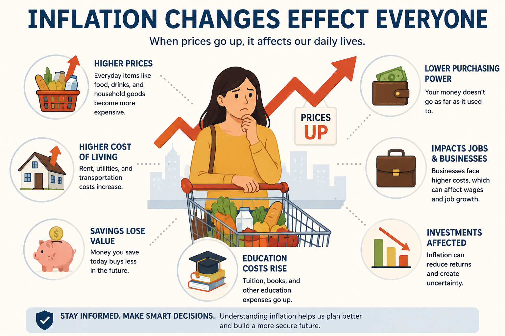
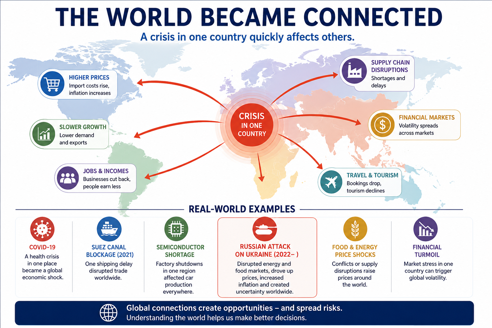
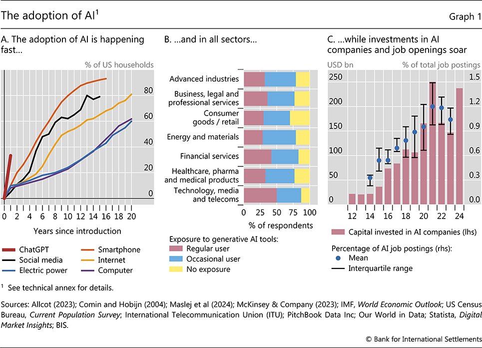
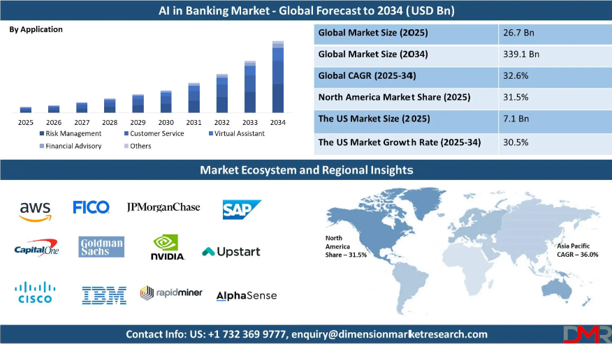
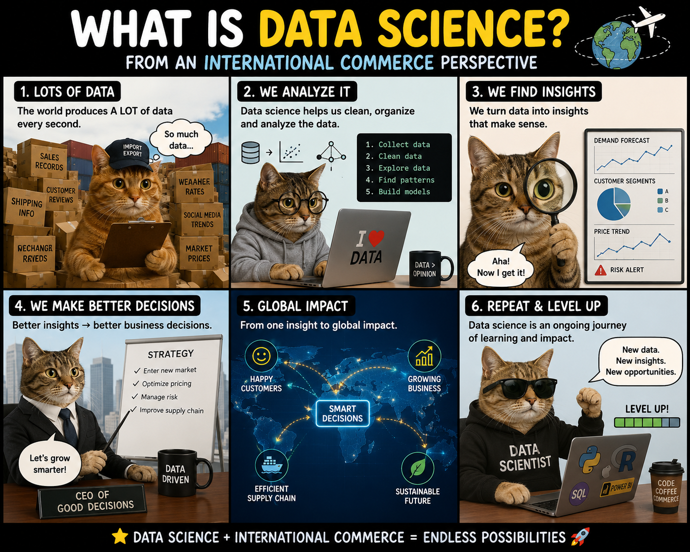
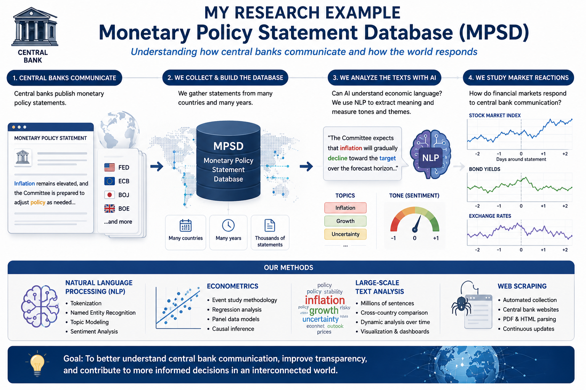
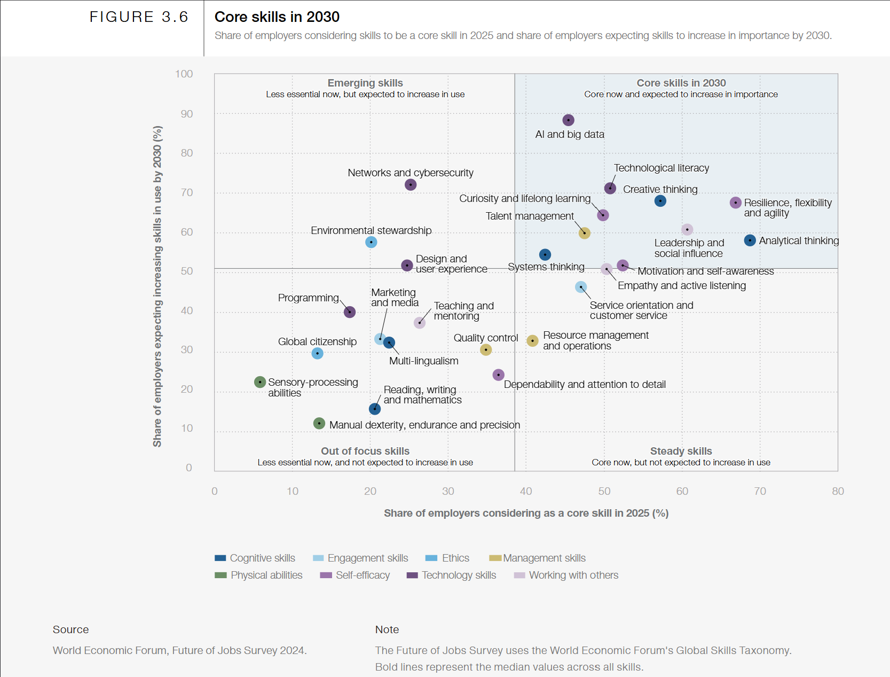

<style>
@media print{
  body, html, .remark-slides-area, .remark-notes-area {
    height: 100% !important;
    width: 100% !important;
    overflow: visible;
    display: inline-block;
    }
}
</style>

<style type="text/css">
.remark-slide-content {
    font-size: 34px;
    padding: 1em 4em 1em 4em;
}
</style>

<style type="text/css">
.my-one-page-font {
  font-size: 28px;
}
</style>

<style type="text/css">
.my-one-page-font-table {
  font-size: 24px;
}
</style>

<style>
.tiny { font-size: 60%; }      /* class you can reuse anywhere */
</style>

<style>
.remark-slide-content {
  position: relative;
  z-index: 1;
}

.remark-slide-content::before {
  content: "";
  position: absolute;
  top: 50%;
  left: 50%;
  width: 600px;          /* adjust size */
  height: 600px;
  background-image: url("1. 교장(Seal_Positive).png");  /* place logo file in same folder */
  background-repeat: no-repeat;
  background-position: center;
  background-size: contain;
  opacity: 0.05;         /* watermark transparency */
  transform: translate(-50%, -50%);
  pointer-events: none;
  z-index: 0;
}
</style>

<style>
.prompt-box {
  border-left: 8px solid #851a10;
  background: #f7f2ef;
  padding: 18px 22px;
  border-radius: 10px;
  margin-top: 18px;
}

.card-grid {
  display: grid;
  grid-template-columns: 1fr 1fr;
  gap: 14px;
  margin-top: 10px;
}

.mini-card {
  background: #fcf7f4;
  border: 2px solid #e8d7ce;
  border-radius: 12px;
  padding: 14px 16px;
  font-size: 0.82em;
}

.mini-card strong {
  color: #851a10;
}

.pill {
  display: inline-block;
  padding: 6px 14px;
  margin: 4px 6px 0 0;
  border-radius: 999px;
  background: #f3e5dc;
  border: 1px solid #d6b7a6;
  font-size: 0.78em;
}

.checklist {
  background: #fbf8f6;
  border: 1px solid #e6d9d2;
  border-radius: 12px;
  padding: 14px 18px;
  margin-top: 14px;
  font-size: 0.82em;
}

.micro-poll {
  background: #fffaf7;
  border: 2px dashed #c99f8c;
  border-radius: 12px;
  padding: 16px 20px;
  margin-top: 14px;
  font-size: 0.8em;
}

@media (max-width: 1366px) {
  .remark-slide-content {
    font-size: 30px;
    padding: 0.8em 2.6em 0.8em 2.6em;
  }

  .card-grid {
    gap: 10px;
  }

  .mini-card {
    padding: 10px 12px;
    font-size: 0.74em;
  }

  .pill {
    padding: 5px 11px;
    font-size: 0.7em;
  }

  .prompt-box,
  .checklist,
  .micro-poll {
    font-size: 0.72em;
    padding: 12px 14px;
  }
}
</style>


```{r setup, include = FALSE}
library(tidyverse)
library(knitr)

opts_chunk$set(fig.width = 10, 
               message = FALSE, 
               warning = FALSE,
               echo = FALSE)
```

```{r xaringan-themer, include=FALSE, warning=FALSE}
#install.packages("xaringanthemer")
library(xaringanthemer)
style_mono_accent(
  base_color = "#851a10",
  header_font_google = google_font("Josefin Sans"),
  text_font_google   = google_font("Montserrat", "500", "550i"),
  code_font_google   = google_font("Fira Mono"),
  colors = c(
  red = "#f34213",
  purple = "#3e2f5b",
  orange = "#ff8811",
  green = "#136f63",
  white = "#FFFFFF"
)
)
```


# International Commerce Today

.pull-left[

### Then: Core Transaction Work

<div class="mini-card" style="margin-bottom: 8px;"><strong>Trade</strong><br>Cross-border goods exchange</div>
<div class="mini-card" style="margin-bottom: 8px;"><strong>Import / Export</strong><br>Documentation and operations</div>
<div class="mini-card" style="margin-bottom: 8px;"><strong>Logistics</strong><br>Transport and delivery coordination</div>
<div class="mini-card" style="margin-bottom: 8px;"><strong>Accounting</strong><br>Recording and compliance</div>

]

.pull-right[

### Now: Strategy + Technology + Global Systems

<div style="display: flex; flex-wrap: wrap; gap: 16px 18px; margin-top: 18px; justify-content: center;">
  <span class="pill" style="font-size:1.1em;">Artificial Intelligence</span>
  <span class="pill" style="font-size:1.1em;">Data Science</span>
  <span class="pill" style="font-size:1.1em;">FinTech</span>
  <span class="pill" style="font-size:1.1em;">Global Finance</span>
  <span class="pill" style="font-size:1.1em;">Digital Payments</span>
  <span class="pill" style="font-size:1.1em;">Geopolitics</span>
  <span class="pill" style="font-size:1.1em;">Central Banking</span>
  <span class="pill" style="font-size:1.1em;">Climate Risk</span>
  <span class="pill" style="font-size:1.1em;">Global Supply Chains</span>
</div>
]

<div class="prompt-box" style="font-size: 1.18em; text-align: center; margin-top: 15em; margin-bottom: 3em;">
  <strong>International commerce today is not only about goods crossing borders. It is also about information, finance, technology, and global coordination.</strong>
</div>

---

class: center, middle

# A Question

## What skills will matter most in the next 10 years?

### Think first.

<div class="micro-poll">
<strong>Fast poll (raise your hand):</strong><br>
A) AI/Tech skills<br>
B) Communication/leadership skills<br>
C) Balanced mix of both
</div>

---

# My Journey

.pull-left[

### Academic & Professional Path

<div class="card-grid">
  <div class="mini-card"><strong>Ukraine</strong><br>Early foundation</div>
  <div class="mini-card"><strong>Banking Sector</strong><br>Industry experience</div>
  <div class="mini-card"><strong>Export-Import Banking</strong><br>Global transactions</div>
  <div class="mini-card"><strong>Central Bank of Ukraine</strong><br>Policy perspective</div>
  <div class="mini-card"><strong>KDI School</strong><br>Advanced training</div>
  <div class="mini-card"><strong>Sogang University</strong><br>Teaching + research</div>
</div>

]

.pull-right[

### What I learned

<div class="checklist">
<strong>Career reality:</strong> paths are not linear.<br><br>
<strong>Portable advantage:</strong> analytical thinking works in every role.<br><br>
<strong>Multiplier:</strong> communication + collaboration accelerate impact.<br><br>
<strong>Constant:</strong> technology reshapes every field.<br><br>
<strong>Global edge:</strong> international exposure opens doors.
</div>

]


<div class="prompt-box" style="font-size:1.12em; text-align:center; margin-top:15em; margin-bottom:0.5em;">
  <strong>Key message:</strong> Every career path is unique—adaptability and learning from each step matter more than a perfect plan.
</div>

---
# Macro Trends Affecting Commerce
<div style="display: flex; align-items: center; justify-content: center; min-height: 65vh;">
  
</div>

<div class="prompt-box"><strong>How to read this visual:</strong> Inflation is not only a macroeconomic number. It directly affects households through living costs, savings, education expenses, and job conditions.</div>

---
# Global Village
<div style="display: flex; align-items: center; justify-content: center; min-height: 65vh;">
  
</div>

<div class="prompt-box"><strong>Key takeaway:</strong> Global interdependence means local shocks become global outcomes. Track the channels from one crisis to prices, jobs, financial markets, and supply chains.</div>


---

# AI is Changing Commerce
.pull-left[
<div style="flex: 1; text-align: center;">
    
  </div>

.tiny[Source: [BIS](https://www.bis.org/publ/arpdf/ar2024e3.htm).]
]

.pull-right[
<div style="flex: 1; text-align: center;">
    
  </div>

.tiny[Source: [DMR](https://dimensionmarketresearch.com/report/ai-in-banking-market/).]
]

<div class="prompt-box"><strong>Think-Reflect:</strong><br>AI is not replacing all jobs, but people who can work with AI gain a strong edge.</div>

---
# Data Science in Commerce
<div style="display: flex; align-items: center; justify-content: center; min-height: 65vh;">
  
</div>

<div class="prompt-box"><strong>Interpretation:</strong> Data science is a cycle, not a one-time step: collect data, analyze patterns, produce insights, decide, and iterate.</div>

---

<div style="display: flex; align-items: center; justify-content: center; min-height: 65vh;">
  
</div>

<div class="prompt-box"><strong>Research workflow in one line:</strong> central bank statements -> NLP and econometrics -> measurable market reactions. This is how commerce, policy, and data science connect in practice.</div>

.tiny[The project link is [here](https://centralbanktexts.github.io/).]

---

# Future Careers

.pull-left[

### Traditional Careers

<div class="mini-card" style="margin-bottom: 8px;"><strong>Banking</strong><br>Credit, markets, risk, operations</div>
<div class="mini-card" style="margin-bottom: 8px;"><strong>Trade</strong><br>Cross-border business and contracts</div>
<div class="mini-card" style="margin-bottom: 8px;"><strong>Consulting</strong><br>Problem-solving for firms and public sector</div>
<div class="mini-card" style="margin-bottom: 8px;"><strong>Government / IOs</strong><br>Policy, regulation, development</div>

]

.pull-right[

### Emerging Careers

<span class="pill">FinTech</span>
<span class="pill">AI in Finance</span>
<span class="pill">Economic Data Analyst</span>
<span class="pill">ESG & Climate Finance</span>
<span class="pill">Digital Policy</span>
<span class="pill">Risk Analytics</span>

]


<div class="prompt-box" style="font-size:1.12em; text-align:center; margin-top:15em; margin-bottom:0.5em;">
  <strong>Key idea:</strong> The best careers blend traditional foundations with new skills—be ready to adapt and combine both.
</div>

---

class: center, middle

# Important Message

## Do not rush to define your entire future immediately.

### University is your low-risk high-growth lab.

<span class="pill">Explore</span>
<span class="pill">Experiment</span>
<span class="pill">Build skills</span>
<span class="pill">Learn how to think</span>
<span class="pill">Network</span>
<span class="pill">Enjoy the process</span>


---

# Core Skills in 2030

.pull-left[

### What employers expect

According to the World Economic Forum, the most important future skills combine:

<div class="card-grid">
  <div class="mini-card"><strong>AI & Big Data</strong><br>Understand model outputs and limits</div>
  <div class="mini-card"><strong>Tech Literacy</strong><br>Use digital tools effectively</div>
  <div class="mini-card"><strong>Analytical Thinking</strong><br>Frame and solve real problems</div>
  <div class="mini-card"><strong>Creative Thinking</strong><br>Generate useful alternatives</div>
  <div class="mini-card"><strong>Lifelong Learning</strong><br>Update yourself continuously</div>
  <div class="mini-card"><strong>Resilience</strong><br>Adapt under uncertainty</div>
</div>

### Key message

International Commerce students need both:

<div class="prompt-box"><strong>Formula:</strong> technical skills + human skills = durable career advantage</div>

]

.pull-right[

<div style="flex: 1; text-align: center;">
    
  </div>

> Return on skills is higher than return on knowledge. 
.tiny[
Source: World Economic Forum, Future of Jobs Survey 2024.
]
]


---

# Final Advice

<div class="card-grid" style="font-size: 1.08em;">
  <div class="mini-card"><strong>1. Standards</strong><br>Build your own principles.</div>
  <div class="mini-card"><strong>2. Challenge</strong><br>Try difficult things early.</div>
  <div class="mini-card"><strong>3. Communication</strong><br>Use it.</div>
  <div class="mini-card"><strong>4. Teamwork</strong><br>Collaborate with others.</div>
  <div class="mini-card"><strong>5. Mastery</strong><br>Build real knowledge and skills.</div>
  <div class="mini-card"><strong>6. Professionalism</strong><br>Aim for excellence in any path.</div>
</div>

<div class="prompt-box" style="font-size:1.12em; text-align:center; margin-top:10em; margin-bottom:0.5em;"><strong>Exit ticket:</strong> Write one concrete action you will take in the next 7 days.</div>

---

class: center, middle

# Thank You!

## Questions?


???
1. To print pdf slides
https://stackoverflow.com/questions/54968311/xaringan-export-slides-to-pdf-while-preserving-formatting

pagedown::chrome_print("W1_ME.html") # but not all pictures are visible

2. Option: https://stackoverflow.com/questions/54968311/xaringan-export-slides-to-pdf-while-preserving-formatting

install.packages("remotes")
remotes::install_github("jhelvy/xaringanBuilder")
remotes::install_github("jhelvy/renderthis@v0.0.9")

library(xaringanBuilder)
build_pdf("DVC.html")

3. Option
writeBin(as.raw(c()), "favicon.ico") # create an empty favicon.ico file
install.packages("renderthis")
remotes::install_github('rstudio/chromote')
library(renderthis)

renderthis::to_pdf("Albatross.html")

getwd()
setwd("C:\\Users\\vyshn\\OneDrive - kdis.ac.kr\\Documents\\GitHub\\Sogang\\2026\\Spring\\Other\\Albatross Seminar")
