<style>
@media print{
  body, html, .remark-slides-area, .remark-notes-area {
    height: 100% !important;
    width: 100% !important;
    overflow: visible;
    display: inline-block;
    }
}
</style>

<style type="text/css">
.remark-slide-content {
    font-size: 34px;
    padding: 1em 4em 1em 4em;
}
</style>

<style type="text/css">
.my-one-page-font {
  font-size: 28px;
}
</style>

<style type="text/css">
.my-one-page-font-table {
  font-size: 24px;
}
</style>

<style>
.tiny { font-size: 60%; }      /* class you can reuse anywhere */
</style>

<style>
.remark-slide-content {
  position: relative;
  z-index: 1;
}

.remark-slide-content::before {
  content: "";
  position: absolute;
  top: 50%;
  left: 50%;
  width: 600px;          /* adjust size */
  height: 600px;
  background-image: url("1. 교장(Seal_Positive).png");  /* place logo file in same folder */
  background-repeat: no-repeat;
  background-position: center;
  background-size: contain;
  opacity: 0.05;         /* watermark transparency */
  transform: translate(-50%, -50%);
  pointer-events: none;
  z-index: 0;
}
</style>


```{r setup, include = FALSE}
library(tidyverse)
library(knitr)
library(reticulate)
# Install packages once manually if needed; avoid installing during lecture rendering.
# py_install(c("pandas", "matplotlib", "scipy"), pip = TRUE)

opts_chunk$set(fig.width = 10, 
               message = FALSE, 
               warning = FALSE,
               echo = FALSE)
```

```{r xaringan-themer, include=FALSE, warning=FALSE}
#install.packages("xaringanthemer")
library(xaringanthemer)
style_mono_accent(
  base_color = "#851a10",
  header_font_google = google_font("Josefin Sans"),
  text_font_google   = google_font("Montserrat", "500", "550i"),
  code_font_google   = google_font("Fira Mono"),
  colors = c(
  red = "#f34213",
  purple = "#3e2f5b",
  orange = "#ff8811",
  green = "#136f63",
  white = "#FFFFFF"
)
)
```

# Happy May, everyone! 🌸

I hope you had a pleasant weekend and are enjoying the extra rest.

Here is some fun statistics to make it even better.

---

class: inverse, center, middle

# Group Project

---

# Course Project

## Data-Driven Business Decision

- **Weight**: 10% of final grade  
- **Format**: Team project (2 students)  
- **Tool**: Python (Google Colab / Jupyter)

## Objective

You act as **data analysts**.

Your goal:

- analyze real-style business data  
- apply statistical methods from class  
- make a **clear business recommendation**

---

## What you will do

1. Understand the dataset  
2. Compute descriptive statistics  
3. Create visualizations  
4. Build a confidence interval or hypothesis test  
5. Analyze relationships (correlation / regression)  
6. Provide a **business conclusion**

---
# Groups

- **Group 1**: Eric and Sohee

- **Group 2**: Quynh and Hongbin

- **Group 3**: Seoncheol and Che  

- **Group 4**: Soeun and Yumin  

- **Group 5**: Jihye and Jun  

---

# Important Dates

**Week 15**
- **Submission due**: June 10, 9:00 pm  
- **Presentation**: June 11, 1:30 pm  

# Submission

Each group submits:

- Python notebook (.ipynb)  
- 5–7 slides  
- Short business conclusion  

---

# What matters most

## This is NOT just coding

You are graded on:

- correct use of statistics  
- clear explanation  
- interpretation of results  
- **business decision**

## Final Goal

Answer this question:

### "What should the company do based on the data?"

---

# Key advice

- Keep it simple  

- Be clear  

- Explain your logic  

- Think like an analyst  

---

class: inverse, center, middle

# Two-sample hypothesis testing (LMW Chapter 11)

---

# Agenda

* Two-sample inference

* Independent samples

* Difference in means

* t-test for two samples

* Intro to ANOVA

---

# Learning Objectives

* compare **two groups**

* conduct **two-sample t-tests**

* interpret **differences in means**

* understand when to use **ANOVA**

---

# Motivation (Business)

A company asks:

> Do repeat customers spend more than new customers?

This is no longer one mean →

## Now we compare two groups

---
# Comparing Two Populations: Example Questions

- Is there a difference in the **mean** residential real estate value sold by male vs female agents in South Florida?

- Is there a difference in the **mean** number of defects produced on the day shift vs the afternoon shift at Kimble Products?

- Is there a difference in the **mean** number of absent days between younger workers (under 21) and older workers (over 60) in the fast-food industry?

- Is there a difference in the **proportion** of first-attempt CPA exam passers between Ohio State University and the University of Cincinnati?

- Does production increase when music is played in the production area?


---
# Comparing Two Population Means: Known Population Variances

Use this z-test when comparing two population means and both population variances are known.

Assumptions:

- The two samples are independent.
- Population variances ($\sigma_1^2, \sigma_2^2$) are known.
- Sample sizes are large, or populations are approximately normal.

Test statistic:

<div>
.center[
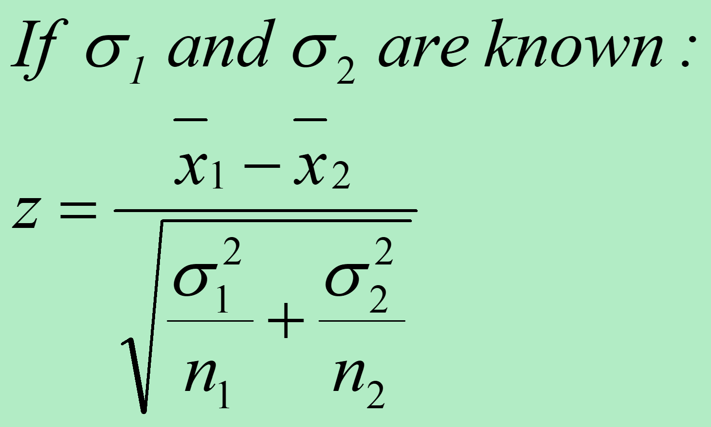
]

</div>

---

# Comparing Two Population Means: Known Population Variances - Example

The Fast Lane procedure was recently installed at a local food market. The store manager wants to know whether the mean checkout time using the standard method is longer than with the Fast Lane procedure.

Checkout time is measured from when a customer enters the line until bags are in the cart, so it includes both waiting and checkout. Use $\alpha = 0.01$.

<div>
.center[
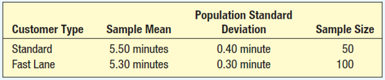
]
.tiny[Source: Douglas Lind, William Marchal, Samuel Wathen, Statistical Techniques in Business and Economics, 16th ed. (LMW)]
</div>

---

# Comparing Two Population Means: Known Population Variances - Example

Applying the six-step hypothesis testing procedure:

Step 1: State the null and alternative hypotheses (keyword: "longer than").

$H_0: \mu_S = \mu_F$  
$H_1: \mu_S > \mu_F$

Step 2: Select the significance level.

The problem specifies $\alpha = 0.01$.

Step 3: Determine the appropriate test statistic.

Because both population standard deviations are known, use a z-test.

---

# Comparing Two Population Means: Known Population Variances - Example

.pull-left[
Step 4: Formulate a decision rule.

Reject $H_0$ if $z > z_\alpha$.  
With $\alpha = 0.01$ (right-tailed), reject if $z > 2.326$.
]

.pull-right[
<div>
.center[
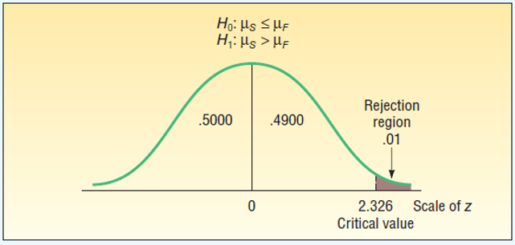
]
.tiny[Source: Douglas Lind, William Marchal, Samuel Wathen, Statistical Techniques in Business and Economics, 16th ed. (LMW)]
</div>
]

---

# Comparing Two Population Means: Known Population Variances - Example

Step 5: Take a sample and make a decision.

.pull-left[
<div>
.center[
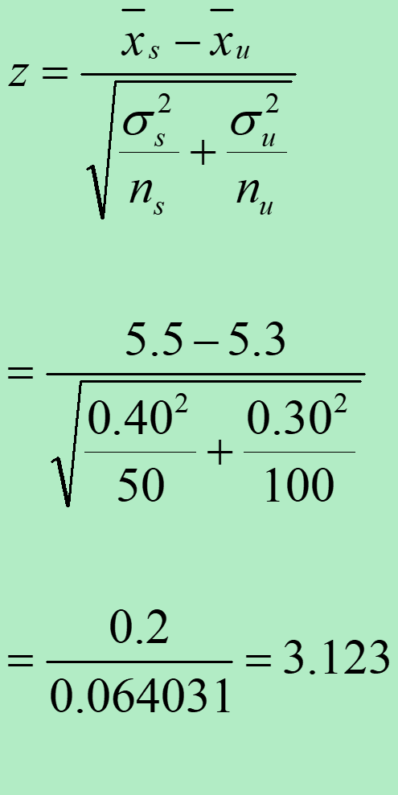
]
</div>
]

.pull-right[
<div>
.center[
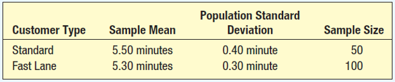
]
.tiny[Source: Douglas Lind, William Marchal, Samuel Wathen, Statistical Techniques in Business and Economics, 16th ed. (LMW)]
</div>
]

*The computed value of 3.123 is larger than the critical value of 2.326. Our decision is to reject the null hypothesis.*


Step 6: Interpret the result.

The observed difference of 0.20 minutes in mean checkout time is too large to be attributed to random chance. We conclude that the Fast Lane method is faster.
---

# Comparing Population Means: Equal, Unknown Population Standard Deviations

Use the t distribution when population standard deviations are unknown. Required assumptions:

- Both populations are approximately normal.

- The population standard deviations are equal.

- The samples are independent.


---
# Comparing Population Means: Equal, Unknown Population Standard Deviations

.pull-left[
  Finding the test statistic requires two steps:

- Pool the sample standard deviations.

- Use the pooled standard deviation to compute the t statistic.

The test statistic $t$ follows a t distribution with $n_1 + n_2 - 2$ degrees of freedom.
]

.pull-right[
<div>
.center[
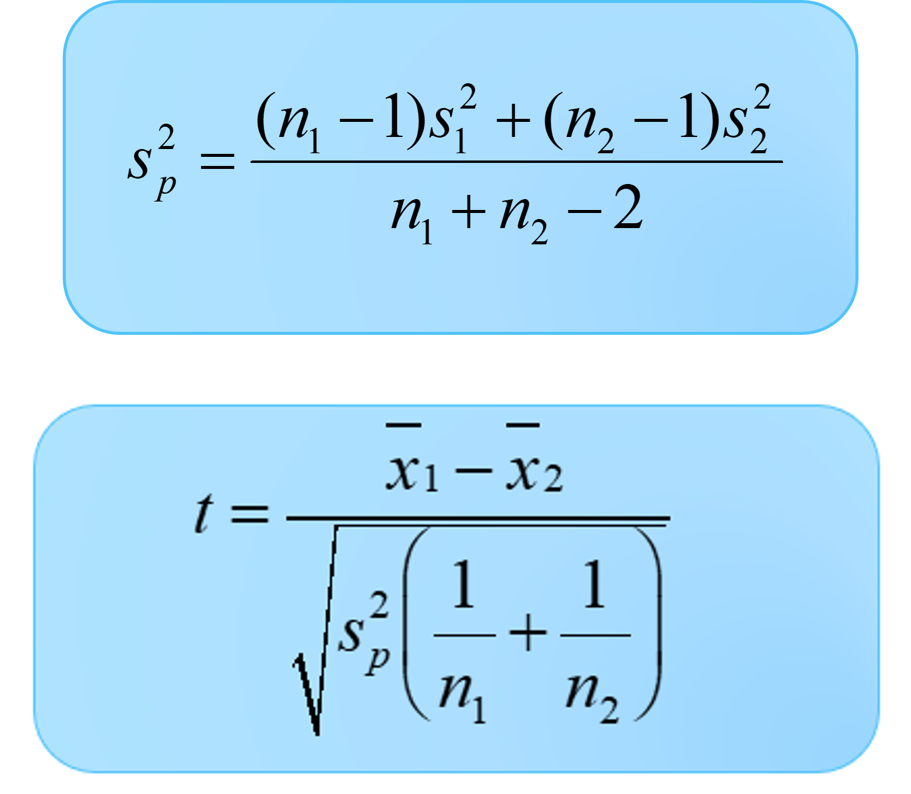
]
</div>
]


.tiny[Note: Pooled variance is a weighted average of two or more sample variances, used to create a single, more reliable estimate of a assumed common population variance.]

---
class: my-one-page-font
# Comparing Population Means: Equal, Unknown Standard Deviations - Example


.pull-left[
Owens Lawn Care, Inc. manufactures and assembles lawnmowers shipped across the United States and Canada. Two procedures were proposed for mounting the engine on the frame.

Method W was developed by longtime employee Herb Welles, and Method A was developed by Vice President of Engineering William Atkins.

To compare the methods, a time-and-motion study was conducted: 5 employees used Method W and 6 employees used Method A. The sample times (minutes) are shown on the right.

Research question: Is there a difference in mean mounting time? Use $\alpha = 0.10$ and assume equal population standard deviations.


]

.pull-right[
<div>
.center[
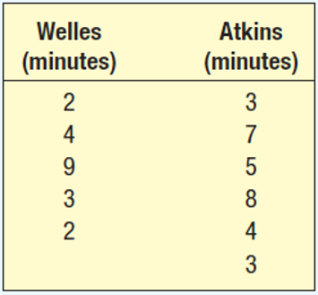
]
.tiny[Source: Douglas Lind, William Marchal, Samuel Wathen, Statistical Techniques in Business and Economics, 16th ed. (LMW)]

</div>
]

---

# Comparing Population Means: Equal, Unknown Standard Deviations - Example

Step 1: State the null and alternative hypotheses (keyword: "difference").

$H_0: \mu_W = \mu_A$  
$H_1: \mu_W \ne \mu_A$

Step 2: State the significance level.

The problem specifies $\alpha = 0.10$.

Step 3: Select the appropriate test statistic.

Population standard deviations are unknown but assumed equal, so use the pooled two-sample t-test.

---

# Comparing Population Means: Equal, Unknown Standard Deviations - Example

.pull-left[
Step 4: State the decision rule.

Reject $H_0$ if  
$t > t_{\alpha/2,\,n_W+n_A-2}$ or $t < -t_{\alpha/2,\,n_W+n_A-2}$.

Here, $\alpha/2 = 0.05$ and $df = n_W + n_A - 2 = 5 + 6 - 2 = 9$, so:

Reject $H_0$ if $t > 1.833$ or $t < -1.833$.

]

.pull-right[
<div>
.center[
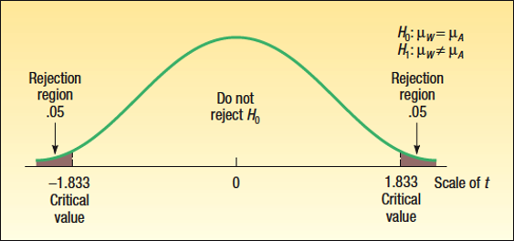
]
.tiny[Source: Douglas Lind, William Marchal, Samuel Wathen, Statistical Techniques in Business and Economics, 16th ed. (LMW)]

</div>
]

---
# Comparing Population Means: Equal, Unknown Standard Deviations - Example

.pull-left[
Step 5: Compute the test statistic and make a decision.

(a) Calculate the sample standard deviations.

(b) Calculate the pooled sample standard deviation.


]

.pull-right[
<div>
.center[
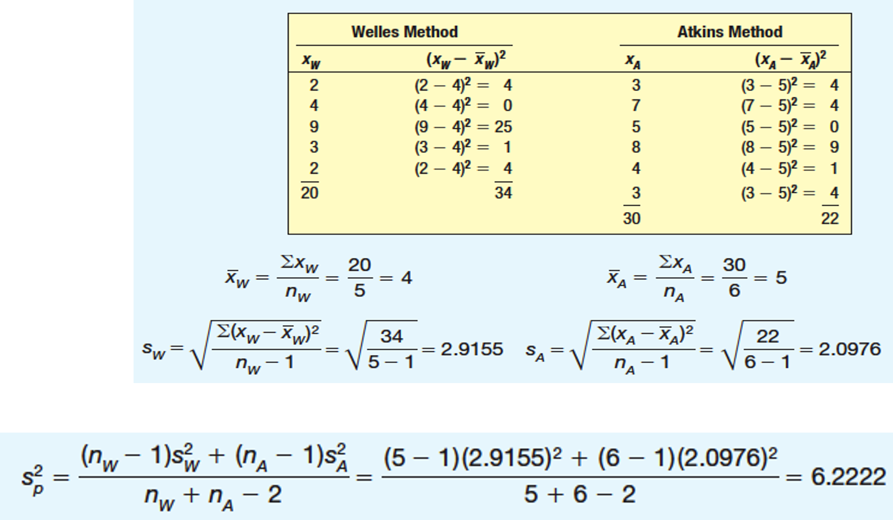
]
.tiny[Source: Douglas Lind, William Marchal, Samuel Wathen, Statistical Techniques in Business and Economics, 16th ed. (LMW)]

</div>
]


---

# Comparing Population Means: Equal, Unknown Standard Deviations - Example

.pull-left[
Step 5 (continued): Compute $t$ and decide.

(c) The observed test statistic is $t = -0.662$.

Since $-1.833 < -0.662 < 1.833$, we fail to reject $H_0$.

Step 6: Interpret the result.

At the 10% significance level, the data do not provide sufficient evidence of a difference in mean mounting time between the Welles and Atkins methods.


]

.pull-right[
<div>
.center[
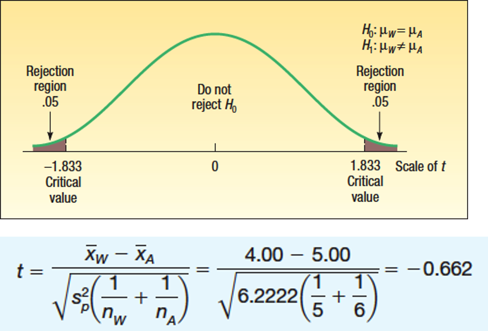
]
.tiny[Source: Douglas Lind, William Marchal, Samuel Wathen, Statistical Techniques in Business and Economics, 16th ed. (LMW)]

</div>
]

---

# Comparing Population Means with Unknown and Unequal Population Standard Deviations

.pull-left[
Use this two-sample t approach (Welch's test) when population standard deviations are unknown and cannot reasonably be assumed equal.

The degrees of freedom are adjusted downward using an approximation formula. Fewer degrees of freedom make the critical values more conservative, so stronger evidence is needed to reject $H_0$.


]

.pull-right[
<div>
.center[
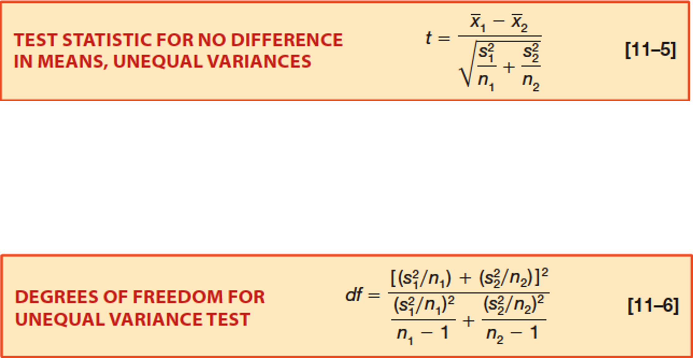
]
.tiny[Source: Douglas Lind, William Marchal, Samuel Wathen, Statistical Techniques in Business and Economics, 16th ed. (LMW)]

</div>
]

---
# Comparing Population Means with Unknown and Unequal Population Standard Deviations

Personnel in a consumer testing laboratory are evaluating paper towel absorbency. They compare store-brand towels with name-brand towels.

For each towel, they dip one ply into a tub of fluid, allow it to drain for two minutes, and then measure absorbed liquid (mL).

Store brand sample ($n_1 = 9$):
8, 8, 3, 1, 9, 7, 5, 5, 12

Name brand sample ($n_2 = 12$):
12, 11, 10, 6, 8, 9, 9, 10, 11, 9, 8, 10

Using $\alpha = 0.10$, test whether the mean absorbed amount differs between the two towel types.

---

# Comparing Population Means with Unknown and Unequal Population Standard Deviations

Step 1: State the null and alternative hypotheses.

$H_0: \mu_1 = \mu_2$  
$H_1: \mu_1 \ne \mu_2$

Step 2: State the significance level.

The problem specifies $\alpha = 0.10$.

Step 3: Select the appropriate test statistic.

Use a two-sample t-test with unequal variances (Welch's t-test).

---
# Comparing Population Means with Unknown and Unequal Population Standard Deviations

.pull-left[
Step 4: State the decision rule.

Reject $H_0$ if  
$t > t_{\alpha/2,\,df}$ or $t < -t_{\alpha/2,\,df}$.

Here, $\alpha/2 = 0.05$ and $df \approx 10$, so:

Reject $H_0$ if $t > 1.812$ or $t < -1.812$.


Step 5: Compute $t$ and make a decision.

The observed value, $t = -2.474$,  is less than the lower critical value $-1.812$. Therefore, reject $H_0$.

]

.pull-right[
<div>
.center[
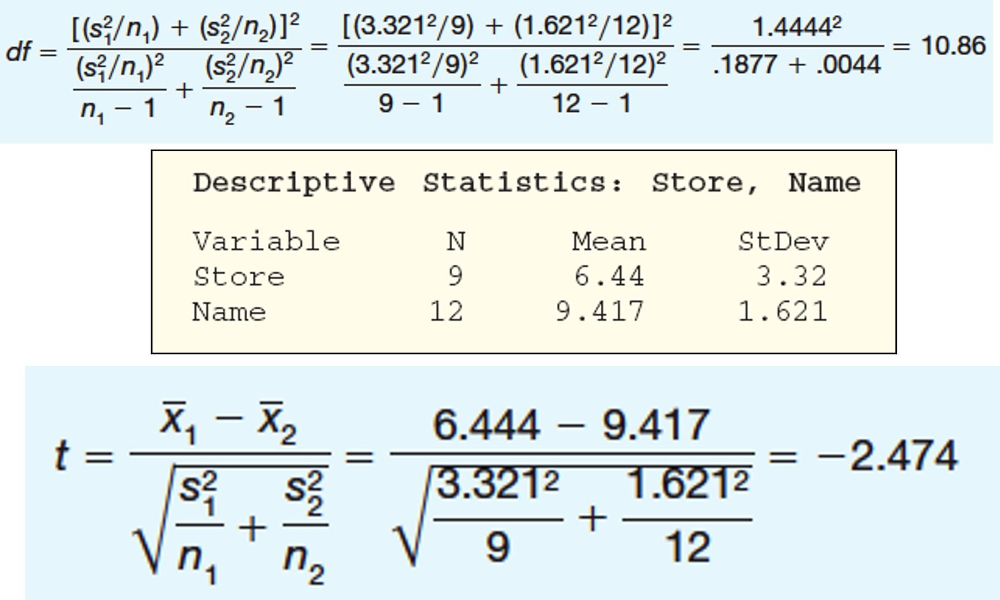
]
.tiny[Source: Douglas Lind, William Marchal, Samuel Wathen, Statistical Techniques in Business and Economics, 16th ed. (LMW)]

</div>
]

Step 6: Interpret the result.

At the 10% significance level, the data provide evidence that the mean absorption differs between store-brand and name-brand towels.


---

# Two-Sample Hypothesis Tests: Dependent (Paired) Samples
.pull-left[

Dependent samples are observations that are naturally paired or matched.

For example:

- If you want to buy a car, you might compare the price of the same model across two dealerships.

- To evaluate a diet program, you might record each person's weight before and after the program.
]

.pull-right[
<div>
.center[

]
.tiny[Source: Douglas Lind, William Marchal, Samuel Wathen, Statistical Techniques in Business and Economics, 16th ed. (LMW)]

</div>
]

---

# Hypothesis Testing Involving Dependent Samples

Use the paired t-test when samples are dependent:
$$
t = \frac{\bar{d} - \mu_{d0}}{s_d / \sqrt{n}}, \quad df = n - 1
$$
where:

- $\bar{d}$ is the mean of the pairwise differences,
- $s_d$ is the standard deviation of the pairwise differences,
- $n$ is the number of pairs, and
- $\mu_{d0}$ is the hypothesized mean difference (often 0).

This test statistic follows a t distribution with $n - 1$ degrees of freedom.

.tiny[Note: The paired t-test is essentially a one-sample t-test on the differences between paired observations. It accounts for the dependence between samples by analyzing the differences directly.]

---

# Hypothesis Testing Involving Dependent Samples - Example

.pull-left[
Nickel Savings and Loan wants to compare the two firms it uses to appraise residential home values.

The bank selected 10 homes and asked both firms to appraise each one. The paired results (in $000) are shown on the right.

At $\alpha = 0.05$, can we conclude that the mean appraised values differ between the two firms?

]

.pull-right[
<div>
.center[
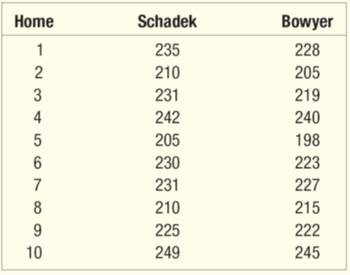
]
.tiny[Source: Douglas Lind, William Marchal, Samuel Wathen, Statistical Techniques in Business and Economics, 16th ed. (LMW)]

</div>
]

---
# Hypothesis Testing Involving Paired Observations - Example

Step 1: State the null and alternative hypotheses.

$H_0: \mu_d = 0$  
$H_1: \mu_d \ne 0$

Step 2: State the significance level.

The problem specifies $\alpha = 0.05$.

Step 3: Select the appropriate test statistic.

Use the paired t-test.

---
# Hypothesis Testing Involving Paired Observations - Example


.pull-left[
Step 4: State the decision rule.

Reject $H_0$ if  
$t > t_{\alpha/2,\,n-1}$ or $t < -t_{\alpha/2,\,n-1}$.

With $n = 10$, we have $df = 9$ and $\alpha/2 = 0.025$, so:

Reject $H_0$ if $t > 2.262$ or $t < -2.262$.


]

.pull-right[
<div>
.center[
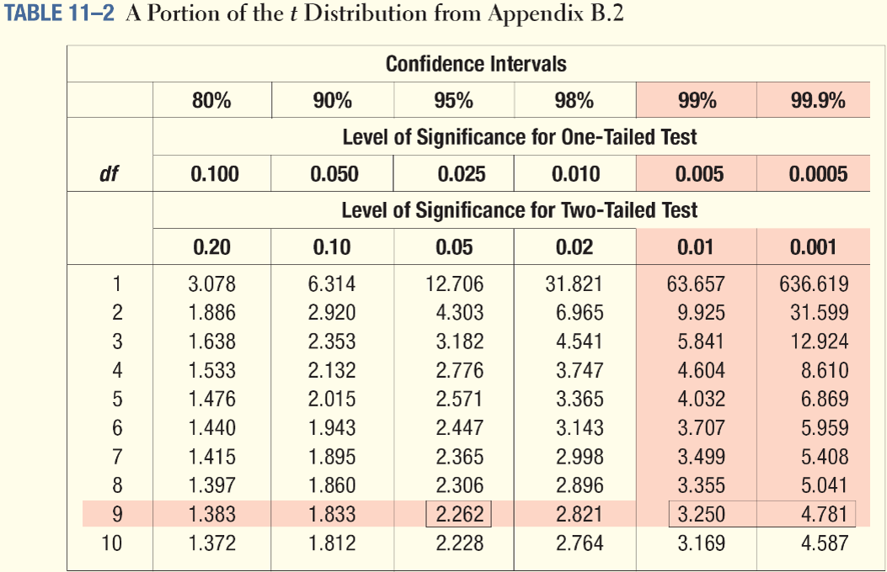
]
.tiny[Source: Douglas Lind, William Marchal, Samuel Wathen, Statistical Techniques in Business and Economics, 16th ed. (LMW)]

</div>
]

---

# Hypothesis Testing Involving Paired Observations - Example

.pull-left[
Step 5: Compute $t$ and make a decision.

The computed value of $t$ is greater than the upper critical value, so we reject $H_0$.

Step 6: Interpret the result.

At the 5% significance level, the data provide evidence of a difference in mean appraised home values between the two firms.

]

.pull-right[
<div>
.center[
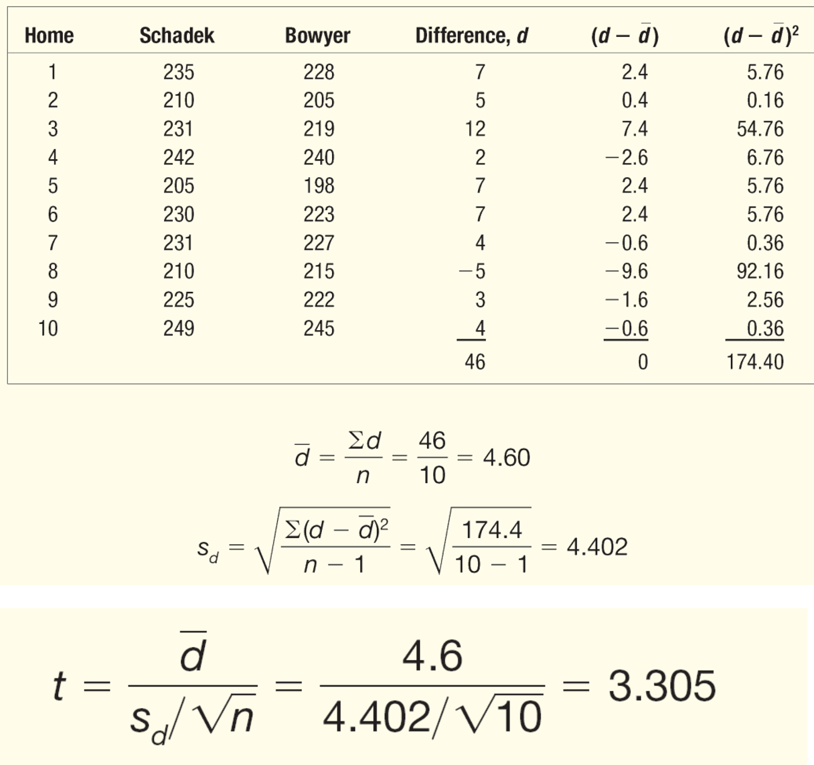
]
.tiny[Source: Douglas Lind, William Marchal, Samuel Wathen, Statistical Techniques in Business and Economics, 16th ed. (LMW)]

</div>
]

---

# When do we use Two-Sample Tests?

Use when:

* comparing two groups
* independent samples
* numeric variable

# More than Two Groups?

Example:

* Region A
* Region B
* Region C

We cannot do many t-tests

---
class: my-one-page-font

.pull-left[
# Solution: ANOVA

## Analysis of Variance

Tests:

* H0: all means equal

* H1: at least one is different

# ANOVA Example

```{python}
import numpy as np
from scipy import stats

group1 = np.random.normal(60,10,30)
group2 = np.random.normal(65,10,30)
group3 = np.random.normal(75,10,30)

f_stat, p_value = stats.f_oneway(group1, group2, group3)
print(f"F-statistic = {f_stat:.3f}")
print(f"p-value = {p_value:.3e}")
```

Here:

- `f_stat` measures how large the between-group variation is relative to the within-group variation.
- `p_value` tells us how likely it is to observe a result this extreme if all group means are actually equal.

If the p-value is small, we reject $H_0$ and conclude that at least one group mean differs.
]
.pull-right[

# Interpretation

* p-value < 0.05 → at least one group differs
* p-value ≥ 0.05 → no evidence of difference

We conclude that there is a statistically significant difference in means across the groups, but we do not know which specific groups differ from each other.

# Important Warning

ANOVA tells us: difference exists

But NOT: which groups differ
]

---

# Summary

* One sample → Week 9

* Two samples → compare means

* Many groups → ANOVA

# Final Idea

## From data → comparison → decision

---
class: inverse, center, middle
# Individual Assignment

---

# Individual Assignment

## Comparing Two Groups

### Task Context

A company wants to test:

> Do customers in **Asia** spend more than customers in **Europe**?

You are given the following sample data:
.pull-left[
- Asia:
  - mean = 72 USD  
  - standard deviation = 14  
  - sample size = 40  

- Europe:
  - mean = 65 USD  
  - standard deviation = 12  
  - sample size = 35  
]
.pull-right[
### Instructions

Work individually. Show all steps.

]
---

# Part 1. Hypothesis Setup

Define the hypotheses:

- $H_0$:  
- $H_1$:  

State clearly:
- type of test (one-sided or two-sided)
- what exactly is being tested

---

# Part 2. Test Statistic

Compute the test statistic:

Use:

$$
t = \frac{\bar{x}_1 - \bar{x}_2}{\sqrt{\frac{s_1^2}{n_1} + \frac{s_2^2}{n_2}}}
$$

Steps:
1. Compute standard error  
2. Compute the $t$-statistic  

---
# Part 3. Decision Rule

Use:

- significance level $\alpha = 0.05$  
- critical value $\approx 2$ (approximation allowed)

Question:

- Do you reject $H_0$ or not?

---

# Part 4. Interpretation

Write 2–3 sentences:

- What does the result mean?  
- Do customers in Asia spend more?  
- Is the difference statistically meaningful?

> Bonus: Construct a 95% confidence interval for the difference in means.

---


# Next

*(May 7)* Nominal-level hypothesis tests (LMW Chapter 15) 

*(May 12 | May 14)* Analysis of variance (ANOVA) (LMW Chapter 12) 

---

class: inverse, center, middle

# Any questions?

# Thank you for your attention and active participation!


???
1. To print pdf slides
https://stackoverflow.com/questions/54968311/xaringan-export-slides-to-pdf-while-preserving-formatting

pagedown::chrome_print("W1_ME.html") # but not all pictures are visible

2. Option: https://stackoverflow.com/questions/54968311/xaringan-export-slides-to-pdf-while-preserving-formatting

install.packages("remotes")
remotes::install_github("jhelvy/xaringanBuilder")
remotes::install_github("jhelvy/renderthis@v0.0.9")

library(xaringanBuilder)
build_pdf("DVC.html")

3. Option
writeBin(as.raw(c()), "favicon.ico") # create an empty favicon.ico file
install.packages("renderthis")
remotes::install_github('rstudio/chromote')
library(renderthis)

renderthis::to_pdf("W-10_SIC.html")

getwd()
setwd("C:\\Users\\vyshn\\OneDrive - kdis.ac.kr\\Documents\\GitHub\\Sogang\\2026\\Spring\\Statistics for International Commerce\\Week_10")


