<style>
@media print{
  body, html, .remark-slides-area, .remark-notes-area {
    height: 100% !important;
    width: 100% !important;
    overflow: visible;
    display: inline-block;
    }
}
</style>

<style type="text/css">
.remark-slide-content {
    font-size: 34px;
    padding: 1em 4em 1em 4em;
}
</style>

<style type="text/css">
.my-one-page-font {
  font-size: 28px;
}
</style>

<style type="text/css">
.my-one-page-font-table {
  font-size: 24px;
}
</style>

<style>
.tiny { font-size: 60%; }      /* class you can reuse anywhere */
</style>

<style>
.remark-slide-content {
  position: relative;
  z-index: 1;
}

.remark-slide-content::before {
  content: "";
  position: absolute;
  top: 50%;
  left: 50%;
  width: 600px;          /* adjust size */
  height: 600px;
  background-image: url("1. 교장(Seal_Positive).png");  /* place logo file in same folder */
  background-repeat: no-repeat;
  background-position: center;
  background-size: contain;
  opacity: 0.05;         /* watermark transparency */
  transform: translate(-50%, -50%);
  pointer-events: none;
  z-index: 0;
}
</style>


```{r setup, include = FALSE}
library(tidyverse)
library(knitr)
library(reticulate)
# Install packages once manually if needed; avoid installing during lecture rendering.
# py_install(c("pandas", "matplotlib", "scipy"), pip = TRUE)

opts_chunk$set(fig.width = 10, 
               message = FALSE, 
               warning = FALSE,
               echo = FALSE)
```

```{r xaringan-themer, include=FALSE, warning=FALSE}
#install.packages("xaringanthemer")
library(xaringanthemer)
style_mono_accent(
  base_color = "#851a10",
  header_font_google = google_font("Josefin Sans"),
  text_font_google   = google_font("Montserrat", "500", "550i"),
  code_font_google   = google_font("Fira Mono"),
  colors = c(
  red = "#f34213",
  purple = "#3e2f5b",
  orange = "#ff8811",
  green = "#136f63",
  white = "#FFFFFF"
)
)
```

# Dear class, great to see you all in class!


---

class: inverse, center, middle

# Group Project

Just to remind you.

---

# Course Project

## Data-Driven Business Decision

- **Weight**: 10% of final grade  
- **Format**: Team project (2 students)  
- **Tool**: Python (Google Colab / Jupyter)

## Objective

You act as **data analysts**.

Your goal:

- analyze real-style business data  
- apply statistical methods from class  
- make a **clear business recommendation**

---

## What you will do

1. Understand the dataset  
2. Compute descriptive statistics  
3. Create visualizations  
4. Build a confidence interval or hypothesis test  
5. Analyze relationships (correlation / regression)  
6. Provide a **business conclusion**

---
# Groups

- **Group 1**: Eric and Sohee

- **Group 2**: Quynh and Hongbin

- **Group 3**: Seoncheol and Che  

- **Group 4**: Soeun and Yumin  

- **Group 5**: Jihye and Jun  

---

# Important Dates

**Week 15**
- **Submission due**: June 10, 9:00 pm  
- **Presentation**: June 11, 1:30 pm  

# Submission

Each group submits:

- Python notebook (.ipynb)  
- 5–7 slides  
- Short business conclusion  

---

# What matters most

## This is NOT just coding

You are graded on:

- correct use of statistics  
- clear explanation  
- interpretation of results  
- **business decision**

## Final Goal

Answer this question:

### "What should the company do based on the data?"

---

# Key advice

- Keep it simple  

- Be clear  

- Explain your logic  

- Think like an analyst  

---

class: inverse, center, middle

# Nominal-level hypothesis tests (LMW Chapter 15 in 17th edition)

---

# Agenda

* One population proportion test

* Two-population proportion test

* Chi-square goodness-of-fit (equal expected frequencies)

* Chi-square goodness-of-fit (unequal expected frequencies)

* Chi-square goodness-of-fit (normal expected distribution)

* Chi-square test of independence (contingency tables)

---

# Learning Objectives

After this lecture, you should be able to:

* test hypotheses about population proportions

* compare two population proportions

* conduct chi-square goodness-of-fit tests

* understand limitations of chi-square tests

* test for independence in contingency tables

---

# Motivation

A company asks:

> “Do customers in different regions prefer different payment methods?”

The variables are:

* categorical
* frequency-based

This requires:

## Nominal-level hypothesis testing

---

# Reminder: Nominal Data

Nominal variables:

* categories (e.g., payment method, country)

* labels (e.g., "Card", "Mobile", "Cash")

* no natural order (e.g., "Asia" vs "Europe")

Examples:

* Customer device type (mobile, desktop, tablet)

* Preferred product category (electronics, fashion, home)

* Payment method (card, mobile, cash)


---

# Testing a Population Proportion

For nominal data, inference is based on counts and proportions.

Notation:

* $x$: number of "successes" (observations with the trait)
* $n$: sample size
* $\hat{p} = x/n$: sample proportion
* $\pi$ (or $p_0$): hypothesized population proportion

Interpretation: a proportion is the fraction (or percent) of observations in a category of interest.

---
# Testing a Population Proportion: Assumptions

We use the one-proportion z-test when these conditions hold:

* random sample
* two outcomes per observation (success/failure)
* constant success probability across observations
* independent observations
* normal approximation is valid: $n\pi \ge 5$ and $n(1-\pi) \ge 5$

If these are satisfied, the binomial distribution can be approximated by the normal distribution.

---

# Testing a Population Proportion - Example

Prior elections suggest a candidate must receive at least 80% of votes in the northern region to win statewide.

The incumbent surveys 2,000 registered voters from that region to assess reelection chances.

Use a hypothesis test to evaluate whether support is below 80%.

---

# Testing a Population Proportion - Example

Step 1: State hypotheses (keyword: "at least").

$$
H_0: \pi \ge 0.80 \qquad H_1: \pi < 0.80
$$

Step 2: Choose significance level.

$$
\alpha = 0.05
$$

Step 3: Choose test statistic.

Use the one-proportion z-test because $n\pi$ and $n(1-\pi)$ are both at least 5.


---
# Testing a Population Proportion - Example

Test statistic:

$$
z = \frac{\hat{p} - \pi_0}{\sqrt{\frac{\pi_0(1-\pi_0)}{n}}}
$$

With data: $n=2000$, $x=1550$, so $\hat{p}=1550/2000=0.775$ and $\pi_0=0.80$.

---
class: my-one-page-font
# Testing a Population Proportion - Example

.pull-left[
Step 4: Formulate the decision rule.

This is a left-tailed test, so:

Reject $H_0$ if $z < -z_{\alpha}$

At $\alpha=0.05$: reject $H_0$ if $z < -1.645$


Step 5: Take a sample, do the analysis, make a decision.


$$
z = \frac{0.775 - 0.80}{\sqrt{\frac{0.80(1-0.80)}{2000}}} = -2.80
$$

Since $-2.80 < -1.645$, reject $H_0$ at the 0.05 level.

]

.pull-right[
<div>
.center[
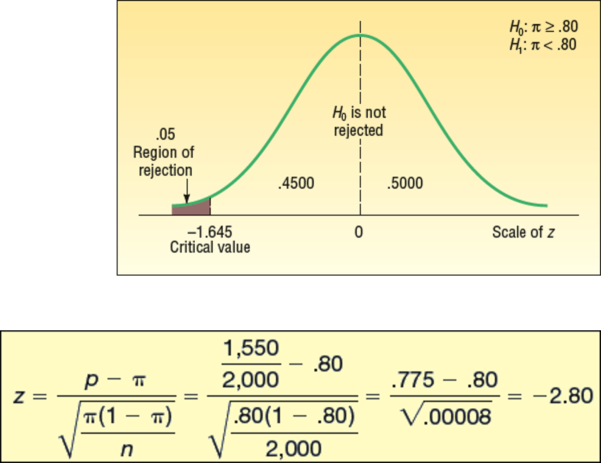
]

</div>
]

Step 6: Interpret results.

The observed support rate (77.5%) is significantly below 80%.
At this stage, the evidence does not support the claim that the incumbent is likely to be reelected.


---

# Two-Sample Tests of Proportions

Examples:

* Is the proportion of employees with more than 5 absences different between the Atlanta and Houston plants?

* Is the proportion who like a new car design different for buyers under 30 versus over 60?

* Is the proportion fearful of flying different for men versus women?
---
# Two-Sample Tests of Proportions

To test a difference between two population proportions, use the two-proportion z-test.

Test statistic:
	
<div>
.center[
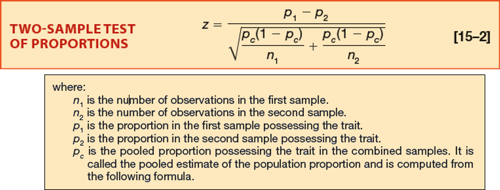
]

</div>
Here, $p_c$ is the pooled estimate of the common population proportion under $H_0$.

.tiny[Pooled means we assume the two population proportions are equal under $H_0$, so we combine the data to get a single estimate of the common proportion.]
---

# Two-Sample Tests of Proportions


Pooling (estimating a common population proportion under $H_0$):

<div>
.center[
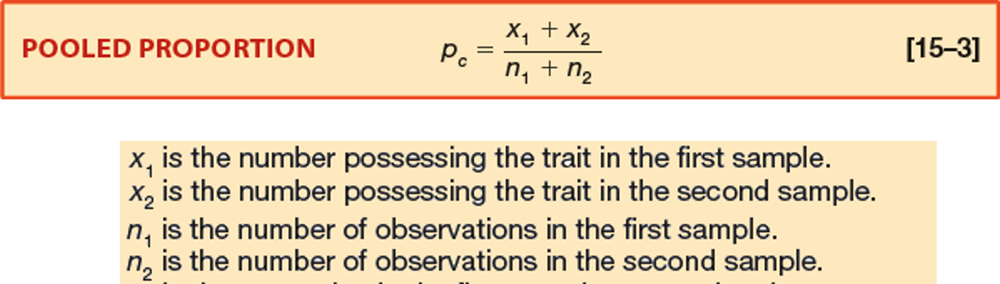
]

</div>

---

# Two-Sample Tests of Proportions - Example

Manelli Perfume developed a fragrance called Heavenly.

The company wants to know whether the purchase proportion differs between younger and older women.

Independent samples are collected from both groups after each participant smells Heavenly.

---
# Two-Sample Tests of Proportions - Example

Step 1: State hypotheses (keyword: "difference").

$$
H_0: \pi_1 = \pi_2 \qquad H_1: \pi_1 \ne \pi_2
$$

Step 2: Select significance level.

$$
\alpha = 0.05
$$

Step 3: Select test statistic.

Use the two-proportion z-test (large independent samples).

---

# Two-Sample Tests of Proportions - Example

Step 4: Formulate decision rule.

For a two-tailed test:

Reject $H_0$ if $z > z_{\alpha/2}$ or $z < -z_{\alpha/2}$

At $\alpha=0.05$: reject if $z > 1.96$ or $z < -1.96$

<div>
.center[
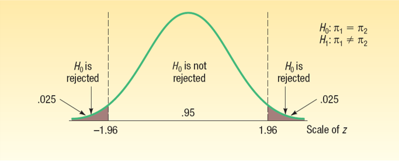
]

</div>

---
class: my-one-page-font
# Two-Sample Tests of Proportions - Example

Step 5: Use sample data and decide.

Let $\hat{p}_1$ be the sample proportion for younger women and $\hat{p}_2$ for older women.

<div>
.center[
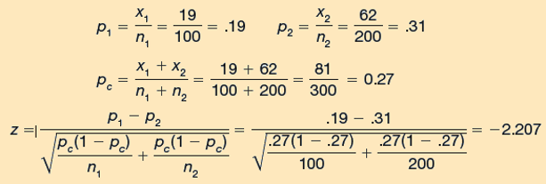
]

</div>

The computed value is $z=-2.207$, which falls in the rejection region.
Therefore, reject $H_0$ at the 0.05 significance level.

Step 6: Interpret the result.

The purchase proportions differ between younger and older women.
Based on sample proportions, older women appear more likely to prefer Heavenly.
---

# Comparing observed and expected frequency distributions

Hypotheses for a goodness-of-fit test:

* $H_0$: observed frequencies match expected frequencies
* $H_1$: observed frequencies do not match expected frequencies


In plain language, we want to see if the observed frequencies (like the number of customers in each category) differ from what we would expect by chance alone.
---

# Comparing observed and expected frequency distributions

The chi-square statistic is used to compare observed and expected frequency distributions.

.pull-left[
 Major characteristics of the chi-square distribution:

 * positively skewed
 * non-negative ($\chi^2 \ge 0$)
 * shape depends on degrees of freedom
]

.pull-right[
<div>
.center[
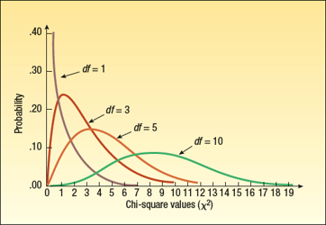
]

</div>
]

---

# Comparing observed and expected frequency distributions:   The Goodness-of-Fit Test

Let $f_o$ and $f_e$ be observed and expected frequencies for each category.
Let $k$ be the number of categories.

Test statistic:


$$
\chi^2 = \sum \frac{(f_o - f_e)^2}{f_e}
$$

Compute the term for each category, then sum across all categories.

---

# Comparing observed and expected frequency distributions: The Goodness-of-Fit Test - Example

Bubba's Fish and Pasta surveys 120 adults about preferred entree.

Question: Is there evidence of different preferences across four entree categories?

If there is no preference, expected frequencies are equal:

$$
120/4 = 30
$$

Under $H_0$, this means each entree has expected frequency 30.

The observed sample frequencies are shown below:

<div>
.center[
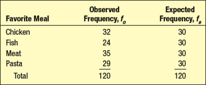
]

</div>

---

# Comparing observed and expected frequency distributions: The Goodness-of-Fit Test - Example


Step 1: State hypotheses.

* $H_0$: observed frequencies match expected frequencies
* $H_1$: observed frequencies do not match expected frequencies

Step 2: Select significance level.

$$
\alpha = 0.05
$$

Step 3: Select test statistic.

Use the chi-square goodness-of-fit statistic, $\chi^2$.

---

# Comparing observed and expected frequency distributions: The Goodness-of-Fit Test - Example
.pull-left[
Step 4: Formulate the decision rule.
The critical value comes from the chi-square distribution with $(k-1)$ degrees of freedom.

Here, $k=4$, so:

$$
df = k-1 = 3
$$

At $\alpha=0.05$ and $df=3$, the critical value is $7.815$.

Reject $H_0$ if $\chi^2 > 7.815$.
]

.pull-right[
<div>
.center[
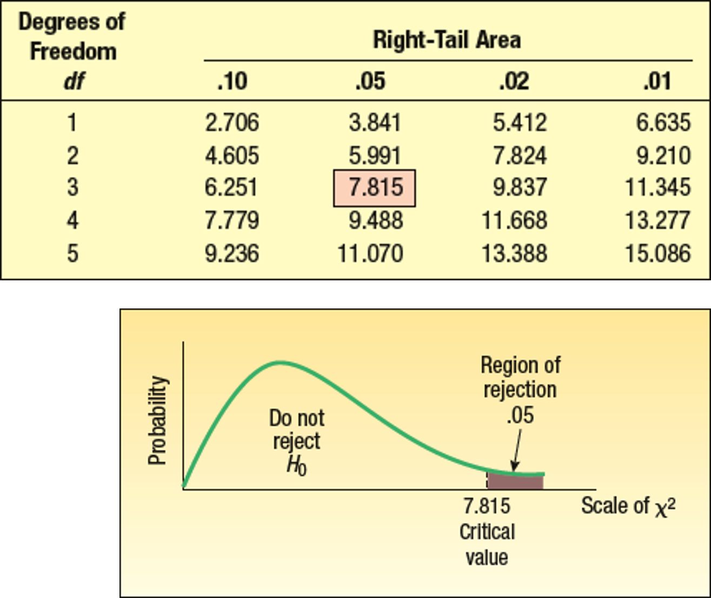
]

</div>
]

---

# Comparing observed and expected frequency distributions: The Goodness-of-Fit Test - Example

Step 5:  Select a sample, do the analysis, and make a decision.

<div>
.center[
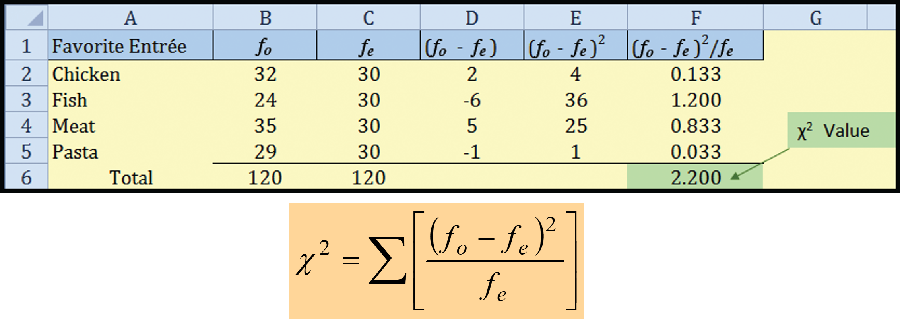
]

</div>

The computed value is $\chi^2=2.20$, which is less than $7.815$.
Therefore, fail to reject $H_0$ at the 0.05 significance level.

Step 6: Interpret the result.

The sample does not provide enough evidence of different entree preferences.
The observed differences from expected counts are consistent with random variation.
---

# Comparing observed and expected frequency distributions: The Goodness-of-Fit Test – Unequal Expected Frequencies Example

The goodness-of-fit procedure is the same even when expected frequencies are unequal.

Hypotheses:

* $H_0$: observed frequencies match expected frequencies
* $H_1$: observed frequencies do not match expected frequencies

---
# Comparing observed and expected frequency distributions: The Goodness-of-Fit Test – Unequal Expected Frequencies Example


The American Hospital Administrators Association (AHAA) reports these one-year admission rates for seniors:

* 40% not admitted
* 30% admitted once
* 20% admitted twice
* 10% admitted three or more times

A survey of 150 Bartow Estates residents found:

* 55 not admitted
* 50 admitted once
* 32 admitted twice
* remaining residents admitted three or more times

Question: Is the Bartow Estates distribution consistent with the AHAA distribution at $\alpha=0.05$?

---

# Comparing observed and expected frequency distributions: The Goodness-of-Fit Test – Unequal Expected Frequencies Example

Observed frequencies come from the survey of 150 Bartow Estates residents.

Expected frequencies come from the AHAA percentages applied to $n=150$:

* not admitted: $0.40 \times 150 = 60$
* admitted once: $0.30 \times 150 = 45$
* admitted twice: $0.20 \times 150 = 30$
* admitted three or more times: $0.10 \times 150 = 15$

<div>
.center[
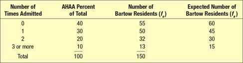
]

</div>

---
# Comparing observed and expected frequency distributions: The Goodness-of-Fit Test – Unequal Expected Frequencies Example


Step 1: State hypotheses.

* $H_0$: the Bartow observed frequencies match the AHAA expected frequencies
* $H_1$: the Bartow observed frequencies do not match the AHAA expected frequencies

Step 2: Select significance level.

$$
\alpha = 0.05
$$

Step 3: Select test statistic.

Use the chi-square goodness-of-fit statistic, $\chi^2$.

---

# Comparing observed and expected frequency distributions: The Goodness-of-Fit Test – Unequal Expected Frequencies Example

Step 4: Formulate the decision rule.
The critical value comes from the chi-square distribution with $(k-1)$ degrees of freedom.

Here, $k=4$, so $df=3$.

At $\alpha=0.05$ and $df=3$, the critical value is $7.815$.

Reject $H_0$ if $\chi^2 > 7.815$.

<div>
.center[
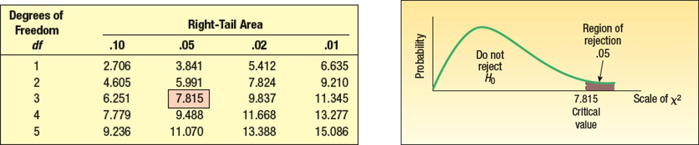
]

</div>

---
class: my-one-page-font
# Comparing observed and expected frequency distributions: The Goodness-of-Fit Test – Unequal Expected Frequencies Example

Step 5:  Select a sample, do the analysis, and make a decision.

<div>
.center[
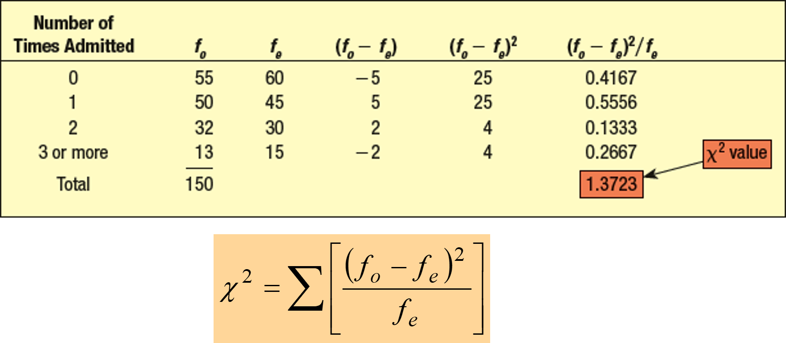
]

</div>

The computed value is $\chi^2=1.3723$, which is less than $7.815$.
Therefore, fail to reject $H_0$ at the 0.05 significance level.

Step 6: Interpret the result.

The Bartow Estates admission pattern is consistent with the AHAA distribution.
Any observed differences are small enough to be explained by random variation.
---
class: my-one-page-font
# Limitations of the Chi-square Goodness-of-Fit tests

Very small expected frequencies can distort the chi-square statistic because $f_e$ appears in the denominator.

Two common rules of thumb are:

1. If there are only two cells, the expected frequency in each cell should be at least 5.

2. If there are more than two cells, do not use chi-square when more than 20% of expected frequencies are below 5.

In the example below, 3 of 7 cells (43%) have expected frequencies below 5, so the test is not appropriate in its original form.

If it is logically reasonable, combine categories to increase expected frequencies. Here, combining the three vice-president categories satisfies the 20% rule.

<div>
.center[
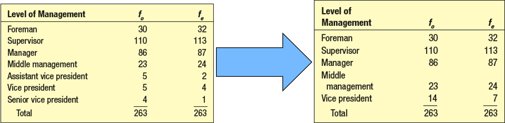
]

</div>

---


# Testing a hypothesis that an observed frequency distribution fits an expected frequency distribution that is normal.  

For a normal goodness-of-fit test, expected frequencies must come from a normal distribution.

Procedure:

* convert class limits to z-scores using the sample mean and sample standard deviation

* use z-table probabilities to obtain expected proportions by class

* multiply expected proportions by total sample size to get expected frequencies

---

# Testing a hypothesis that an observed frequency distribution fits an expected frequency distribution that is normal.  

Applewood's profit data for 180 vehicles are shown below.

<div>
.center[
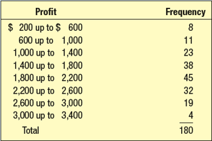
]

</div>

Question: Is the observed profit distribution consistent with a normal distribution?
---
# Testing a hypothesis that an observed frequency distribution fits an expected frequency distribution that is normal.  

Step 1: State hypotheses.

* $H_0$: observed frequencies match the expected normal frequencies
* $H_1$: observed frequencies do not match the expected normal frequencies

Step 2: Select significance level.

$$
\alpha = 0.05
$$

Step 3: Select test statistic.

Use the chi-square goodness-of-fit statistic, $\chi^2$.

---

# Testing a hypothesis that an observed frequency distribution fits an expected frequency distribution that is normal.  

Step 4: Formulate the decision rule.
When expected frequencies are estimated using sample $\mu$ and $\sigma$, the degrees of freedom are:

$$
df = k - 1 - 2 = k - 3
$$

With $k=8$, we get $df=5$.

At $\alpha=0.05$ and $df=5$, the critical value is $11.070$.

Reject $H_0$ if $\chi^2 > 11.070$.

<div>
.center[
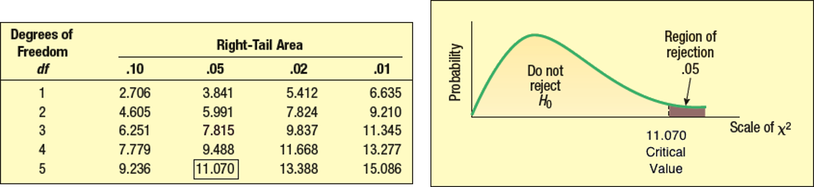
]

</div>

---

# Testing a hypothesis that an observed frequency distribution fits an expected frequency distribution that is normal.  

From the data, the sample mean is $1,843.17$ and the sample standard deviation is $643.63$.

Convert each class limit to a z-score using these values.

Then compute class probabilities from the z-table and convert them to expected frequencies.

<div>
.center[
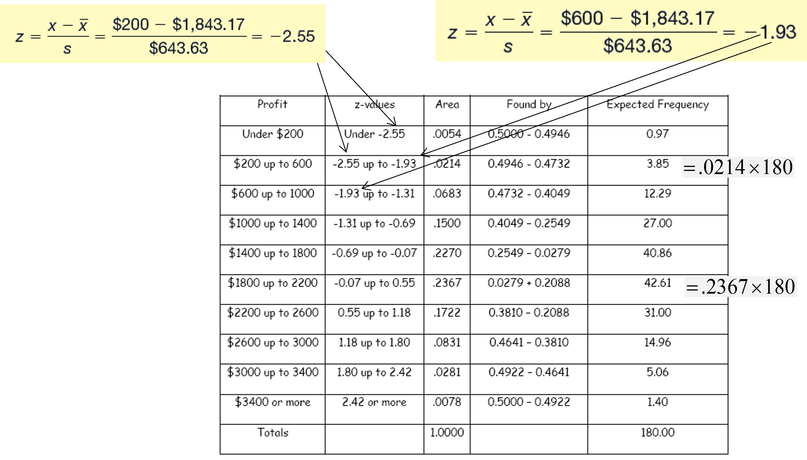
]

</div>

---
class: my-one-page-font
# Testing a hypothesis that an observed frequency distribution fits an expected frequency distribution that is normal.  

Step 5:  Select a sample, do the analysis, and make a decision.

<div>
.center[
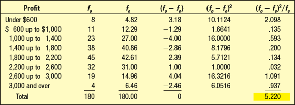
]

</div>

The computed value is $\chi^2=5.220$, which is less than $11.070$.
Therefore, fail to reject $H_0$ at the 0.05 significance level.

Step 6: Interpret the result.

There is no statistically significant difference between observed and expected normal frequencies.
The data are consistent with a normal distribution.
---


# Contingency Table Analysis

A contingency table reports observed frequencies for two categorical variables.

Each observation is classified by both variables, and we test whether the variables are related.

Example question: Is income level related to the decision to play the lottery?

The table below shows observed frequencies for two variables.

<div>
.center[
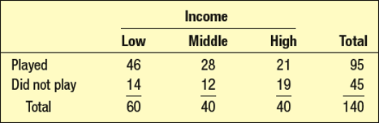
]

</div>

---

# Contingency Table Analysis - Example

Rainbow Chemical employs hourly and salaried workers.

A random sample of 380 employees was surveyed about satisfaction with the current health-care benefits program.

At $\alpha=0.05$, test whether pay type and satisfaction level are related.


<div>
.center[
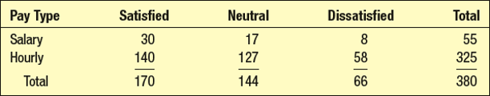
]

</div>

---

# Contingency Table Analysis - Example

Step 1: State hypotheses.

* $H_0$: pay type and satisfaction level are independent (no relationship)
* $H_1$: pay type and satisfaction level are dependent (a relationship exists)

Step 2: Select significance level.

$$
\alpha = 0.05
$$

Step 3: Select test statistic.

Use the chi-square test for independence:

$$
\chi^2 = \sum \frac{(f_o-f_e)^2}{f_e}
$$


---
class: my-one-page-font
# Contingency Table Analysis - Example

Step 4: Formulate the decision rule.
Degrees of freedom for a contingency table are:

$$
df=(r-1)(c-1)
$$

Here, $r=2$ rows and $c=3$ columns, so:

$$
df=(2-1)(3-1)=2
$$

At $\alpha=0.05$ and $df=2$, the critical value is $5.991$.

Reject $H_0$ if $\chi^2>5.991$.

<div>
.center[
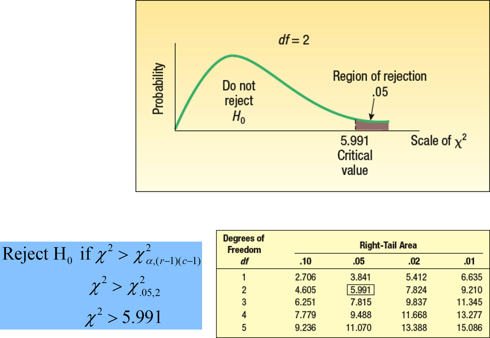
]

</div>

---

# Contingency Table Analysis: Computing Expected Frequencies (fe)

Expected frequencies are computed as:

$$
f_e = \frac{(\text{row total})(\text{column total})}{\text{grand total}}
$$

For example, the expected frequency for salaried personnel who are satisfied is:

<div>
.center[
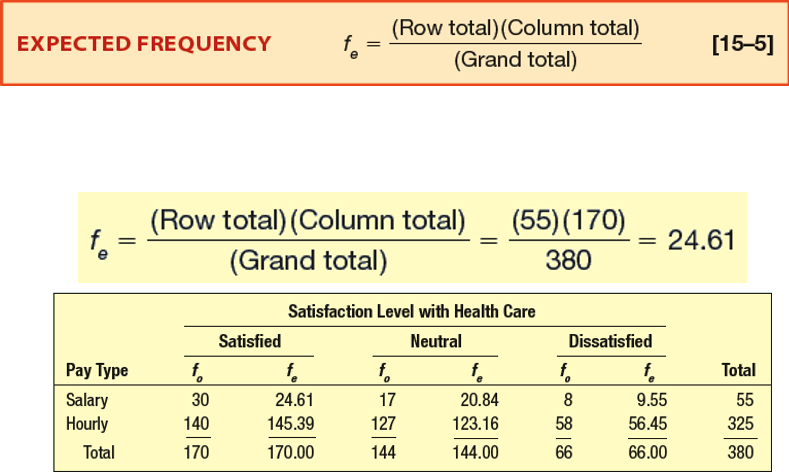
]

</div>

---
class: my-one-page-font
# Contingency Table Analysis - Example

Step 5:  Select a sample, do the analysis, and make a decision.

<div>
.center[
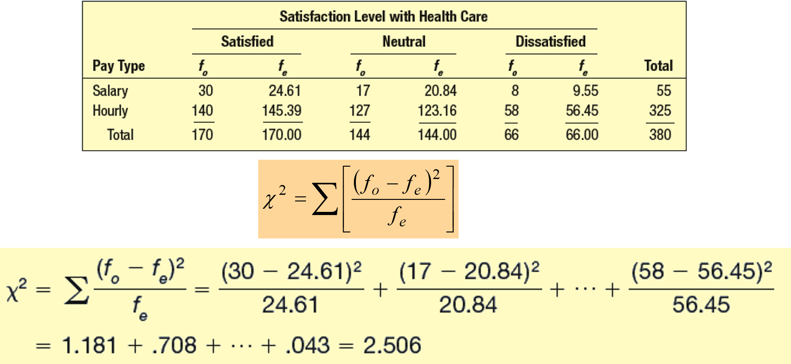
]

</div>

The computed value is $\chi^2=2.506$, which is less than $5.991$.
Therefore, fail to reject $H_0$ at the 0.05 significance level.

Step 6: Interpret the result.

The data do not provide enough evidence of a relationship between pay type and satisfaction with health-care benefits.

---

# Next week

*(May 12 | May 14)* Analysis of variance (ANOVA) (LMW Chapter 12) 

---

class: inverse, center, middle

# Any questions?

# Thank you for your attention and active participation!


???
1. To print pdf slides
https://stackoverflow.com/questions/54968311/xaringan-export-slides-to-pdf-while-preserving-formatting

pagedown::chrome_print("W1_ME.html") # but not all pictures are visible

2. Option: https://stackoverflow.com/questions/54968311/xaringan-export-slides-to-pdf-while-preserving-formatting

install.packages("remotes")
remotes::install_github("jhelvy/xaringanBuilder")
remotes::install_github("jhelvy/renderthis@v0.0.9")

library(xaringanBuilder)
build_pdf("DVC.html")

3. Option
writeBin(as.raw(c()), "favicon.ico") # create an empty favicon.ico file
install.packages("renderthis")
remotes::install_github('rstudio/chromote')
library(renderthis)

renderthis::to_pdf("W-10_2_SIC.html")

getwd()
setwd("C:\\Users\\vyshn\\OneDrive - kdis.ac.kr\\Documents\\GitHub\\Sogang\\2026\\Spring\\Statistics for International Commerce\\Week_10_2")


