<style>
@media print{
  body, html, .remark-slides-area, .remark-notes-area {
    height: 100% !important;
    width: 100% !important;
    overflow: visible;
    display: inline-block;
    }
}
</style>

<style type="text/css">
.remark-slide-content {
    font-size: 34px;
    padding: 1em 4em 1em 4em;
}
</style>

<style type="text/css">
.my-one-page-font {
  font-size: 28px;
}
</style>

<style type="text/css">
.my-one-page-font-table {
  font-size: 24px;
}
</style>

<style>
.tiny { font-size: 60%; }      /* class you can reuse anywhere */
</style>

<style>
.remark-slide-content {
  position: relative;
  z-index: 1;
}

.remark-slide-content::before {
  content: "";
  position: absolute;
  top: 50%;
  left: 50%;
  width: 600px;          /* adjust size */
  height: 600px;
  background-image: url("1. 교장(Seal_Positive).png");  /* place logo file in same folder */
  background-repeat: no-repeat;
  background-position: center;
  background-size: contain;
  opacity: 0.05;         /* watermark transparency */
  transform: translate(-50%, -50%);
  pointer-events: none;
  z-index: 0;
}
</style>


```{r setup, include = FALSE}
library(tidyverse)
library(knitr)
library(reticulate)
# Ensure Python chunks use the project virtual environment.
use_python("c:/Users/vyshn/OneDrive - kdis.ac.kr/Documents/GitHub/Sogang/.venv/Scripts/python.exe", required = TRUE)
# Install packages once manually if needed; avoid installing during lecture rendering.
# py_install(c("pandas", "matplotlib", "scipy"), pip = TRUE)

opts_chunk$set(fig.width = 10, 
               message = FALSE, 
               warning = FALSE,
               echo = FALSE)
```

```{r xaringan-themer, include=FALSE, warning=FALSE}
#install.packages("xaringanthemer")
library(xaringanthemer)
style_mono_accent(
  base_color = "#851a10",
  header_font_google = google_font("Josefin Sans"),
  text_font_google   = google_font("Montserrat", "500", "550i"),
  code_font_google   = google_font("Fira Mono"),
  colors = c(
  red = "#f34213",
  purple = "#3e2f5b",
  orange = "#ff8811",
  green = "#136f63",
  white = "#FFFFFF"
)
)
```

# Agenda

* why start with the F-distribution

* testing equality of two population variances

* transition: from variance testing to ANOVA

* one-way ANOVA (logic + implementation)

* business interpretation

---

# Learning Objectives

After this lecture, you should be able to:

* explain why ANOVA is needed

* conduct a one-way ANOVA

* interpret ANOVA output

* understand the F-statistic

* apply ANOVA in business settings

---

# Why We Start with Two-Variance Testing

ANOVA relies on the F-distribution, which is built from variance ratios.

So we begin with a two-variance F-test to build intuition.

This helps students see:

* what an F ratio measures
* how degrees of freedom affect the critical value
* how a variance-based test leads naturally to ANOVA

Then we extend that same F logic from comparing variances to comparing means.

---

# Testing the Hypothesis of Two Equal Population Variances: The F Distribution

The F distribution is named after Sir Ronald Fisher, one of the founders of modern statistics.

It is used to:

* test whether two population variances are equal

$$
\frac{s_1^2}{s_2^2} \sim F(n_1-1, n_2-1)
$$

* test whether several population means are equal (ANOVA)

*What is variance?* 
> It measures how far observations are spread around the mean.

*Why do we care about variances?* 
> Because they tell us about the consistency or variability of data, which is crucial for understanding differences between groups. 

---

# Characteristics of a F-Distribution

.pull-left[
* There is a family of F-distributions.

* An F statistic is always a ratio (numerator / denominator).

* A specific F-distribution is determined by two degrees of freedom:
  * numerator df
  * denominator df

* The F-distribution is continuous.

* F-values cannot be negative.

* The F-distribution is positively skewed.

* It is asymptotic: as $F \to \infty$, the curve approaches the x-axis but never touches it.

]

.pull-right[
<div>
.center[
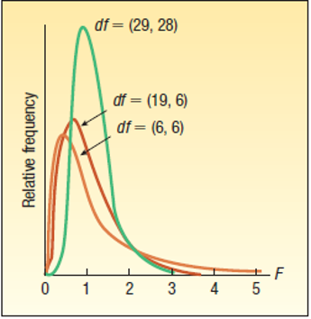
]

</div>
]

---

# Testing the Hypothesis of Two Equal Population Variances

The F-distribution tests whether the variance of one normal population equals the variance of another.

$$
H_0: \sigma_1^2 = \sigma_2^2
$$

$$
H_1: \sigma_1^2 \ne \sigma_2^2
$$

It tells us whether the variability in one group is significantly different from the variability in another group.

---

# Testing the Hypothesis of Two Equal Population Variances

Examples:

* Two shearing machines produce bars with the same target length. We test whether production variability is also the same.

* Two stock portfolios have similar average returns. We test whether return variability differs (for example, technology stocks vs utility stocks).

* Men and women may spend similar average time reading a newspaper, but one group may show much larger variation in reading time.

---
# Testing the Hypothesis of Two Equal Population Variances – Example

.pull-left[
Lammers Limos offers service from Toledo city hall to Metro Airport in Detroit.

The company president is comparing two routes: U.S. 25 and I-75.

He collected sample travel times (in minutes) for each route.

At $\alpha = 0.10$, test whether the travel-time variation differs between the two routes.
]

.pull-right[
<div>
.center[
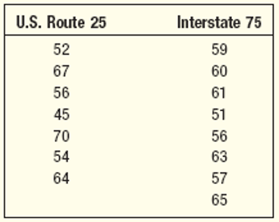
]

</div>
]

---
# Testing the Hypothesis of Two Equal Population Variances – Example

Compute the sample means and variances:
<div>
.center[
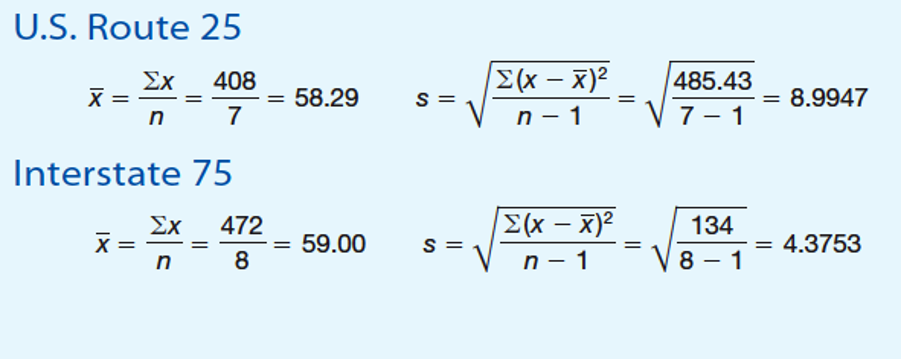
]

</div>

---
# Testing the Hypothesis of Two Equal Population Variances – Example

Step 1: State the hypotheses.

$$
H_0: \sigma_1^2 = \sigma_2^2
$$

$$
H_1: \sigma_1^2 \ne \sigma_2^2
$$

Step 2: Choose the significance level.

$$
\alpha = 0.10
$$

Step 3: Select the test statistic.

Use the ratio of sample variances, placing the larger variance in the numerator:

$$
F = \frac{s_1^2}{s_2^2} \sim F(n_1-1, n_2-1)
$$

---

# Testing the Hypothesis of Two Equal Population Variances – Example
.pull-left[
Step 4: State the decision rule.

For a two-tailed test of variances:

Reject $H_0$ if $F > F_{\alpha/2, v_1, v_2}$.

Substitute values:

$F > F_{0.10/2, 7-1, 8-1} = F_{0.05, 6, 7}$.
]				

.pull-right[
<div>
.center[
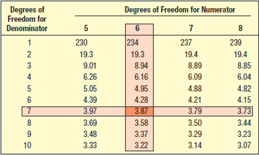
]

</div>

F critical values with alpha = 0.05

]

---
# Testing the Hypothesis of Two Equal Population Variances – Example

Step 5: Compute the value of F and make a decision.

<div>
.center[
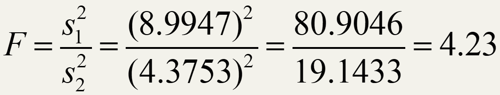
]

</div>

The decision is to reject the null hypothesis because the computed F-value ($4.23$) is larger than the critical value ($3.87$).

Step 6: Interpret the result.

The data indicate a difference in travel-time variation between the two routes.

---
# Testing the Hypothesis of Three or More Equal Population Means

The F-distribution is also used to test whether three or more population means are equal.

Assumptions:

* each population is approximately normal
* population standard deviations are equal
* samples are random and independent

---
# Testing the Hypothesis of Three or More Equal Population Means

The null hypothesis states all population means are equal.

The alternative states at least one mean differs.

The test statistic follows the F-distribution.

Hypothesis setup and decision rule:

$$
H_0: \mu_1 = \mu_2 = \cdots = \mu_k
$$

$$
H_1:\text{ not all means are equal}
$$

Reject $H_0$ if $F > F_{\alpha, k-1, n-k}$.

---
# Testing the Hypothesis of Three or More Equal Population Means – Example

.pull-left[
Four major carriers hired Brunner Marketing Research, Inc., to measure passenger satisfaction.

The survey covered ticketing, boarding, in-flight service, baggage handling, pilot communication, and related service items.

There were 25 questions, each scored as:

* excellent = 4
* good = 3
* fair = 2
* poor = 1

]

.pull-right[
<div>
.center[
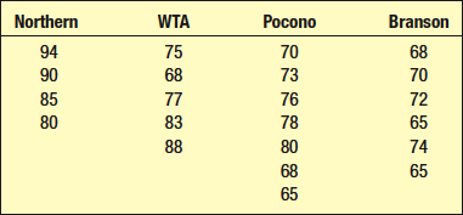
]

</div>

Question: Is mean satisfaction different across the four airlines?

Use alpha = 0.01.

]

Scores were summed to create an overall satisfaction score for each passenger.

Passengers were randomly sampled from all four airlines.

---
# Testing the Hypothesis of Three or More Equal Population Means – Example

Compute the treatment means and the grand mean:

<div>
.center[
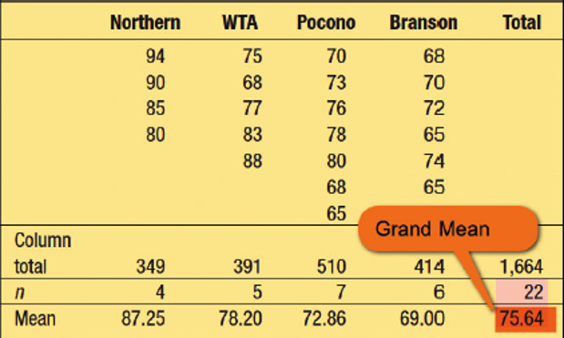
]

</div>

---
# Testing the Hypothesis of Three or More Equal Population Means – Example

Step 1: State the hypotheses.

$$
H_0: \mu_N = \mu_W = \mu_P = \mu_B
$$

$$
H_1: \text{not all means are equal}
$$

Step 2: Choose the significance level.

$$
\alpha = 0.01
$$

Step 3: Select the test statistic.

Because we compare more than two means, use the ANOVA F-statistic:

$$
F = \frac{MST}{MSE} = \frac{SST/(k-1)}{SSE/(n-k)} \sim F(k-1, n-k)
$$

.tiny[
Where: MST = mean square for treatments, MSE = mean square for error, SST = sum of squares for treatments, SSE = sum of squares for error, k = number of groups, n = total observations.
]
---
# Testing the Hypothesis of Three or More Equal Population Means – Example
Step 4: Formulate the decision rule.

For one-way ANOVA, reject $H_0$ if:

$$
F > F_{\alpha, k-1, n-k}
$$

Degrees of freedom:

* numerator (treatments): $k-1 = 4-1 = 3$
* denominator (error): $n-k = 22-4 = 18$
---
# Testing the Hypothesis of Three or More Equal Population Means – Example

.pull-left[
From the F-table at $\alpha = 0.01$:

$F_{0.01,3,18} = 5.09$.
]

.pull-right[
<div>
.center[
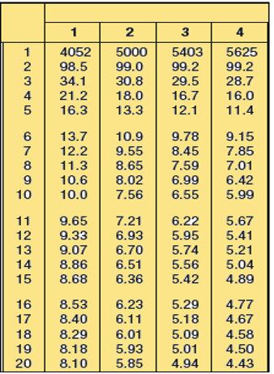
]
</div>
]

---
# Testing the Hypothesis of Three or More Equal Population Means – Example
Step 5: Compute the F value and make a decision.

Create the ANOVA table:


<div>
.center[
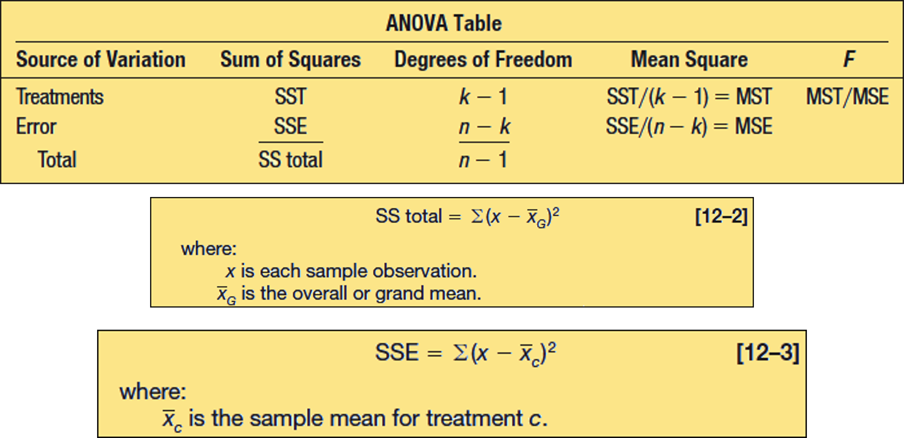
]
</div>

---
# Creating the ANOVA Table: Computing SS Total and SSE

.pull-left[
  Computing the total sum of squares:

<div>
.center[
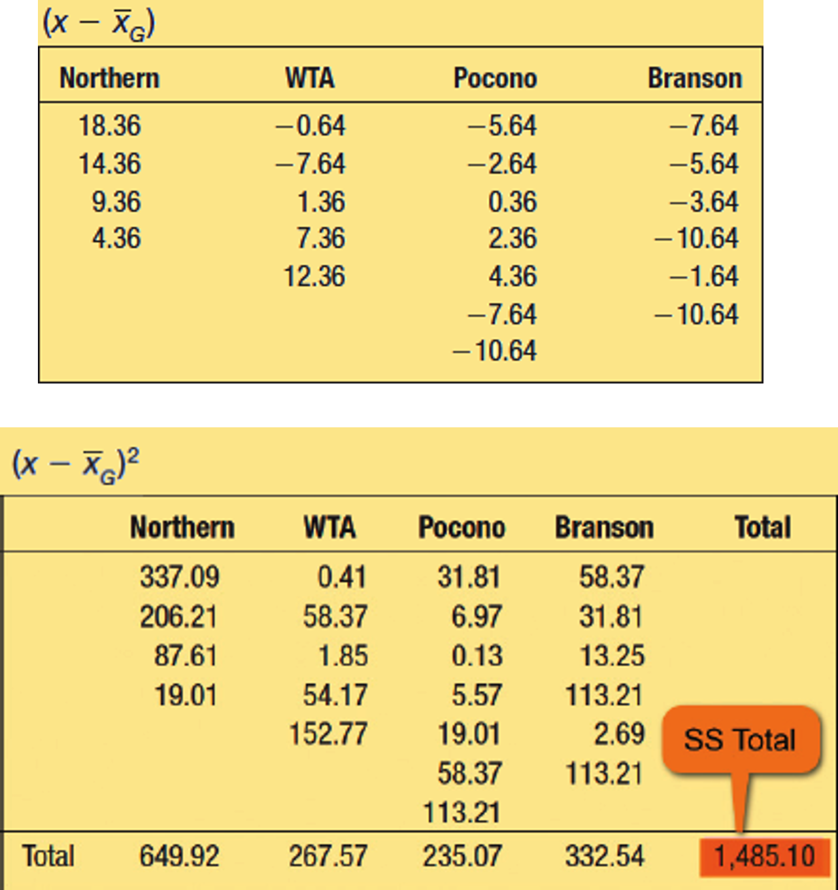
]
</div>
]


.pull-right[
  Computing the error sum of squares:

<div>
.center[
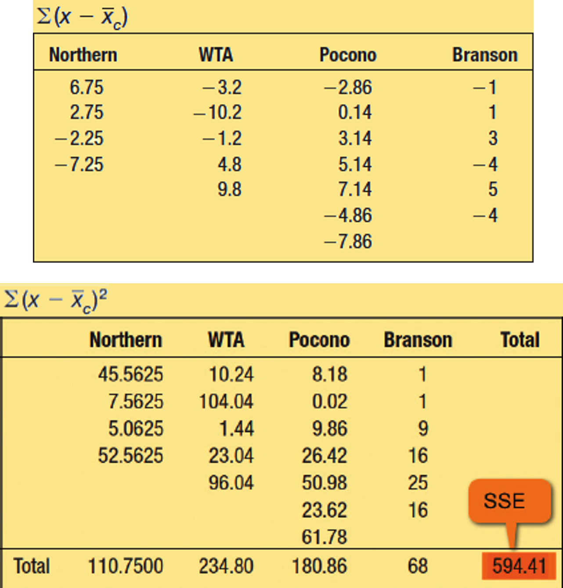
]
</div>
]

---
# Creating the ANOVA Table: Treatment Sum of Squares, SST, and the ANOVA Table

Step 5 (continued):

The computed value is $F = 8.99$.

Since $8.99 > 5.09$, reject $H_0$.

<div>
.center[
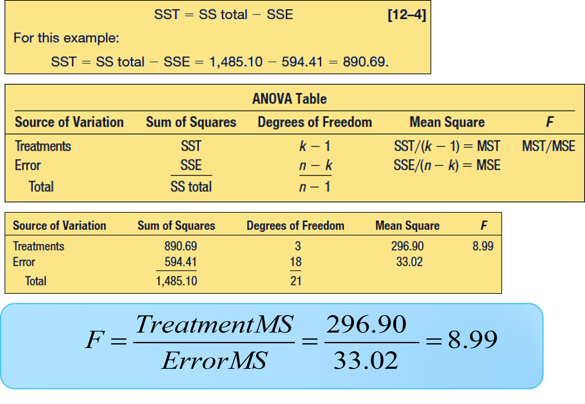
]
</div>

---
# Testing the Hypothesis of Three or More Equal Population Means – Example

Step 6: Interpret the result.

The population mean satisfaction scores are not all equal.

At least one airline differs from the others, but ANOVA alone does not identify which specific pair(s) differ.

---

# Transition: From F-Test to ANOVA

In the two-variance test, F compares one sample variance to another.

In ANOVA, F compares:

* variation between group means
* variation within groups

Same distribution family, different hypothesis target:

$$
H_0: \sigma_1^2 = \sigma_2^2 \quad \longrightarrow \quad H_0: \mu_1 = \mu_2 = \cdots = \mu_k
$$

Now we apply this framework to a one-way ANOVA workflow.
---

# ANOVA Framework

.pull-left[
ANOVA stands for Analysis of Variance. It is a statistical method used to analyze the differences between the means of two or more groups or treatments. It is often used to determine whether there are any statistically significant differences between the means of different groups.

]


.pull-right[

<div>
.center[
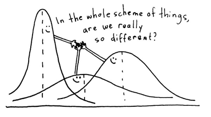
]
</div>
]

ANOVA compares the variation between group means to the variation within the groups. If the variation between group means is significantly larger than the variation within groups, it suggests a significant difference between the means of the groups.

ANOVA calculates an F-statistic by comparing between-group variability to within-group variability. If the F-statistic exceeds a critical value, it indicates significant differences between group means.


---

# Motivation

A company asks:

> Do customers from different regions spend different amounts?

We now compare:

* Asia
* Europe
* North America

---

# Problem

Could we use many t-tests?

Example:

* Asia vs Europe
* Asia vs North America
* Europe vs North America

Problem:

## too many tests increase Type I error

---

# Solution

## Analysis of Variance (ANOVA)

ANOVA compares:

* several population means
* using one overall test

### What is variance?

Variance measures how far observations are spread around the mean.

* higher variance: observations are more spread out
* lower variance: observations are closer to the mean

### Why is it called "analysis of variance"?
ANOVA analyzes the variance within and between groups to determine if group means differ significantly.

---

# Main Idea
.pull-left[
ANOVA compares:

* variation between groups
  vs
* variation within groups


# Intuition

If group means are very different:

* between-group variation becomes large

If observations inside groups are similar:

* within-group variation stays small

Then:

## evidence against H0 increases
]

.pull-right[

# Hypotheses

## One-Way ANOVA

* H0: all population means are equal
* H1: at least one mean differs
]
---

# Example Dataset

Monthly spending (USD):

* Asia
* Europe
* North America

```{python w5v8dp}
import numpy as np
import pandas as pd
import matplotlib.pyplot as plt
from scipy import stats

np.random.seed(42)

asia = np.random.normal(70, 10, 30)
europe = np.random.normal(65, 10, 30)
na = np.random.normal(80, 10, 30)

df = pd.DataFrame({
    "spending": np.concatenate([asia, europe, na]),
    "region": ["Asia"]*30 + ["Europe"]*30 + ["NorthAmerica"]*30
})

df.head()
```

---

# Visual Comparison

```{python n2z6wr, echo=FALSE}
plt.boxplot(
    [asia, europe, na],
    labels=["Asia","Europe","North America"]
)

plt.ylabel("Monthly Spending (USD)")
plt.title("Customer Spending by Region")
plt.show()
```

It shows some differences in central tendency and spread, but we need a formal test to determine if these differences are statistically significant.
---

# Group Means

```{python 6h8q2v}
df.groupby("region")["spending"].mean()
```

---

# ANOVA Test Statistic

## F-statistic

$$
F = \frac{\text{Variation Between Groups}}
{\text{Variation Within Groups}}
$$

---

# Interpretation of F

* Large F:

  * groups differ substantially

* Small F:

  * group means are similar

---

# Running ANOVA in Python

```{python f4m9ks, echo=TRUE}
# f_stat compares between-group variation to within-group variation.
# p_value is the probability of observing an F this large (or larger) if H0 is true.
f_stat, p_value = stats.f_oneway(
    asia,
    europe,
    na
)

print(f"F-statistic: {f_stat:.4f}")
print(f"p-value: {p_value:.6f}")
```

---

# Interpretation

Decision rule:

* p-value < 0.05 → reject H0
* otherwise → do not reject H0

How to read the output:

* F-statistic: larger values indicate stronger evidence that group means differ
* p-value: if very small, the observed differences are unlikely under equal means

---

# Business Interpretation

If spending differs by region:

* pricing strategy may differ
* marketing may be localized
* inventory allocation may change

---

# ANOVA Table

ANOVA separates variation into:

| Source         | Meaning                 |
| -------------- | ----------------------- |
| Between groups | differences among means |
| Within groups  | random variation        |

It quantifies how much of the total variation is due to differences between groups vs random variation within groups.

---

# Sum of Squares

Key concepts:

## SST

Total variation

## SSB

Between-group variation

## SSW

Within-group variation


# Relationship

$$
SST = SSB + SSW
$$

---

# Degrees of Freedom

For one-way ANOVA:

* df between = k - 1. Shows how many groups we have minus one (because we estimate one mean per group).
* df within = n - k. Shows how many observations we have minus the number of groups (because we lose one degree of freedom for each group mean estimated).

Where:

* k = number of groups
* n = total observations

---

# ANOVA Using statsmodels

```{python u9q5hx}
try:
  # ols() fits a linear model with region as a categorical predictor.
  # anova_lm(..., typ=2) returns the ANOVA table for that model.
  import statsmodels.api as sm
  from statsmodels.formula.api import ols

  model = ols(
    'spending ~ C(region)',
    data=df
  ).fit()

  anova_table = sm.stats.anova_lm(model, typ=2)
  print(anova_table)
except ModuleNotFoundError:
  print("statsmodels is not installed in the current Python environment.")
  print("Install it with: pip install statsmodels")
```

## Interpretation of This ANOVA Result

What this means:

* `df = 2` for `C(region)` means 3 groups were compared ($k-1 = 3-1 = 2$).
* `df = 87` for residual means there were 90 observations total ($n-k = 90-3 = 87$).
* `F = 24.24` is large, so between-group variation is much larger than within-group variation.
* `PR(>F) = 4.29e-09` is far below 0.05, so reject $H_0$.
* Conclusion: average spending is not the same across all regions; at least one region mean differs.
* `NaN` in the residual row for `F` and `PR(>F)` is normal because the residual row is the error baseline, not a separate hypothesis test.
---
## Reading the Output

Important columns:

* `sum_sq`: variation attributed to each source
* `df`: degrees of freedom for each source
* `F`: test statistic = explained variation / unexplained variation
* `PR(>F)`: p-value for the ANOVA F-test

How to interpret quickly:

* small p-value (typically < 0.05) => reject equal-means null
* large p-value => insufficient evidence that group means differ

Example:

* if `PR(>F) = 0.003`, then $0.003 < 0.05$, so reject $H_0$

---

# Important Warning

ANOVA only tells us:

> at least one mean differs

But NOT:

* which groups differ

---

# Post Hoc Tests

If ANOVA is significant:

* we may need additional comparisons

Examples:

* Tukey test
* pairwise t-tests

---

# Assumptions of ANOVA

1. Independent observations (i.e., random sampling)

2. Approximately normal groups (though ANOVA is robust to moderate violations)

3. Similar variances across groups (also known as homogeneity of variances)

---

# What if Assumptions Fail?

Possible issues:

* unreliable p-values
* misleading conclusions

Alternatives:

* nonparametric methods
* transformations

---

# Summary Table

| Method | Main Use         |
| ------ | ---------------- |
| t-test | compare 2 means  |
| ANOVA  | compare 3+ means |

---

# In-Class Practice

Please open Week 11 lab in Colab and follow the instructions to practice ANOVA with real data.

---

# Final Idea

ANOVA helps businesses understand:

* customer differences
* regional variation
* product performance
* market segmentation


---

# Next week

*(May 19 | May 21)* Correlation and simple linear regression (LMW Chapter 13)  

---

class: inverse, center, middle

# Any questions?

# Thank you for your attention and active participation!


???
1. To print pdf slides
https://stackoverflow.com/questions/54968311/xaringan-export-slides-to-pdf-while-preserving-formatting

pagedown::chrome_print("W-11_SIC.html") # but not all pictures are visible

2. Option: https://stackoverflow.com/questions/54968311/xaringan-export-slides-to-pdf-while-preserving-formatting

install.packages("remotes")
remotes::install_github("jhelvy/xaringanBuilder")
remotes::install_github("jhelvy/renderthis@v0.0.9")

library(xaringanBuilder)
build_pdf("W-11_SIC.html")

3. Option
writeBin(as.raw(c()), "favicon.ico") # create an empty favicon.ico file
install.packages("renderthis")
remotes::install_github('rstudio/chromote')
library(renderthis)

renderthis::to_pdf("W-11_SIC.html")

getwd()
setwd("C:\\Users\\vyshn\\OneDrive - kdis.ac.kr\\Documents\\GitHub\\Sogang\\2026\\Spring\\Statistics for International Commerce\\Week_11")


