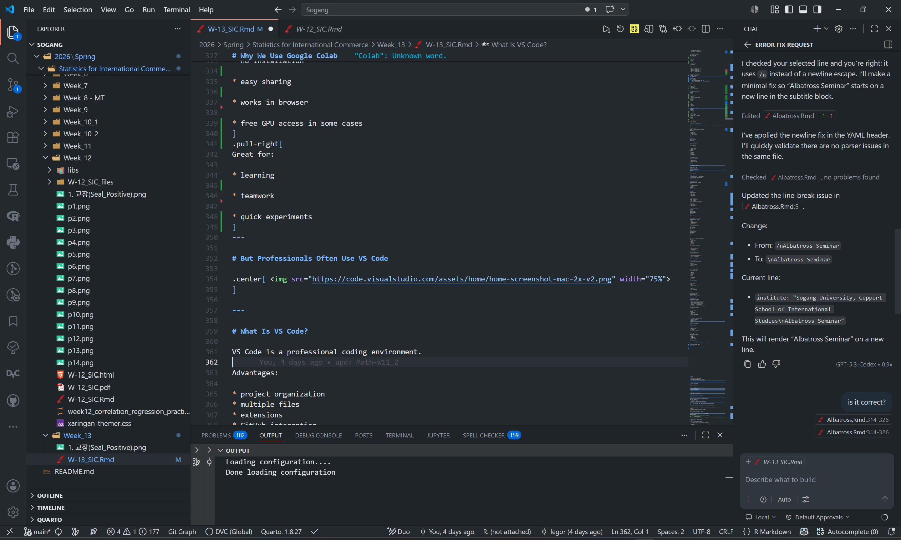

<style>
@media print{
  body, html, .remark-slides-area, .remark-notes-area {
    height: 100% !important;
    width: 100% !important;
    overflow: visible;
    display: inline-block;
    }
}
</style>

<style type="text/css">
.remark-slide-content {
    font-size: 34px;
    padding: 1em 4em 1em 4em;
}
</style>

<style type="text/css">
.my-one-page-font {
  font-size: 28px;
}
</style>

<style type="text/css">
.my-one-page-font-table {
  font-size: 24px;
}
</style>

<style>
.tiny { font-size: 60%; }      /* class you can reuse anywhere */
</style>

<style>
.remark-slide-content {
  position: relative;
  z-index: 1;
}

.remark-slide-content::before {
  content: "";
  position: absolute;
  top: 50%;
  left: 50%;
  width: 600px;          /* adjust size */
  height: 600px;
  background-image: url("1. 교장(Seal_Positive).png");  /* place logo file in same folder */
  background-repeat: no-repeat;
  background-position: center;
  background-size: contain;
  opacity: 0.05;         /* watermark transparency */
  transform: translate(-50%, -50%);
  pointer-events: none;
  z-index: 0;
}
</style>


```{r setup, include = FALSE}
library(tidyverse)
library(knitr)
library(reticulate)
# Ensure Python chunks use the project virtual environment.
use_python("c:/Users/vyshn/OneDrive - kdis.ac.kr/Documents/GitHub/Sogang/.venv/Scripts/python.exe", required = TRUE)
# Install packages once manually if needed; avoid installing during lecture rendering.
# py_install(c("pandas", "matplotlib", "scipy"), pip = TRUE)

opts_chunk$set(fig.width = 10, 
               message = FALSE, 
               warning = FALSE,
               echo = FALSE)
```

```{r xaringan-themer, include=FALSE, warning=FALSE}
#install.packages("xaringanthemer")
library(xaringanthemer)
style_mono_accent(
  base_color = "#851a10",
  header_font_google = google_font("Josefin Sans"),
  text_font_google   = google_font("Montserrat", "500", "550i"),
  code_font_google   = google_font("Fira Mono"),
  colors = c(
  red = "#f34213",
  purple = "#3e2f5b",
  orange = "#ff8811",
  green = "#136f63",
  white = "#FFFFFF"
)
)
```

# Today

## How Modern Analytics Actually Works

We will talk about:

* how companies and researchers work with data

* how analytics projects are organized

* modern tools used in practice

* collaboration and reproducibility

* AI-assisted workflows

---

# Big Idea

Modern analytics is NOT just:

* statistics
* coding
* charts

It is an entire workflow:

.center[
<div style="margin-top: 14px; display: flex; align-items: stretch; justify-content: center; gap: 10px;">
  <div style="width: 22%; background: #e8f3ff; border-left: 6px solid #2b6cb0; border-radius: 10px; padding: 12px 10px; line-height: 1.2;">
    <strong>1) Data</strong><br>
    Collect and define
  </div>
  <div style="font-size: 42px; color: #851a10; align-self: center;">&rarr;</div>
  <div style="width: 22%; background: #eafaf1; border-left: 6px solid #2f855a; border-radius: 10px; padding: 12px 10px; line-height: 1.2;">
    <strong>2) Analysis</strong><br>
    Turn data into insight
  </div>
  <div style="font-size: 42px; color: #851a10; align-self: center;">&rarr;</div>
  <div style="width: 22%; background: #fff6e8; border-left: 6px solid #c05621; border-radius: 10px; padding: 12px 10px; line-height: 1.2;">
    <strong>3) Collaboration</strong><br>
    Share and validate
  </div>
  <div style="font-size: 42px; color: #851a10; align-self: center;">&rarr;</div>
  <div style="width: 22%; background: #f7ecff; border-left: 6px solid #6b46c1; border-radius: 10px; padding: 12px 10px; line-height: 1.2;">
    <strong>4) Decision</strong><br>
    Act with confidence
  </div>
</div>
]

---

# Typical Analytics Workflow

.center[
<div style="margin-top: 6px; width: 85%; margin-left: auto; margin-right: auto;">
  <div style="background:#f3f7ff; border-left:8px solid #2b6cb0; border-radius:8px; padding:10px 14px; margin-bottom:8px;"><strong>Input:</strong> Raw Data (DB, API, Excel, Survey)</div>
  <div style="text-align:center; color:#851a10; font-size:32px; line-height:0.8;">&darr;</div>
  <div style="background:#ecfff4; border-left:8px solid #2f855a; border-radius:8px; padding:10px 14px; margin-bottom:8px;"><strong>Processing:</strong> Python / SQL / Excel + Cleaning</div>
  <div style="text-align:center; color:#851a10; font-size:32px; line-height:0.8;">&darr;</div>
  <div style="background:#fff9ed; border-left:8px solid #b7791f; border-radius:8px; padding:10px 14px; margin-bottom:8px;"><strong>Insight:</strong> Analysis + Visualization</div>
  <div style="text-align:center; color:#851a10; font-size:32px; line-height:0.8;">&darr;</div>
  <div style="background:#f4f0ff; border-left:8px solid #6b46c1; border-radius:8px; padding:10px 14px; margin-bottom:8px;"><strong>Delivery:</strong> Collaboration + Report / Dashboard / Paper</div>
  <div style="text-align:center; color:#851a10; font-size:32px; line-height:0.8;">&darr;</div>
  <div style="background:#ffecec; border-left:8px solid #c53030; border-radius:8px; padding:10px 14px;"><strong>Outcome:</strong> Business Decision</div>
</div>
]

---

# Real-World Example

Suppose a company asks:

> “Why are sales falling in Europe?”

A modern analytics workflow may involve:

.center[
<div style="margin-top: 6px; width: 94%; margin-left: auto; margin-right: auto;">
  <div style="background:#fff9ed; border-left:8px solid #b7791f; border-radius:10px; padding:10px 14px; margin-bottom:10px; text-align:left;">
    <strong>Pause and discuss:</strong> if sales fall in Europe, which part of the workflow would you check first?
  </div>
  <div style="display:flex; align-items:stretch; justify-content:space-between; gap:8px; margin-bottom:10px;">
    <div style="flex:1; background:#e8f3ff; border-radius:10px; padding:10px 8px; min-height:76px;">
      <strong>1</strong><br>Data<br><span class="tiny">databases, APIs, Excel</span>
    </div>
    <div style="font-size:30px; color:#851a10; align-self:center;">&rarr;</div>
    <div style="flex:1; background:#ecfff4; border-radius:10px; padding:10px 8px; min-height:76px;">
      <strong>2</strong><br>Analysis<br><span class="tiny">Python and cleaning</span>
    </div>
    <div style="font-size:30px; color:#851a10; align-self:center;">&rarr;</div>
    <div style="flex:1; background:#fff6e8; border-radius:10px; padding:10px 8px; min-height:76px;">
      <strong>3</strong><br>Output<br><span class="tiny">charts, dashboards</span>
    </div>
    <div style="font-size:30px; color:#851a10; align-self:center;">&rarr;</div>
    <div style="flex:1; background:#f4f0ff; border-radius:10px; padding:10px 8px; min-height:76px;">
      <strong>4</strong><br>Sharing<br><span class="tiny">GitHub, Overleaf, PowerPoint</span>
    </div>
  </div>
  <div style="display:flex; gap:10px; align-items:stretch;">
    <div style="flex:1; background:#ffecec; border-left:8px solid #c53030; border-radius:10px; padding:10px 12px; text-align:left;">
      <strong>Team question:</strong><br>What would you do in step 1, and what would you show in step 3?
    </div>
    <div style="flex:1; background:#eefbf8; border-left:8px solid #2f855a; border-radius:10px; padding:10px 12px; text-align:left;">
      <strong>Real tools:</strong><br>database + notebook + dashboard + collaborative writing
    </div>
  </div>
</div>
]

---

# Why This Matters

These workflows are used in:

<div style="margin-top: 8px; width: 94%; margin-left: auto; margin-right: auto;">
  <div style="background:#fff9ed; border-left:8px solid #b7791f; border-radius:10px; padding:10px 14px; margin-bottom:10px; text-align:left;">
    <strong>Ask the room:</strong> where do you think analytics is most important in everyday business and research?
  </div>
  <div style="display:grid; grid-template-columns: repeat(4, 1fr); gap:10px;">
    <div style="background:#e8f3ff; border-radius:10px; padding:12px 10px; min-height:70px;"><strong>Consulting</strong><br>client decisions</div>
    <div style="background:#ecfff4; border-radius:10px; padding:12px 10px; min-height:70px;"><strong>Finance</strong><br>risk and forecasting</div>
    <div style="background:#fff6e8; border-radius:10px; padding:12px 10px; min-height:70px;"><strong>Fintech</strong><br>products and users</div>
    <div style="background:#f4f0ff; border-radius:10px; padding:12px 10px; min-height:70px;"><strong>E-commerce</strong><br>sales and behavior</div>
    <div style="background:#ffecec; border-radius:10px; padding:12px 10px; min-height:70px;"><strong>Logistics</strong><br>routes and delivery</div>
    <div style="background:#eefbf8; border-radius:10px; padding:12px 10px; min-height:70px;"><strong>Research</strong><br>evidence and papers</div>
    <div style="background:#f7ecff; border-radius:10px; padding:12px 10px; min-height:70px;"><strong>Central Banks</strong><br>policy and stability</div>
    <div style="background:#fdf2f8; border-radius:10px; padding:12px 10px; min-height:70px;"><strong>Tech</strong><br>products and analytics</div>
  </div>
</div>

---

# Modern Analytics Is Collaborative

Very few real projects are done alone.

Modern projects involve:

<div style="margin-top: 8px; width: 94%; margin-left: auto; margin-right: auto;">
  <div style="background:#ecfff4; border-left:8px solid #2f855a; border-radius:10px; padding:10px 14px; margin-bottom:10px; text-align:left;">
    <strong>Who does what?</strong> Each role sees the project from a different angle.
  </div>
  <div style="display:flex; flex-wrap:wrap; gap:10px; justify-content:center;">
    <div style="background:#e8f3ff; border-radius:999px; padding:10px 14px;"><strong>Analysts</strong>: find patterns</div>
    <div style="background:#fff9ed; border-radius:999px; padding:10px 14px;"><strong>Managers</strong>: decide priorities</div>
    <div style="background:#f4f0ff; border-radius:999px; padding:10px 14px;"><strong>Developers</strong>: build tools</div>
    <div style="background:#ffecec; border-radius:999px; padding:10px 14px;"><strong>Researchers</strong>: test ideas</div>
    <div style="background:#eefbf8; border-radius:999px; padding:10px 14px;"><strong>Designers</strong>: make it clear</div>
    <div style="background:#fff6e8; border-radius:999px; padding:10px 14px;"><strong>Domain experts</strong>: add context</div>
  </div>
  <div style="margin-top:12px; background:#fff9ed; border-left:8px solid #b7791f; border-radius:10px; padding:10px 14px; text-align:left;">
    <strong>Discussion cue:</strong> what goes wrong if one of these roles is missing?
  </div>
</div>

---

# Typical Workflow Tools

.center[
<div style="margin-top: 8px; width: 95%; margin-left: auto; margin-right: auto;">
  <div style="background:#fff9ed; border-left:8px solid #b7791f; border-radius:10px; padding:10px 14px; margin-bottom:10px; text-align:left;">
    <strong>Quick question:</strong> which of these tools do you already know, and which one would help you most right now?
  </div>
  <div style="display:grid; grid-template-columns: repeat(3, 1fr); gap:10px;">
    <div style="background:#e8f3ff; border-radius:10px; padding:12px 10px; min-height:70px;"><strong>Coding</strong><br>Python, R</div>
    <div style="background:#ecfff4; border-radius:10px; padding:12px 10px; min-height:70px;"><strong>Development</strong><br>VS Code</div>
    <div style="background:#fff6e8; border-radius:10px; padding:12px 10px; min-height:70px;"><strong>Cloud notebooks</strong><br>Google Colab</div>
    <div style="background:#f4f0ff; border-radius:10px; padding:12px 10px; min-height:70px;"><strong>Version control</strong><br>GitHub</div>
    <div style="background:#ffecec; border-radius:10px; padding:12px 10px; min-height:70px;"><strong>Writing/reporting</strong><br>Overleaf</div>
    <div style="background:#eefbf8; border-radius:10px; padding:12px 10px; min-height:70px;"><strong>Visualization + AI</strong><br>Tableau, Power BI, Copilot</div>
  </div>
</div>
]

---

# Step 1. Working with Data

Data can come from:

.center[
<div style="margin-top: 8px; width: 94%; margin-left: auto; margin-right: auto;">
  <div style="display:flex; gap:10px; flex-wrap:wrap; justify-content:center;">
    <div style="background:#e8f3ff; border-radius:999px; padding:10px 14px;"><strong>Company</strong>: databases</div>
    <div style="background:#ecfff4; border-radius:999px; padding:10px 14px;"><strong>Web</strong>: APIs, websites</div>
    <div style="background:#fff6e8; border-radius:999px; padding:10px 14px;"><strong>Files</strong>: Excel, text documents</div>
    <div style="background:#f4f0ff; border-radius:999px; padding:10px 14px;"><strong>People</strong>: surveys</div>
    <div style="background:#ffecec; border-radius:999px; padding:10px 14px;"><strong>Markets</strong>: financial data</div>
  </div>
  <div style="margin-top:12px; background:#fff9ed; border-left:8px solid #b7791f; border-radius:10px; padding:10px 14px; text-align:left;">
    <strong>Think first:</strong> where would you look if you needed sales data for one country over time?
  </div>
</div>
]

---

# Example Types of Data

.center[
<div style="margin-top: 8px; width: 92%; margin-left: auto; margin-right: auto; display:grid; grid-template-columns: repeat(2, 1fr); gap:10px;">
  <div style="background:#e8f3ff; border-radius:10px; padding:12px 14px;"><strong>Numerical</strong><br>sales revenue</div>
  <div style="background:#ecfff4; border-radius:10px; padding:12px 14px;"><strong>Categorical</strong><br>customer type</div>
  <div style="background:#fff6e8; border-radius:10px; padding:12px 14px;"><strong>Time series</strong><br>stock prices</div>
  <div style="background:#f4f0ff; border-radius:10px; padding:12px 14px;"><strong>Text</strong><br>reviews, reports</div>
  <div style="background:#ffecec; border-radius:10px; padding:12px 14px; grid-column: span 2;"><strong>Images</strong><br>product photos</div>
</div>
]

---

# Example: Python in Analytics

```{python id="y1z4rf"}
import pandas as pd
import numpy as np

# Generate sample sales data
np.random.seed(42)
df = pd.DataFrame({
    'region': np.random.choice(['Asia', 'Europe', 'North America'], 100),
    'sales': np.random.uniform(50, 200, 100),
    'quarter': np.random.choice(['Q1', 'Q2', 'Q3', 'Q4'], 100)
})

df.head()
```

Python helps us:

.center[
<div style="margin-top: 8px; width: 94%; margin-left: auto; margin-right: auto; display:flex; gap:10px;">
  <div style="flex:1; background:#e8f3ff; border-radius:10px; padding:10px 12px;"><strong>Organize</strong><br>clean and structure data</div>
  <div style="flex:1; background:#ecfff4; border-radius:10px; padding:10px 12px;"><strong>Analyze</strong><br>find patterns and relationships</div>
  <div style="flex:1; background:#fff9ed; border-radius:10px; padding:10px 12px;"><strong>Automate</strong><br>repeat tasks faster and safer</div>
</div>
]

---

# Why Python Became So Popular

.center[
<div style="margin-top: 8px; width: 94%; margin-left: auto; margin-right: auto;">
  <div style="background:#fff9ed; border-left:8px solid #b7791f; border-radius:10px; padding:10px 14px; margin-bottom:10px; text-align:left;">
    <strong>Class prompt:</strong> why do you think Python spread so quickly across business and research?
  </div>
  <div style="display:grid; grid-template-columns: repeat(2, 1fr); gap:10px;">
    <div style="background:#e8f3ff; border-radius:10px; padding:12px 14px;"><strong>Easy to start</strong><br>simple syntax and readable code</div>
    <div style="background:#ecfff4; border-radius:10px; padding:12px 14px;"><strong>Flexible</strong><br>data, web, automation, AI</div>
    <div style="background:#fff6e8; border-radius:10px; padding:12px 14px;"><strong>Widely used</strong><br>companies, banks, startups</div>
    <div style="background:#f4f0ff; border-radius:10px; padding:12px 14px;"><strong>Community</strong><br>libraries, tutorials, examples</div>
  </div>
</div>
]

---

# Why We Use Google Colab

.center[
<div style="margin-top: 8px; width: 94%; margin-left: auto; margin-right: auto;">
  <div style="background:#ecfff4; border-left:8px solid #2f855a; border-radius:10px; padding:10px 14px; margin-bottom:10px; text-align:left;">
    <strong>Imagine you are in class:</strong> what makes Colab easier for beginners than installing software locally?
  </div>
  <div style="display:flex; gap:10px; flex-wrap:wrap; justify-content:center;">
    <div style="background:#e8f3ff; border-radius:999px; padding:10px 14px;">No installation</div>
    <div style="background:#fff6e8; border-radius:999px; padding:10px 14px;">Easy sharing</div>
    <div style="background:#f4f0ff; border-radius:999px; padding:10px 14px;">Works in browser</div>
    <div style="background:#ffecec; border-radius:999px; padding:10px 14px;">Good for teamwork</div>
    <div style="background:#eefbf8; border-radius:999px; padding:10px 14px;">Quick experiments</div>
  </div>
</div>
]
---

# But Professionals Often Use VS Code

<div>
.center[

]

</div>

---

# What Is VS Code?

VS Code is a professional coding environment.

Advantages:

.center[
<div style="margin-top: 8px; width: 94%; margin-left: auto; margin-right: auto;">
  <div style="background:#f3f7ff; border-left:8px solid #2b6cb0; border-radius:10px; padding:10px 14px; margin-bottom:10px; text-align:left;">
    <strong>Why professionals like it:</strong> which feature matters most when a project gets bigger?
  </div>
  <div style="display:grid; grid-template-columns: repeat(2, 1fr); gap:10px;">
    <div style="background:#e8f3ff; border-radius:10px; padding:12px 14px;"><strong>Project organization</strong><br>multiple folders and files</div>
    <div style="background:#ecfff4; border-radius:10px; padding:12px 14px;"><strong>Extensions</strong><br>extra tools for data work</div>
    <div style="background:#fff6e8; border-radius:10px; padding:12px 14px;"><strong>GitHub integration</strong><br>version control in one place</div>
    <div style="background:#f4f0ff; border-radius:10px; padding:12px 14px;"><strong>AI tools</strong><br>support for coding and debugging</div>
  </div>
</div>
]

---

# But Remember

The goal is NOT:

## “learn software”

The goal is:

## solve problems with data

Tools are just tools.

.center[
<div style="margin-top: 10px; width: 90%; margin-left: auto; margin-right: auto; background:#fff9ed; border-left:8px solid #b7791f; border-radius:10px; padding:12px 14px; text-align:left;">
  <strong>Big idea:</strong> the tool matters less than whether it helps you solve the actual problem.
</div>
]

---

# Example Workflow

.center[
<div style="margin-top: 8px; width: 94%; margin-left: auto; margin-right: auto;">
  <div style="background:#fff9ed; border-left:8px solid #b7791f; border-radius:10px; padding:10px 14px; margin-bottom:10px; text-align:left;">
    <strong>Try this mentally:</strong> if the data are messy, which step should happen before any chart is made?
  </div>
  <div style="display:grid; grid-template-columns: repeat(3, 1fr); gap:10px;">
    <div style="background:#e8f3ff; border-radius:10px; padding:12px 10px;"><strong>1. Load</strong><br>bring data into the project</div>
    <div style="background:#ecfff4; border-radius:10px; padding:12px 10px;"><strong>2. Clean</strong><br>fix missing values and errors</div>
    <div style="background:#fff6e8; border-radius:10px; padding:12px 10px;"><strong>3. Analyze</strong><br>find patterns and answer questions</div>
    <div style="background:#f4f0ff; border-radius:10px; padding:12px 10px;"><strong>4. Visualize</strong><br>make the result easy to see</div>
    <div style="background:#ffecec; border-radius:10px; padding:12px 10px;"><strong>5. Share</strong><br>present to others</div>
    <div style="background:#eefbf8; border-radius:10px; padding:12px 10px;"><strong>6. Decide</strong><br>turn insight into action</div>
  </div>
</div>
]
---

# Step 2. Visualization

Visualization helps people:

.center[
<div style="margin-top: 8px; width: 92%; margin-left: auto; margin-right: auto; display:flex; gap:10px;">
  <div style="flex:1; background:#e8f3ff; border-radius:10px; padding:10px 12px;"><strong>Understand</strong><br>see patterns faster</div>
  <div style="flex:1; background:#ffecec; border-radius:10px; padding:10px 12px;"><strong>Detect</strong><br>spot problems early</div>
  <div style="flex:1; background:#ecfff4; border-radius:10px; padding:10px 12px;"><strong>Communicate</strong><br>share findings clearly</div>
</div>
]

---

# Example

```{python id="e3t7md"}
import matplotlib.pyplot as plt
import numpy as np

regions = ["Asia", "Europe", "North America"]
sales = [120, 90, 150]

colors = ["#3A86FF", "#FF9F1C", "#2EC4B6"]

fig, ax = plt.subplots(figsize=(10, 5.5))
bars = ax.bar(regions, sales, color=colors, edgecolor="#2f2f2f", linewidth=1.2)

avg_sales = np.mean(sales)
ax.axhline(avg_sales, color="#851a10", linestyle="--", linewidth=2, label=f"Average = {avg_sales:.0f}")

max_idx = int(np.argmax(sales))
bars[max_idx].set_edgecolor("#851a10")
bars[max_idx].set_linewidth(2.6)

for bar, value in zip(bars, sales):
  ax.text(
    bar.get_x() + bar.get_width() / 2,
    value + 3,
    f"{value}",
    ha="center",
    va="bottom",
    fontsize=12,
    fontweight="bold",
  )

ax.set_title("Regional Sales Snapshot", fontsize=18, pad=12, fontweight="bold")
ax.text(0.5, 1.01, "North America currently leads", transform=ax.transAxes,
    ha="center", va="bottom", fontsize=11, color="#444444")
ax.set_ylabel("Million USD")
ax.set_ylim(0, max(sales) * 1.25)

ax.set_axisbelow(True)
ax.yaxis.grid(True, linestyle=":", alpha=0.35)
ax.spines["top"].set_visible(False)
ax.spines["right"].set_visible(False)
ax.legend(frameon=False, loc="upper left")

plt.tight_layout()
plt.show()
```

---

# Important Reality

In real business:

* communication matters as much as analysis

A brilliant analysis nobody understands:

## has little value

.center[
<div style="margin-top: 10px; width: 90%; margin-left: auto; margin-right: auto; background:#fff9ed; border-left:8px solid #b7791f; border-radius:10px; padding:12px 14px; text-align:left;">
  <strong>Check your message:</strong> if you had 30 seconds to explain the result, what would you say first?
</div>
]

---

# Step 3. Collaboration

Modern projects involve many people.

Problem:

* multiple versions
* accidental overwriting
* confusion

Solution:

## version control

.center[
<div style="margin-top: 8px; width: 92%; margin-left: auto; margin-right: auto; display:flex; gap:10px;">
  <div style="flex:1; background:#e8f3ff; border-radius:10px; padding:10px 12px;"><strong>Problem</strong><br>too many versions</div>
  <div style="flex:1; background:#ecfff4; border-radius:10px; padding:10px 12px;"><strong>Tool</strong><br>GitHub</div>
  <div style="flex:1; background:#fff9ed; border-radius:10px; padding:10px 12px;"><strong>Result</strong><br>clear history and teamwork</div>
</div>
]

---

# GitHub

GitHub is used to:

.center[
<div style="margin-top: 8px; width: 90%; margin-left: auto; margin-right: auto; display:flex; flex-wrap:wrap; gap:10px; justify-content:center;">
  <div style="background:#e8f3ff; border-radius:999px; padding:10px 14px;">Store code</div>
  <div style="background:#ecfff4; border-radius:999px; padding:10px 14px;">Track changes</div>
  <div style="background:#fff6e8; border-radius:999px; padding:10px 14px;">Collaborate</div>
  <div style="background:#f4f0ff; border-radius:999px; padding:10px 14px;">Manage projects</div>
</div>
]

---

# Why GitHub Matters

Without version control:

```text id="f6k3vn"
final_project_REAL_final_v2_LAST.xlsx
```

With GitHub:

.center[
<div style="margin-top: 8px; width: 92%; margin-left: auto; margin-right: auto; display:flex; gap:10px;">
  <div style="flex:1; background:#ffecec; border-left:8px solid #c53030; border-radius:10px; padding:10px 12px;"><strong>Without GitHub</strong><br>file chaos and confusion</div>
  <div style="flex:1; background:#ecfff4; border-left:8px solid #2f855a; border-radius:10px; padding:10px 12px;"><strong>With GitHub</strong><br>history, safety, reproducibility</div>
</div>
]

---

# Example GitHub Workflow

.center[
<div style="margin-top: 8px; width: 88%; margin-left: auto; margin-right: auto;">
  <div style="display:flex; justify-content:space-between; gap:10px; margin-bottom:8px;">
    <div style="flex:1; background:#e8f3ff; border-top:6px solid #2b6cb0; border-radius:8px; padding:10px;"><strong>1. Notebook</strong><br>Start analysis</div>
    <div style="flex:1; background:#ecfff4; border-top:6px solid #2f855a; border-radius:8px; padding:10px;"><strong>2. Upload</strong><br>Push to GitHub</div>
    <div style="flex:1; background:#fff9ed; border-top:6px solid #b7791f; border-radius:8px; padding:10px;"><strong>3. Collaborate</strong><br>Teammate edits</div>
  </div>
  <div style="text-align:center; color:#851a10; font-size:32px; line-height:0.9; margin:4px 0;">&darr;</div>
  <div style="display:flex; justify-content:space-between; gap:10px;">
    <div style="flex:1; background:#f4f0ff; border-top:6px solid #6b46c1; border-radius:8px; padding:10px;"><strong>4. Track Changes</strong><br>History + review</div>
    <div style="flex:1; background:#ffecec; border-top:6px solid #c53030; border-radius:8px; padding:10px;"><strong>5. Final Project</strong><br>Stable shared version</div>
  </div>
</div>
]

---

# Modern Research Works Similarly

Research today often includes:

.center[
<div style="margin-top: 8px; width: 94%; margin-left: auto; margin-right: auto;">
  <div style="background:#fff9ed; border-left:8px solid #b7791f; border-radius:10px; padding:10px 14px; margin-bottom:10px; text-align:left;">
    <strong>Think of a real paper:</strong> what do you need besides the text itself to make it convincing?
  </div>
  <div style="display:grid; grid-template-columns: repeat(2, 1fr); gap:10px;">
    <div style="background:#e8f3ff; border-radius:10px; padding:12px 14px;"><strong>Code</strong><br>for cleaning and analysis</div>
    <div style="background:#ecfff4; border-radius:10px; padding:12px 14px;"><strong>Datasets</strong><br>the evidence base</div>
    <div style="background:#fff6e8; border-radius:10px; padding:12px 14px;"><strong>Figures & Tables</strong><br>what the reader sees first</div>
    <div style="background:#f4f0ff; border-radius:10px; padding:12px 14px;"><strong>Collaborative Writing</strong><br>drafts, comments, revisions</div>
    <div style="background:#ffecec; border-radius:10px; padding:12px 14px; grid-column: span 2;"><strong>Reproducibility</strong><br>someone else should be able to follow your steps</div>
  </div>
  <div style="margin-top:12px; background:#ecfff4; border-left:8px solid #2f855a; border-radius:10px; padding:10px 14px; text-align:left;">
    <strong>Discussion cue:</strong> which part becomes the bottleneck when the project gets bigger?
  </div>
</div>
]

---

# Example Research Workflow

.center[
<div style="margin-top: 8px; width: 88%; margin-left: auto; margin-right: auto;">
  <div style="background:#f3f7ff; border-left:8px solid #2b6cb0; border-radius:8px; padding:10px 14px; margin-bottom:7px;"><strong>1. Data Collection</strong> from surveys, experiments, or databases</div>
  <div style="text-align:center; color:#851a10; font-size:30px; line-height:0.8;">&darr;</div>
  <div style="background:#ecfff4; border-left:8px solid #2f855a; border-radius:8px; padding:10px 14px; margin-bottom:7px;"><strong>2. Python Analysis</strong> for cleaning, modeling, and testing</div>
  <div style="text-align:center; color:#851a10; font-size:30px; line-height:0.8;">&darr;</div>
  <div style="background:#fff9ed; border-left:8px solid #b7791f; border-radius:8px; padding:10px 14px; margin-bottom:7px;"><strong>3. Figures & Tables</strong> to communicate core findings</div>
  <div style="text-align:center; color:#851a10; font-size:30px; line-height:0.8;">&darr;</div>
  <div style="background:#f4f0ff; border-left:8px solid #6b46c1; border-radius:8px; padding:10px 14px; margin-bottom:7px;"><strong>4. GitHub Collaboration</strong> for versioning and co-author work</div>
  <div style="text-align:center; color:#851a10; font-size:30px; line-height:0.8;">&darr;</div>
  <div style="background:#ffecec; border-left:8px solid #c53030; border-radius:8px; padding:10px 14px; margin-bottom:7px;"><strong>5. Overleaf Paper</strong> for structured writing and references</div>
  <div style="text-align:center; color:#851a10; font-size:30px; line-height:0.8;">&darr;</div>
  <div style="background:#fdeff8; border-left:8px solid #97266d; border-radius:8px; padding:10px 14px;"><strong>6. Publication</strong> as reproducible output</div>
</div>
]

---

.center[
<div style="margin-top: 8px; width: 94%; margin-left: auto; margin-right: auto;">
  <div style="background:#fff9ed; border-left:8px solid #b7791f; border-radius:10px; padding:10px 14px; margin-bottom:10px; text-align:left;">
    <strong>Think like a co-author:</strong> what makes writing easier when several people edit the same document?
  </div>
  <div style="display:grid; grid-template-columns: repeat(2, 1fr); gap:10px;">
    <div style="background:#e8f3ff; border-radius:10px; padding:12px 14px;"><strong>What it is</strong><br>a collaborative writing platform</div>
    <div style="background:#ecfff4; border-radius:10px; padding:12px 14px;"><strong>Used for</strong><br>papers, reports, presentations</div>
    <div style="background:#fff6e8; border-radius:10px; padding:12px 14px;"><strong>Also useful for</strong><br>equations and references</div>
    <div style="background:#f4f0ff; border-radius:10px; padding:12px 14px;"><strong>Why researchers like it</strong><br>real-time collaboration, version history, cloud access</div>
  </div>
</div>
]
---

# Example of Reproducibility

.center[
<div style="margin-top: 8px; width: 94%; margin-left: auto; margin-right: auto;">
  <div style="background:#ecfff4; border-left:8px solid #2f855a; border-radius:10px; padding:10px 14px; margin-bottom:10px; text-align:left;">
    <strong>Question:</strong> if a classmate runs your code, do they get the same answer?
  </div>
  <div style="display:grid; grid-template-columns: repeat(3, 1fr); gap:10px;">
    <div style="background:#e8f3ff; border-radius:10px; padding:12px 14px;"><strong>Reproduce</strong><br>same result again</div>
    <div style="background:#fff6e8; border-radius:10px; padding:12px 14px;"><strong>Transparent</strong><br>clear calculations</div>
    <div style="background:#f4f0ff; border-radius:10px; padding:12px 14px;"><strong>Documented</strong><br>workflow is written down</div>
  </div>
</div>
]


# Why Reproducibility Matters

.center[
<div style="margin-top: 8px; width: 94%; margin-left: auto; margin-right: auto; display:flex; gap:10px;">
  <div style="flex:1; background:#ffecec; border-left:8px solid #c53030; border-radius:10px; padding:10px 12px; text-align:left;">
    <strong>Without reproducibility</strong><br>harder to find mistakes, weaker trust, unclear results
  </div>
  <div style="flex:1; background:#ecfff4; border-left:8px solid #2f855a; border-radius:10px; padding:10px 12px; text-align:left;">
    <strong>With reproducibility</strong><br>easier review, stronger credibility, safer decisions
  </div>
</div>
<div style="margin-top:12px; background:#fff9ed; border-left:8px solid #b7791f; border-radius:10px; padding:10px 14px; text-align:left;">
  <strong>Discussion cue:</strong> where would reproducibility matter more, a business report or a research paper?
</div>
]

---

# AI Is Changing Analytics

.center[
<div style="margin-top: 8px; width: 94%; margin-left: auto; margin-right: auto;">
  <div style="background:#fff9ed; border-left:8px solid #b7791f; border-radius:10px; padding:10px 14px; margin-bottom:10px; text-align:left;">
    <strong>AI is changing the workflow:</strong> where would you let AI help, and where would you still check manually?
  </div>
  <div style="display:grid; grid-template-columns: repeat(2, 1fr); gap:10px;">
    <div style="background:#e8f3ff; border-radius:10px; padding:12px 14px;"><strong>Coding</strong><br>generate or explain code</div>
    <div style="background:#ecfff4; border-radius:10px; padding:12px 14px;"><strong>Debugging</strong><br>spot errors faster</div>
    <div style="background:#fff6e8; border-radius:10px; padding:12px 14px;"><strong>Summarizing</strong><br>compress long text or notes</div>
    <div style="background:#f4f0ff; border-radius:10px; padding:12px 14px;"><strong>Writing + Visualization</strong><br>draft text and suggest charts</div>
  </div>
  <div style="margin-top:12px; display:flex; gap:10px; justify-content:center; flex-wrap:wrap;">
    <div style="background:#e8f3ff; border-radius:999px; padding:10px 14px;">ChatGPT</div>
    <div style="background:#ecfff4; border-radius:999px; padding:10px 14px;">GitHub Copilot</div>
    <div style="background:#fff6e8; border-radius:999px; padding:10px 14px;">Cursor AI</div>
  </div>
</div>
]

---

# But Important Warning

AI is a tool.

.center[
<div style="margin-top: 8px; width: 94%; margin-left: auto; margin-right: auto; display:flex; gap:10px;">
  <div style="flex:1; background:#ecfff4; border-left:8px solid #2f855a; border-radius:10px; padding:10px 12px; text-align:left;">
    <strong>You still need</strong><br>logic, statistics, critical thinking
  </div>
  <div style="flex:1; background:#ffecec; border-left:8px solid #c53030; border-radius:10px; padding:10px 12px; text-align:left;">
    <strong>AI can produce</strong><br>mistakes, hallucinations, wrong interpretation
  </div>
</div>
<div style="margin-top:12px; background:#fff9ed; border-left:8px solid #b7791f; border-radius:10px; padding:10px 14px; text-align:left;">
  <strong>Rule of thumb:</strong> use AI to speed up work, not to replace judgment.
</div>
]

---

# The Most Valuable Skill

Not memorizing formulas.

The most valuable skill is:

## turning data into decisions

.center[
<div style="margin-top: 10px; width: 90%; margin-left: auto; margin-right: auto; background:#fff9ed; border-left:8px solid #b7791f; border-radius:10px; padding:12px 14px; text-align:left;">
  <strong>Final check:</strong> can you explain why the result matters, not just what the result is?
</div>
]

---

# Example Careers

These workflows are used in:

.center[
<div style="margin-top: 8px; width: 94%; margin-left: auto; margin-right: auto; display:grid; grid-template-columns: repeat(2, 1fr); gap:10px;">
  <div style="background:#e8f3ff; border-radius:10px; padding:12px 14px;"><strong>Data analyst</strong><br>dashboards, reports</div>
  <div style="background:#ecfff4; border-radius:10px; padding:12px 14px;"><strong>Business analyst</strong><br>strategy decisions</div>
  <div style="background:#fff6e8; border-radius:10px; padding:12px 14px;"><strong>Research analyst</strong><br>statistical analysis</div>
  <div style="background:#f4f0ff; border-radius:10px; padding:12px 14px;"><strong>Financial analyst</strong><br>forecasting</div>
  <div style="background:#ffecec; border-radius:10px; padding:12px 14px;"><strong>Consultant</strong><br>client analytics</div>
  <div style="background:#eefbf8; border-radius:10px; padding:12px 14px;"><strong>Policy analyst</strong><br>evidence-based decisions</div>
</div>
]

---

# What Employers Often Want

Not only:

* technical skills

But also:

.center[
<div style="margin-top: 8px; width: 92%; margin-left: auto; margin-right: auto; display:grid; grid-template-columns: repeat(2, 1fr); gap:10px;">
  <div style="background:#e8f3ff; border-radius:10px; padding:12px 14px;"><strong>Technical</strong><br>tools, methods, coding</div>
  <div style="background:#ecfff4; border-radius:10px; padding:12px 14px;"><strong>Human</strong><br>communication, teamwork</div>
  <div style="background:#fff6e8; border-radius:10px; padding:12px 14px;"><strong>Thinking</strong><br>problem solving</div>
  <div style="background:#f4f0ff; border-radius:10px; padding:12px 14px;"><strong>Context</strong><br>business understanding</div>
</div>
]

---

# What You Already Know

From this course, you already learned:

* descriptive statistics
* probability
* hypothesis testing
* ANOVA
* Python basics

These are real foundations.

.center[
<div style="margin-top: 10px; width: 90%; margin-left: auto; margin-right: auto; background:#fff9ed; border-left:8px solid #b7791f; border-radius:10px; padding:12px 14px; text-align:left;">
  <strong>You already have a toolkit:</strong> the next step is connecting it to real problems, not starting from zero.
</div>
]

---

# Important Message

You do NOT need to become:

* expert programmer
* mathematician
* AI engineer

to use analytics effectively.

.center[
<div style="margin-top: 10px; width: 90%; margin-left: auto; margin-right: auto; background:#ecfff4; border-left:8px solid #2f855a; border-radius:10px; padding:12px 14px; text-align:left;">
  <strong>Takeaway:</strong> you do not need to be the best coder in the room to make a useful analysis.
</div>
]

---

# Final Idea

Modern analytics combines:

.center[
<div style="margin-top: 8px; width: 94%; margin-left: auto; margin-right: auto; display:grid; grid-template-columns: repeat(5, 1fr); gap:8px;">
  <div style="background:#e8f3ff; border-radius:10px; padding:10px 8px;"><strong>Stats</strong></div>
  <div style="background:#ecfff4; border-radius:10px; padding:10px 8px;"><strong>Coding</strong></div>
  <div style="background:#fff6e8; border-radius:10px; padding:10px 8px;"><strong>Communication</strong></div>
  <div style="background:#f4f0ff; border-radius:10px; padding:10px 8px;"><strong>Collaboration</strong></div>
  <div style="background:#ffecec; border-radius:10px; padding:10px 8px;"><strong>Business</strong></div>
</div>
]

---

# One Sentence Summary

## Data is valuable only when it helps people make better decisions.

.center[
<div style="margin-top: 10px; width: 90%; margin-left: auto; margin-right: auto; background:#fff9ed; border-left:8px solid #b7791f; border-radius:10px; padding:12px 14px; text-align:left;">
  <strong>Final question:</strong> what is one decision in your life or work that could be better with data?
</div>
]

---

class: inverse, center, middle

# Any questions?

# Thank you for your attention and active participation!


???
1. To print pdf slides
https://stackoverflow.com/questions/54968311/xaringan-export-slides-to-pdf-while-preserving-formatting

pagedown::chrome_print("W-11_SIC.html") # but not all pictures are visible

2. Option: https://stackoverflow.com/questions/54968311/xaringan-export-slides-to-pdf-while-preserving-formatting

install.packages("remotes")
remotes::install_github("jhelvy/xaringanBuilder")
remotes::install_github("jhelvy/renderthis@v0.0.9")

library(xaringanBuilder)
build_pdf("W-11_SIC.html")

3. Option
writeBin(as.raw(c()), "favicon.ico") # create an empty favicon.ico file
install.packages("renderthis")
remotes::install_github('rstudio/chromote')
library(renderthis)

renderthis::to_pdf("W-13_SIC.html")

getwd()
setwd("C:\\Users\\vyshn\\OneDrive - kdis.ac.kr\\Documents\\GitHub\\Sogang\\2026\\Spring\\Statistics for International Commerce\\Week_13")


