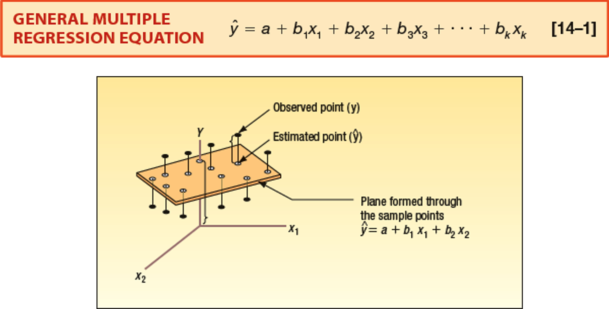
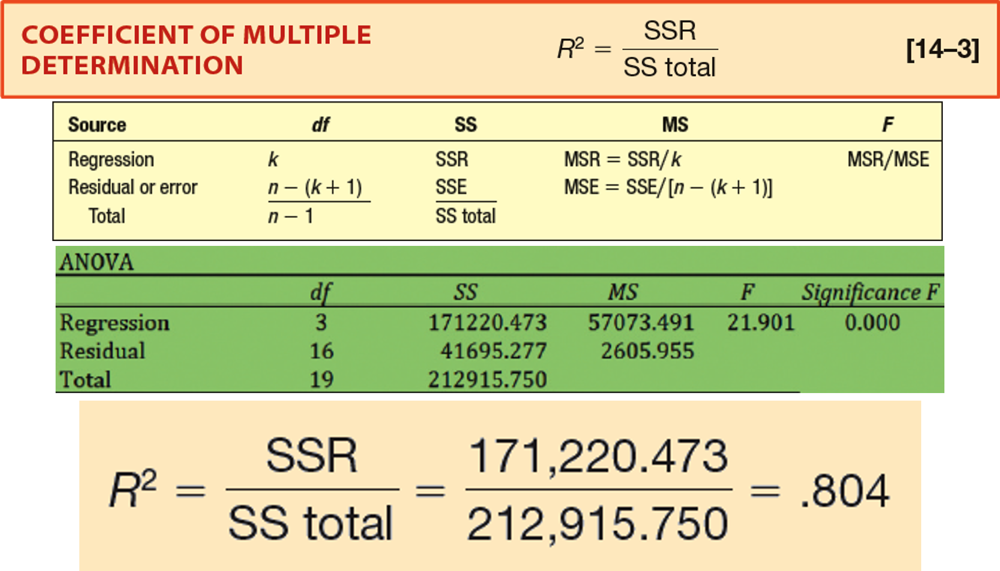
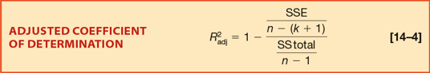
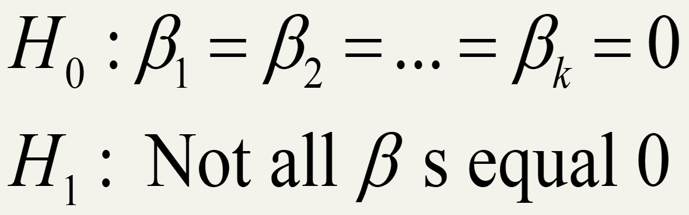
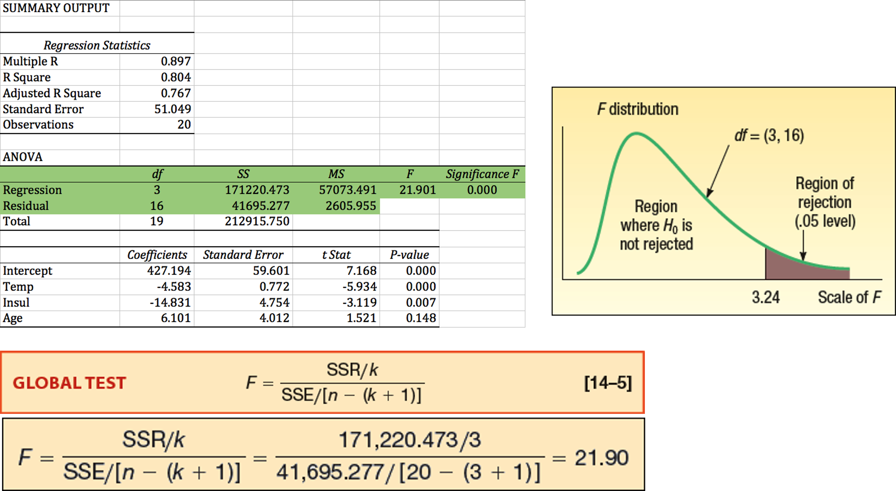
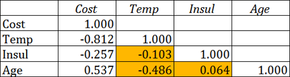
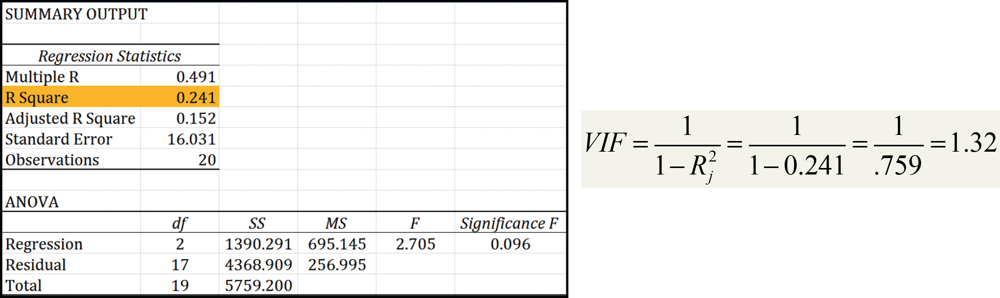
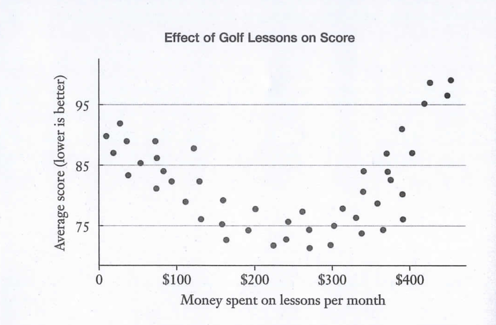
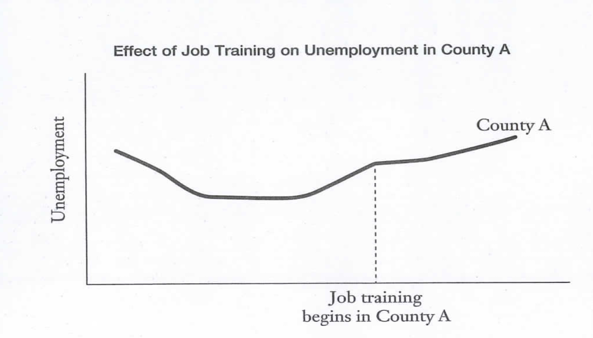
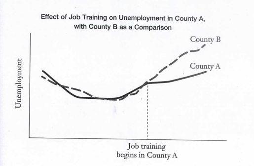

<style>
@media print{
  body, html, .remark-slides-area, .remark-notes-area {
    height: 100% !important;
    width: 100% !important;
    overflow: visible;
    display: inline-block;
    }
}
</style>

<style type="text/css">
.remark-slide-content {
    font-size: 34px;
    padding: 1em 4em 1em 4em;
}
</style>

<style type="text/css">
.my-one-page-font {
  font-size: 28px;
}
</style>

<style type="text/css">
.my-one-page-font-table {
  font-size: 24px;
}
</style>

<style>
.tiny { font-size: 60%; }      /* class you can reuse anywhere */
</style>

<style>
.remark-slide-content {
  position: relative;
  z-index: 1;
}

.remark-slide-content::before {
  content: "";
  position: absolute;
  top: 50%;
  left: 50%;
  width: 600px;          /* adjust size */
  height: 600px;
  background-image: url("1. 교장(Seal_Positive).png");  /* place logo file in same folder */
  background-repeat: no-repeat;
  background-position: center;
  background-size: contain;
  opacity: 0.05;         /* watermark transparency */
  transform: translate(-50%, -50%);
  pointer-events: none;
  z-index: 0;
}
</style>


```{r setup, include = FALSE}
library(tidyverse)
library(knitr)
library(reticulate)
# Ensure Python chunks use the project virtual environment.
use_python("c:/Users/vyshn/OneDrive - kdis.ac.kr/Documents/GitHub/Sogang/.venv/Scripts/python.exe", required = TRUE)
# Install packages once manually if needed; avoid installing during lecture rendering.
# py_install(c("pandas", "matplotlib", "scipy"), pip = TRUE)
opts_chunk$set(fig.width = 10,
         message = FALSE,
         warning = FALSE,
         echo = FALSE)
```

```{r xaringan-themer, include=FALSE, warning=FALSE}
#install.packages("xaringanthemer")
library(xaringanthemer)
style_mono_accent(
  base_color = "#851a10",
  header_font_google = google_font("Josefin Sans"),
  text_font_google   = google_font("Montserrat", "500", "550i"),
  code_font_google   = google_font("Fira Mono"),
  colors = c(
  red = "#f34213",
  purple = "#3e2f5b",
  orange = "#ff8811",
  green = "#136f63",
  white = "#FFFFFF"
)
)
```

# Agenda

* multiple predictors

* interpretation of coefficients

* prediction

* model fit

* business applications

---

# Learning Objectives

After this lecture, you should be able to:

* explain multiple regression

* interpret regression coefficients

* understand ceteris paribus interpretation

* evaluate model fit

* identify limitations of regression models

---

# Motivation

A company wants to predict:

## customer spending

using:

* income
* advertising exposure
* delivery speed

> One variable alone may not be enough.

---

# From Simple to Multiple Regression

## Simple Regression

$$
Y = a + bX
$$

uses:

* one independent variable


## Multiple Regression

$$
Y = a + b_1X_1 + b_2X_2 + b_3X_3
$$

uses:

* multiple independent variables

---

# Multiple Regression Analysis
.pull-left[
The general multiple regression equation with k independent variables is given by:
<div>
.center[

]

</div>
]


.pull-right[

In the model: $Y = a + b_1X_1 + b_2X_2 + \cdots + b_kX_k$:

* $X_1, \ldots, X_k$ are independent variables
* $a$ is the intercept (predicted $Y$ when all $X$ values are 0)
* $b_i$ is the expected change in $Y$ for a one-unit increase in $X_i$, holding all other variables constant

Each $b_i$ is called a partial regression coefficient.

The coefficients are estimated using the least squares method (typically with software such as Excel, MINITAB, or Python).
]

---
.pull-left[
# Why Use Multiple Regression?

Real business outcomes usually depend on:

* many factors simultaneously

Examples:

* sales
* customer satisfaction
* stock prices
* shipping costs
]
.pull-right[
# Example Business Question

What affects online sales?

Possible factors:

* advertising
* price
* delivery time
* customer ratings
]
---

# Example Dataset

```{python}
import numpy as np
import pandas as pd
n = 60

advertising = np.random.normal(50,10,n)
delivery = np.random.normal(4,1,n)
income = np.random.normal(70,15,n)

sales = (
  20
  + 2.5*advertising
  - 4*delivery
  + 1.8*income
  + np.random.normal(0,15,n)
)

df = pd.DataFrame({
  "sales": sales,
  "advertising": advertising,
  "delivery_days": delivery,
  "income": income
})

df.head()
```


# Variables

| Variable      | Meaning               |units                 |
| ------------- | --------------------- |----------------------|
| sales         | monthly sales         | dollars              |
| advertising   | advertising spending  | dollars              |
| delivery_days | average delivery time | days                 |
| income        | customer income       | dollars              |

---

# Correlation Matrix

```{python}
df.corr().round(2)
```

# Multiple Regression Equation

$$
Sales =
a
+
b_1 Advertising
+
b_2 Delivery
+
b_3 Income
$$


# Important Idea

Each coefficient measures:

> the effect of one variable
> while holding other variables constant

This is called:

## ceteris paribus

---

# Estimating the Model

```{python}
import statsmodels.api as sm
import pandas as pd

X = df[["advertising",
        "delivery_days",
        "income"]]

X = sm.add_constant(X)

# Baseline OLS fit, then report heteroskedasticity-robust (HC1) SE as in applied econ papers.
model = sm.OLS(df["sales"], X).fit(cov_type="HC1")

coef = model.params
se = model.bse
tstat = model.tvalues
pval = model.pvalues
display_order = ["advertising", "delivery_days", "income", "const"]
labels = {
  "advertising": "Advertising",
  "delivery_days": "Delivery days",
  "income": "Income",
  "const": "Constant"
}

def star(p):
  if p < 0.01:
    return "***"
  if p < 0.05:
    return "**"
  if p < 0.10:
    return "*"
  return ""

rows = []
for var in display_order:
  rows.append([
    labels[var],
    f"{coef[var]:.3f}{star(pval[var])}",
    f"({se[var]:.3f})",
    f"{tstat[var]:.3f}",
    f"{pval[var]:.3f}"
  ])

reg_table = pd.DataFrame(rows, columns=["Variable", "Coefficient", "Robust SE", "t-stat", "p-value"])
reg_table

fit_stats = pd.DataFrame({
  "Statistic": ["Observations", "R-squared", "Adj. R-squared"],
  "Value": [f"{int(model.nobs)}", f"{model.rsquared:.3f}", f"{model.rsquared_adj:.3f}"]
})
fit_stats

print("Notes: Robust standard errors in parentheses. *** p<0.01, ** p<0.05, * p<0.10")
```

## Important Output

Focus on:

* coefficients
* robust standard errors
* t-statistics and p-values
* significance stars
* R-squared

Do not panic about all other statistics.

---

# Interpreting Coefficients

Suppose:

$$
b_1 = 2.5
$$

Interpretation:

Holding other variables constant, one additional unit of advertising increases expected sales by 2.5 units.

## Negative Coefficients

Suppose:

$$
b_2 = -4.9
$$

Interpretation:

Holding other variables constant, one additional delivery day reduces expected sales by 4.9 units.

---

# Why “Holding Other Variables Constant” Matters

Without controlling for other variables:

* relationships may become misleading

Example:

* wealthier customers may both:

  * spend more
  * receive faster delivery

---
# Evaluating the Model: Coefficient of Determination

Suppose:

$$
R^2 = 0.804
$$

Interpretation:

* 80.4% of the variation in sales is explained by the independent variables in the model
* the remaining 19.6% is due to random variation and other factors not included in the model

Higher $R^2$ usually indicates a better fit, but it does not guarantee that the model is correct.

<div>
.center[

]

</div>

---
# Adjusted Coefficient of Determination

Adding more independent variables almost always increases $R^2$.

That creates a problem:

* a larger $R^2$ does not always mean a better model
* some added variables may contribute very little useful information

Adjusted $R^2$ corrects for this by penalizing unnecessary predictors.

Use adjusted $R^2$ when comparing models with different numbers of independent variables.

Its formula accounts for both sample size and degrees of freedom.

<div>
.center[

]

</div>

---
# Prediction Example

Predict sales for:

| Variable      | Value |
| ------------- | ----- |
| advertising   | 60    |
| delivery_days | 3     |
| income        | 80    |


```{python}

new_data = pd.DataFrame({
    "const":[1],
    "advertising":[60],
    "delivery_days":[3],
    "income":[80]
})

# Point prediction
pred_value = float(model.predict(new_data).iloc[0])

# 95% prediction interval for one similar future observation
pred_ci = model.get_prediction(new_data).summary_frame(alpha=0.05)
lower = float(pred_ci["obs_ci_lower"].iloc[0])
upper = float(pred_ci["obs_ci_upper"].iloc[0])

print(f"Predicted monthly sales: {pred_value:,.2f}")
print(f"95% prediction interval: [{lower:,.2f}, {upper:,.2f}]")
print("Interpretation: For a customer profile with advertising=60, delivery_days=3, and income=80,")
print("the model predicts expected sales near the point estimate above.")
```

---

# Residuals

Residual:

$$
e = y - \hat{y}
$$

Meaning:

* prediction error

---

# Residual Plot

```{python}
import matplotlib.pyplot as plt

predicted = model.predict(X)

residuals = df["sales"] - predicted

plt.scatter(predicted, residuals)

plt.axhline(y=0)

plt.xlabel("Predicted Sales")
plt.ylabel("Residuals")

plt.title("Residual Plot")

plt.show()
```

---

# What We Want

Residuals should look:

* random
* patternless

Patterns may indicate:

* missing variables
* nonlinear relationship
* poor model fit

---
class: my-one-page-font
.pull-left[
# Multicollinearity

Problem:

Independent variables may be strongly correlated with each other.

Example:

* income
* education
* wealth
]

.pull-right[
# Why Multicollinearity Is a Problem

It may:

* distort coefficient estimates
* increase uncertainty
* make interpretation difficult
]

.pull-left[
## Example

If:

* advertising spending
* influencer spending

move together strongly, it becomes difficult to separate their effects.
]
.pull-right[
## Correlation Among Predictors

```{python}
X_no_const = df[[
    "advertising",
    "delivery_days",
    "income"
]]

X_no_const.corr().round(2)
```
]

---
# The Global Test of the Model

The global F-test checks whether the model, as a whole, has explanatory power.

Step 1: State the hypotheses.

$$
H_0: \beta_1 = \beta_2 = \cdots = \beta_k = 0
$$

$$
H_1: \text{At least one } \beta_i \ne 0
$$

Step 2: Choose a significance level.

$$
\alpha = 0.05
$$

Step 3: Use the F-statistic with $k$ and $n-(k+1)$ degrees of freedom.

Step 4: Decision rule: reject $H_0$ if the test statistic is larger than the critical F value.

<div>
.center[

]

</div>

Decision rule:

Reject $H_0$ if $F > F_{\alpha, k, n-(k+1)}$


---
# The Global Test of the Model: Interpretation

Step 5: Estimate the model and compute the F-statistic.

<div>
.center[

]

</div>

If the p-value is less than $\alpha$, reject $H_0$.

Interpretation:

* the regression model is statistically significant overall
* at least one independent variable helps explain variation in the dependent variable
* this does not mean that every coefficient is individually significant

---
# Evaluating the Assumptions

Key assumptions of multiple regression:

* linearity: the relationship between $Y$ and the predictors is linear in parameters

* constant variance: the error variance is stable across observations

* normality: the error terms are approximately normally distributed

* no perfect multicollinearity: predictors are not exact linear combinations of one another

* independence: the error terms are independent

If these assumptions are badly violated, interpretation and prediction become less reliable.

---
# Evaluating the Assumptions: Multicollinearity

Multicollinearity occurs when independent variables are strongly correlated with each other.

Possible warning signs:

* an important predictor appears statistically insignificant

* coefficient estimates change sharply when a variable is added or removed

* standard errors become large, making interpretation unstable

---
# Checking Multicollinearity

Two common checks are:

* pairwise correlations among predictors
* the variance inflation factor (VIF)

Rules of thumb:

* correlations between about $-0.70$ and $0.70$ are often not a major concern
* a VIF greater than 10 suggests serious multicollinearity

To compute the VIF for one predictor, regress that predictor on the remaining predictors and use the resulting $R^2$.

---
# Multicollinearity Example: Correlation Check

In the home-heating example, the predictors are:

* outside temperature
* insulation thickness
* furnace age

First, examine the correlation matrix for the independent variables.

<div>
.center[

]

</div>

Because none of the pairwise correlations are close to $0.70$ or $-0.70$, multicollinearity does not appear to be severe.

---
# Multicollinearity Example: VIF Check

To examine multicollinearity more carefully, compute the VIF for temperature.

Regress temperature on the other predictors:

$$
  	\text{Temperature} = b_0 + b_1(\text{Insulation}) + b_2(\text{Furnace Age})
$$

<div>
.center[

]

</div>

Because the VIF is $1.32$, which is well below 10, temperature is not highly collinear with the other predictors.

Conclusion: multicollinearity is not a serious problem in this example.

---
# Assessing Studies Based on Multiple Regression

What makes a multiple regression study reliable?

Internal validity:

* Are the estimated causal effects valid for the population studied?

External validity:

* Can the findings be generalized to other populations and settings?

---
# Threats to External Validity

Common threats include:

* population differences: results from one group may not apply to another
* setting differences: institutions, laws, and environments may differ

Example:

* lab evidence from mice may not directly generalize to humans

Consistent findings across multiple high-quality studies strengthen external validity.

---
# Threats to Internal Validity

Key threats in multiple regression:

* omitted variable bias

* simultaneity (reverse causality)

* functional form misspecification

---
# Internal Validity Threat 1: Omitted Variable Bias

Omitted variable bias occurs when an omitted factor:

* affects the dependent variable $Y$
* is correlated with an included regressor

Then the estimated coefficient mixes the true effect with the omitted factor's effect.

# Omitted Variable Bias Example

Claim: "Golfers are more prone to heart disease, cancer, and arthritis."

Possible omitted variable: age.

* older people are more likely to play golf
* older people also have higher health risks

Without controlling for age, golf may be incorrectly blamed.

---
# Internal Validity Threat 2: Functional Form Misspecification

If the true relationship is nonlinear but we estimate a linear model, OLS estimates can be biased.

<div>
.center[

]

</div>

Common fixes:

* polynomial terms (e.g., $X^2$, $X^3$)
* logarithmic transformations of $Y$ and/or $X$

---
# Internal Validity Threat 3: Simultaneity

Simultaneity (reverse causality) occurs when causality runs both ways.

Examples:

* police presence and crime
* poor golf performance and number of lessons

This makes it difficult to isolate one-direction causal effects.

Common fixes:
* instrumental variables
* natural experiments

---
# Overcoming Internal Validity Threats

Key challenge:

* causal inference needs a counterfactual (what would have happened without treatment)

But we never observe both states for the same unit at the same time.

Researchers use study designs that approximate the missing counterfactual.

---
# Example: Police and Crime

Naive regression can be misleading:

* more police may reduce crime
* higher crime may also lead to hiring more police

A useful strategy is to find exogenous variation.

Example: high terrorism alert days in Washington, D.C., which increased police presence for reasons unrelated to ordinary street crime.

---
# Design Strategies

1. Randomized controlled trials (RCTs)
2. Natural experiments
3. Difference-in-differences (DiD)

Natural experiment example:

* changes in compulsory schooling laws across states can identify education effects on health outcomes

---
# Difference-in-Differences: Step 1

Compare the treated group before and after the policy.

<div>
.center[

]

</div>

---
# Difference-in-Differences: Step 2

Compare that change with a similar untreated group over the same period.

<div>
.center[

]

</div>

---
# Business Applications

Multiple regression is widely used for:

* sales forecasting

* pricing analysis

* customer analytics

* demand estimation

* credit scoring

* logistics optimization

---

# Example Questions

* What affects customer spending?

* What determines delivery satisfaction?

* Which variables affect exports?

* Which factors predict firm profitability?

---

# Important Warning

Regression does NOT automatically prove causation.

Even with multiple variables:

* omitted variables may still exist
* reverse causality may exist

---

# Common Mistakes

* interpreting correlation as causation

* ignoring multicollinearity

* overfitting

* using too many irrelevant variables

---

# Simple vs Multiple Regression

| Simple                | Multiple                  |
| --------------------- | ------------------------- |
| one predictor         | several predictors        |
| easier interpretation | more realistic            |
| limited control       | controls for more factors |

---

# In-Class Practice

See Week 14 workbook in Cyber Campus folder for hands-on practice with multiple regression analysis using Python.

---

# Final Idea

Multiple regression helps businesses understand:

## which factors matter most

while controlling for other variables.

# One Sentence Summary

Multiple regression models the relationship between one outcome and several explanatory variables simultaneously.

---

# Remaining Schedule

*(June 2/4)* Multiple regression analysis (LMW Chapter 14) 
  - Lab: Multiple regression in Python   

*(June 9)* Multiple Time Series and Forecasting (LMW Chapter 16)
  - Lab: Time series forecasting in Python
  - Final review and Q&A session

*(June 11)* Project presentations

*(June 16)* No class (final exam week)

*(June 18)* Final Exam


---

class: inverse, center, middle

# Any questions?

# Thank you for your attention and active participation!


???
1. To print pdf slides
https://stackoverflow.com/questions/54968311/xaringan-export-slides-to-pdf-while-preserving-formatting

pagedown::chrome_print("W-11_SIC.html") # but not all pictures are visible

2. Option: https://stackoverflow.com/questions/54968311/xaringan-export-slides-to-pdf-while-preserving-formatting

install.packages("remotes")
remotes::install_github("jhelvy/xaringanBuilder")
remotes::install_github("jhelvy/renderthis@v0.0.9")

library(xaringanBuilder)
build_pdf("W-11_SIC.html")

3. Option
writeBin(as.raw(c()), "favicon.ico") # create an empty favicon.ico file
install.packages("renderthis")
remotes::install_github('rstudio/chromote')
library(renderthis)

renderthis::to_pdf("W-14_SIC.html")

getwd()
setwd("C:\\Users\\vyshn\\OneDrive - kdis.ac.kr\\Documents\\GitHub\\Sogang\\2026\\Spring\\Statistics for International Commerce\\Week_14")


