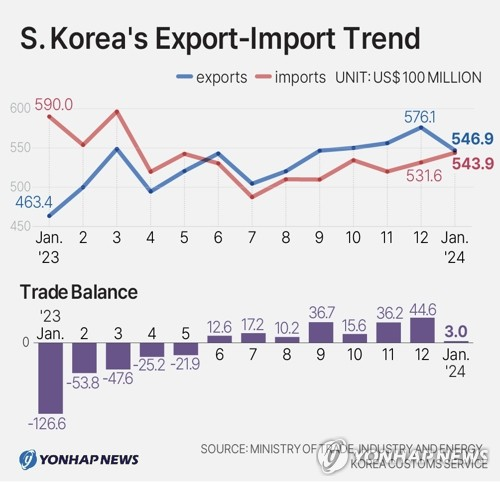
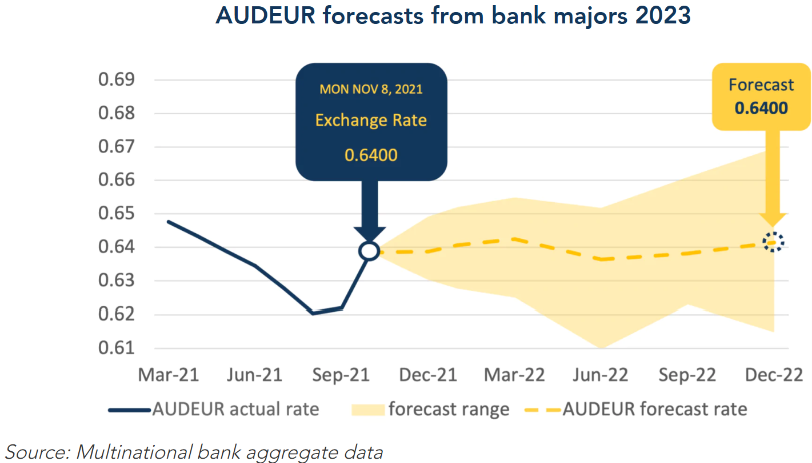
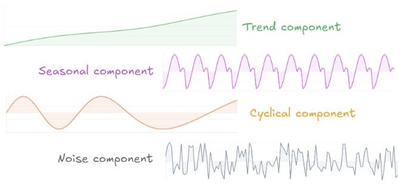

<style>
@media print{
  body, html, .remark-slides-area, .remark-notes-area {
    height: 100% !important;
    width: 100% !important;
    overflow: visible;
    display: inline-block;
    }
}
</style>

<style type="text/css">
.remark-slide-content {
    font-size: 34px;
    padding: 1em 4em 1em 4em;
}
</style>

<style type="text/css">
.my-one-page-font {
  font-size: 28px;
}
</style>

<style type="text/css">
.my-one-page-font-table {
  font-size: 24px;
}
</style>

<style>
.tiny { font-size: 60%; }      /* class you can reuse anywhere */
</style>

<style>
.remark-slide-content {
  position: relative;
  z-index: 1;
}

.remark-slide-content::before {
  content: "";
  position: absolute;
  top: 50%;
  left: 50%;
  width: 600px;          /* adjust size */
  height: 600px;
  background-image: url("1. 교장(Seal_Positive).png");  /* place logo file in same folder */
  background-repeat: no-repeat;
  background-position: center;
  background-size: contain;
  opacity: 0.05;         /* watermark transparency */
  transform: translate(-50%, -50%);
  pointer-events: none;
  z-index: 0;
}
</style>


```{r setup, include = FALSE}
library(tidyverse)
library(knitr)
library(reticulate)
# Ensure Python chunks use the project virtual environment.
use_python("c:/Users/vyshn/OneDrive - kdis.ac.kr/Documents/GitHub/Sogang/.venv/Scripts/python.exe", required = TRUE)
# Install packages once manually if needed; avoid installing during lecture rendering.
# py_install(c("pandas", "matplotlib", "scipy"), pip = TRUE)
opts_chunk$set(fig.width = 10,
         message = FALSE,
         warning = FALSE,
         echo = FALSE)
```

```{r xaringan-themer, include=FALSE, warning=FALSE}
#install.packages("xaringanthemer")
library(xaringanthemer)
style_mono_accent(
  base_color = "#851a10",
  header_font_google = google_font("Josefin Sans"),
  text_font_google   = google_font("Montserrat", "500", "550i"),
  code_font_google   = google_font("Fira Mono"),
  colors = c(
  red = "#f34213",
  purple = "#3e2f5b",
  orange = "#ff8811",
  green = "#136f63",
  white = "#FFFFFF"
)
)
```

# Agenda

* Part 1. Introduction to Time Series

* Part 2. Components of Time Series

* Part 3. Forecasting Methods

* Part 4. Forecast Accuracy

* Part 5. Python Example

* Part 6. Business Case

---

# Learning Objectives

After this lecture, you should be able to:

* explain what a time series is and distinguish it from cross-sectional data

* identify and interpret trend, seasonal, cyclical, and random components

* compute forecasts using naive, moving average, weighted moving average, and exponential smoothing methods

* evaluate and compare forecast performance using MAD and MSE

* implement and visualize a simple moving-average forecast in Python

* use forecasting results to support basic inventory planning decisions


---
class: inverse, center, middle
# Part 1. Introduction to Time Series

---

# What Is a Time Series?

A time series is a sequence of observations collected over time.
.pull-left[
Examples:

* monthly exports of Korea
* daily exchange rates
* quarterly GDP
* monthly company sales
* weekly website visitors

Question:

Why is time important here?
]

.pull-right[
<div>
.center[

]

</div>
]

---

# Cross-Sectional vs Time Series Data

| Cross-sectional   | Time series           |
| ----------------- | --------------------- |
| Many units        | One unit              |
| One point in time | Multiple time periods |
| Countries in 2025 | Korea from 2010–2025  |

Examples:

Cross-sectional:

* GDP of 50 countries in 2025

Time series:

* Korea's GDP from 2000–2025

---

# Illustrative Example: Why Order Matters

Suppose weekly online sales are:

120, 90, 140, 100

If we ignore time order, we only see an average level.

If we keep time order, we can detect:

* ups and downs
* possible trend
* possible seasonal pattern

Key point: in time series, sequence carries information.

---

# Why Forecast?
.pull-left[
Businesses use forecasts for:

* inventory planning

* staffing

* budgeting

* logistics

* production planning

* investment decisions

]

.pull-right[
<div>
.center[

]

</div>
]

> To reduce uncertainty and improve decision-making.

---

# Forecast Examples
.pull-left[
Forecast:

* exports

* imports

* shipping demand

* exchange rates

* tourism arrivals

* online sales
]

.pull-right[
<div>
.center[

]

</div>
]

---
class: inverse, center, middle
# Part 2. Components of Time Series

---


# Four Components of Time Series
.pull-left[
A time series may contain:

1. Trend

2. Seasonal variation

3. Cyclical variation

4. Random variation
]

.pull-right[
<div>
.center[

]

</div>
]

---

# Trend
.pull-left[
Long-run movement.

Examples:

* growth in exports

* growth in e-commerce sales
]
.pull-right[
```{python trend-illustration, fig.height=3.2}
import matplotlib.pyplot as plt

t = list(range(1, 37))
y = [100 + 2.2 * i for i in t]

plt.figure(figsize=(7.5, 3.2))
plt.plot(t, y, color="#1f4e79", linewidth=2.4)
plt.title("Trend Component")
plt.xlabel("Time")
plt.ylabel("Value")
plt.grid(alpha=0.2)
plt.tight_layout()
plt.show()
```
]

> Key point: trend shows the overall direction of the series over time.

---

# Seasonality
.pull-left[
Pattern repeating regularly.

Examples:

* tourism demand

* holiday sales

* airline passengers

Example:

December sales often exceed February sales.
]
.pull-right[
```{python seasonality-illustration, fig.height=3.2}
import math
import matplotlib.pyplot as plt

t = list(range(1, 37))
y = [120 + 18 * math.sin(2 * math.pi * (i / 12)) for i in t]

plt.figure(figsize=(7.5, 3.2))
plt.plot(t, y, color="#2ca02c", linewidth=2.4)
plt.title("Seasonal Component")
plt.xlabel("Month")
plt.ylabel("Value")
plt.grid(alpha=0.2)
plt.tight_layout()
plt.show()
```
]
> Key point: seasonality reflects regular fluctuations tied to calendar periods.
---

# Cyclical Variation
.pull-left[
Long-term business cycle effects.

Examples:

* recessions

* booms

* financial crises
]
.pull-right[
```{python cyclical-illustration, fig.height=3.2}
import math
import matplotlib.pyplot as plt

t = list(range(1, 73))
y = [140 + 22 * math.sin(2 * math.pi * (i / 48)) for i in t]

plt.figure(figsize=(7.5, 3.2))
plt.plot(t, y, color="#ff7f0e", linewidth=2.4)
plt.title("Cyclical Component")
plt.xlabel("Time")
plt.ylabel("Value")
plt.grid(alpha=0.2)
plt.tight_layout()
plt.show()
```
]
> Key point: cyclical variation reflects economic expansions and contractions over several years.
---

# Random Variation
.pull-left[
Unexpected events.

Examples:

* natural disasters

* strikes

* pandemics

Cannot be predicted perfectly.
]
.pull-right[
```{python random-illustration, fig.height=3.2}
import random
import matplotlib.pyplot as plt

random.seed(7)
t = list(range(1, 37))
y = [120 + random.gauss(0, 10) for _ in t]

plt.figure(figsize=(7.5, 3.2))
plt.plot(t, y, color="#d62728", linewidth=1.8, marker="o", markersize=3)
plt.title("Random Component")
plt.xlabel("Time")
plt.ylabel("Value")
plt.grid(alpha=0.2)
plt.tight_layout()
plt.show()
```
]
> Key point: random variation represents unpredictable fluctuations that cannot be systematically explained.
---
class: my-one-page-font

# Quick Component Identification Example
.pull-left[
Monthly ice cream sales show:

* upward movement over 5 years
* peaks every July-August
* decline during recession years
* unusual drop during a pandemic month
]
.pull-right[
Interpretation:

1. upward movement -> trend (because of growing demand)
2. July-August peaks -> seasonality (because of summer)
3. recession decline -> cyclical variation (because of economic cycle)
4. pandemic drop -> random variation (because of unexpected shock)
]

<div>
.center[

```{python component-identification-visual, fig.height=3.6}
import math
import random
import matplotlib.pyplot as plt

random.seed(10)
t = list(range(1, 61))

trend = [70 + 1.25 * i for i in t]
season = [9 * math.sin(2 * math.pi * (i / 12)) for i in t]
cycle = [7 * math.sin(2 * math.pi * (i / 36)) for i in t]
noise = [random.gauss(0, 2.8) for _ in t]

y = [trend[i - 1] + season[i - 1] + cycle[i - 1] + noise[i - 1] for i in t]
shock_month = 52
y[shock_month - 1] -= 28
cycle_baseline = [trend[i - 1] + cycle[i - 1] for i in t]

plt.figure(figsize=(9.2, 3.6))
plt.plot(t, y, color="#1f4e79", linewidth=2.1, marker="o", markersize=2.6, label="Observed series")

# Trend marker: long-run direction line.
plt.plot(t, trend, color="#ff7f0e", linestyle="--", linewidth=2.0, label="Trend")
plt.text(47, trend[46] + 2, "Trend", color="#ff7f0e", fontsize=10)

# Seasonality marker: recurring July-August windows.
for start in [7, 19, 31, 43, 55]:
  plt.axvspan(start - 0.5, start + 1.5, color="#2ca02c", alpha=0.12)
plt.text(2, max(y) + 2.2, "Seasonality: Jul-Aug windows", color="#2ca02c", fontsize=10)

# Cyclical marker: smooth business-cycle baseline and downturn shading.
plt.plot(t, cycle_baseline, color="#9467bd", linewidth=1.9, linestyle=":", label="Trend + cycle")
trough_month = cycle.index(min(cycle)) + 1
plt.axvspan(trough_month - 3, trough_month + 3, color="#9467bd", alpha=0.10)
plt.text(trough_month - 4, cycle_baseline[trough_month - 1] - 10, "Cyclical downturn", color="#9467bd", fontsize=10)

# Random variation marker: one-off pandemic shock.
plt.axvline(shock_month, color="#d62728", linestyle="--", linewidth=1.5, alpha=0.85)
plt.scatter([shock_month], [y[shock_month - 1]], color="#d62728", s=35, zorder=3, label="Random shock")
plt.text(shock_month + 0.8, y[shock_month - 1] + 5, "Random shock", color="#d62728", fontsize=10)

plt.title("Combined Time Series: Trend + Seasonality + Cycle + Random Shock")
plt.xlabel("Month")
plt.ylabel("Sales")
plt.grid(alpha=0.2)
plt.legend(loc="lower right", fontsize=9)
plt.tight_layout()
plt.show()
```
]
</div>

---
class: inverse, center, middle
# Part 3. Forecasting Methods

---

# Naïve Forecast

Forecast next period using current period.

$$
F_{t+1} = Y_t
$$

Example:

Current month's sales:

[
120
]

Forecast next month:

[
120
]

> Key point: naïve forecast is simple but ignores trends and seasonality.
---

# Moving Average

Forecast uses several previous observations, where 'moving' refers to the window of past observations considered.

Example:

Sales:

110, 120, 130, 140, 170, ...

3-period moving average:

$$
\frac{110+120+130}{3} = 120 \text{(for month 4);} \\
\frac{120+130+140}{3} = 130 \text{(for month 5)}
$$

> Key point: moving average smooths out short-term fluctuations but may lag behind trends.
---
.pull-left[
# Practice

Monthly exports:

80, 90, 60, 110, 75, ...

Compute 3-month moving average forecasts for months 4, 5, and 6.

Answer:


`$$(80+90+60)/3 = 76.67$$`
`$$(90+60+110)/3 = 86.67$$`
`$$(60+110+75)/3 = 81.67$$`

]
.pull-right[

# Why Moving Average?

Advantages:

* simple

* smooths fluctuations

Disadvantages:

* reacts slowly to sudden changes
]

---

# Weighted Moving Average

Recent observations receive higher weights.

Example:

Weights:

0.5, 0.3, 0.2

Observations:

130, 120, 110

Forecast:

$$
0.5(130) + 0.3(120) + 0.2(110) = 123
$$
> Key point: weighted moving average allows more flexibility by emphasizing recent data.
---

# Exponential Smoothing

Most popular business forecasting method.

Formula:

$$
F_{t+1} = \alpha Y_t + (1-\alpha)F_t
$$

where:

$$
0 < \alpha < 1 \text{ (smoothing constant, indicates weight on current observation)}
$$
> Key point: exponential smoothing gives more weight to recent observations while still considering past forecasts.

### Interpretation of Alpha

Large α responds quickly; small α gives smoother forecasts.

---

# Example

$$
\alpha = 0.30 \text{ (moderate weight on current observation)}
$$

Current sales:

[
100
]

Previous forecast:

[
90
]

Forecast:

$$
0.30(100) + 0.70(90) = 93
$$

---

# Illustrative Example: Choosing Alpha

Assume:

* current actual demand `\(Y_t = 120\)`
* previous forecast `\(F_t = 100\)`

If `\(\alpha = 0.8\)`:

$$
F_{t+1} = 0.8(120) + 0.2(100) = 116
$$

If `\(\alpha = 0.2\)`:

$$
F_{t+1} = 0.2(120) + 0.8(100) = 104
$$

Higher `\(\alpha\)` reacts faster to new information.

---
# Some other forecasting methods:
* Holt's linear trend method (for series with trend)

* Holt-Winters method (for series with trend and seasonality)

* ARIMA/SARIMA models (for complex patterns and autocorrelation)

* Machine learning methods (for large datasets and nonlinear relationships)

---
class: inverse, center, middle
# Part 4. Forecast Accuracy

---

# Forecast Errors

Forecast error:

$$
e_t = Y_t - F_t
$$

.pull-left[

Example:

* Actual: 100
* Forecast: 90
* Error: 10


]

.pull-right[
```{python forecast-error-visual, fig.height=4.1}
import matplotlib.pyplot as plt

actual = 100
forecast = 90
error = actual - forecast

fig, axes = plt.subplots(1, 2, figsize=(8.6, 4.1))

axes[0].bar(["Forecast", "Actual"], [forecast, actual], color=["#d62728", "#1f4e79"])
axes[0].set_title("Plot 1: Forecast vs Actual")
axes[0].set_ylim(80, 110)
axes[0].set_ylabel("Value")

axes[1].axhline(0, color="black", linewidth=1)
axes[1].bar(["Error (Y - F)"], [error], color="#2ca02c")
axes[1].set_title("Plot 2: Signed Forecast Error")
axes[1].set_ylim(-20, 20)
axes[1].set_ylabel("Error")

plt.tight_layout()
plt.show()
```

]
> Positive error means under-forecasting; negative error means over-forecasting.

---

# Mean Absolute Deviation (MAD)

$$
\mathrm{MAD} = \frac{\sum |e_t|}{n}
$$

Measures average forecasting error.

Smaller is better.
> Key point: MAD treats all errors equally regardless of direction.

# Mean Squared Error (MSE)

$$
\mathrm{MSE} = \frac{\sum e_t^2}{n}
$$

Large errors receive heavier penalties.
> Key point: MSE emphasizes larger errors more than MAD.


## Choose the method with smaller MAD and smaller MSE.

---

# Worked Accuracy Example

Actual demand for 4 months: 100, 110, 120, 130

.pull-left[

Method A

* Forecast: 98, 112, 118, 128
* Errors: 2, 2, 2, 2
* MAD = 2.0
* MSE = 4.0

]

.pull-right[

Method B

* Forecast: 90, 105, 130, 125
* Errors: 10, 5, 10, 5
* MAD = 7.5
* MSE = 62.5

]

Conclusion: Method A is more accurate because it has the smaller MAD and MSE.

---
# Some other forecast accuracy measures:
* Mean Absolute Percentage Error (MAPE)

$$
\mathrm{MAPE} = \frac{100\%}{n} \sum \left| \frac{e_t}{Y_t} \right|
$$

* Root Mean Squared Error (RMSE)
$$
\mathrm{RMSE} = \sqrt{\mathrm{MSE}} = \sqrt{\
frac{\sum e_t^2}{n}}
$$

---
class: inverse, center, middle
# Part 5. Python Example

---

# Why Python Here?

Python helps us turn the lecture ideas into a small forecasting workflow:

* build a dataset

* visualize the series

* create forecasts

* compare forecast accuracy


---
class: my-one-page-font
# Example Dataset and Trend
.pull-left[

Monthly export demand shows a steady upward pattern.

| Month | Exports |
| ----- | ------: |
| 1 | 120 |
| 2 | 124 |
| 3 | 128 |
| 4 | 131 |
| 5 | 135 |
| 6 | 140 |
| 7 | 144 |
| 8 | 149 |
| 9 | 153 |
| 10 | 158 |
| 11 | 162 |
| 12 | 167 |


]

.pull-right[

```{python part5-trend-plot, fig.height=3.8}
import pandas as pd
import matplotlib.pyplot as plt

sales = [120, 124, 128, 131, 135, 140, 144, 149, 153, 158, 162, 167]

df = pd.DataFrame({
  "Month": list(range(1, 13)),
  "Exports": sales
})

plt.figure(figsize=(8.5, 3.8))
plt.plot(df["Month"], df["Exports"], marker="o", linewidth=2.2, color="#1f4e79")
plt.title("Monthly Export Demand")
plt.xlabel("Month")
plt.ylabel("Exports")
plt.xticks(df["Month"])
plt.tight_layout()
plt.show()
```
Interpretation:

* the level is rising over time
* month-to-month changes are small
* this is a good setting for comparing simple forecasting methods
]

> The line slopes upward, which is why simple forecasting methods are useful here.

---

# Forecast Output
.pull-left[

The Python workflow produces two forecasts:

| Month | Actual | Naive | MA(3) |
| ----- | -----: | ----: | ----: |
| 4 | 131 | 128.0 | 124.0 |
| 5 | 135 | 131.0 | 127.7 |
| 6 | 140 | 135.0 | 131.3 |
| 7 | 144 | 140.0 | 135.3 |
| 8 | 149 | 144.0 | 139.7 |
| 9 | 153 | 149.0 | 144.3 |
| 10 | 158 | 153.0 | 148.7 |
| 11 | 162 | 158.0 | 153.3 |
| 12 | 167 | 162.0 | 157.7 |


]

.pull-right[

```{python part5-forecast-plot, fig.height=3.9}
df["Naive"] = df["Exports"].shift(1)
df["MA3"] = df["Exports"].rolling(3).mean()

plt.figure(figsize=(8.5, 3.9))
plt.plot(df["Month"], df["Exports"], marker="o", linewidth=2.2, label="Actual", color="#1f4e79")
plt.plot(df["Month"], df["Naive"], marker="s", linestyle="--", linewidth=1.8, label="Naive", color="#d62728")
plt.plot(df["Month"], df["MA3"], marker="^", linestyle="--", linewidth=1.8, label="MA(3)", color="#2ca02c")
plt.title("Actual Demand vs Forecasts")
plt.xlabel("Month")
plt.ylabel("Exports")
plt.xticks(df["Month"])
plt.legend()
plt.tight_layout()
plt.show()
```
Interpretation:

* the naive forecast follows the most recent value
* MA(3) is smoother, but it lags behind the rising trend
]

> The chart makes the lag visible at a glance.

---

# Accuracy Summary
.pull-left[

| Method | MAD | MSE |
| ------ | ---: | ---: |
| Naive | 4.27 | 18.64 |
| MA(3) | 8.56 | 73.82 |

Conclusion:

* for this steadily rising series, the naive forecast is more accurate numerically

* MA(3) is still useful because it smooths short-term fluctuations

* MAD and MSE make the comparison objective and easy to explain

]

.pull-right[

```{python part5-accuracy-plot, fig.height=3.9}
cmp = df.dropna(subset=["Naive", "MA3"]).copy()

def metrics(y, f):
  e = y - f
  return pd.Series({"MAD": e.abs().mean(), "MSE": (e**2).mean()})

results = pd.DataFrame({
  "Naive": metrics(cmp["Exports"], cmp["Naive"]),
  "MA3": metrics(cmp["Exports"], cmp["MA3"]),
}).T

ax = results.plot(kind="bar", figsize=(8.5, 3.9), color=["#d62728", "#2ca02c"])
ax.set_title("Forecast Accuracy Comparison")
ax.set_xlabel("Method")
ax.set_ylabel("Value")
plt.xticks(rotation=0)
plt.tight_layout()
plt.show()
```

]

> Lower bars are better, and both MAD and MSE favor the naive forecast here.

---

# What to Remember

The key lesson is not only how to code the forecast, but how to read the output:

* tables show the forecast values directly

* figures would show the trend and the lag visually

* accuracy measures tell us which method fits the data better

---
class: inverse, center, middle
# Part 6. Business Case

---

# Case Study

A Korean exporter observes monthly export demand:

| Month | Orders |
| ----- | ------ |
| Jan   | 120    |
| Feb   | 130    |
| Mar   | 140    |
| Apr   | 145    |
| May   | 160    |

Tasks:

1. Calculate 3-month moving average.
2. Forecast June demand.
3. Recommend inventory planning.

---

# What We Learned

Time series components:

* trend
* seasonality
* cycles
* randomness

Forecasting methods:

* naïve
* moving average
* weighted moving average
* exponential smoothing

Forecast evaluation:

* MAD
* MSE

---

# Final Message

Forecasts are never perfect.

Good forecasting reduces uncertainty and improves business decision-making.


---

# Remaining Schedule

*(June 9)* Multiple Time Series and Forecasting (LMW Chapter 16)
  - Final review and Q&A session

*(June 11)* Project presentations

*(June 16)* No class (final exam week)

*(June 18)* Final Exam


---

class: inverse, center, middle

# Any questions?

# Thank you for your attention and active participation!


???
1. To print pdf slides
https://stackoverflow.com/questions/54968311/xaringan-export-slides-to-pdf-while-preserving-formatting

pagedown::chrome_print("W-11_SIC.html") # but not all pictures are visible

2. Option: https://stackoverflow.com/questions/54968311/xaringan-export-slides-to-pdf-while-preserving-formatting

install.packages("remotes")
remotes::install_github("jhelvy/xaringanBuilder")
remotes::install_github("jhelvy/renderthis@v0.0.9")

library(xaringanBuilder)
build_pdf("W-11_SIC.html")

3. Option
writeBin(as.raw(c()), "favicon.ico") # create an empty favicon.ico file
install.packages("renderthis")
remotes::install_github('rstudio/chromote')
library(renderthis)

renderthis::to_pdf("W-15_SIC.html")

getwd()
setwd("C:\\Users\\vyshn\\OneDrive - kdis.ac.kr\\Documents\\GitHub\\Sogang\\2026\\Spring\\Statistics for International Commerce\\Week_15")