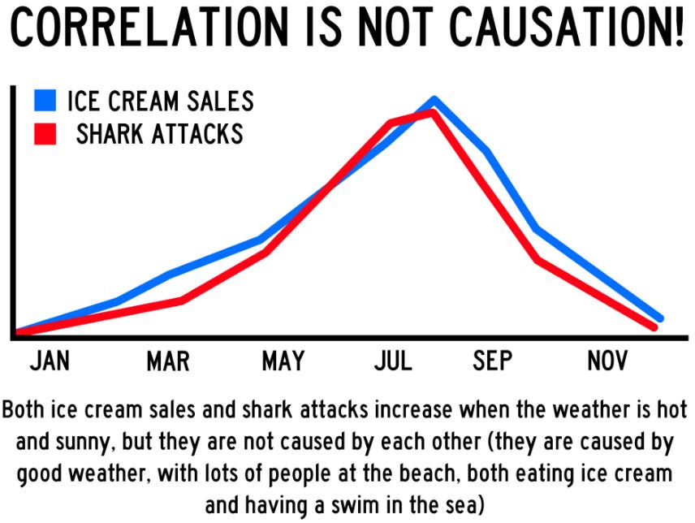
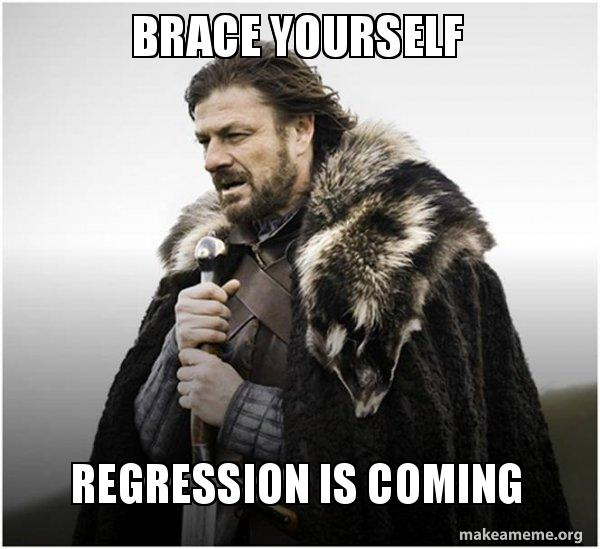

<style>
@media print{
  body, html, .remark-slides-area, .remark-notes-area {
    height: 100% !important;
    width: 100% !important;
    overflow: visible;
    display: inline-block;
    }
</style>

<style type="text/css">
.remark-slide-content {
    font-size: 34px;
    padding: 1em 4em 1em 4em;
}
</style>

<style type="text/css">
.my-one-page-font {
  font-size: 28px;
}
</style>

</style>

<style type="text/css">
.my-one-page-font-table {
  font-size: 20px;
}
</style>

<style>
.tiny { font-size: 60%; }      /* class you can reuse anywhere */
</style>

<style>
.remark-slide-content {
  position: relative;
  z-index: 1;
}

.remark-slide-content::before {
  content: "";
  position: absolute;
  top: 50%;
  left: 50%;
  width: 600px;          /* adjust size */
  height: 600px;
  background-image: url("1. 교장(Seal_Positive).png");  /* place logo file in same folder */
  background-repeat: no-repeat;
  background-position: center;
  background-size: contain;
  opacity: 0.05;         /* watermark transparency */
  transform: translate(-50%, -50%);
  pointer-events: none;
  z-index: 0;
}
</style>


```{r setup, include = FALSE}
library(tidyverse)
library(knitr)

opts_chunk$set(fig.width = 10, 
               message = FALSE, 
               warning = FALSE,
               echo = FALSE)
```

```{r xaringan-themer, include=FALSE, warning=FALSE}
#install.packages("xaringanthemer")
library(xaringanthemer)
style_mono_accent(
  base_color = "#851a10",
  header_font_google = google_font("Josefin Sans"),
  text_font_google   = google_font("Montserrat", "500", "550i"),
  code_font_google   = google_font("Fira Mono"),
  colors = c(
  red = "#f34213",
  purple = "#3e2f5b",
  orange = "#ff8811",
  green = "#136f63",
  white = "#FFFFFF"
)
)
```


Hello everyone!

I am *Iegor Vyshnevskyi*, your instructor for **Statistics for International Commerce**.

I hope you are **excited** to start this journey into the *world of statistics and economics*!

---

class: inverse, center, middle

# Icebreaker  
## How Wrong Can Humans Be?

---

# Quick Poll (No Phones Yet)

Which of the following do you think is TRUE?

  A) More people die each year from shark attacks than from vending machines.  

  B) Most international trade happens between rich and poor countries.  

  C) Small exchange rate changes (1–2%) never matter for firms.  

  D) Countries with higher GDP always have higher living standards.

Raise your hand for your answer.

---

# Reality Check

A) False – vending machines are statistically more dangerous than sharks.  

B) False – most trade happens between developed economies.  

C) False – small % changes can have huge profit effects.  

D) False – GDP per capita ≠ distribution, inequality matters.

Lesson:
*Our intuition is often wrong.*

**That is why we need statistics.**

---

class: center, middle

# Mini-Game  
## Guess the Number

---

# Guess the Number

Without Googling/AI:

  1) What percentage of global trade is services?  

  2) What percentage of world trade involves global value chains?  

  3) What is the average tariff rate globally?

Write your guesses.

We will revisit these later in the semester.

---

class: inverse, center, middle

# Why This Matters

If your guess is far from reality,  
that is not a failure.

That is the starting point of learning.

Statistics reduces the gap between:
what we think  
and what the data says.

---

class: inverse, center, middle

# Final Icebreaker Question

Which best describes you?

1) “I love numbers.” 

2) “I tolerate numbers.”  

3) “Numbers tolerate me.” 

4) “I survived math. Barely.”

Be honest.

**This course is designed for all four types.**


---

# Agenda

1. Course welcome and logistics

2. What this course is about

3. How we will learn (Python or R, DataCamp, applied work)

4. Expectations, policies, grading

5. Statistics in International Commerce 

---

class: inverse, center, middle

# 1. Course welcome and logistics

---

# Course Information

* Course Title: Statistics for International Commerce

* Course Number: TIC2001

* Credit: 3

* Semester: Spring 2026

* Class Time: TU/TH 13:30–14:45

* Target students: All students planning to major in International Commerce

---

# Instructor

.pull-left[

* Name: Iegor Vyshnevskyi

- Assistant Professor [(link)](https://elic.sogang.ac.kr/lic.en/lic_en_01_04_05.html), Sogang University

* Office: J721

* Office hours:

  * TU, WE 10:00–12:00
  * TH 14:45–16:45

* Additional availability:

  * Online meetings by email request
    ]

.pull-right[

* Email: ievysh@sogang.ac.kr

* [My page](https://iegor-vy.github.io/)

* Communication preference:

  * LMS for most Q and A
  * Email mainly for meeting requests and urgent issues

* *Hobbies*: research, martial arts, cycling, etc.

]

---

# About you (quick start)

* Preferred name

* Major interest inside International Commerce

* One practical thing you want to be able to do with data by the end of the semester

* What do you expect from this course?


---

class: inverse, center, middle

# 2. What this course is about

---

# Course description

* This course introduces statistical methods used in international commerce, economics, and policy analysis.

* We focus on summarizing and visualizing data, modeling uncertainty with probability, doing statistical inference, and using regression for real-world questions.

* Applied interpretation is the priority.

---

# Learning outcomes

By the end of the course, you will be able to:

* Analyze and visualize economic and business data relevant to international commerce

* Apply probability models to assess uncertainty

* Conduct statistical inference and evaluate evidence

* Estimate and interpret regression models for policy and business analysis

* Use Python or R to perform reproducible statistical analysis

* Communicate results clearly to non-technical audiences

---

# Disclaimer

- This course may be adjusted during the semester depending on class progress and learning needs.

---

class: inverse, center, middle

# 3. How we will learn

---

# Course format

* Flipped and applied learning approach:

  * Short prep materials before class
  * Class time for discussion, interpretation, coding demos, and hands-on problem solving

* Real economic and business datasets are used throughout

* Emphasis on understanding concepts and interpretation, not just formulas

* Safe space for questions and learning from mistakes


---

# Course materials

1. **Required / Core Reference:**
  - Douglas Lind, William Marchal, Samuel Wathen. *Statistical Techniques in Business and Economics*, 16th ed. (LMW)

2. **Supplementary Resources:**
  - James, G., Witten, D., Hastie, T., Tibshirani, R., & Taylor, J. (2023). *An Introduction to Statistical Learning: with Applications in Python* (ISLP). Available at https://www.statlearning.com/
  - James, G., Witten, D., Hastie, T., Tibshirani, R., & Taylor, J. (2013). *An Introduction to Statistical Learning: with Applications in R* (ISLR). Available at https://www.statlearning.com/

3. **Online Platforms:**
  - DataCamp Classroom (assigned modules)
  - Google Colab (for coding practice)

---

# Tools we will use: Python and DataCamp and LLMs

* Python (primary), or R (allowed option depending on your track)

* DataCamp Classroom:

  * guided practice to build core coding fluency
  * structured exercises aligned with weekly topics

* Large Language Models (LLMs):

  * for brainstorming, debugging, and learning support
  * not for blindly copying code or answers

* Goal: you become independent enough to run analyses without copying code blindly

---

# What “mastering Python” means in this course

You will repeatedly practice:

* Working with datasets (loading, cleaning, selecting variables)

* Describing data (summary statistics, basic plots)

* Probability and simulation intuition (simple experiments with code)

* Inference and regression workflows (estimate, diagnose, interpret)

* Reproducibility habits (clear scripts, documented outputs)

---

# Our Main Coding Interface: Google Colab

We will primarily use **Google Colab**.

Why?

- Runs in your browser (no installation needed)
- Free access to Python environment
- Easy sharing and submission
- Works on any computer

All you need:
- A Google account
- Internet connection
- A laptop

---

# What is Google Colab?

[Google Colab](https://colab.research.google.com/) is an online Jupyter Notebook environment.

It allows you to:

- Write and run Python code  
- Combine text, formulas, and code  
- Visualize data (plots, tables)  
- Save work automatically in Google Drive  

It is widely used in data science and research.

---

# What You Will Do in Colab

In this course, you will:

- Load datasets (CSV, Excel)
- Clean and prepare data
- Compute statistics
- Create visualizations
- Estimate regression models
- Interpret results

Everything will be reproducible.

---

# Can I Use Something Else?

Yes.

You may use:

- VS Code  
- Jupyter Notebook  
- PyCharm  
- RStudio (if using R)

However:
- Support and demonstrations will be done in Colab.
- Your code must run properly when submitted.

---

# Why This Matters

The goal is not just learning statistics.

It is learning to:

- Think analytically  
- Work with real data  
- Produce reproducible analysis  
- Build practical data skills for international commerce

Colab is simply our tool.

---

class: inverse, center, middle

# 4. Expectations, policies, grading

---

# Grading

* Midterm Exam: 25%

* Final Exam: 25%

* 2 Quizzes: 10%

* Project: 10%

* Assignments: 20%

* Participation: 10%

More details on each component will be provided down the road.

*Remember*, I'm not giving you grades; you're earning them.

---

# Course policies (high priority)

* Academic integrity is strict:

  * Plagiarism can lead to zero for the task and an F-grade in the course

* No photos or video in class without permission

* Most Q and A should happen in LMS so everyone benefits (you can post anonymously)

---

class: my-one-page-font-table

# Course roadmap

| Week | Date | Topic | Reading |
|------|------|-------|---------|
| 1 | Mar 3 | Course Introduction: Why do we need to study statistics? | Slides |
| 1 | Mar 5 | Introduction to statistics & Introduction to Python/R and datasets & ethics | LMW Chapter 1 |
| 2 | Mar 10, Mar 12 | Descriptive statistics | LMW Chapter 3 |
| 3 | Mar 17, Mar 19 | Survey of probability concepts | LMW Chapter 5 |
| 4 | Mar 24, Mar 26 | Discrete probability distributions | LMW Chapter 6 |
| 5 | Mar 31 | Continuous probability distributions | LMW Chapter 7 |
| 5 | Apr 2 | Quiz #1 | |
| 6 | Apr 7, Apr 9 | Sampling distributions; central limit theorem; estimation; confidence intervals | LMW Chapters 8–9 |
| 7 | Apr 14, Apr 16 | Sampling distributions; central limit theorem; estimation; confidence intervals | LMW Chapters 8–9 |
| 8 | Apr 21, Apr 23 | Midterm Exam | |
| 9 | Apr 28, Apr 30 | One-sample hypothesis testing | LMW Chapter 10 |
| 10 | May 5 | Two-sample hypothesis testing | LMW Chapter 11 |
| 10 | May 7 | Nominal-level hypothesis tests | LMW Chapter 15 |
| 11 | May 12, May 14 | Analysis of variance (ANOVA) | LMW Chapter 12 |
| 12 | May 19, May 21 | Correlation and simple linear regression | LMW Chapter 13 |
| 13 | May 26 | Quiz #2 | |
| 13 | May 28 | Multiple regression analysis | LMW Chapter 14 |
| 14 | Jun 2 | Multiple regression analysis | LMW Chapter 14 |
| 14 | Jun 4 | Multiple time series and forecasting | LMW Chapter 16 |
| 15 | Jun 9 | Multiple time series and forecasting | LMW Chapter 16 |
| 15 | Jun 11 | Project presentations | |
| 16 | Jun 16, Jun 18 | Final Exam | |

.tiny[
Tentative schedule. It may be adjusted based on the class background and progress.]

---

# General things

- **Our Goals**:
   - to learn the basics of Statistics for International Commerce 
   - to apply the knowledge in real-life scenarios
   - see that *Statistics* is .red[fun] :-)

- **Our Principle**: 
   - learning by doing
   - mutual respect
   - put one's efforts

- **My role**: to guide you through the course, i.e. **mentoring and facilitating ** 

- Your suggestions are welcomed and appreciated to make the course better for you and future students.

---

# Our communication

- Check the website regularly for materials and messages

- Feel free to approach me before or after our class

- **Office hours**: J721, Tu10-12, W10-12, Thu3-5  or by appointment. You are welcome to discuss course-related issues and questions, career plans, etc.

- Check / use **LMS** (incl. messages in-there)

- **Emailing policy**: email me to set up a one-to-one meeting or in the case of some urgent issues.
   - Please indicate the course name in the subject line and the issue (e.g., *[Statistics for International Commerce ]* Meeting request)
   
   - Please write at least two times when you would like to meet and a brief description (1-2 sentence) why you want to meet up with me
   
   - I may not reply on time (so email me in advance)


---


class: inverse, center, middle

# Statistics in International Commerce  
## Let’s Make It Real (and a Bit Fun)

---

# Why International Commerce Needs Statistics

Imagine you work in:

- An exporting company deciding where to expand  

- A multinational firm managing currency risk  

- A government agency evaluating trade policy  

- A logistics company optimizing global supply chains  

All of them rely on data.

Statistics turns raw numbers into decisions.

---

# Example 1: Exchange Rates & Profits

Suppose your company exports to the U.S.

Question:
- If KRW appreciates by 5%, what happens to revenue in KRW?

With statistics, we can:

- Model exchange rate volatility  
- Estimate revenue sensitivity  
- Forecast possible profit scenarios  

Without statistics:
- “Let’s hope the exchange rate behaves.”

---

# Example 2: Market Entry Decision

You are analyzing two countries:

- Country A: higher GDP growth, unstable inflation  
- Country B: stable inflation, slower growth  

Using statistics, you can:

- Compare averages and variability  
- Test whether differences are statistically significant  
- Estimate demand using regression  

This is not math for math’s sake.  
It is structured decision-making under uncertainty.

---

# Example 3: Consumer Data

An international e-commerce platform collects:

- Click data  
- Purchase history  
- Country-level preferences  

Statistics helps to:

- Segment customers  
- Estimate price elasticity  
- Predict demand  

Behind every “recommended for you” section there is probability and regression.

---

# Example 4: Trade Policy Evaluation

Suppose tariffs increase.

We may ask:

- Did imports decrease significantly?  
- Did domestic production increase?  
- Was the effect temporary or persistent?

We use:

- Before-after comparisons  
- Hypothesis testing  
- Regression models  

Statistics helps separate signal from noise.

---

class: inverse, center, middle

# Now Let’s Make It Fun

---

# Meme 1: Correlation vs Causation

.pull-left[

.center[

]]

.pull-right[
“Correlation does not imply causation.”

Just because two variables move together  
does not mean one causes the other.

In international commerce:
- GDP growth and exports may move together  
But why?

That’s where analysis begins.
]
---

# Meme 2: Forecasting

.center[

]

Forecasting be like:

“We predict with 95% confidence that something will happen… unless it doesn’t.”

Statistics does not remove uncertainty.  

It quantifies it.

---

# Meme 3: Regression Be Like

.pull-left[
.center[

]]

.pull-right[
Regression students:

“Is this coefficient significant?”

Professor:

“First, tell me what it means economically.”

Numbers without interpretation are useless.
]

---

# Meme 4: Data Cleaning

.pull-left[
.center[

]]

.pull-right[
Expectation: glamorous data science.  

Reality: cleaning messy spreadsheets for 3 hours.

In this course:
You will learn that cleaning is 50-80% of real analysis.
]

---

# Quick Interactive Exercise

Think about one international commerce question:

- Why did exports fall last year?  
- What determines foreign direct investment?  
- Does exchange rate volatility reduce trade?  
- Do trade agreements increase bilateral flows?

Now ask:

Which data would you need?  
Which statistical tools might help?

---

# The Big Idea

Statistics is not about formulas.

It is about:

- Making better decisions  
- Understanding global markets  
- Reducing uncertainty  
- Thinking critically  

And yes, sometimes laughing at regression memes.

---

class: inverse, center, middle

# Ready to start thinking like an analyst?

---

# Week 1 overview (where we are today)

Meeting 1 (today):

* Course introduction: Why do we study statistics

Meeting 2 (Thursday):

* Introduction to statistics

* Introduction to Python or R, datasets, and ethics

* Reading: LMW Chapter 1

---

class: inverse, center, middle

# Any questions before we start our journey?

# Thank you


???
1. To print pdf slides
https://stackoverflow.com/questions/54968311/xaringan-export-slides-to-pdf-while-preserving-formatting

pagedown::chrome_print("W1_ME.html") # but not all pictures are visible

2. Option: https://stackoverflow.com/questions/54968311/xaringan-export-slides-to-pdf-while-preserving-formatting

install.packages("remotes")
remotes::install_github("jhelvy/xaringanBuilder")
remotes::install_github("jhelvy/renderthis@v0.0.9")

library(xaringanBuilder)
build_pdf("DVC.html")

3. Option
writeBin(as.raw(c()), "favicon.ico") # create an empty favicon.ico file
install.packages("renderthis")
remotes::install_github('rstudio/chromote')
library(renderthis)

renderthis::to_pdf("W-1_1_SIC.html")

getwd()
setwd("C:\\Users\\vyshn\\OneDrive - kdis.ac.kr\\Documents\\GitHub\\Sogang\\2026\\Spring\\Statistics for International Commerce\\Week_1_1")

