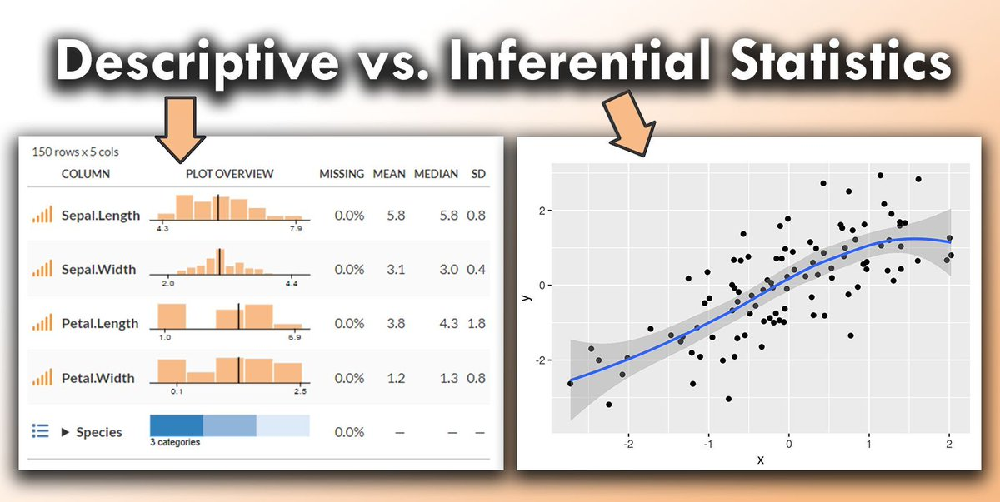
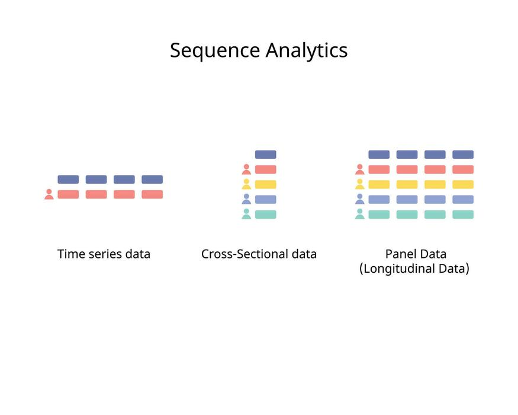

<style>
@media print{
  body, html, .remark-slides-area, .remark-notes-area {
    height: 100% !important;
    width: 100% !important;
    overflow: visible;
    display: inline-block;
    }
</style>

<style type="text/css">
.remark-slide-content {
    font-size: 34px;
    padding: 1em 4em 1em 4em;
}
</style>

<style type="text/css">
.my-one-page-font {
  font-size: 28px;
}
</style>

</style>

<style type="text/css">
.my-one-page-font-table {
  font-size: 24px;
}
</style>

<style>
.tiny { font-size: 60%; }      /* class you can reuse anywhere */
</style>

<style>
.remark-slide-content {
  position: relative;
  z-index: 1;
}

.remark-slide-content::before {
  content: "";
  position: absolute;
  top: 50%;
  left: 50%;
  width: 600px;          /* adjust size */
  height: 600px;
  background-image: url("1. 교장(Seal_Positive).png");  /* place logo file in same folder */
  background-repeat: no-repeat;
  background-position: center;
  background-size: contain;
  opacity: 0.05;         /* watermark transparency */
  transform: translate(-50%, -50%);
  pointer-events: none;
  z-index: 0;
}
</style>


```{r setup, include = FALSE}
library(tidyverse)
library(knitr)
library(reticulate)
py_install(c("pandas", "matplotlib"), pip = TRUE)

opts_chunk$set(fig.width = 10, 
               message = FALSE, 
               warning = FALSE,
               echo = FALSE)
```

```{r xaringan-themer, include=FALSE, warning=FALSE}
#install.packages("xaringanthemer")
library(xaringanthemer)
style_mono_accent(
  base_color = "#851a10",
  header_font_google = google_font("Josefin Sans"),
  text_font_google   = google_font("Montserrat", "500", "550i"),
  code_font_google   = google_font("Fira Mono"),
  colors = c(
  red = "#f34213",
  purple = "#3e2f5b",
  orange = "#ff8811",
  green = "#136f63",
  white = "#FFFFFF"
)
)
```


Hello everyone!

What a nice day to **start learning** statistics for international commerce. :-)

---

# Agenda

1. What is statistics (properly defined)?

2. Types of data in international commerce

3. Population vs sample

4. Introduction to Python in Google Colab

5. Real-World Example

6. First hands-on example

---

class: inverse, center, middle

# 1. What Is Statistics — More Precisely?

---

# A More Technical Definition

.pull-left[
Statistics is the science of:

- Designing data collection

- Summarizing data

- Quantifying uncertainty

- Making inferences about populations

- Supporting decision-making under uncertainty

It is not just “calculating averages.”
]

.pull-right[
.center[

]]

---

# Two Branches of Statistics

.pull-left[
## 1. Descriptive Statistics
- Summarize data
- Means, medians, standard deviations
- Tables and graphs

## 2. Inferential Statistics
- Draw conclusions about a population
- Hypothesis testing
- Confidence intervals
- Regression models

This course covers both.
]

.pull-right[
.center[

]]

*The key takeaway*: Descriptive statistics help you describe your current data, while inferential statistics allow you to make predictions and informed decisions based on your data.

---

class: inverse, center, middle

# 2. Data in International Commerce

---

# What Is Data?

Data = recorded information about variables.

.pull-left[
Example variables in international commerce:

- Export volume
- GDP
- Exchange rate
- Inflation
- Tariff rate
- FDI inflows
]

.pull-right[
.center[]
]

A variable is a measurable characteristic.

---

# Types of Variables

.pull-left[
## 1. Quantitative (Numerical)

- GDP
- Exchange rate
- Revenue
- Inflation rate

Can be:
- Discrete (number of trade agreements)
- Continuous (exchange rate)
]

.pull-right[
## 2. Qualitative (Categorical)

- Country
- Region
- Trade agreement type
- Industry sector
]

---

# Cross-Section vs Time Series vs Panel

## Cross-section
Different countries at one point in time.

Example:
GDP of 50 countries in 2024.

## Time series
One country over time.

Example:
Korea’s exports 2000–2025.

## Panel data
Multiple countries over time.

Example:
Exports of 30 countries over 20 years.

We will work with all three.

---

.center[]

---

class: inverse, center, middle

# 3. Population vs Sample

---

# Population vs Sample

.pull-left[
## Population
The entire group we care about.

Examples:
- All exporting firms in Korea
- All international trade flows globally
- All consumers in a country

Usually impossible to observe fully.
]

.pull-right[
## Sample

A subset of the population.

We use samples because:
- Data collection is costly
- Full data may not exist
- Time constraints
]

Inferential statistics helps us generalize from sample to population.

---

# Why Sampling Matters

Bad sample → biased conclusions.

Example:
If you only survey large exporters,
you cannot infer about small firms.

Statistical thinking begins with:
“How was this data collected?”

---

class: inverse, center, middle

# 4. Introduction to Python (Google Colab)

---

# Today’s Goal

By the end of today, you should:

- Open Google Colab

- Run Python code

- Load a dataset

- Compute simple statistics

- Create a basic visualization

No prior coding required.

---

# Structure of a Notebook

In Colab:

- Text cells (explanations)

- Code cells (Python commands)

- Output (tables, plots)

You execute code cell by cell.

Statistics becomes interactive.

---

# First Python Example

```{python, echo=TRUE}

# Import pandas library to handle data
import pandas as pd

# Create simple data
exports = [100, 120, 130, 150, 170]

# Convert to DataFrame for better handling
df = pd.DataFrame({"Exports": exports})

# Display the data
df
```


---

# Descriptive Statistics in Python

```{python, echo=TRUE}

# Show summary statistics
df.describe()

```

This returns:

* Mean

* Standard deviation

* Minimum

* Maximum

This is descriptive statistics.

---

# Simple Visualization

```{python, echo=TRUE, fig.width=4, fig.height=3, out.width="50%"}

# Import matplotlib for plotting
import matplotlib.pyplot as plt

plt.plot(exports) # simple line plot
plt.title("Export Growth Example") # add title
plt.xlabel("Year") # add x-axis label
plt.ylabel("Exports") # add y-axis label
plt.show() # display the plot

```

Visualization helps us see patterns immediately.


---

class: inverse, center, middle

# 5. Real-World Example  
## International Trade Data

---

# Example Dataset: Bilateral Trade (Simplified)

Suppose we observe export values (in billion USD) for 2023:

| Country        | Exports (bn USD) |
|---------------|------------------|
| Korea         | 632              |
| Germany       | 1650             |
| Japan         | 747              |
| United States | 2064             |
| Vietnam       | 355              |

This resembles WTO-style aggregated trade data.

Question:
Who is “big” depends on what?

---

# Step 1: Load Data in Python

```{python, echo=TRUE}

import pandas as pd

data = {
    "Country": ["Korea", "Germany", "Japan", "United States", "Vietnam"],
    "Exports_bn_USD": [632, 1650, 747, 2064, 355]
}

df = pd.DataFrame(data)

df
```

Now we have a small cross-sectional trade dataset.

---

# Step 2: Descriptive Statistics

```{python, echo=TRUE}

df["Exports_bn_USD"].describe()

```

Interpret:

* Mean export level
* Minimum exporter
* Maximum exporter
* Spread of values

Question:
Is the mean representative here?

---

# Step 3: Visualization -> Large dispersion | One dominant exporter | Skewness in trade distribution

```{python, echo=TRUE, fig.width=3, fig.height=2, out.width="50%", fig.align="center", dpi=200}

import matplotlib.pyplot as plt
plt.bar(df["Country"], df["Exports_bn_USD"])
plt.title("Exports in 2023 (bn USD)", fontsize=6)
plt.ylabel("Billion USD", fontsize=6)
plt.xticks(rotation=45, fontsize=6)
plt.tight_layout()
plt.show()


```

---

class: inverse, center, middle

# Statistical Thinking Begins Here

---

# Discussion Questions

1. Does a higher export value mean a stronger economy?
2. Should we compare absolute exports or exports per capita?
3. What if we adjust for GDP?
4. Are these differences statistically meaningful?

Statistics helps refine naive comparisons.

---

# Extending the Dataset (Time Series)

Suppose Korea’s exports over 5 years:

| Year | Exports (bn USD) |
| ---- | ---------------- |
| 2019 | 542              |
| 2020 | 512              |
| 2021 | 644              |
| 2022 | 683              |
| 2023 | 632              |

Now we have time series data.

---

# Time Series in Python

```{python, echo=TRUE, fig.width=3, fig.height=2, out.width="50%", fig.align="center", dpi=200}

korea_exports = [542, 512, 644, 683, 632]

plt.plot(korea_exports)
plt.title("Korea Exports (2019–2023)")
plt.xlabel("Year index")
plt.ylabel("Billion USD")
plt.tight_layout()
plt.show()

```

Questions: Was 2020 an outlier? | Is there an upward trend? | How volatile are exports?

---

class: inverse, center, middle

# From Description to Inference

---

# Next Logical Questions

* Is export growth statistically significant?

* What determines export performance?

* Does exchange rate depreciation increase exports?

* Does inflation reduce competitiveness?

These require inferential statistics and regression.

We will build toward this.

---

# Big Picture

Even a simple 5-row dataset:

* Allows comparison

* Reveals distribution patterns

* Raises policy questions

* Shows why structure matters

Statistics transforms numbers into economic insight.

---

class: inverse, center, middle

# 6. Hands-On Mini Exercise

---

# Exercise (5 minutes)

1. Create a list of 5 numbers representing:

   * Exchange rate values
     OR
   * Trade volumes

2. Compute:

   * Mean
   * Maximum
   * Minimum

3. Plot the values.

Goal:
Become comfortable running code.

---

# Why This Matters

In international commerce:

* You will analyze real data.
* You will interpret coefficients.
* You will evaluate uncertainty.

Python is not the goal.
It is the tool.

Statistics is the framework.

---

# Key Takeaways Today

* Statistics helps us reason under uncertainty.

* Data comes in different structures.

* Samples allow inference about populations.

* Python allows us to implement statistical ideas.

---

# Week 1 overview (where we are today)

Meeting 2 (today):

* Introduction to statistics

* Introduction to Python or R, datasets, and ethics

* Reading: LMW Chapter 1

# Week 2 overview (next week)

* Descriptive statistics (LMW Chapter 3)

---

class: inverse, center, middle

# Any questions?

# Thank you!


???
1. To print pdf slides
https://stackoverflow.com/questions/54968311/xaringan-export-slides-to-pdf-while-preserving-formatting

pagedown::chrome_print("W1_ME.html") # but not all pictures are visible

2. Option: https://stackoverflow.com/questions/54968311/xaringan-export-slides-to-pdf-while-preserving-formatting

install.packages("remotes")
remotes::install_github("jhelvy/xaringanBuilder")
remotes::install_github("jhelvy/renderthis@v0.0.9")

library(xaringanBuilder)
build_pdf("DVC.html")

3. Option
writeBin(as.raw(c()), "favicon.ico") # create an empty favicon.ico file
install.packages("renderthis")
remotes::install_github('rstudio/chromote')
library(renderthis)

renderthis::to_pdf("W-1_2_SIC.html")

getwd()
setwd("C:\\Users\\vyshn\\OneDrive - kdis.ac.kr\\Documents\\GitHub\\Sogang\\2026\\Spring\\Statistics for International Commerce\\Week_1_2")

