<style>
@media print{
  body, html, .remark-slides-area, .remark-notes-area {
    height: 100% !important;
    width: 100% !important;
    overflow: visible;
    display: inline-block;
    }
</style>

<style type="text/css">
.remark-slide-content {
    font-size: 34px;
    padding: 1em 4em 1em 4em;
}
</style>

<style type="text/css">
.my-one-page-font {
  font-size: 28px;
}
</style>

</style>

<style type="text/css">
.my-one-page-font-table {
  font-size: 24px;
}
</style>

<style>
.tiny { font-size: 60%; }      /* class you can reuse anywhere */
</style>

<style>
.remark-slide-content {
  position: relative;
  z-index: 1;
}

.remark-slide-content::before {
  content: "";
  position: absolute;
  top: 50%;
  left: 50%;
  width: 600px;          /* adjust size */
  height: 600px;
  background-image: url("1. 교장(Seal_Positive).png");  /* place logo file in same folder */
  background-repeat: no-repeat;
  background-position: center;
  background-size: contain;
  opacity: 0.05;         /* watermark transparency */
  transform: translate(-50%, -50%);
  pointer-events: none;
  z-index: 0;
}
</style>


```{r setup, include = FALSE}
library(tidyverse)
library(knitr)
library(reticulate)
py_install(c("pandas", "matplotlib"), pip = TRUE)

opts_chunk$set(fig.width = 10, 
               message = FALSE, 
               warning = FALSE,
               echo = FALSE)
```

```{r xaringan-themer, include=FALSE, warning=FALSE}
#install.packages("xaringanthemer")
library(xaringanthemer)
style_mono_accent(
  base_color = "#851a10",
  header_font_google = google_font("Josefin Sans"),
  text_font_google   = google_font("Montserrat", "500", "550i"),
  code_font_google   = google_font("Fira Mono"),
  colors = c(
  red = "#f34213",
  purple = "#3e2f5b",
  orange = "#ff8811",
  green = "#136f63",
  white = "#FFFFFF"
)
)
```

Hello everyone!

It's a **great day** to *keep learning* statistics for international commerce. :-)

---

# Agenda

1. Ethics and data

2. Descriptive vs inferential statistics

3. Types of variables & measurement levels

4. Measures of central tendency

5. Measures of dispersion

6. Application to international commerce data

7. Practice in Python (Colab)

---

class: inverse, center, middle

# 1. Ethics and Data

---

# Why Ethics Matters in Statistics

Statistics must be based on:

* Integrity in data collection (i.e., no fabrication or falsification)

* Honesty in analysis (i.e., no cherry-picking or p-hacking)

* Transparency in reporting (i.e., no hiding outliers or manipulating visuals)

Misuse of statistics has led to:

* Financial scandals (Enron)

* Fraud schemes (Madoff)

* Misleading public policy decisions

Statistics is power.
**Power requires responsibility.**

---

# Common Ethical Problems

* Manipulating sample selection (selection bias)

* Hiding outliers (outlier bias)

* Cherry-picking time periods (cherry-picking bias)

* Misleading visualizations (e.g., truncated axes)

* Overstating causality (correlation ≠ causation)

In international commerce:
**Small misinterpretations → billion-dollar mistakes.**

---

class: inverse, center, middle

# 2. Descriptive vs Inferential Statistics

---

# Descriptive Statistics

> methods of organizing, summarizing, and presenting data in an informative way.

*Examples:*

* Korea exported $632bn in 2023.

* Average tariff rate is 3.4%.

* Inflation rate was 2.1%.

Describes what happened.

---

# Inferential Statistics

> a decision, estimate, prediction, or generalization about a population based on a sample.

*Examples:*

* Does exchange rate depreciation increase exports?

* Is the trade deficit statistically significant?

* Will inflation exceed 3% next year?

Moves from description → decision.

---

class: inverse, center, middle

# 3. Population vs Sample

---
# Population vs Sample

.pull-left[
## Population

All possible units of interest.

Examples:

* All Korean exporting firms
* All bilateral trade flows globally
* All consumers in a country
]

.pull-right[
## Sample

Subset of the population.

We sample because:

* Cost constraints
* Time constraints
* Data availability

Inference connects sample → population.
]

---

# Population vs Sample

<div>
.center[
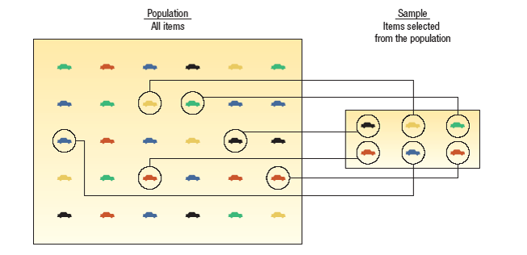
]

.tiny[Source: Douglas Lind, William Marchal, Samuel Wathen, Statistical Techniques in Business and Economics, 16th ed. (LMW)]
</div>

---

class: inverse, center, middle

# 4. Types of Variables

---

# Types of Variables

.pull-left[
## Qualitative Variables

Non-numeric categories:

* Country
* Industry sector
* Trade agreement type
* Currency regime
]

.pull-right[
## Quantitative Variables

Numeric:

* GDP
* Export volume
* Exchange rate
* Inflation
* Tariff rate

Can be:

* Discrete
* Continuous
]

---

# Types of Variables

<div>
.center[
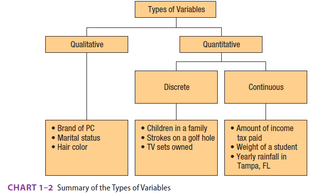
]

.tiny[Source: Douglas Lind, William Marchal, Samuel Wathen, Statistical Techniques in Business and Economics, 16th ed. (LMW)]
</div>

---

# Variables in Python

In Python, variables are symbolic names for values stored in memory. Python uses dynamic typing, so you don't need to declare data types explicitly.

```{python, echo=TRUE}
# Create variables
x = 5           # x is an integer
name = "John"   # name is a string
cost = 40.25    # cost is a float
is_jedi = True  # is_jedi is a boolean

```

You can display the value of a variable using the $print()$ function. You can also check its data type with the $type()$ function.

---

# Data Types in Python


---

class: inverse, center, middle

# Levels of Measurement

---

# Four Levels

1. Nominal
   Categories only (country, region)

2. Ordinal
   Ranked but differences meaningless (credit rating: AAA, AA, A)

3. Interval
   Differences meaningful, no true zero (temperature in Celsius)

4. Ratio
   True zero, ratios meaningful (GDP, exports, income)

Most economic data = ratio level.

---

# Levels of Measurement

<div>
.center[
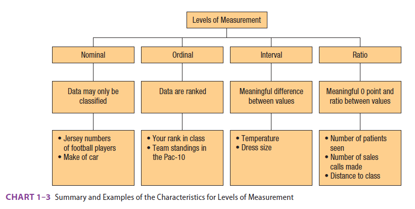
]

.tiny[Source: Douglas Lind, William Marchal, Samuel Wathen, Statistical Techniques in Business and Economics, 16th ed. (LMW)]
</div>

---

class: inverse, center, middle

# 5. Chapter 3 - Describing Data: Measures of Central Tendency

---

# Measures of Location

Measures of location (central tendency) summarize a dataset with a single value.

The purpose of a measure of location is to pinpoint the center of a distribution of data.

Three key measures:

1. **Mean** – average of all values

2. **Median** – middle value when ordered

3. **Mode** – most frequently occurring value

Each reveals different aspects of your data.

---

# Mean

## Arithmetic Mean

The arithmetic mean is the most widely used measure of central tendency.

**Formula:**
$$\bar{X} = \frac{\sum_{i=1}^{n} X_i}{n}$$

**Key characteristics:**

* Calculated by summing all values and dividing by the count
* Uses every observation in the dataset
* Unique value for any given dataset
* Sum of deviations from the mean always equals zero: $\sum(X_i - \bar{X}) = 0$
---

**Example (International Commerce):**

If Korea exports to 5 countries: $100, 120, 130, 150, 170$ billion USD

Mean = $\frac{100 + 120 + 130 + 150 + 170}{5} = \frac{670}{5} = 134$ billion USD

**When to use:**
* Symmetric distributions
* When you need a measure sensitive to all values
* For further statistical calculations
---

# Mean Calculation in Python

```{python, echo=TRUE}

import pandas as pd

data = {
    "Country": ["1", "2", "3", "4", "5"],
    "Exports_bn_USD": [100, 120, 130, 150, 170]
}

df = pd.DataFrame(data)

# Convert Exports_bn_USD to numeric if necessary
df["Exports_bn_USD"] = pd.to_numeric(df["Exports_bn_USD"], errors='coerce')

df.mean(numeric_only=True)

```

---

# Population Mean

When we have data for the entire population, we calculate the population mean (μ):
$$\mu = \frac{\sum_{i=1}^{N} X_i}{N}$$

Where N is the population size.
In practice, we often work with samples and use the sample mean (x̄) to estimate the population mean (μ).

---

<div>
.center[
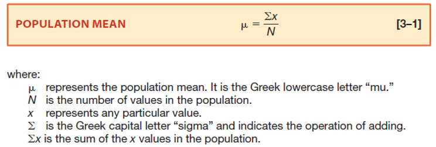
]

.tiny[Source: Douglas Lind, William Marchal, Samuel Wathen, Statistical Techniques in Business and Economics, 16th ed. (LMW)]
</div>

---

**Example – Population Mean:**

If we have export data for all 195 countries, we can calculate the population mean export value.

If we only have data for 30 countries, we calculate the sample mean and use it to estimate the population mean.

---

# Sample Mean

For ungrouped data, the sample mean is the sum of all the sample values divided by the number of sample values:

<div>
.center[
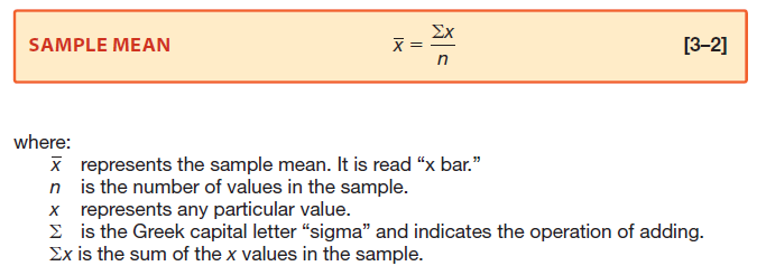
]

.tiny[Source: Douglas Lind, William Marchal, Samuel Wathen, Statistical Techniques in Business and Economics, 16th ed. (LMW)]
</div>

---

# Properties of the Arithmetic Mean

1. Every set of interval-level and ratio-level data has a mean.

2. All the values are included in computing the mean.

3. The mean is unique.

4. The sum of the deviations of each value from the mean is zero. 

---

# Parameter versus Statistic

.pull-left[
## Parameter
A measurable characteristic of a **population**.

Denoted by Greek letters:
- μ (mu) = population mean
- σ² (sigma squared) = population variance
- σ (sigma) = population standard deviation

Unknown in practice.
We estimate it using sample statistics.
]

.pull-right[
## Statistic
A measurable characteristic of a **sample**.

Denoted by Latin letters:
- x̄ (x-bar) = sample mean
- s² = sample variance
- s = sample standard deviation

Known from data.
Used to estimate population parameters.
]
---

**Example:**

If Korea has 1,000 exporting firms (population) and we survey 100 firms (sample):

* Population mean export value = **parameter** (unknown)
* Sample mean export value = **statistic** (calculated from data)


---

# Median

The median is the midpoint value when data are ordered from minimum to maximum.

**Formula:**
For n observations ordered as $X_1 \leq X_2 \leq ... \leq X_n$:

* If n is odd: Median = $X_{(n+1)/2}$ (e.g., 3rd value in 5 observations)
* If n is even: Median = $\frac{X_{n/2} + X_{(n/2)+1}}{2}$ (e.g., average of 3rd and 4th values in 6 observations)

**Key characteristics:**

* Unique value for any dataset
* Unaffected by extreme values (outliers)
* Useful for skewed distributions
* Can be computed for open-ended distributions (if median is not in open class)
---
**Example (International Commerce):**

Export rankings (bn USD, arranged in *ascending order*): 100, 120, 130, 150, 170

Median = 130 (middle value)

If we add one more: 100, 120, 130, 150, 170, 200

Median = (130 + 150) / 2 = 140

**When to use:**

* Skewed distributions (e.g., income, firm size)
* When outliers are present
* Symmetric distributions (same as mean if normal)
* Ordinal data (rankings)

**Median vs Mean:**

Mean is pulled by extremes. Median represents the "typical" value better when data are skewed.


---

# Mode

The mode is the value that appears most frequently in a dataset.

**Key characteristics:**

* Can be used for all data types (nominal, ordinal, interval, ratio)
* A dataset can have one mode (unimodal), multiple modes (bimodal/multimodal), or no mode (e.g., all values unique)
* Unaffected by extreme values
* Less commonly used than mean or median in quantitative analysis
---
**Example (International Commerce):**

Trade agreement types: FTA, FTA, RCEP, FTA, Bilateral

Mode = FTA (appears 3 times)

**When to use:**

* Categorical/nominal data (e.g., most common trade regime)
* Market segmentation (e.g., most popular product type)
* Identifying dominant categories in trade data
* When you need the "most typical" category, not a numerical average
---
# Mean vs Median vs Mode

```{python, echo=TRUE}

import pandas as pd

data = {
    "Country": ["1", "2", "3", "4", "5"],
    "Exports_bn_USD": [100, 120, 130, 150, 170]
}

# Convert Exports_bn_USD to numeric if necessary
df["Exports_bn_USD"] = pd.to_numeric(df["Exports_bn_USD"], errors='coerce')

df = pd.DataFrame(data)

print("Mean:", df.mean(numeric_only=True))
print("Median:", df.median(numeric_only=True))
print("Mode:", df.mode(numeric_only=True))

```

---
**Mode vs Mean vs Median:**

* Mode: Most frequent

* Median: Middle value

* Mean: Average value

Together, they provide a complete picture of data distribution.

---

# The Relative Positions of the Mean, Median and the Mode

<div>
.center[
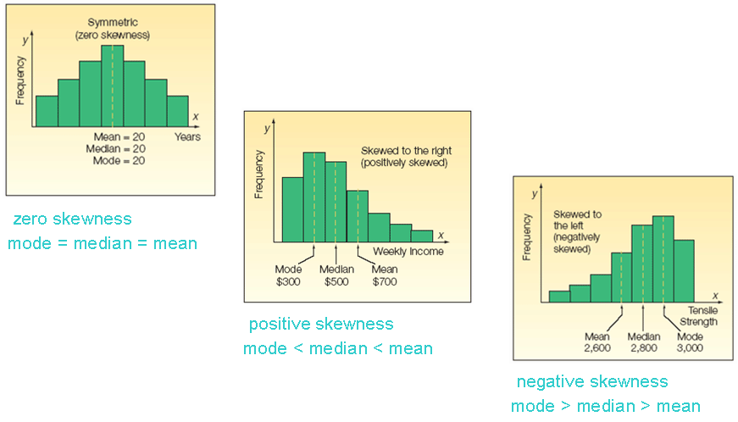
]

.tiny[Source: Douglas Lind, William Marchal, Samuel Wathen, Statistical Techniques in Business and Economics, 16th ed. (LMW)]
</div>

---

class: inverse, center, middle

# Geometric Mean

---

# Why Geometric Mean?


Used for:

* Growth rates
* Returns
* Percentage change over time


<div>
.center[
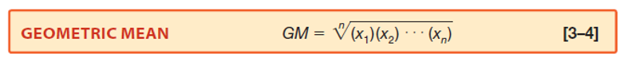
]

.tiny[Source: Douglas Lind, William Marchal, Samuel Wathen, Statistical Techniques in Business and Economics, 16th ed. (LMW)]
</div>


---
class: my-one-page-font

# Geometric Mean: Example

If exports grow 10%, then fall 5%, arithmetic mean is misleading.

Geometric mean captures true compounded growth.

The return on investment earned by Atkins Construction Company for four successive years was: 30 percent, 20 percent, -40 percent, and 200 percent. What is the geometric mean rate of return on investment?
1. Convert percentages to growth factors:
   - Year 1: 1 + 0.30 = 1.30
   - Year 2: 1 + 0.20 = 1.20
   - Year 3: 1 - 0.40 = 0.60
   - Year 4: 1 + 2.00 = 3.00
2. Calculate the product of growth factors:
   - Product = 1.30 * 1.20 * 0.60 * 3.00 = 2.808
3. Take the nth root (where n = 4):
   - Geometric Mean = (2.808)^(1/4) ≈ 1.29
4. Convert back to percentage:
   - Geometric Mean Rate of Return = (1.29 - 1) * 100% ≈ 29%
The geometric mean rate of return on investment is approximately 29 percent.

---
# The Geometric Mean: Finding an Average Percent Change Over Time


<div>
.center[
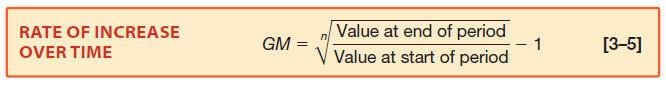
]

</div>

During the decade of the 1990s, and into the 2000s, Las Vegas, Nevada, was the fastest-growing city in the United States. The population increased from 258,295 in 1990 to 584,539 in 2011. This is an increase of 326,244 people, or a 126.3 percent increase over the period. What is the average annual increase?


<div>
.center[
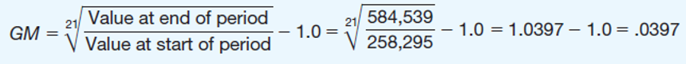
]

.tiny[Source: Douglas Lind, William Marchal, Samuel Wathen, Statistical Techniques in Business and Economics, 16th ed. (LMW)]
</div>


---
class: inverse, center, middle

# 6. Measures of Dispersion

---

# Why Dispersion Matters

Mean alone is insufficient.

Example:

Average river depth = 3 feet
Maximum depth = 20 feet

Would you cross?

Spread matters.

---
# Measures of Dispersion

<div>
.center[
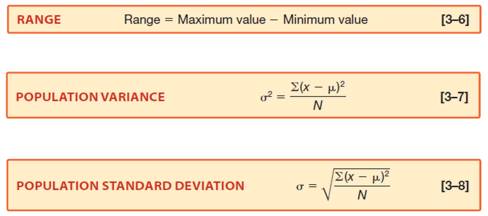
]

.tiny[Source: Douglas Lind, William Marchal, Samuel Wathen, Statistical Techniques in Business and Economics, 16th ed. (LMW)]
</div>


- Range: Simple but ignores most data.
- Variance: Average squared deviation from mean. Uses all observations.
- Standard Deviation: Square root of variance. Interpretable in original units. If export volatility is high → risk is high.

---
# Variance and Standard Deviation

- The variance and standard deviations are nonnegative and are zero only if all observations are the same. 

- For populations whose values are near the mean, the variance and standard deviation will be small.

- For populations whose values are dispersed from the mean, the population variance and standard deviation will be large.

- The variance overcomes the weakness of the range by using all the values in the population.

---

class: my-one-page-font

# Example: Sample Variance and Standard Deviation
Suppose we have export values (in billion USD) for 5 countries: 100, 120, 130, 150, 170
1. Calculate the mean:
   - Mean = (100 + 120 + 130 + 150 + 170) / 5 = 134
2. Calculate the deviations from the mean:
   - 100 - 134 = -34
   - 120 - 134 = -14
   - 130 - 134 = -4
   - 150 - 134 = 16
   - 170 - 134 = 36
3. Square each deviation:
   - (-34)² = 1,156
   - (-14)² = 196
   - (-4)² = 16
   - (16)² = 256
   - (36)² = 1,296
4. Calculate the sum of squared deviations:
   - Sum = 1,156 + 196 + 16 + 256 + 1,296 = 2,920
5. Calculate the variance of the sample:
   - Variance = Sum / (n - 1) = 2,920 / 4 = 730 (use n-1 for sample variance because we precision is reduced by estimating the mean from the same data)
6. Calculate the standard deviation of the sample:
   - Standard Deviation = √Variance = √730 ≈ 27.02
The variance of the export values is 730 billion USD², and the standard deviation is approximately 27.02 billion USD.
---

class: my-one-page-font

# Example: Population Variance and Standard Deviation
Suppose we have export values (in billion USD) for all 5 countries: 100, 120, 130, 150, 170
1. Calculate the mean:
   - Mean = (100 + 120 + 130 + 150 + 170) / 5 = 134
2. Calculate the deviations from the mean:
   - 100 - 134 = -34
    - 120 - 134 = -14
    - 130 - 134 = -4
    - 150 - 134 = 16
    - 170 - 134 = 36
3. Square each deviation:
   - (-34)² = 1,156
    - (-14)² = 196
    - (-4)² = 16
    - (16)² = 256
    - (36)² = 1,296
4. Calculate the sum of squared deviations:
    - Sum = 1,156 + 196 + 16 + 256 + 1,296 = 2,920
5. Calculate the variance of the population:
    - Variance = Sum / N = 2,920 / 5 = 584
6. Calculate the standard deviation of the population:
    - Standard Deviation = √Variance = √584 ≈ 24.17
The variance of the export values is 584 billion USD², and the standard deviation is approximately 24.17 billion USD.


---

# Variance and Standard Deviation in Python

```{python, echo=TRUE}

import pandas as pd

data = {
    "Country": ["1", "2", "3", "4", "5"],
    "Exports_bn_USD": [100, 120, 130, 150, 170]
}

df = pd.DataFrame(data)

# Convert Exports_bn_USD to numeric if necessary
df["Exports_bn_USD"] = pd.to_numeric(df["Exports_bn_USD"], errors='coerce')

print("Variance:", df.var(ddof=1, numeric_only=True))  # Sample variance
print("Standard Deviation:", df.std(ddof=1, numeric_only=True))  # Sample standard deviation

print("Population Variance:", df.var(ddof=0, numeric_only=True))  # Population variance
print("Population Standard Deviation:", df.std(ddof=0, numeric_only=True))  # Population standard deviation

```

---

class: inverse, center, middle

# Empirical Rule

---
.pull-left[
If distribution is approximately normal:

* 68% within 1 SD
* 95% within 2 SD
* 99.7% within 3 SD

Used in:

* Risk analysis
* Financial modeling
* Trade volatility assessment
]

.pull-right[
<div>
.center[
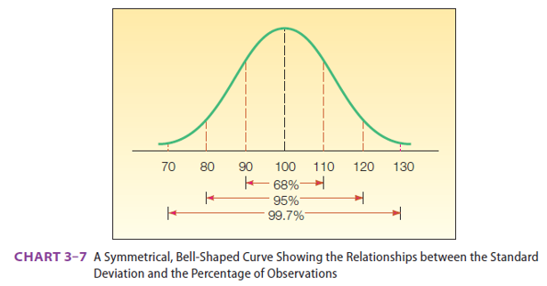
]

.tiny[Source: Douglas Lind, William Marchal, Samuel Wathen, Statistical Techniques in Business and Economics, 16th ed. (LMW)]
</div>
]
---

class: inverse, center, middle

# 7. Application to International Commerce

---

# Example Dataset

Exports (bn USD):

Korea – 632; 
Germany – 1650; 
Japan – 747; 
USA – 2064; 
Vietnam – 355

Questions:

* What is the mean?
* Is the distribution skewed?
* Who is an outlier?
* Is comparison per capita better?

Statistics structures these questions.

---

class: inverse, center, middle

# Practice Time

---

# In-Class Task (Colab)

1. Compute:

   * Mean
   * Median
   * Standard deviation

2. Compare:

   * Is mean larger than median?
   * Why?

3. Interpret:

   * What does dispersion imply for trade risk?

---

# Key Takeaways

* Statistics describes and supports decisions.

* Ethical use is essential.

* Mean is not enough.

* Dispersion reveals risk.

* Growth requires geometric thinking.

* International commerce data is often skewed and volatile.

---

# Next Week

(Mar 17 | Mar 19) Survey of probability concepts (LMW Chapter 5) 

---

class: inverse, center, middle

# Any questions?

# Thank you!


???
1. To print pdf slides
https://stackoverflow.com/questions/54968311/xaringan-export-slides-to-pdf-while-preserving-formatting

pagedown::chrome_print("W1_ME.html") # but not all pictures are visible

2. Option: https://stackoverflow.com/questions/54968311/xaringan-export-slides-to-pdf-while-preserving-formatting

install.packages("remotes")
remotes::install_github("jhelvy/xaringanBuilder")
remotes::install_github("jhelvy/renderthis@v0.0.9")

library(xaringanBuilder)
build_pdf("DVC.html")

3. Option
writeBin(as.raw(c()), "favicon.ico") # create an empty favicon.ico file
install.packages("renderthis")
remotes::install_github('rstudio/chromote')
library(renderthis)

renderthis::to_pdf("W-2_SIC.html")

getwd()
setwd("C:\\Users\\vyshn\\OneDrive - kdis.ac.kr\\Documents\\GitHub\\Sogang\\2026\\Spring\\Statistics for International Commerce\\Week_2")

