<style>
@media print{
  body, html, .remark-slides-area, .remark-notes-area {
    height: 100% !important;
    width: 100% !important;
    overflow: visible;
    display: inline-block;
    }
</style>

<style type="text/css">
.remark-slide-content {
    font-size: 34px;
    padding: 1em 4em 1em 4em;
}
</style>

<style type="text/css">
.my-one-page-font {
  font-size: 28px;
}
</style>

</style>

<style type="text/css">
.my-one-page-font-table {
  font-size: 24px;
}
</style>

<style>
.tiny { font-size: 60%; }      /* class you can reuse anywhere */
</style>

<style>
.remark-slide-content {
  position: relative;
  z-index: 1;
}

.remark-slide-content::before {
  content: "";
  position: absolute;
  top: 50%;
  left: 50%;
  width: 600px;          /* adjust size */
  height: 600px;
  background-image: url("1. 교장(Seal_Positive).png");  /* place logo file in same folder */
  background-repeat: no-repeat;
  background-position: center;
  background-size: contain;
  opacity: 0.05;         /* watermark transparency */
  transform: translate(-50%, -50%);
  pointer-events: none;
  z-index: 0;
}
</style>


```{r setup, include = FALSE}
library(tidyverse)
library(knitr)
library(reticulate)
py_install(c("pandas", "matplotlib"), pip = TRUE)

opts_chunk$set(fig.width = 10, 
               message = FALSE, 
               warning = FALSE,
               echo = FALSE)
```

```{r xaringan-themer, include=FALSE, warning=FALSE}
#install.packages("xaringanthemer")
library(xaringanthemer)
style_mono_accent(
  base_color = "#851a10",
  header_font_google = google_font("Josefin Sans"),
  text_font_google   = google_font("Montserrat", "500", "550i"),
  code_font_google   = google_font("Fira Mono"),
  colors = c(
  red = "#f34213",
  purple = "#3e2f5b",
  orange = "#ff8811",
  green = "#136f63",
  white = "#FFFFFF"
)
)
```

Hello everyone!

It's a **great day** to *keep learning* statistics for international commerce. :-)

---

# Agenda

. . .
- Probability distributions

- Random variables

- Binomial distribution

- Hypergeometric distribution

- Poisson distribution

- In-class exercises

---

# Learning Objectives

After this lecture students should be able to:

• Understand probability distributions

• Distinguish discrete vs continuous variables

• Compute expected value of a distribution

• Apply binomial, hypergeometric, and Poisson distributions

• Implement probability models in Python

---

# What is a Probability Distribution?

.pull-left[
A probability distribution describes:

• all possible outcomes of a random experiment
• the probability of each outcome

Experiment: Toss a coin three times. Observe the number of heads. The possible results are: zero heads, one head, two heads, and three heads. 

What is the probability distribution for the number of heads?
]

.pull-right[
<div>
.center[
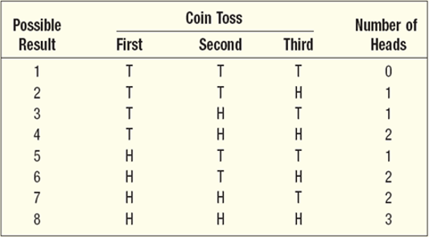
]

.tiny[Source: Douglas Lind, William Marchal, Samuel Wathen, Statistical Techniques in Business and Economics, 16th ed. (LMW)]
</div>

]
---

<div>
.center[
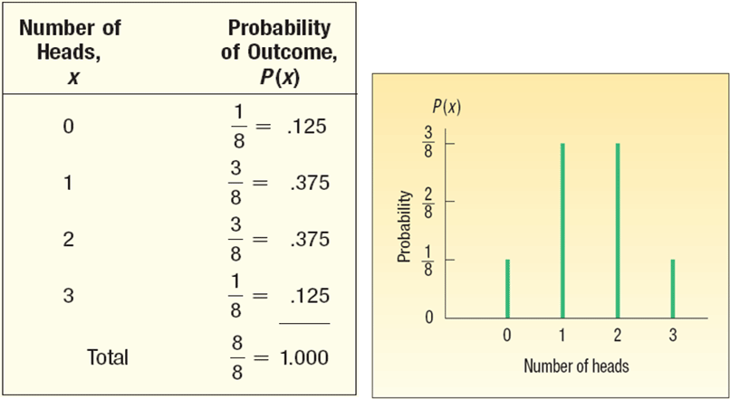
]

.tiny[Source: Douglas Lind, William Marchal, Samuel Wathen, Statistical Techniques in Business and Economics, 16th ed. (LMW)]
</div>

---

# Python Example: Coin Toss Distribution

```{python, echo=TRUE}
import pandas as pd

data = {
    "Heads": [0,1,2,3],
    "Probability": [1/8,3/8,3/8,1/8]
}

df = pd.DataFrame(data)

df
```

Visualizing distribution

```{python, echo=TRUE}
import matplotlib.pyplot as plt

plt.bar(df["Heads"], df["Probability"])
plt.title("Probability Distribution of Heads")
plt.xlabel("Number of Heads")
plt.ylabel("Probability")
plt.show()
```

---
# Random Variables

.pull-left[
A random variable is a numerical value resulting from a random experiment.

Example

Number of delayed flights per day.

Possible values

0, 1, 2, 3, ...
]

.pull-right[
<div>
.center[
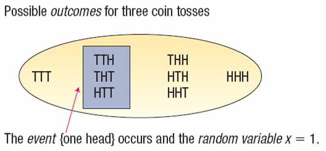
]

.tiny[Source: Douglas Lind, William Marchal, Samuel Wathen, Statistical Techniques in Business and Economics, 16th ed. (LMW)]
</div>
] 
---

# Types of Random Variables

Discrete random variable

• Countable outcomes
• Example: number of export shipments delayed, number of cars sold, number of customers arriving

Continuous random variable

• Measured outcomes
• Example: shipping time, exchange rate changes, customer satisfaction score

> Intuition: Discrete = countable, Continuous = measurable.

---
# Features of a Discrete Distribution

The main features of a discrete probability distribution are:
  - The sum of the probabilities of the various outcomes is 1.00.

  - The probability of a particular outcome is between 0 and 1.00.

  - The outcomes are mutually exclusive.


---
# The Mean of a Probability Distribution
## Expected Value (Mean)

- The mean is a typical value used to represent the central location of a probability distribution.
- The mean of a probability distribution is also referred to as its expected value.

Formula

μ = Σ xP(x)

Interpretation: The expected value is the average outcome of a large number of repeated experiments.

Example: Expected number of cars sold on Saturday
---

# Example: Expected Sales Distribution

Cars sold on Saturday

X | P(X) | X*P(X)
--- | --- | ---
0 | 0.10 | 0
1 | 0.20 | 0.20
2 | 0.30 | 0.60
3 | 0.30 | 0.90
4 | 0.10 | 0.40

Expected value

μ = Σ xP(x) = 2.1

This means the salesperson sells about **2 cars on average**.

---

# Python Example: Expected Value

```{python, echo=TRUE}
import pandas as pd

data = {
    "cars_sold":[0,1,2,3,4],
    "prob":[0.10,0.20,0.30,0.30,0.10]
}

df = pd.DataFrame(data)

expected_value = (df["cars_sold"] * df["prob"]).sum()

expected_value
```

---

# Variance and Standard Deviation

Variance measures spread of outcomes.

Formula

σ² = Σ (x − μ)² P(x)

Standard deviation

σ = √variance

---
# Variance and Standard Deviation

X | P(X) | (X - μ) | (X - μ)² | (X - μ)² * P(X)
--- | --- | --- | ---
0 | 0.10 | -2.1 | 4.41 | 0.441
1 | 0.20 | -1.1 | 1.21 | 0.242
2 | 0.30 | -0.1 | 0.01 | 0.003
3 | 0.30 | 0.9 | 0.81 | 0.243
4 | 0.10 | 2.1 | 3.61 | 0.361

Variance = Σ (X - μ)² * P(X) = 1.296
Standard Deviation = √1.296 = 1.138

---

# Python Example: Variance of Distribution

```{python, echo=TRUE}
import numpy as np

mu = expected_value

variance = ((df["cars_sold"] - mu)**2 * df["prob"]).sum()

std_dev = np.sqrt(variance)

variance, std_dev
```

---

# Binomial Distribution

A binomial distribution describes the number of successes in repeated trials.

Conditions

• Two outcomes (success or failure)

• Fixed number of trials

• Independent trials

• Same probability each trial

---

# Binomial Formula

P(x) = C(n,x) p^x (1-p)^(n-x)

where

n = number of trials
x = number of successes
p = probability of success

---

# Example: Late Flights

Suppose

5 flights per day
Probability of delay = 0.20

Question

What is probability that **no flights are late?**

---

# Python Example: Binomial Distribution

```{python, echo=TRUE}
from scipy.stats import binom

n = 5
p = 0.20

prob_no_delay = binom.pmf(0, n, p)

prob_no_delay
```

---

# Mean and Variance of Binomial Distribution

Mean

μ = np

Variance

σ² = np(1 − p)

Example

n = 5
p = 0.2

Mean = 1
Variance = 0.8

---

# Visualizing Binomial Distribution

```{python, echo=TRUE}
import numpy as np
import matplotlib.pyplot as plt
from scipy.stats import binom

x = np.arange(0,6)

y = binom.pmf(x,5,0.2)

plt.bar(x,y)
plt.title("Binomial Distribution")
plt.xlabel("Number of Delayed Flights")
plt.ylabel("Probability")
plt.show()
```

---

# Hypergeometric Distribution

Used when sampling **without replacement**.

Example

A factory has defective and non-defective items.

Selecting items without replacement changes probabilities.

---

# Example: Union Employees

Total workers = 50
Union members = 40
Non-union = 10

Select 5 employees.

Probability that **4 belong to union**.

---

# Python Example: Hypergeometric

```{python, echo=TRUE}
from scipy.stats import hypergeom

N = 50   # population
K = 40   # success in population
n = 5    # sample size
x = 4    # successes in sample

hypergeom.pmf(x, N, K, n)
```

---

# Poisson Distribution

Used to model rare events.

Examples

• lost baggage
• system failures
• arrivals of customers

Parameter

λ = average number of events.

---

# Poisson Example

Average lost baggage per flight

λ = 0.3

Probability of **zero lost bags**

---

# Python Example: Poisson Distribution

```{python, echo=TRUE}
from scipy.stats import poisson

lam = 0.3

prob_zero = poisson.pmf(0, lam)

prob_zero
```

---

# Why Probability Distributions Matter in Economics

Applications

• trade risk analysis
• logistics reliability
• financial default risk
• quality control in production
• forecasting demand

---

# In-Class Exercise

A company ships goods internationally.

Probability shipment delayed = 0.15

If 8 shipments occur today

Questions

1. Probability exactly 2 delays
2. Probability at least one delay

Students compute using Python.

---

# Python Exercise

```{python, echo=TRUE}
from scipy.stats import binom

n = 8
p = 0.15

binom.pmf(2, n, p)
```

---

# Practice Session

Open the **Week 4 practice notebook** in LMS.

Complete probability exercises using Python.

---

# Week 4 Assignment

Apply probability models to

• logistics delays
• export demand risk
• quality control

Submit analysis notebook.

---

# Key Takeaways
* Probability distributions model uncertainty in commerce.

* Binomial, hypergeometric, and Poisson are key discrete distributions.

* Python allows practical application of these models.


---

# Next Week

(Mar 31 | April 2) Continuous probability distributions (LMW Chapter 7) & April 2 is a public holiday. Video lecture will be uploaded. 

Please submit by next week (Tuesday) your:
- Class activity (Colab link).
???
- DataCamp assignment 'Introduction to Python' (screenshot required).

---

class: inverse, center, middle

# Any questions?

# Thank you for your attention and active participation!


???
1. To print pdf slides
https://stackoverflow.com/questions/54968311/xaringan-export-slides-to-pdf-while-preserving-formatting

pagedown::chrome_print("W1_ME.html") # but not all pictures are visible

2. Option: https://stackoverflow.com/questions/54968311/xaringan-export-slides-to-pdf-while-preserving-formatting

install.packages("remotes")
remotes::install_github("jhelvy/xaringanBuilder")
remotes::install_github("jhelvy/renderthis@v0.0.9")

library(xaringanBuilder)
build_pdf("DVC.html")

3. Option
writeBin(as.raw(c()), "favicon.ico") # create an empty favicon.ico file
install.packages("renderthis")
remotes::install_github('rstudio/chromote')
library(renderthis)

renderthis::to_pdf("W-4_SIC.html")

getwd()
setwd("C:\\Users\\vyshn\\OneDrive - kdis.ac.kr\\Documents\\GitHub\\Sogang\\2026\\Spring\\Statistics for International Commerce\\Week_4")


---

# Agenda

1. What is probability

2. Experiment, outcome, and event

3. Ways to assign probabilities

4. Probability rules

5. In-class task

---

class: inverse, center, middle

# 1. Probability

---

# What Is Probability?

**Probability** measures the likelihood that an event will occur.

.pull-left[
Probability values are between:

0 ≤ P(event) ≤ 1

Interpretation:

* P = 0 → impossible event
* P = 1 → certain event
* P close to 0 → unlikely
* P close to 1 → very likely
]

.pull-right[
<div>
.center[

]
</div>   
]

---

# What Is Probability?

<div>
.center[

]

.tiny[Source: Douglas Lind, William Marchal, Samuel Wathen, Statistical Techniques in Business and Economics, 16th ed. (LMW)]
</div>

---

# Example

Probability that a shipment arrives on time:

- P(on-time delivery)

Probability that exchange rate increases tomorrow:

- P(exchange rate ↑)

Probability helps quantify uncertainty.

---

class: inverse, center, middle

# 2. Experiment, Outcome, Event

---

# Experiment

An **experiment** is a process that produces one of several outcomes.

Examples:

* Rolling a die

* Observing daily exchange rate change

* Observing whether a shipment is delayed

---

.pull-left[
# Outcome

An **outcome** is a specific result of an experiment.

Example: Rolling a die

Possible outcomes:

1, 2, 3, 4, 5, 6
]
.pull-right[
# Event

An **event** is a set of one or more outcomes.

Example:

Event A: rolling an even number

A = {2,4,6}
]
---
# Experiment, Outcome, and Event

<div>
.center[

]

.tiny[Source: Douglas Lind, William Marchal, Samuel Wathen, Statistical Techniques in Business and Economics, 16th ed. (LMW)]
</div>

---

class: inverse, center, middle

# 3. Ways to Assign Probability

---

# Three Approaches

1. Classical probability

2. Empirical probability

3. Subjective probability

---

# Classical Probability

Assumes outcomes are equally likely.

Formula:

P(event) = favorable outcomes / total outcomes

Example:

Rolling a die, probability of even number:

$P = 3 / 6 = 0.5$

---

# Classical Probability example

<div>
.center[

]

.tiny[Source: Douglas Lind, William Marchal, Samuel Wathen, Statistical Techniques in Business and Economics, 16th ed. (LMW)]
</div>


---

# Empirical Probability

Based on historical data.

Example:

If 4 out of 100 shipments were delayed:

$P(delay) = 4 / 100 = 0.04$

The **Law of Large Numbers** states:

The larger the sample, the more accurate probability estimates become.

---

# Empirical Probability example (1)

On February 1, 2003, the Space Shuttle Columbia exploded. This was the second disaster in 123 space missions for NASA. On the basis of this information, what is the probability that a future mission is successfully completed?

$$P(success) = 121 / 123 ≈ 0.9837$$

The probability of success is 0.9837.

---

# Empirical Probability example (2)

<div>
.center[
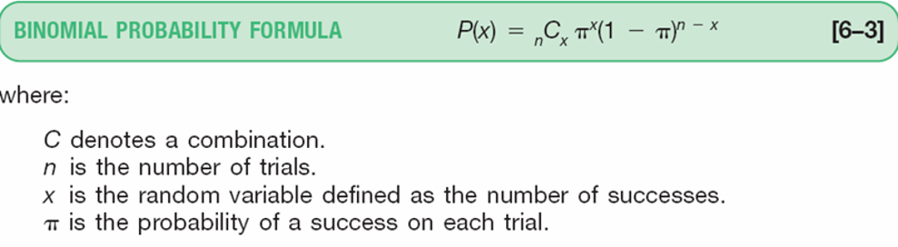
]

.tiny[Source: Douglas Lind, William Marchal, Samuel Wathen, Statistical Techniques in Business and Economics, 16th ed. (LMW)]
</div>

---

# Subjective Probability

Used when historical data is unavailable.

Based on judgment or expert opinion.

Examples:

* Probability a firm enters a new market
* Probability of a trade agreement
* Probability of currency crisis

Common in business forecasting.

---

# Summarizing Ways of Probability Assignment 

<div>
.center[
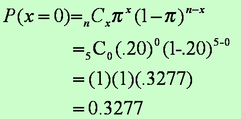
]

.tiny[Source: Douglas Lind, William Marchal, Samuel Wathen, Statistical Techniques in Business and Economics, 16th ed. (LMW)]
</div>

---

# Probability: Example (1)
<div>
.center[
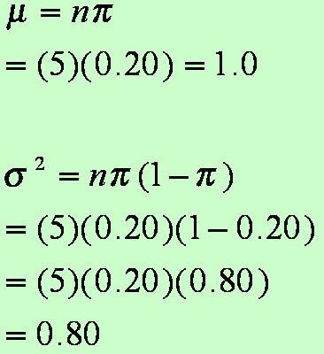
]

.tiny[Source: Douglas Lind, William Marchal, Samuel Wathen, Statistical Techniques in Business and Economics, 16th ed. (LMW)]
</div>


---
# Probability: Example (2)
<div>
.center[
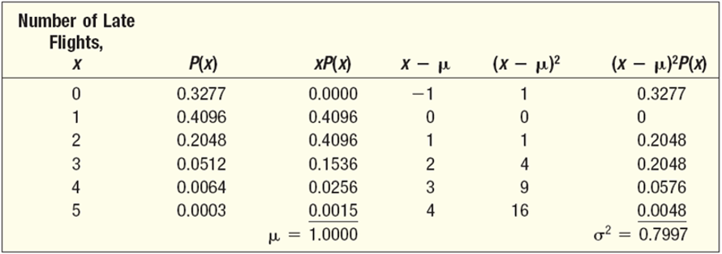
]

.tiny[Source: Douglas Lind, William Marchal, Samuel Wathen, Statistical Techniques in Business and Economics, 16th ed. (LMW)]
</div>

---
class: inverse, center, middle

# 4. Probability of Events

---

# Probability of Events Vocabulary

<div>
.center[
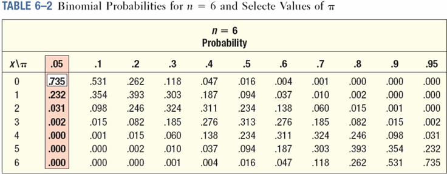
]

.tiny[Source: Douglas Lind, William Marchal, Samuel Wathen, Statistical Techniques in Business and Economics, 16th ed. (LMW)]
</div>

---
# Probability of Events: Venn Diagram 
.pull-left[
Convention:
- Sample space S is represented by a big rectangle.

- Events are represented by circles
]
.pull-right[
Venn Diagram with one event A:

<div>
.center[
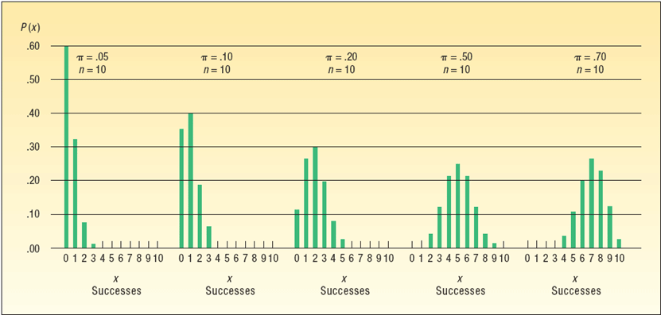
]

.tiny[Source: Douglas Lind, William Marchal, Samuel Wathen, Statistical Techniques in Business and Economics, 16th ed. (LMW)]
</div>
]
---

# Complement Rule

.pull-left[
If event A occurs with probability:

P(A)

Then the probability that A does **not** occur:

$P(A) + P(not A) = 1$ or $P(not A) = 1 − P(A)$ 
]
.pull-right[
<div>
.center[
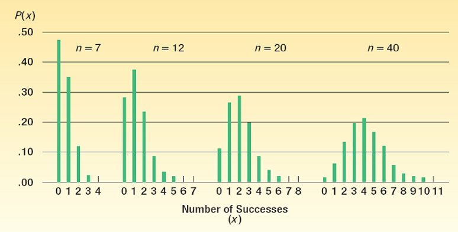
]

.tiny[Source: Douglas Lind, William Marchal, Samuel Wathen, Statistical Techniques in Business and Economics, 16th ed. (LMW)]
</div>
]
---

# Example

If probability of shipment delay is:

P(delay) = 0.07

Then:

$P(on-time) = 1 − 0.07 = 0.93$

---

# The Complement Rule: Example

<div>
.center[
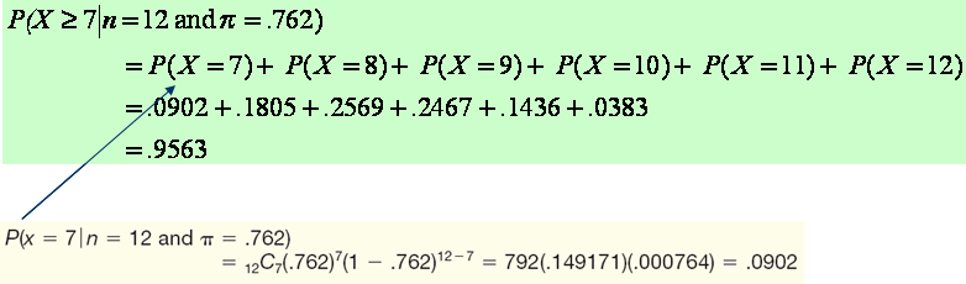
]

.tiny[Source: Douglas Lind, William Marchal, Samuel Wathen, Statistical Techniques in Business and Economics, 16th ed. (LMW)]
</div>

---

# Mutually Exclusive Events
.pull-left[
> Events cannot occur simultaneously.

Example:

- A = shipment delayed
- B = shipment early

Both cannot happen together.

Formula:

$P(A \text{ or } B) = P(A) + P(B)$
]
.pull-right[
Venn Diagram with two events A and B
- A and B are mutually exclusive (left)
- A and B are not mutually exclusive (right)

<div>
.center[

]

.tiny[Source: Douglas Lind, William Marchal, Samuel Wathen, Statistical Techniques in Business and Economics, 16th ed. (LMW)]
</div>
]   
---

# Example

Probability shipment is:

- Underweight: 0.025

- Overweight: 0.075

Probability of either:

$P(A \text{ or } B) = 0.025 + 0.075 = 0.10$

---
# Probability of Events: Venn Diagram 
<div>
.center[
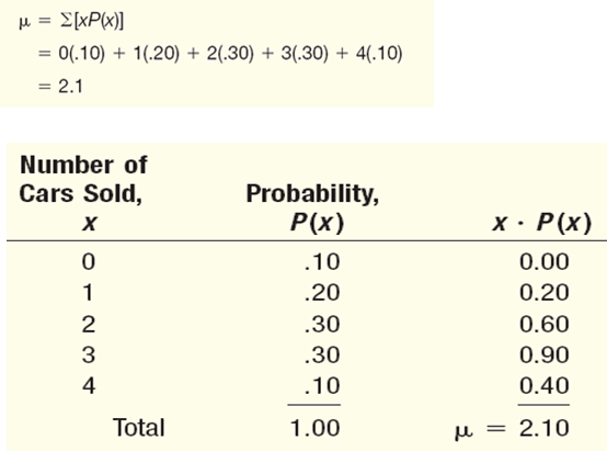
]

.tiny[Source: Douglas Lind, William Marchal, Samuel Wathen, Statistical Techniques in Business and Economics, 16th ed. (LMW)]
</div>

---

# Your turn

<div>
.center[
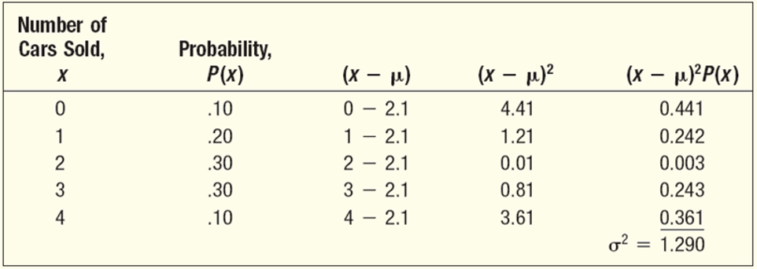
]

.tiny[Source: Douglas Lind, William Marchal, Samuel Wathen, Statistical Techniques in Business and Economics, 16th ed. (LMW)]
</div>

---

# General Addition Rule
.pull-left[
If events are **not mutually exclusive** (events are mutually exclusive if the  occurrence of any one event means that none of the others can occur at the same time. 
):

$P(A \text{ or } B) = P(A) + P(B) − P(A \text{ and } B)$, where $P(A \text{ and } B)$ is the probability both A and B occur (joint probability).
]
.pull-right[
<div>
.center[

]

.tiny[Source: Douglas Lind, William Marchal, Samuel Wathen, Statistical Techniques in Business and Economics, 16th ed. (LMW)]
</div>
]   
---

# Example

Tourist visits:

Lotte World = 120
Imperial Palace = 100
Both = 60

Out of 200 tourists.

P(Lotte World or Imperial Palace)

$= 120/200 + 100/200 − 60/200$
$= 0.80$ is the probability that a tourist visits either Lotte World or the Imperial Palace.

---

#  Special Rule of Addition 
> If two events A and B are mutually exclusive, the probability of one or the other event occurring equals the sum of their  probabilities. 
$$P(A \text{ or } B) = P(A) + P(B)$$

<div>
.center[

]

.tiny[Source: Douglas Lind, William Marchal, Samuel Wathen, Statistical Techniques in Business and Economics, 16th ed. (LMW)]
</div>

---

# Special Rule of Multiplication

Two events are **independent** if one does not affect the other.

Example:

Two customers making reservations.

Formula:

$P(A \text{ and } B) = P(A) × P(B)$

## Example

Probability AAA member makes airline reservation:

P(R) = 0.60

Probability two selected members both made reservations:

P(R1 and R2)

= 0.60 × 0.60
= 0.36

---

# General Rule of Multiplication 
> If two events are **not independent**, the probability of both occurring is the probability of the first event multiplied by the probability of the second event given that the first event has occurred.

Example:

Drawing cards without replacement, the probability of drawing two aces is not independent.

Formula:

$P(A \text{ and } B) = P(A) × P(B | A)$

---

# Conditional Probability

Probability of event A given event B has occurred.

Notation:

$P(A | B)$

Meaning:

Probability of A **given B**.

---

# Example

.pull-left[
Closet contains:

9 white shirts
3 blue shirts

Probability first shirt white:

P(W1) = 9/12

Probability second shirt white given first white:

P(W2 | W1) = 8/11
]
.pull-right[
Joint probability:

P(W1 and W2) from general multiplication rule:

$$= \left(\frac{9}{12}\right)\left(\frac{8}{11}\right)$$

= 0.55 is the probability of drawing two white shirts without replacement.
]

---

# Contingency Tables

> A contingency table is used to classify sample observations according to two or more identifiable characteristics measured.

- For example, 150 adults are surveyed about their attendance of movies during the last 12 months. Each respondent is classified according to two criteria—the number of movies attended and gender.

<div>
.center[

]

.tiny[Source: Douglas Lind, William Marchal, Samuel Wathen, Statistical Techniques in Business and Economics, 16th ed. (LMW)]
</div>

---

# Example Calculations

> Based on the survey, what is the probability that a person attended zero movies?

$P(0 \text{ movies}) = \frac{60}{150} = 0.40$

## Conditional Probability Example

> Based on the survey, what is the probability that a person attended zero movies or is male?

Applying the General Rule of Addition:

$P(\text{zero movies or male}) = P(\text{zero movies}) + P(\text{male}) – P(\text{zero movies and male})$

$P(\text{zero movies or male}) = \frac{60}{150} + \frac{70}{150} – \frac{20}{150} = 0.733$

---

# Bayes’ Theorem

Used to update probability when new information arrives.

General form:

<div>
.center[

]

.tiny[Source: Douglas Lind, William Marchal, Samuel Wathen, Statistical Techniques in Business and Economics, 16th ed. (LMW)]
</div>

---

# Bayes’ Theorem: Example (1)

<div>
.center[

]

.tiny[Source: Douglas Lind, William Marchal, Samuel Wathen, Statistical Techniques in Business and Economics, 16th ed. (LMW)]
</div>

---
# Bayes’ Theorem: Example (2)

<div>
.center[

]

.tiny[Source: Douglas Lind, William Marchal, Samuel Wathen, Statistical Techniques in Business and Economics, 16th ed. (LMW)]
</div>

---
# Bayes’ Theorem: Example (3)

<div>
.center[

]

.tiny[Source: Douglas Lind, William Marchal, Samuel Wathen, Statistical Techniques in Business and Economics, 16th ed. (LMW)]
</div>

---
# Bayes’ Theorem: Example (4)

<div>
.center[

]

.tiny[Source: Douglas Lind, William Marchal, Samuel Wathen, Statistical Techniques in Business and Economics, 16th ed. (LMW)]
</div>

---

# Counting rules: Multiplication Rule

> The probability of two or more independent events occurring together is the product of their individual probabilities.

.pull-left[
If there are:

- m ways to do task A
- n ways to do task B

Total ways:

$m × n$
]
.pull-right[
Example:

- 10 shirts
- 8 ties

Outfits = 80
]
---

# Counting rules: Permutations

A permutation is any arrangement of r objects selected from n possible objects. The order of arrangement is important in permutations.

.pull-left[
<div>
.center[

]

.tiny[Source: Douglas Lind, William Marchal, Samuel Wathen, Statistical Techniques in Business and Economics, 16th ed. (LMW)]
</div>
]
.pull-right[
Example:

Ranking 5 players from 12.
]

.tiny[NB: The formula contains '!' which is the factorial function. For a positive integer n, n! is the product of all positive integers less than or equal to n. For example, 5! = 5 × 4 × 3 × 2 × 1 = 120.]

---

# Counting rules: Combinations

A combination is the number of ways to choose r objects from a group of n objects without regard to order.
.pull-left[
<div>
.center[

]

.tiny[Source: Douglas Lind, William Marchal, Samuel Wathen, Statistical Techniques in Business and Economics, 16th ed. (LMW)]
</div>
]
.pull-right[
Example:

Selecting 5 players from 12.
]
---

# Counting rules: Combination and Permutation Examples

<div>
.center[

]

.tiny[Source: Douglas Lind, William Marchal, Samuel Wathen, Statistical Techniques in Business and Economics, 16th ed. (LMW)]
</div>


---

class: inverse, center, middle

# 5. In-Class Task

---

# In-Class Task

Using Google Colab:

- Simulate rolling a die 1000, 5000, and 10000 times.

```{python, echo=TRUE}

import numpy as np

# Simulate rolling a die 1000 times
rolls = np.random.randint(1, 7, 1000)

# Count the number of times each number appears
counts = np.bincount(rolls)[1:]  # Exclude the 0 index

# Calculate the probability of each number
probabilities = counts / 1000

print("Counts:", counts)
print("Probabilities:", probabilities)

```

- Estimate:
   - P(even number) for each simulation.
   - P(rolling a 6) for each simulation.
   - Compare with theoretical probability.

---

# In-Class Activity

Please open Week 3 activity in Cyber Campus and follow the instructions to complete the tasks.

---

# Key Takeaways

* Probability quantifies uncertainty.

* Three ways to assign probabilities.

* Addition and multiplication rules allow calculation of complex events.

* Conditional probability describes dependent events.

* Bayes’ theorem updates beliefs.

---

