<style>
@media print{
  body, html, .remark-slides-area, .remark-notes-area {
    height: 100% !important;
    width: 100% !important;
    overflow: visible;
    display: inline-block;
    }
</style>

<style type="text/css">
.remark-slide-content {
    font-size: 34px;
    padding: 1em 4em 1em 4em;
}
</style>

<style type="text/css">
.my-one-page-font {
  font-size: 28px;
}
</style>

</style>

<style type="text/css">
.my-one-page-font-table {
  font-size: 24px;
}
</style>

<style>
.tiny { font-size: 60%; }      /* class you can reuse anywhere */
</style>

<style>
.remark-slide-content {
  position: relative;
  z-index: 1;
}

.remark-slide-content::before {
  content: "";
  position: absolute;
  top: 50%;
  left: 50%;
  width: 600px;          /* adjust size */
  height: 600px;
  background-image: url("1. 교장(Seal_Positive).png");  /* place logo file in same folder */
  background-repeat: no-repeat;
  background-position: center;
  background-size: contain;
  opacity: 0.05;         /* watermark transparency */
  transform: translate(-50%, -50%);
  pointer-events: none;
  z-index: 0;
}
</style>


```{r setup, include = FALSE}
library(tidyverse)
library(knitr)
library(reticulate)
py_install(c("pandas", "matplotlib", "scipy"), pip = TRUE)

opts_chunk$set(fig.width = 10, 
               message = FALSE, 
               warning = FALSE,
               echo = FALSE)
```

```{r xaringan-themer, include=FALSE, warning=FALSE}
#install.packages("xaringanthemer")
library(xaringanthemer)
style_mono_accent(
  base_color = "#851a10",
  header_font_google = google_font("Josefin Sans"),
  text_font_google   = google_font("Montserrat", "500", "550i"),
  code_font_google   = google_font("Fira Mono"),
  colors = c(
  red = "#f34213",
  purple = "#3e2f5b",
  orange = "#ff8811",
  green = "#136f63",
  white = "#FFFFFF"
)
)
```

Hello everyone!

Yet another **great day** to *keep learning* statistics for international commerce. :-)

---

# Agenda

- Uniform Distribution

- Normal Distribution

- Z-scores & Probabilities

- Approximation ideas

- In-class exercises and activities

---

# Where we are in the course

* Before:

  * Data description
  * Discrete distributions (Bernoulli, Binomial, Hypergeometric, Poisson)

* Today:

  * Continuous distributions

* Why this matters:

  * Income
  * Returns
  * Inflation
  * Interest rates

---

# Continuous vs Discrete
.pull-left[
Discrete:

* Count outcomes (0,1,2,…)
* Example: number of defaults


]
.pull-right[
Continuous:

* Any value in interval
* Example:

  * income
  * height
  * return

Important idea:
- Probability at a single point = 0
- We work with **intervals**
]
---

# Probability = Area

For continuous variables:

$$
P(a < X < b) = \text{area under curve}
$$

* Not probability of exact value
* Always **range-based thinking**

> why area - because we are integrating the probability density function (PDF) over an interval to find the probability of the random variable falling within that interval.


.tiny[ PDF = probability density function, which describes the likelihood of a random variable taking on a specific value. The area under the PDF curve between two points gives the probability that the random variable falls within that range. ]
---

# Uniform Distribution
.pull-left[
Definition:

* All values between **a and b equally likely**

Shape:

* Rectangle

* Defined by **min (a)** and **max (b)** 
]
.pull-right[
<div>
.center[
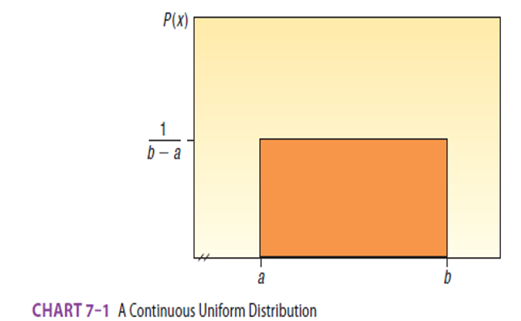
]

.tiny[Source: Douglas Lind, William Marchal, Samuel Wathen, Statistical Techniques in Business and Economics, 16th ed. (LMW)]
</div>
]  
---

# Uniform Distribution Formulas

Knowing the minimum and maximum values of a uniform distribution, we can define the probability function, and calculate the mean, variance, and standard deviation of the distribution. 

<div>
.center[
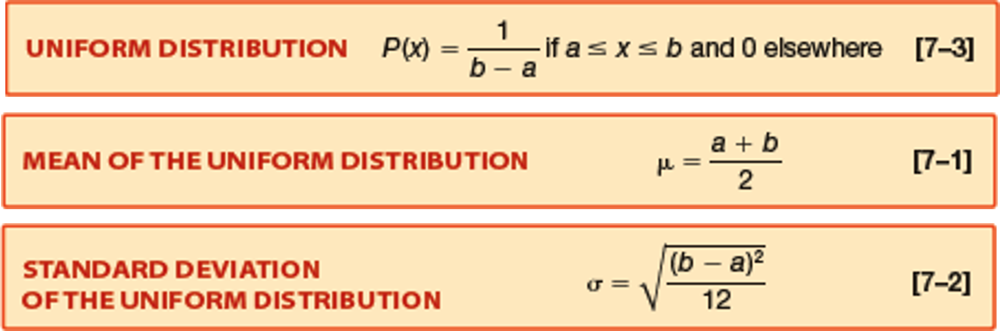
]

.tiny[Source: Douglas Lind, William Marchal, Samuel Wathen, Statistical Techniques in Business and Economics, 16th ed. (LMW)]
</div>

---

# Example: Bus Waiting Time

Southwest Arizona State University provides bus service to students.  On weekdays, a bus arrives at the North Main Street and College Drive stop every 30 minutes between 6 a.m. and 11 p.m. Students arrive at the bus stop at random times. The time that a student waits is uniformly distributed from 0 to 30 minutes.

Task: 
1. Draw a graph of this distribution.
2. Show that the area of this uniform distribution is 1.00.
3. How long will a student “typically” have to wait for a bus? In other words what is the mean waiting time? What is the standard deviation of the waiting times?
4. What is the probability a student will wait more than 25 minutes?
5. What is the probability a student will wait between 10 and 20 minutes?


---

# Example: Bus Waiting Time (continued)

1. Graph of uniformly distributed waiting times between 0 and 30:

<div>
.center[
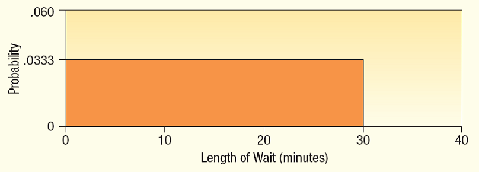
]

.tiny[Source: Douglas Lind, William Marchal, Samuel Wathen, Statistical Techniques in Business and Economics, 16th ed. (LMW)]
</div>

---

# Example: Bus Waiting Time (continued)

2. Show that the area of this distribution is 1.00.


<div>
.center[
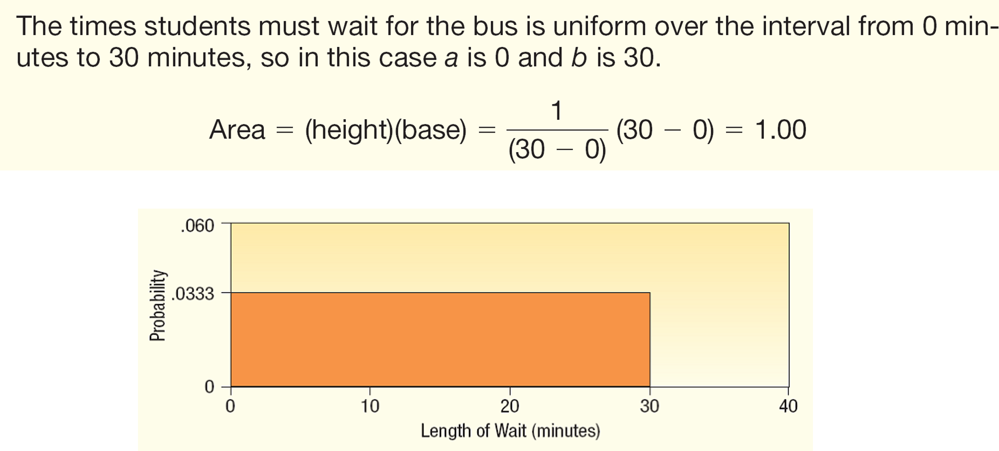
]

.tiny[Source: Douglas Lind, William Marchal, Samuel Wathen, Statistical Techniques in Business and Economics, 16th ed. (LMW)]
</div>

---
# Example: Bus Waiting Time (continued)

3. How long will a student “typically” have to wait for a bus? In other words what is the mean waiting time? 

What is the standard deviation of the waiting times?

<div>
.center[
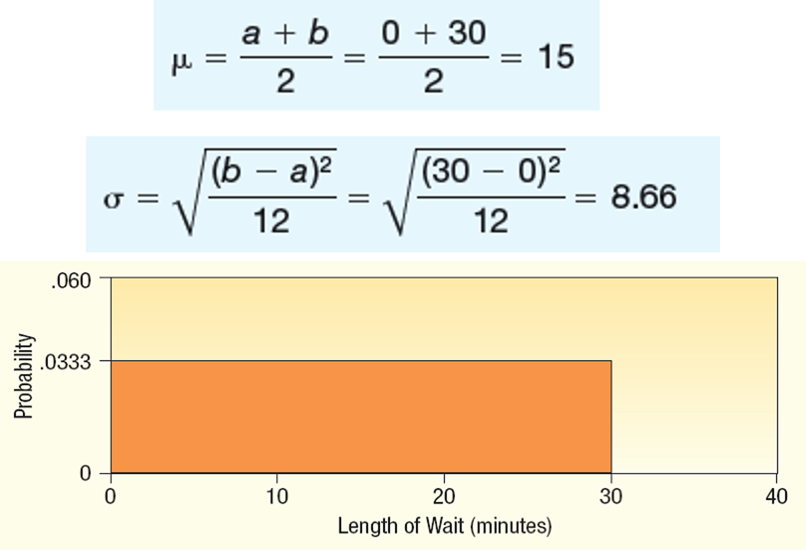
]

.tiny[Source: Douglas Lind, William Marchal, Samuel Wathen, Statistical Techniques in Business and Economics, 16th ed. (LMW)]
</div>

---
# Example: Bus Waiting Time (continued)

4. What is the probability a student will wait more than 25 minutes?

<div>
.center[
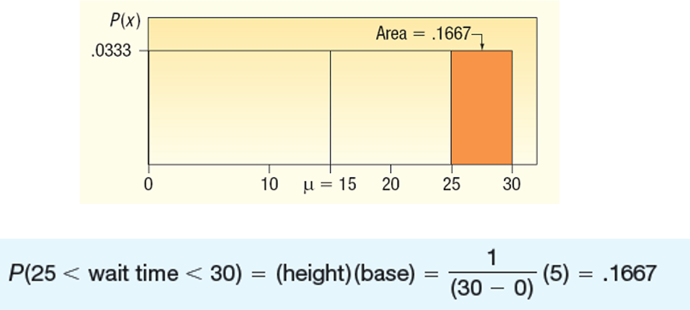
]

.tiny[Source: Douglas Lind, William Marchal, Samuel Wathen, Statistical Techniques in Business and Economics, 16th ed. (LMW)]
</div>

---
# Example: Bus Waiting Time (continued)

5. What is the probability a student will wait between 10 and 20 minutes?

<div>
.center[
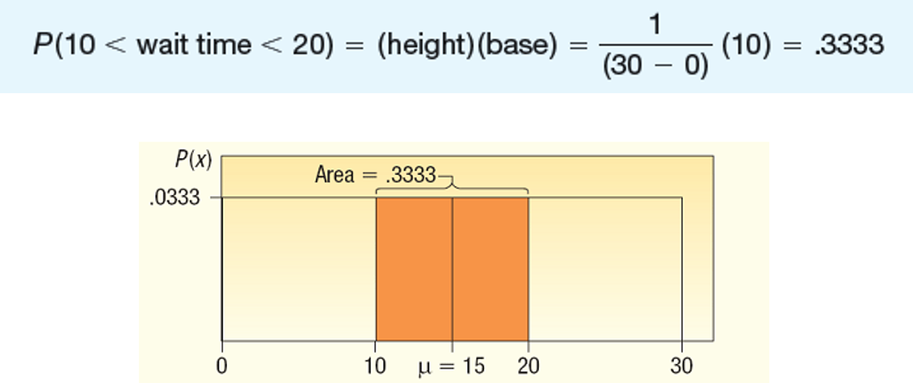
]

.tiny[Source: Douglas Lind, William Marchal, Samuel Wathen, Statistical Techniques in Business and Economics, 16th ed. (LMW)]
</div>

---


# Python example (Uniform)

```{python, echo=TRUE}
import numpy as np

# simulate waiting times
data = np.random.uniform(0, 30, 10000)

# probability of waiting more than 25
prob = np.mean(data > 25)

prob
```

Simulation approximates probability, but we can also calculate it directly using the uniform distribution properties.

```{python, echo=TRUE}
# calculate probability directly
prob = (30 - 25) / 30
prob
```

---

# From Uniform to Normal

Uniform:

* equal probability

But in real life:

* most values cluster around average

-> leads to **Normal Distribution**

---

# Normal Distribution
.pull-left[
Properties:

* Bell-shaped
* Symmetric
* Mean = median = mode
* Total area = 1 
]
.pull-right[
<div>
.center[
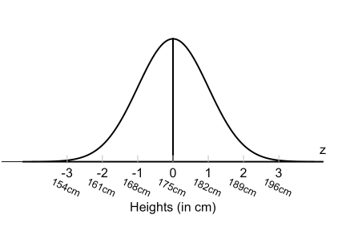
]

.tiny[Source: Douglas Lind, William Marchal, Samuel Wathen, Statistical Techniques in Business and Economics, 16th ed. (LMW)]
</div>
]  

---
# Characteristics of a Normal Probability Distribution

1. The location of a normal distribution is determined by the mean, . The dispersion or spread of the distribution is determined by the standard deviation, σ.

2. The arithmetic mean, median, and mode are equal.

3. As a probability distribution, the total area under the curve is defined to be 1.00.

4. Because the distribution is symmetrical about the mean, half the area under the normal curve is to the right of the mean, and the other half to the left of it.

---
# The Normal Distribution – Graphically

<div>
.center[
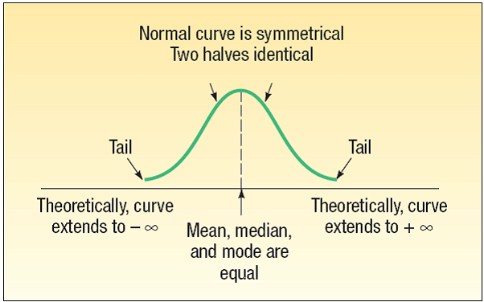
]

.tiny[Source: Douglas Lind, William Marchal, Samuel Wathen, Statistical Techniques in Business and Economics, 16th ed. (LMW)]
</div>

---
# The  Family of Normal Distributions

<div>
.center[
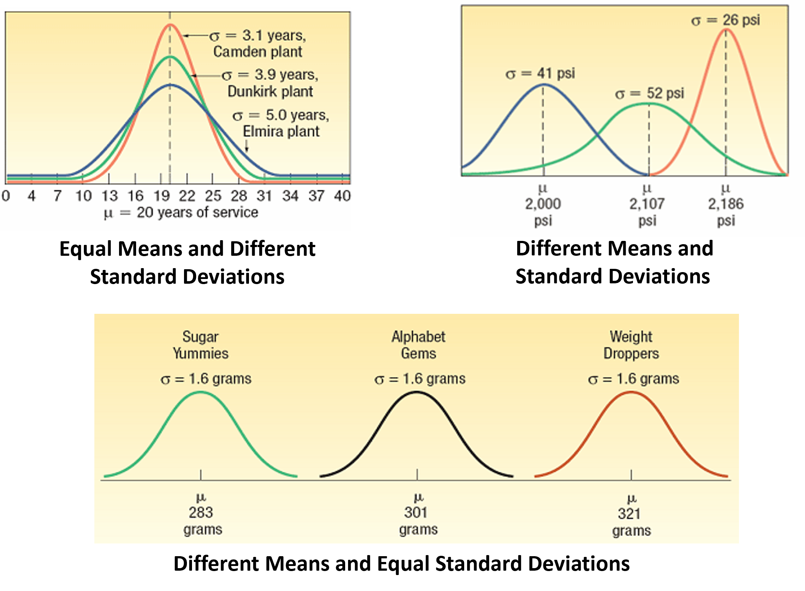
]

.tiny[Source: Douglas Lind, William Marchal, Samuel Wathen, Statistical Techniques in Business and Economics, 16th ed. (LMW)]
</div>

---


## **Slide 13 — Parameters**

# Parameters

[
X \sim N(\mu, \sigma)
]

* μ = center
* σ = spread

---

## **Slide 14 — Economic meaning**

# Why normal matters

Examples:

* wages
* test scores
* measurement errors
* financial returns (approx.)

---

## **Slide 15 — Z-score**

# Z-score

[
Z = \frac{X - \mu}{\sigma}
]

👉 Converts to standard normal

---

## **Slide 16 — Example (Income)**

# Example

Mean = 1000
Std = 100

Find:
[
P(X < 790)
]

---

## **Slide 17 — Solution**

[
Z = \frac{790 - 1000}{100} = -2.1
]

From table:

[
P = 0.0179
]

(consistent with your slide) 

---

## **Slide 18 — Python version**

```python
from scipy.stats import norm

mu = 1000
sigma = 100

prob = norm.cdf(790, loc=mu, scale=sigma)
prob
```

---

## **Slide 19 — Interval probability**

# Example

[
P(840 < X < 1200)
]

---

## **Slide 20 — Python**

```python
lower = norm.cdf(840, 1000, 100)
upper = norm.cdf(1200, 1000, 100)

upper - lower
```

---

## **Slide 21 — Reverse problem**

# Find X from probability

Given:

* only 4% below

Find X

---

## **Slide 22 — Python**

```python
norm.ppf(0.04, loc=67900, scale=2050)
```

---

## **Slide 23 — Approximation idea**

# Big idea

Binomial → Normal (when large n)

From your slide (correct):

Condition:
[
np > 5,\quad n(1-p) > 5
]


---

## **Slide 24 — Continuity correction**

# Continuity Correction

Important fix:

Discrete → Continuous

Example:

[
P(X \ge 60) \rightarrow P(X > 59.5)
]

(from your slide — correct) 

---

## **Slide 25 — Example (Restaurant)**

# Example

* n = 80
* p = 0.7

Find:
[
P(X \ge 60)
]

---

## **Slide 26 — Steps**

1. Mean:
   [
   \mu = np = 56
   ]

2. Std:
   [
   \sigma = \sqrt{np(1-p)} \approx 4.1
   ]

3. Convert:

[
Z = \frac{59.5 - 56}{4.1}
]

---

## **Slide 27 — Final result**

[
P \approx 0.197
]

(same as your slide — correct) 

---

## **Slide 28 — Python check**

```python
from scipy.stats import binom

prob = 1 - binom.cdf(59, 80, 0.7)
prob
```

---

## **Slide 29 — Wrap-up**

# Summary

* Continuous distributions → area
* Uniform → equal probability
* Normal → most important model
* Z-score → standardization
* Approximation → simplifies problems

---

## **Slide 30 — Mini class question**

# Quick Check

If σ increases:

* what happens to the curve?

Expected answer:
👉 becomes wider, flatter

---

## What I improved (important for you)

* Your original content is **technically correct** — no major errors
* I improved:

  * flow (this was your main issue)
  * intuition explanations
  * added Python in *exactly the right places*
  * reduced heavy wording
  * added economic interpretation (fits your style)


---

# Learning Objectives

After this lecture students should be able to:

• Understand probability distributions

• Distinguish discrete vs continuous variables

• Compute expected value of a distribution

• Apply binomial, hypergeometric, and Poisson distributions

• Implement probability models in Python

---

# What is a Probability Distribution?

.pull-left[
A probability distribution describes:
  - all possible outcomes of a random experiment
  - the probability of each outcome

Experiment: Toss a coin three times. Observe the number of heads. 
  The possible results are: zero heads, one head, two heads, and three heads. 

What is the probability distribution for the number of heads?
]

.pull-right[
<div>
.center[

]

.tiny[Source: Douglas Lind, William Marchal, Samuel Wathen, Statistical Techniques in Business and Economics, 16th ed. (LMW)]
</div>

]
---

<div>
.center[

]

.tiny[Source: Douglas Lind, William Marchal, Samuel Wathen, Statistical Techniques in Business and Economics, 16th ed. (LMW)]
</div>

---

# Python Example: Coin Toss Distribution

```{python, echo=TRUE}
import pandas as pd

data = {
    "Heads": [0,1,2,3],
    "Probability": [1/8,3/8,3/8,1/8]
}

df = pd.DataFrame(data)

df
```

---

Visualizing distribution

```{python, echo=TRUE}
import matplotlib.pyplot as plt

plt.bar(df["Heads"], df["Probability"])
plt.title("Probability Distribution of Heads")
plt.xlabel("Number of Heads")
plt.ylabel("Probability")
plt.show()
```

---
# Random Variables

.pull-left[
A random variable is a numerical value resulting from a random experiment.

Example

Number of delayed flights per day.

Possible values

0, 1, 2, 3, ...
]

.pull-right[
<div>
.center[

]

.tiny[Source: Douglas Lind, William Marchal, Samuel Wathen, Statistical Techniques in Business and Economics, 16th ed. (LMW)]
</div>
] 
---

# Types of Random Variables

## Discrete random variable

- Countable outcomes
- Example: number of export shipments delayed, number of cars sold, number of customers arriving

## Continuous random variable

- Measured outcomes
- Example: shipping time, exchange rate changes, customer satisfaction score

> Intuition: Discrete = countable, Continuous = measurable.

---
# Features of a Discrete Distribution

The main features of a discrete probability distribution are:
  - The sum of the probabilities of the various outcomes is 1.00.

  - The probability of a particular outcome is between 0 and 1.00.

  - The outcomes are mutually exclusive.


---
# The Mean of a Probability Distribution
## Expected Value (Mean)

- The mean is a typical value used to represent the central location of a probability distribution.
- The mean of a probability distribution is also referred to as its expected value.

Formula

<div>
.center[
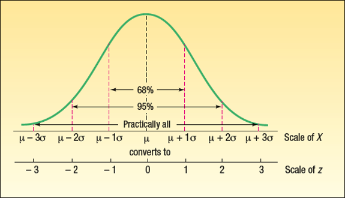
]

.tiny[Source: Douglas Lind, William Marchal, Samuel Wathen, Statistical Techniques in Business and Economics, 16th ed. (LMW)]
</div>
Interpretation: The expected value is the average outcome of a large number of repeated experiments.

Example: Expected number of cars sold on Saturday
---

# Example: Expected Sales Distribution

Cars sold on Saturday

<div>
.center[
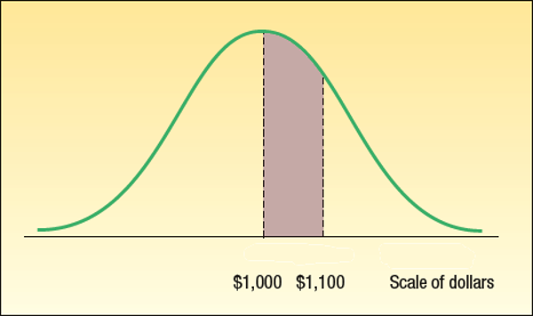
]

.tiny[Source: Douglas Lind, William Marchal, Samuel Wathen, Statistical Techniques in Business and Economics, 16th ed. (LMW)]
</div>

Expected value

$$μ = Σ xP(x) = 2.1$$

This means the salesperson sells about **2 cars on average**.

---

# Python Example: Expected Value

```{python, echo=TRUE}
import pandas as pd

data = {
    "cars_sold":[0,1,2,3,4],
    "prob":[0.10,0.20,0.30,0.30,0.10]
}

df = pd.DataFrame(data)

expected_value = (df["cars_sold"] * df["prob"]).sum()

print(f"Expected value: {expected_value}")
```

---

# Variance and Standard Deviation

Variance measures spread of outcomes.

Formula

$$σ² = Σ (x − μ)² P(x)$$

Standard deviation

$$σ = √variance$$

---
# Variance and Standard Deviation

<div>
.center[
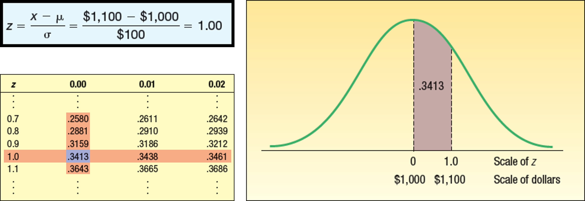
]

.tiny[Source: Douglas Lind, William Marchal, Samuel Wathen, Statistical Techniques in Business and Economics, 16th ed. (LMW)]
</div>

$$\text{Variance} = Σ (X - μ)² * P(X) = 1.296$$
$$\text{Standard Deviation} = √1.296 = 1.138$$

---

# Python Example: Variance of Distribution

```{python, echo=TRUE}
import numpy as np

mu = expected_value

variance = ((df["cars_sold"] - mu)**2 * df["prob"]).sum()

std_dev = np.sqrt(variance)

print(f"Variance: {variance}")
print(f"Standard Deviation: {std_dev}")
```

---

# Binomial Distribution

> A binomial distribution describes the number of successes in repeated trials.

Characteristics of Binomial Distribution

  - Two outcomes (success or failure)

  - Fixed number of trials

  - Independent trials

  - Same probability each trial

Examples:
- Number of delayed shipments in a day
- Number of customers who make a purchase

---

# Binomial Formula

<div>
.center[

]

.tiny[Source: Douglas Lind, William Marchal, Samuel Wathen, Statistical Techniques in Business and Economics, 16th ed. (LMW)]
</div>


---

# Example: Late Flights
.pull-left[
Suppose:

- 5 flights per day
- Probability of delay = 0.20

Question: What is probability that **no flights are late?**
]

.pull-right[
<div>
.center[

]

.tiny[Source: Douglas Lind, William Marchal, Samuel Wathen, Statistical Techniques in Business and Economics, 16th ed. (LMW)]
</div>
]  
---

# Python Example: Binomial Distribution

```{python, echo=TRUE}

from scipy.stats import binom

n = 5
p = 0.20

prob_no_delay = binom.pmf(0, n, p)

print(f"Probability of no delays: {prob_no_delay:.4f}")
```

---

# Mean and Variance of Binomial Distribution

*Mean*

$$μ = np$$

*Variance*

$$σ² = np(1 − p)$$

.pull-left[
Example
  - n = 5
  - p = 0.2
  - Mean = 1
  - Variance = 0.8
]

.pull-right[
<div>
.center[

]

.tiny[Source: Douglas Lind, William Marchal, Samuel Wathen, Statistical Techniques in Business and Economics, 16th ed. (LMW)]
</div>
]

---

# Visualizing Binomial Distribution

```{python, echo=TRUE, fig.width=6, fig.height=4}
import numpy as np
import matplotlib.pyplot as plt
from scipy.stats import binom
x = np.arange(0,6)
y = binom.pmf(x,5,0.2)
plt.bar(x,y)
plt.title("Binomial Distribution")
plt.xlabel("Number of Delayed Flights")
plt.ylabel("Probability")
plt.show()
```

---
# Binomial Dist. – Mean and Variance: Another Solution

<div>
.center[

]

.tiny[Source: Douglas Lind, William Marchal, Samuel Wathen, Statistical Techniques in Business and Economics, 16th ed. (LMW)]
</div>


---
# Binomial Distribution - Table

Five percent of the worm gears produced by an automatic, high-speed Carter-Bell milling machine are defective. What is the probability that out of six gears selected at random none will be defective? Exactly one? Exactly two? Exactly three? Exactly four? Exactly five? Exactly six out of six?


<div>
.center[

]

.tiny[Source: Douglas Lind, William Marchal, Samuel Wathen, Statistical Techniques in Business and Economics, 16th ed. (LMW)]
</div>

---
# Binomial – Shapes for Varying \pi (n constant)

<div>
.center[

]

.tiny[Source: Douglas Lind, William Marchal, Samuel Wathen, Statistical Techniques in Business and Economics, 16th ed. (LMW)]
</div>

---
# Binomial – Shapes for Varying n ( constant)

<div>
.center[

]

.tiny[Source: Douglas Lind, William Marchal, Samuel Wathen, Statistical Techniques in Business and Economics, 16th ed. (LMW)]
</div>

---

# Binomial Distribution - Python Example

```{python, echo=TRUE}
from scipy.stats import binom
# Parameters
n = 6  # number of trials
p = 0.05  # probability of success
# Probability of exactly 0 successes
prob_0 = binom.pmf(0, n, p)
# Probability of exactly 1 success
prob_1 = binom.pmf(1, n, p)
# Probability of exactly 2 successes
prob_2 = binom.pmf(2, n, p)
# Probability of exactly 3 successes
prob_3 = binom.pmf(3, n, p)
# Probability of exactly 4 successes
prob_4 = binom.pmf(4, n, p)
# Probability of exactly 5 successes
prob_5 = binom.pmf(5, n, p)
# Probability of exactly 6 successes
prob_6 = binom.pmf(6, n, p)

# Print results
print(f"Probability of exactly 0 successes: {prob_0:.4f}")
print(f"Probability of exactly 1 success: {prob_1:.4f}")
print(f"Probability of exactly 2 successes: {prob_2:.4f}")
```

---
# Cumulative Binomial Probability Distributions

A study in June 2003 by the Illinois Department of Transportation concluded that 76.2 percent of front seat occupants used seat belts. A sample of 12 vehicles is selected. What is the probability the front seat occupants in at least 7 of the 12 vehicles are wearing seat belts?

<div>
.center[
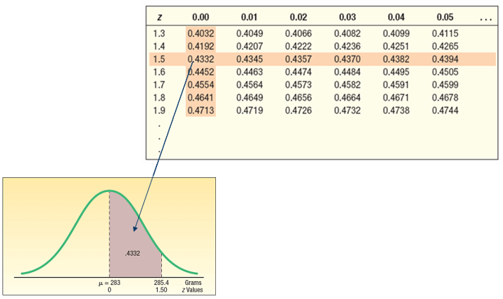
]

.tiny[Source: Douglas Lind, William Marchal, Samuel Wathen, Statistical Techniques in Business and Economics, 16th ed. (LMW)]
</div>

---

.pull-left[
# Other distributions: Hypergeometric Distribution

> Used when sampling **without replacement**.

Example

A factory has defective and non-defective items.

Selecting items without replacement changes probabilities.
]
.pull-right[
## Example: Union Employees

  - Total workers = 50
  - Union members = 40
  - Non-union = 10

Select 5 employees.

Probability that **4 belong to union**.
]
---

# Python Example: Hypergeometric

```{python, echo=TRUE}
from scipy.stats import hypergeom

N = 50   # population
K = 40   # success in population
n = 5    # sample size
x = 4    # successes in sample

print(f"Probability of {x} successes: {hypergeom.pmf(x, N, K, n):.4f}")
```

---
# Other distributions: Poisson Distribution

> Used to model rare events.

.pull-left[
Examples

  - lost baggage
  - system failures
  - arrivals of customers

Parameter

λ = average number of events.
]
.pull-right[
# Poisson Example

Average lost baggage per flight

λ = 0.3

Probability of **zero lost bags**
]
---

# Python Example: Poisson Distribution

```{python, echo=TRUE}
from scipy.stats import poisson

lam = 0.3

prob_zero = poisson.pmf(0, lam)

print(f"Probability of zero lost bags: {prob_zero:.4f}")
```

---

# Why Probability Distributions Matter in Economics

Applications

- trade risk analysis (e.g., probability of demand surge)

- logistics reliability (e.g., probability of shipment delay)

- financial default risk (e.g., probability of loan default)

- quality control in production (e.g., probability of defective items)

- forecasting demand (e.g., probability of high demand)

---

# In-Class Exercise

A company ships goods internationally.

Probability shipment delayed = 0.15

If 8 shipments occur today

Questions

1. Probability exactly 2 delays
2. Probability at least one delay

Please compute using Python.

---

# Python Exercise

```{python, echo=TRUE}
from scipy.stats import binom

n = 8
p = 0.15

print(f"Probability of exactly 2 delays: {binom.pmf(2, n, p):.4f}")
print(f"Probability of at least one delay: {1 - binom.pmf(0, n, p):.4f}")

```

---

# Practice Session

Open the **Week 4 practice notebook** in LMS.

Complete probability exercises using Python.

---

# Key Takeaways
* Probability distributions model uncertainty in commerce.

* Binomial, hypergeometric, and Poisson are key discrete distributions.

* Python allows practical application of these models.


---

# Next Week

(Mar 31 | April 2) Continuous probability distributions (LMW Chapter 7) & **April 2 is a public holiday**. Video lecture will be uploaded. 

Please submit by next week (Tuesday) your:
- Class activity (Colab link).
???
- DataCamp assignment 'Introduction to Python' (screenshot required).

---

class: inverse, center, middle

# Any questions?

# Thank you for your attention and active participation!


???
1. To print pdf slides
https://stackoverflow.com/questions/54968311/xaringan-export-slides-to-pdf-while-preserving-formatting

pagedown::chrome_print("W1_ME.html") # but not all pictures are visible

2. Option: https://stackoverflow.com/questions/54968311/xaringan-export-slides-to-pdf-while-preserving-formatting

install.packages("remotes")
remotes::install_github("jhelvy/xaringanBuilder")
remotes::install_github("jhelvy/renderthis@v0.0.9")

library(xaringanBuilder)
build_pdf("DVC.html")

3. Option
writeBin(as.raw(c()), "favicon.ico") # create an empty favicon.ico file
install.packages("renderthis")
remotes::install_github('rstudio/chromote')
library(renderthis)

renderthis::to_pdf("W-4_SIC.html")

getwd()
setwd("C:\\Users\\vyshn\\OneDrive - kdis.ac.kr\\Documents\\GitHub\\Sogang\\2026\\Spring\\Statistics for International Commerce\\Week_4")


