<style>
@media print{
  body, html, .remark-slides-area, .remark-notes-area {
    height: 100% !important;
    width: 100% !important;
    overflow: visible;
    display: inline-block;
    }
</style>

<style type="text/css">
.remark-slide-content {
    font-size: 34px;
    padding: 1em 4em 1em 4em;
}
</style>

<style type="text/css">
.my-one-page-font {
  font-size: 28px;
}
</style>

</style>

<style type="text/css">
.my-one-page-font-table {
  font-size: 24px;
}
</style>

<style>
.tiny { font-size: 60%; }      /* class you can reuse anywhere */
</style>

<style>
.remark-slide-content {
  position: relative;
  z-index: 1;
}

.remark-slide-content::before {
  content: "";
  position: absolute;
  top: 50%;
  left: 50%;
  width: 600px;          /* adjust size */
  height: 600px;
  background-image: url("1. 교장(Seal_Positive).png");  /* place logo file in same folder */
  background-repeat: no-repeat;
  background-position: center;
  background-size: contain;
  opacity: 0.05;         /* watermark transparency */
  transform: translate(-50%, -50%);
  pointer-events: none;
  z-index: 0;
}
</style>


```{r setup, include = FALSE}
library(tidyverse)
library(knitr)
library(reticulate)
py_install(c("pandas", "matplotlib", "scipy"), pip = TRUE)

opts_chunk$set(fig.width = 10, 
               message = FALSE, 
               warning = FALSE,
               echo = FALSE)
```

```{r xaringan-themer, include=FALSE, warning=FALSE}
#install.packages("xaringanthemer")
library(xaringanthemer)
style_mono_accent(
  base_color = "#851a10",
  header_font_google = google_font("Josefin Sans"),
  text_font_google   = google_font("Montserrat", "500", "550i"),
  code_font_google   = google_font("Fira Mono"),
  colors = c(
  red = "#f34213",
  purple = "#3e2f5b",
  orange = "#ff8811",
  green = "#136f63",
  white = "#FFFFFF"
)
)
```

Hello everyone!

Yet another **great day** to *keep learning* statistics for international commerce. :-)

---

# Agenda

- Sampling distribution of the sample mean
- Central Limit Theorem (CLT)
- Standard error
- Point estimates and confidence intervals
- z-interval and t-interval
- Business and international commerce applications

---

# Learning Objectives

By the end of this class, you should be able to:

- explain what a **sampling distribution** is
- distinguish **population values** from **sample statistics**
- use the **Central Limit Theorem**
- calculate the **standard error of the mean**
- construct and interpret **confidence intervals**
- decide when to use **z** versus **t**
- interpret results in a **business decision** context

---

# Quick Review from Week 5

Last week, we worked with:

- **continuous probability distributions**
- **normal distribution**
- **z-scores**
- **probabilities under the normal curve**

This week, we move from:

### individual observations

to

### sample means

That is the key idea of today's class.

---

# Warm-Up Question

A global e-commerce company wants to know:

> "What is the average amount spent per customer order?"

Should they:

A. Ask **every** customer  
B. Take a **sample** of customers

### Think:

If they take different random samples, will they always get the same sample mean?

---

# Population vs Sample

## Population

The full set of all units of interest.

Examples:
- all orders made on Amazon Korea this month
- all export firms in Korea
- all shipping times for a logistics company this year

## Sample

A subset selected from the population.

Examples:
- 100 customer orders
- 50 export firms
- 40 shipments

---

# Why Sampling?

We usually use samples because a population may be:

- too large
- too expensive to study fully
- too time-consuming to measure
- constantly changing

### Goal:

Use the sample to learn something about the population.

---

# Key Idea Today

Even if the **population stays the same**, different samples give different sample means.

So we ask:

## How do sample means behave?

That leads us to the:

# Sampling Distribution

---

# What is a Sampling Distribution?

A **sampling distribution** is the probability distribution of a sample statistic.

Today we focus on:

## the sampling distribution of the sample mean

That means:

- take many random samples of the same size $n$
- compute the mean for each sample
- study the distribution of those means

---

# Example: Small Population of Order Values

Suppose the daily order values (in USD) in a tiny online store are:

$$
6, 7, 8, 10
$$

Population mean:

$$
\mu = \frac{6+7+8+10}{4} = 7.75
$$

We will take all possible samples of size 2.

---

# All Samples of Size 2

Possible samples (without replacement):

- (6, 7) → mean = 6.5
- (6, 8) → mean = 7.0
- (6, 10) → mean = 8.0
- (7, 8) → mean = 7.5
- (7, 10) → mean = 8.5
- (8, 10) → mean = 9.0

These means form the **sampling distribution of the sample mean**.

---

# Important Observation

The population values were:

$$
6, 7, 8, 10
$$

The sample means were:

$$
6.5, 7.0, 7.5, 8.0, 8.5, 9.0
$$

Notice:

- sample means are **less spread out** than individual values
- the average of sample means is still close to the population mean

This is a major idea in statistics.

---

# Properties of the Sampling Distribution

For the sampling distribution of the sample mean:

## 1. Mean

$$
\mu_{\bar{x}} = \mu
$$

The mean of sample means equals the population mean.

## 2. Standard Deviation

$$
\sigma_{\bar{x}} = \frac{\sigma}{\sqrt{n}}
$$

This is called the:

# Standard Error

---

# Standard Error of the Mean

The **standard error** tells us how much the sample mean typically varies from sample to sample.

$$
SE = \frac{\sigma}{\sqrt{n}}
$$

### Interpretation:

- larger sample size → **smaller error**
- more variability in population → **larger error**

---

# Intuition

If you average more observations:

- random ups and downs tend to cancel out
- the sample mean becomes more stable

### Therefore:

Larger samples usually give **more precise estimates**.

---

# Python Example: Sampling Distribution

```{python, echo=TRUE}
import numpy as np
import matplotlib.pyplot as plt
import pandas as pd
from itertools import combinations

pop = np.array([6, 7, 8, 10])
all_samples = list(combinations(pop, 2))
sample_means = np.array([np.mean(sample) for sample in all_samples])

print("sample_means =", sample_means)
print("mean(pop) =", pop.mean())
print("mean(sample_means) =", sample_means.mean())
print("sd(pop) =", pop.std(ddof=1))
print("sd(sample_means) =", sample_means.std(ddof=1))
```

---

# Visualizing Population vs Sample Means

```{python, echo=FALSE}
pop_counts = pd.Series(pop).value_counts().sort_index()
sample_mean_counts = pd.Series(sample_means).value_counts().sort_index()

fig, axes = plt.subplots(1, 2, figsize=(12, 5), sharey=True)

axes[0].bar(pop_counts.index, pop_counts.values, width=0.55, color="#4c78a8", edgecolor="white")
axes[0].axvline(pop.mean(), color="#c44e52", linestyle="--", linewidth=2, label=f"Mean = {pop.mean():.2f}")
axes[0].set_title("Population values")
axes[0].set_xlabel("Value")
axes[0].set_ylabel("Frequency")
axes[0].set_xticks(pop_counts.index)
axes[0].set_ylim(0, max(pop_counts.max(), sample_mean_counts.max()) + 0.6)
axes[0].legend(frameon=False, loc="upper left")

axes[1].bar(sample_mean_counts.index, sample_mean_counts.values, width=0.38, color="#72b7b2", edgecolor="white")
axes[1].axvline(sample_means.mean(), color="#c44e52", linestyle="--", linewidth=2, label=f"Mean = {sample_means.mean():.2f}")
axes[1].set_title("Sampling distribution of $\\bar{x}$")
axes[1].set_xlabel("Sample mean")
axes[1].set_xticks(sample_mean_counts.index)
axes[1].legend(frameon=False, loc="upper left")

fig.suptitle("Population Values vs Sampling Distribution", fontsize=18)
fig.tight_layout(rect=[0, 0, 1, 0.95])
plt.show()
```

---

# Sampling Distribution of the Sample Mean – Example

Tartus Industries has seven production employees (considered the population). The hourly earnings of each employee are given in the table below.

<div>
.center[
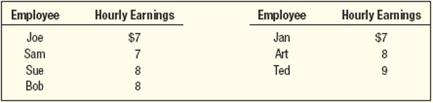
]

.tiny[Source: Douglas Lind, William Marchal, Samuel Wathen, Statistical Techniques in Business and Economics, 16th ed. (LMW)]
</div>

- What is the population mean?
- What is the population standard deviation?
- What is the sampling distribution of the sample mean for samples of size 2?
- What is the mean of the sampling distribution?
- What is the standard deviation of the sampling distribution?
- What observations can be made about the population and the sampling distribution?

---
# Sampling Distribution of the Sample Mean – Example

<div>
.center[
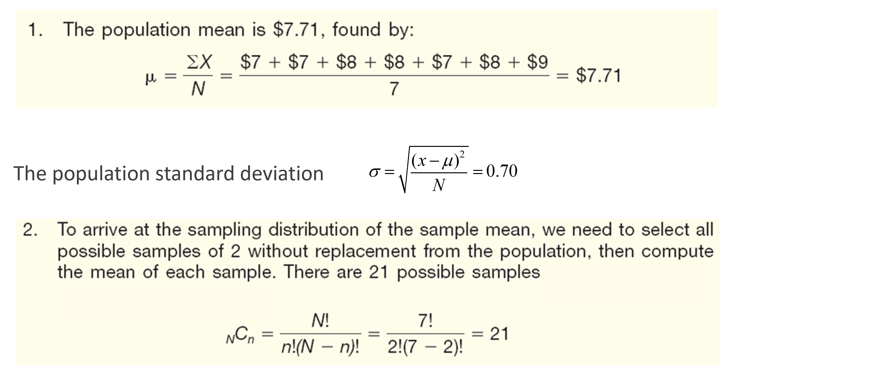
]

.tiny[Source: Douglas Lind, William Marchal, Samuel Wathen, Statistical Techniques in Business and Economics, 16th ed. (LMW)]
</div>

---
# Sampling Distribution of the Sample Mean – Example

<div>
.center[
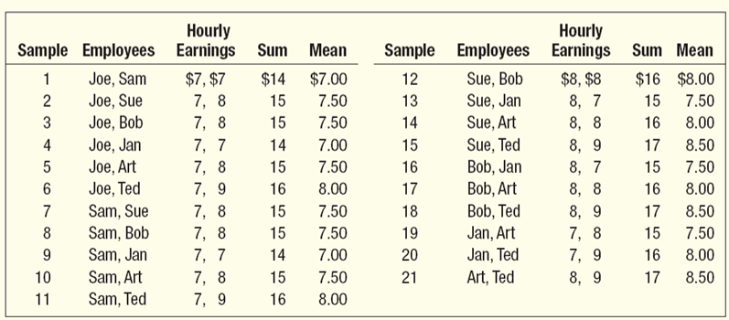
]

.tiny[Source: Douglas Lind, William Marchal, Samuel Wathen, Statistical Techniques in Business and Economics, 16th ed. (LMW)]
</div>

---
# Sampling Distribution of the Sample Mean – Example

<div>
.center[
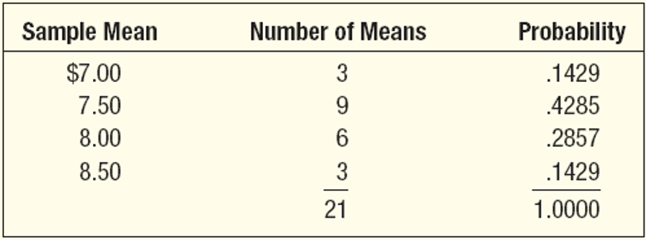
]

.tiny[Source: Douglas Lind, William Marchal, Samuel Wathen, Statistical Techniques in Business and Economics, 16th ed. (LMW)]
</div>

---
# Sampling Distribution of the Sample Mean – Example

<div>
.center[
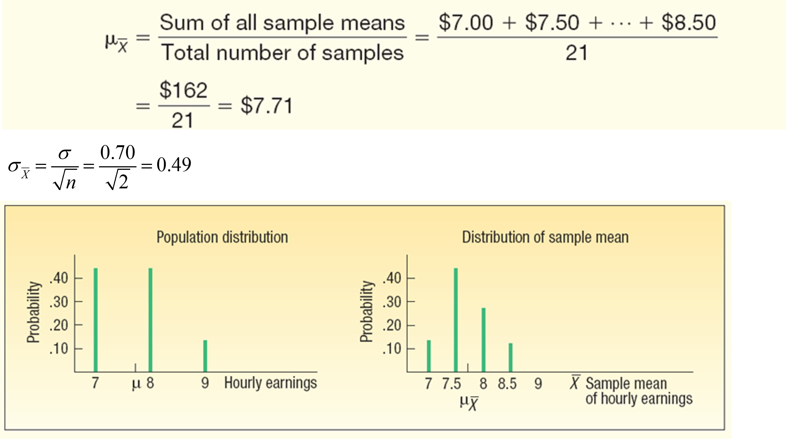
]

.tiny[Source: Douglas Lind, William Marchal, Samuel Wathen, Statistical Techniques in Business and Economics, 16th ed. (LMW)]
</div>

---
# Sampling Distribution of the Sample Mean – Example

These observations can be made:
- The mean of the distribution of the sample mean ($7.71) is equal to the mean of the population.

- The spread in the distribution of the sample mean is less than the spread in the population values.  As size of the sample is increased, the spread of the distribution of the sample mean becomes smaller. 

- The shape of the sampling distribution of the sample mean and the shape of the frequency distribution of the population values are different. The distribution of the sample mean tends to approximate the normal probability distribution.

---

# In-Class Check

Suppose the population standard deviation is 12 and sample size is 36.

What is the standard error?

$$
SE = \frac{12}{\sqrt{36}} = ?
$$

### Answer:

$$
SE = 2
$$

---

# Commonly Used Sampling Methods

## Simple Random Sampling

> A sample selected so that each item or person in the population has the same chance of being included. 

*EXAMPLE*: A population consists of 845 employees of Nitra Industries. A sample of 52 employees will be selected from that population. The name of each employee is written on a small slip of paper and all slips are deposited in a box. After they have been thoroughly mixed, the first selection is made by drawing a slip out of the box without looking at it. This process is repeated until the sample of 52 employees is chosen.

---
# Commonly Used Sampling Methods
## Systematic Random Sampling

> The items or individuals of the population are arranged in some order.  A random starting point is selected and then every kth member of the population is selected for the sample.

*EXAMPLE*: A population consists of 845 employees of Nitra Industries. A sample of 52 employees will be selected from that population.

First, $k$ is calculated as the population size divided by the sample size. For Nitra Industries, we would select every 16th (845/52) employee list. If $k$ is not a whole number, then round down. Random sampling is used in the selection of the first name. Then, select every 16th name on the list thereafter.

---
# Commonly Used Sampling Methods
## Stratified Random Sampling

> A population is first divided into subgroups, called strata, and a sample is selected from each stratum. This is useful when a population can be clearly divided in groups based on some characteristics.

*EXAMPLE*: Suppose we want to study the advertising expenditures for the 352 largest companies in the United States to determine whether firms with high returns on equity (a measure of profitability) spend more of each sales dollar on advertising than firms with a low return or deficit. We decide to sample a total of 50 companies. To make sure that the sample is a fair representation of the 352 companies, the companies are grouped on percent return on equity and the number to sample in each group is  proportional to the relative size of the group.  Then, the number of companies is randomly selected from each group. 

---
# Commonly Used Sampling Methods
## Cluster Sampling

> A population is divided into clusters using naturally occurring geographic or other boundaries. Then, clusters are randomly selected and a sample is collected by randomly selecting from each cluster.

*EXAMPLE*: Suppose you want to determine the views of residents in the greater Chicago, Illinois, metropolitan area about state and federal environmental protection policies. 
You can employ cluster sampling by subdividing the region into small units, perhaps by counties.  These are often called primary units.  Of the twelve counties, you randomly select three:  La Porte, Cook, and Kenosha.  Next you select a random sample of residents in each of these counties.  

---
# Commonly Used Sampling Methods
## Sampling Error

By definition, sampling is used to calculate sample statistics which are estimates of population parameters.  

So there will always be a difference (usually an unknown difference) between the sample statistic and the population parameter. 

This difference is called sampling error.

---
class: center, middle
# Central Limit Theorem (CLT)
---

# Central Limit Theorem (CLT)

The **Central Limit Theorem** says:

> If we repeatedly take random samples of size $n$, the sampling distribution of the sample mean becomes approximately normal as $n$ gets larger.

Even if the original population is **not normal**.

---

# Why CLT Matters

This is one of the most important ideas in statistics because it allows us to use:

- normal-based probabilities
- z-scores
- confidence intervals
- hypothesis tests

for many real-world business problems.

---

# Rule of Thumb for CLT

If the population is:

- **normal** → sample mean is normal for any $n$
- **roughly symmetric** → often okay when $n \ge 10$
- **skewed** → safer when $n \ge 30$ (if very skewed, may need even larger $n$)

This is why you often hear:

## “30 is a useful benchmark”

---
# Central Limit Theorem (CLT) 
<div>
.center[
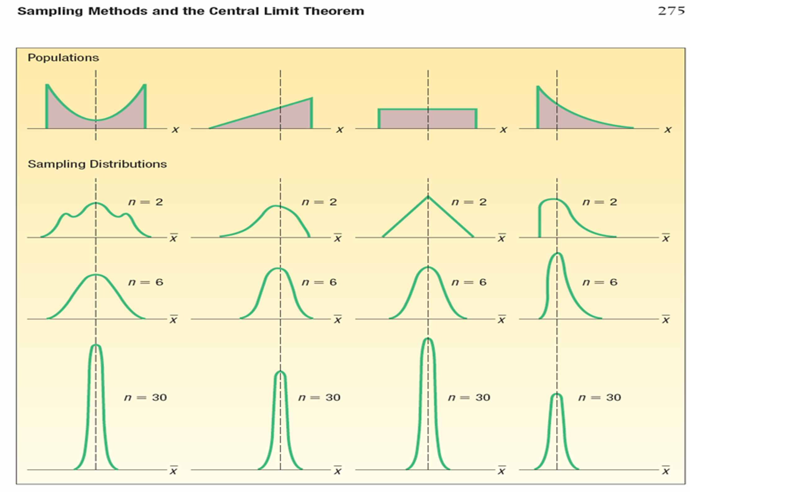
]

.tiny[Source: Douglas Lind, William Marchal, Samuel Wathen, Statistical Techniques in Business and Economics, 16th ed. (LMW)]
</div>

---

# International Commerce Example

A company ships smartphone accessories globally.

The delivery time of individual parcels is somewhat skewed.

But if we take samples of:

- 5 shipments
- 30 shipments
- 100 shipments

then the distribution of the **sample mean delivery time** becomes more and more normal.

---

# Python Simulation: CLT

```{python, echo=FALSE}
rng = np.random.default_rng(123)
population = rng.exponential(scale=5, size=100000)

sample_means_5 = np.array([rng.choice(population, size=5, replace=False).mean() for _ in range(1000)])
sample_means_30 = np.array([rng.choice(population, size=30, replace=False).mean() for _ in range(1000)])
sample_means_100 = np.array([rng.choice(population, size=100, replace=False).mean() for _ in range(1000)])

fig, axes = plt.subplots(2, 2, figsize=(12, 8))

panels = [
    (population[:5000], "Population (skewed)"),
    (sample_means_5, "Sample means, n=5"),
    (sample_means_30, "Sample means, n=30"),
    (sample_means_100, "Sample means, n=100"),
]

for axis, (values, title) in zip(axes.flat, panels):
    axis.hist(values, bins=35, color="steelblue", edgecolor="white")
    axis.set_title(title)
    axis.set_xlabel("Value")
    axis.set_ylabel("Count")

fig.suptitle("Central Limit Theorem in Action", fontsize=18)
fig.tight_layout()
plt.show()
```

---

# Interpretation of the Simulation

As sample size increases:

- the distribution of sample means becomes **more bell-shaped**
- the distribution becomes **narrower**
- estimates become **more stable**

This is exactly what the CLT predicts.

---

# Example 1: Container Weight Check

A company exports coffee beans.

Each container should contain on average:

- population mean: $\mu = 500$ kg
- population standard deviation: $\sigma = 20$ kg

A random sample of **25 containers** has mean weight:

$$
\bar{x} = 507
$$

Question:

> Is this unusually high?

---

## Step 1: Compute Standard Error

$$
SE = \frac{\sigma}{\sqrt{n}} = \frac{20}{\sqrt{25}} = 4
$$

## Step 2: Compute z-value

$$
z = \frac{\bar{x} - \mu}{SE}
$$

$$
z = \frac{507 - 500}{4} = 1.75
$$

---

# Step 3: Probability

From the standard normal distribution:

$$
P(Z > 1.75) \approx 0.0401
$$

### Interpretation:

There is about a **4% chance** of getting a sample mean this high or higher if the true process mean is 500.

That is somewhat unusual.

---

# Python Check

```{python, echo=FALSE}
import scipy.stats as stats

mu = 500
sigma = 20
n = 25
xbar = 507

SE = sigma / np.sqrt(n)
z = (xbar - mu) / SE
p_value = 1 - stats.norm.cdf(z)

print("SE =", SE)
print("z =", z)
print("p_value =", p_value)
```

---

# Business Interpretation

If the company consistently sees sample means this high,

it may suggest:

- overfilling containers
- higher shipping cost
- inefficiency in packaging

Statistics helps detect whether a difference is likely due to:

### random sampling variation

or

### a real process issue

---

# Transition to Estimation

So far, we asked:

> “How unusual is a sample mean?”

Now we ask:

> “What does a sample tell us about the population mean?”

This leads to:

# Estimation

> Using sample data to estimate population parameters ($\mu$, $p$, etc.).

---

# Point Estimate

A **point estimate** is a single number used to estimate a population parameter.

For example:

- population mean $\mu$ is estimated by sample mean $\bar{x}$
- population proportion $p$ is estimated by sample proportion $\hat{p}$

### Example:

If a sample of customers spends on average **$84**, then **$84** is a point estimate of the true population mean spending.

---
# Point Estimate

<div>
.center[
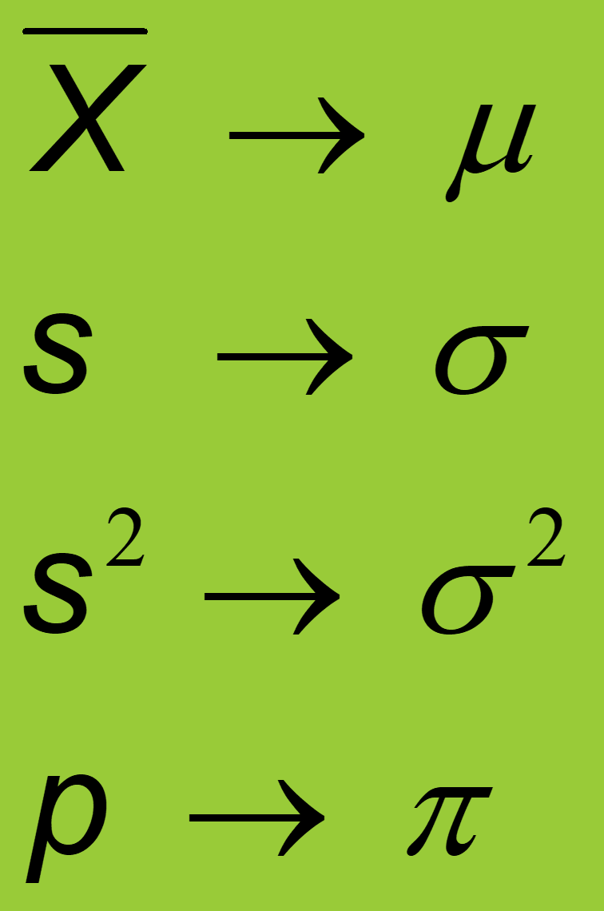
]

</div>

> The point estimate is a single value that serves as our best guess for the population parameter. However, it does not provide any information about the uncertainty or variability of the estimate.

---

# Problem with Point Estimates

A point estimate gives only **one value**.

But samples vary.

So instead of saying:

> “The true mean is exactly 84.”

we usually prefer:

> “The true mean is probably between A and B.”

That is a:

# Confidence Interval

---

# Confidence Interval (CI)

A **confidence interval** is a range of plausible values for a population parameter.

General form:

$$
\text{Confidence Interval} = \text{Point Estimate} \pm \text{Margin of Error}
$$

---

# Margin of Error

The margin of error depends on:

- the **confidence level**
- the **standard error**

Formula:

$$
\text{Margin of Error} = (\text{critical value}) \times (\text{standard error})
$$

---

# Confidence Level

Common confidence levels:

- **90%**
- **95%**
- **99%**

### Meaning:

If we repeated the sampling process many times, then about 95% of the intervals constructed this way would contain the true population mean.

---

# Very Important Interpretation

A 95% confidence interval does **not** mean:

> “There is a 95% probability that the true mean is inside this interval.”

Instead, it means:

> “The method produces intervals that capture the true mean about 95% of the time.”

This distinction is important.

---
# Interpretation of Confidence Intervals

.pull-left[

For a 95% confidence interval about 95% of similarly constructed intervals will contain the parameter being estimated.  

Also 95% of the sample means for a specified sample size will lie within 1.96 standard deviations of the hypothesized population.
]

.pull-right[
<div>
.center[
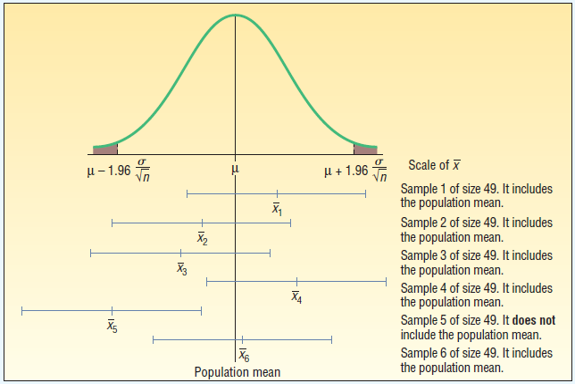
]
.tiny[Source: Douglas Lind, William Marchal, Samuel Wathen, Statistical Techniques in Business and Economics, 16th ed. (LMW)]
</div>
]

---

# z-Interval for a Mean

Use this when:

- the population standard deviation **σ is known**
- or in some simplified textbook settings

Formula:

$$
\bar{x} \pm z \cdot \frac{\sigma}{\sqrt{n}}
$$

Where:

- $\bar{x}$ = sample mean
- $z$ = critical value
- $\sigma$ = population standard deviation
- $n$ = sample size

---

# Common z Critical Values

For two-sided confidence intervals:

- 90% CI → $z = 1.645$
- 95% CI → $z = 1.96$
- 99% CI → $z = 2.576$

---

# Example 2: Mean Order Value (σ Known)

An international online retailer wants to estimate the mean order value.

A random sample of **64 orders** gives:

- sample mean = **$82**
- population standard deviation = **$16**

Construct a **95% confidence interval**.

---
class: my-one-page-font

## Step 1: Standard Error

$$
SE = \frac{16}{\sqrt{64}} = 2
$$

## Step 2: Margin of Error

For 95% confidence:

$$
z = 1.96
$$

$$
ME = 1.96 \times 2 = 3.92
$$

## Step 3: Confidence Interval

$$
82 \pm 3.92
$$

$$
(78.08, 85.92)
$$

### Interpretation:

We are 95% confident that the population mean order value is between **$78.08 and $85.92**.

---

# Python Check

```{python, echo=TRUE}
xbar = 82
sigma = 16
n = 64
z_star = 1.96

SE = sigma / np.sqrt(n)
ME = z_star * SE
lower = xbar - ME
upper = xbar + ME

print(pd.Series({"SE": SE, "ME": ME, "Lower": lower, "Upper": upper}))
```

---

# What Affects the Width of a CI?

A confidence interval becomes **wider** when:

- confidence level is higher
- variability is larger
- sample size is smaller

A confidence interval becomes **narrower** when:

- sample size is larger

---

# Visual Intuition

Think:

- **More confidence** → wider net
- **More data** → more precision

So there is always a trade-off between:

## confidence and precision

---

# Python Illustration: Confidence vs Precision

```{python, echo=FALSE}
from scipy import stats

sigma = 16
n_values = [25, 100]
conf_levels = np.array([0.90, 0.95, 0.99])
z_stars = stats.norm.ppf((1 + conf_levels) / 2)

fig, ax = plt.subplots(figsize=(9, 5))

for n in n_values:
  se = sigma / np.sqrt(n)
  widths = 2 * z_stars * se
  ax.plot(conf_levels * 100, widths, marker="o", linewidth=2.2, label=f"n = {n}")

ax.set_title("CI Width vs Confidence Level")
ax.set_xlabel("Confidence Level (%)")
ax.set_ylabel("Interval Width")
ax.set_xticks(conf_levels * 100)
ax.grid(alpha=0.25)
ax.legend(title="Sample size")
plt.tight_layout()
plt.show()
```

---

# Python Example: Sample Size and CI Width

```{python, echo=TRUE}
ci_df = pd.DataFrame({
    "n": [25, 64, 100, 400],
    "sigma": [16, 16, 16, 16],
    "z": [1.96, 1.96, 1.96, 1.96],
})

ci_df["SE"] = ci_df["sigma"] / np.sqrt(ci_df["n"])
ci_df["ME"] = ci_df["z"] * ci_df["SE"]
ci_df["Width"] = 2 * ci_df["ME"]

print(ci_df.round(2).to_string(index=False))
```

---

# When σ is Unknown

In real life, we usually do **not** know the population standard deviation $\sigma$.

So we use:

- sample standard deviation $s$
- **t-distribution** instead of z-distribution

---

# t-Distribution

.pull-left[
The **t-distribution** is:

- bell-shaped
- symmetric
- centered at 0
- similar to z, but with **heavier tails**

Why heavier tails?

Because when $\sigma$ is unknown, there is extra uncertainty.
]

.pull-right[
<div>
.center[
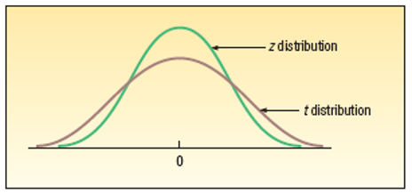
]

.tiny[Source: Douglas Lind, William Marchal, Samuel Wathen, Statistical Techniques in Business and Economics, 16th ed. (LMW)]
</div>

]

---
# Comparing the z and t Distributions When n is Small, 95% Confidence Level
<div>
.center[
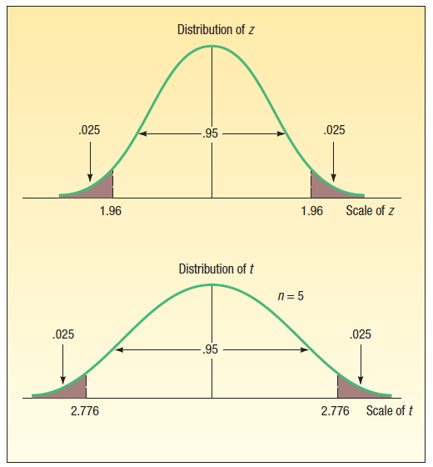
]

.tiny[Source: Douglas Lind, William Marchal, Samuel Wathen, Statistical Techniques in Business and Economics, 16th ed. (LMW)]
</div>

---

# Degrees of Freedom

For a one-sample t-interval:

$$
df = n - 1
$$

So if sample size is 15:

$$
df = 14
$$

> DF is a measure of how much information we have about variability. With fewer degrees of freedom, the t-distribution has heavier tails.

---

# t vs z

When sample size is small:

- **t** is wider than **z**
- because we are less certain

When sample size gets large:

- **t** becomes very close to **z**

---

# Visual Comparison of z and t

```{python, echo=FALSE}
x = np.linspace(-4, 4, 500)

fig, ax = plt.subplots(figsize=(10, 6))
ax.plot(x, stats.norm.pdf(x), label="z", linewidth=2)
ax.plot(x, stats.t.pdf(x, df=5), label="t (df=5)", linewidth=2)
ax.plot(x, stats.t.pdf(x, df=20), label="t (df=20)", linewidth=2)

ax.set_title("z Distribution vs t Distributions")
ax.set_xlabel("Value")
ax.set_ylabel("Density")
ax.legend(title="Distribution")
fig.tight_layout()
plt.show()
```

---

# t-Interval for a Mean

Use this when:

- population standard deviation **σ is unknown**
- population is approximately normal, or sample size is large enough

Formula:

$$
\bar{x} \pm t \cdot \frac{s}{\sqrt{n}}
$$

where *Margin of Error* = $t \cdot \frac{s}{\sqrt{n}}$ stands for error due to sampling variability and the fact that we are estimating $\sigma$ with $s$. 

---

# Example 3: Delivery Cost Estimate (σ Unknown)

A firm wants to estimate the average **express shipping cost** for overseas orders.

A sample of **10 shipments** gives:

- sample mean = **$42**
- sample standard deviation = **$8**

Construct a **95% confidence interval**.

---

# Step 1: Given Information


- $\bar{x} = 42$
- $s = 8$
- $n = 10$
- $df = 9$

For a 95% CI with df = 9:

$$
t^* \approx 2.262
$$


<div>
.center[
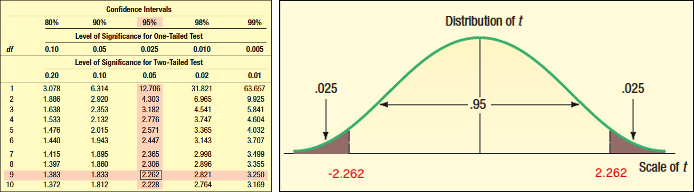
]

.tiny[Source: Douglas Lind, William Marchal, Samuel Wathen, Statistical Techniques in Business and Economics, 16th ed. (LMW)]
</div>


---

## Step 2: Standard Error

$$
SE = \frac{8}{\sqrt{10}} \approx 2.53
$$

## Step 3: Margin of Error

$$
ME = 2.262 \times 2.53 \approx 5.72 \text{ which means that the margin of error is about 5.72 dollars.}
$$

## Step 4: Confidence Interval

$$
42 \pm 5.72
$$

$$
(36.28, 47.72)
$$

### Interpretation:

We are 95% confident that the true mean express shipping cost is between **\$36.28 and \$47.72**.

---

# Python Check

```{python, echo=TRUE}
xbar = 42
s = 8
n = 10
df = n - 1
t_star = stats.t.ppf(0.975, df=df)

SE = s / np.sqrt(n)
ME = t_star * SE
lower = xbar - ME
upper = xbar + ME

print(pd.Series({"t_star": t_star, "SE": SE, "ME": ME, "Lower": lower, "Upper": upper}))
```

---

# z or t? Quick Decision Rule

Use **z** when:

- $\sigma$ is known

Use **t** when:

- $\sigma$ is unknown

In most real applications:

## we usually use t

---

# Example 4: International Retail Survey

A company surveys **36 international students** about monthly spending on imported snacks.

Sample results:

- sample mean = **$28**
- sample standard deviation = **$9**

Question:

Construct a 95% confidence interval.

Should we use z or t?

---

# Solution Idea

Because population standard deviation is **not given**, we use:

## t-interval

Even though $n=36$ is fairly large, t is still the standard choice.

---

# Python Solution

```{python, echo=TRUE}
xbar = 28
s = 9
n = 36
df = n - 1
t_star = stats.t.ppf(0.975, df=df)

SE = s / np.sqrt(n)
ME = t_star * SE
lower = xbar - ME
upper = xbar + ME

print(pd.Series({"SE": SE, "ME": ME, "Lower": lower, "Upper": upper}))
```

---

# Interpretation Practice

Suppose the 95% CI for average customer spending is:

$$
(24.95, 31.05)
$$

Can we say the true mean spending is likely to be:

- **$26** ?
- **$30** ?
- **$35** ?

### Answer:

- $26 → plausible
- $30 → plausible
- $35 → not supported by this interval

---

# Common Student Mistakes

## Mistake 1
Using **σ** when only **s** is available

## Mistake 2
Confusing **standard deviation** with **standard error**

## Mistake 3
Incorrect interpretation of confidence intervals

## Mistake 4
Forgetting that **larger n** reduces the interval width

---

# In-Class Practice 1

A company wants to estimate average delivery time for international parcels.

Known information:

- population standard deviation = 6 days
- sample size = 49
- sample mean = 18 days

Construct a **95% confidence interval**.

---

# In-Class Practice 2

A fashion retailer wants to estimate the average amount spent by tourists in a duty-free store.

Sample information:

- sample mean = $112
- sample standard deviation = $24
- sample size = 25

Construct a **95% confidence interval**.

Should you use z or t?

---

# In-Class Practice 3

A Korean cosmetics exporter samples 40 foreign buyers.

Average monthly order quantity:

- sample mean = 58 units
- sample standard deviation = 10 units

Construct a **90% confidence interval** for the population mean.

---

# Python Practice Template

```{python, echo=TRUE}
# Replace these values with the numbers from your problem
xbar = 0
s_or_sigma = 0
n = 0

# For z interval (if sigma known)
# z_star = 1.96
# SE = s_or_sigma / np.sqrt(n)
# lower = xbar - z_star * SE
# upper = xbar + z_star * SE

# For t interval (if sigma unknown)
# t_star = stats.t.ppf(0.975, df=n - 1)
# SE = s_or_sigma / np.sqrt(n)
# lower = xbar - t_star * SE
# upper = xbar + t_star * SE
```

---

# Summary

Today we learned:

- what a **sampling distribution** is

- why the **sample mean** has its own distribution

- the meaning of the **Central Limit Theorem**

- how to compute the **standard error**

- how to construct **confidence intervals**

- when to use **z** and when to use **t**

---

# Final Big Idea

Statistics helps us move from:

## a sample

to

## a reasonable conclusion about the population

That is one of the most useful tools in business, economics, and international commerce.

---

# Homework / Reflection / Self-Check

In 3–4 sentences, explain:

1. Why larger samples give more precise estimates.

2. Why a confidence interval is more informative than a point estimate.

3. One international business decision where confidence intervals would be useful.

---

# Next Week

*(April 14 | April 16)* Sampling distributions; central limit theorem; estimation; confidence intervals (LMW Chapters 8 and 9) 

*(April 21 | April 23)* No class / Midterm exam

*(April 28 | April 30)* One-sample hypothesis testing (LMW Chapter 10) 
---

class: inverse, center, middle

# Any questions?

# Thank you for your attention and active participation!


???
1. To print pdf slides
https://stackoverflow.com/questions/54968311/xaringan-export-slides-to-pdf-while-preserving-formatting

pagedown::chrome_print("W1_ME.html") # but not all pictures are visible

2. Option: https://stackoverflow.com/questions/54968311/xaringan-export-slides-to-pdf-while-preserving-formatting

install.packages("remotes")
remotes::install_github("jhelvy/xaringanBuilder")
remotes::install_github("jhelvy/renderthis@v0.0.9")

library(xaringanBuilder)
build_pdf("DVC.html")

3. Option
writeBin(as.raw(c()), "favicon.ico") # create an empty favicon.ico file
install.packages("renderthis")
remotes::install_github('rstudio/chromote')
library(renderthis)

renderthis::to_pdf("W-6_SIC.html")

getwd()
setwd("C:\\Users\\vyshn\\OneDrive - kdis.ac.kr\\Documents\\GitHub\\Sogang\\2026\\Spring\\Statistics for International Commerce\\Week_6")


