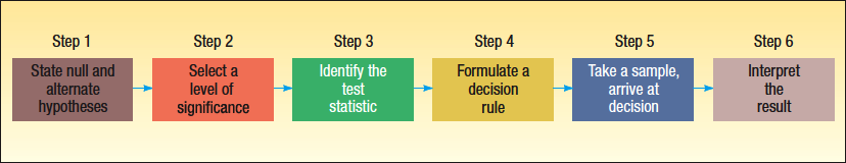
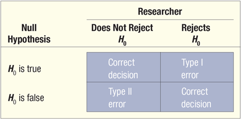
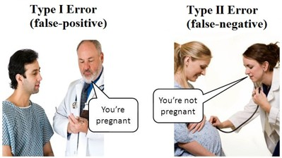
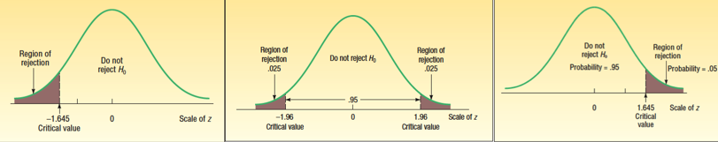
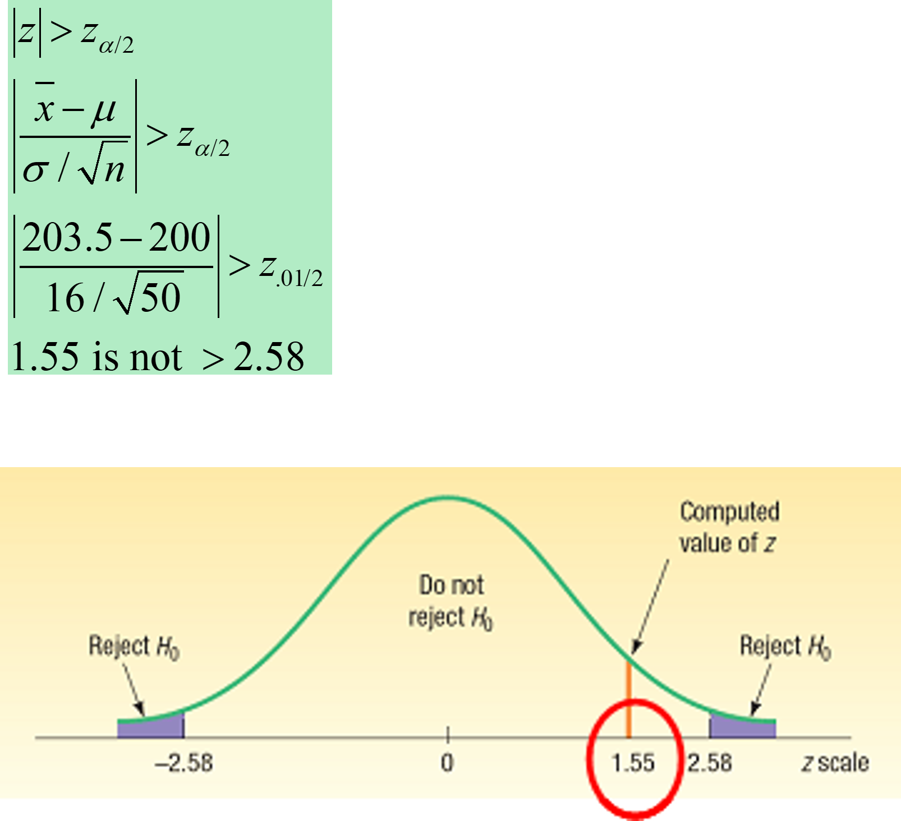
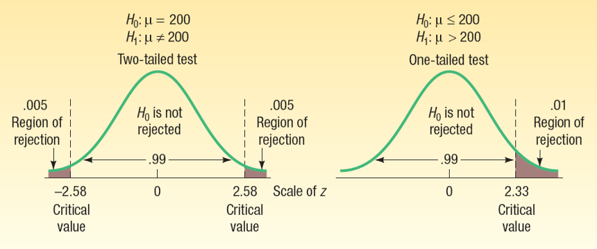
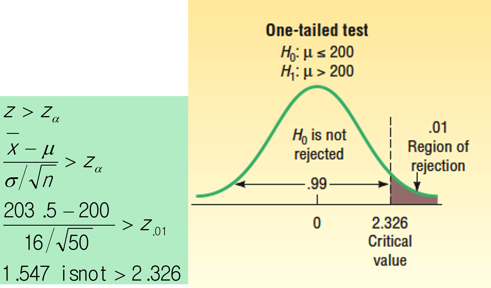
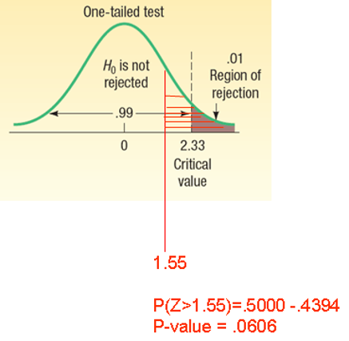

<style>
@media print{
  body, html, .remark-slides-area, .remark-notes-area {
    height: 100% !important;
    width: 100% !important;
    overflow: visible;
    display: inline-block;
    }
}
</style>

<style type="text/css">
.remark-slide-content {
    font-size: 34px;
    padding: 1em 4em 1em 4em;
}
</style>

<style type="text/css">
.my-one-page-font {
  font-size: 28px;
}
</style>

<style type="text/css">
.my-one-page-font-table {
  font-size: 24px;
}
</style>

<style>
.tiny { font-size: 60%; }      /* class you can reuse anywhere */
</style>

<style>
.remark-slide-content {
  position: relative;
  z-index: 1;
}

.remark-slide-content::before {
  content: "";
  position: absolute;
  top: 50%;
  left: 50%;
  width: 600px;          /* adjust size */
  height: 600px;
  background-image: url("1. 교장(Seal_Positive).png");  /* place logo file in same folder */
  background-repeat: no-repeat;
  background-position: center;
  background-size: contain;
  opacity: 0.05;         /* watermark transparency */
  transform: translate(-50%, -50%);
  pointer-events: none;
  z-index: 0;
}
</style>


```{r setup, include = FALSE}
library(tidyverse)
library(knitr)
library(reticulate)
# Install packages once manually if needed; avoid installing during lecture rendering.
# py_install(c("pandas", "matplotlib", "scipy"), pip = TRUE)

opts_chunk$set(fig.width = 10, 
               message = FALSE, 
               warning = FALSE,
               echo = FALSE)
```

```{r xaringan-themer, include=FALSE, warning=FALSE}
#install.packages("xaringanthemer")
library(xaringanthemer)
style_mono_accent(
  base_color = "#851a10",
  header_font_google = google_font("Josefin Sans"),
  text_font_google   = google_font("Montserrat", "500", "550i"),
  code_font_google   = google_font("Fira Mono"),
  colors = c(
  red = "#f34213",
  purple = "#3e2f5b",
  orange = "#ff8811",
  green = "#136f63",
  white = "#FFFFFF"
)
)
```

Hello everyone!

Yet another **great day** to *keep learning* statistics for international commerce. :-)

---

# Agenda

## Hypothesis Testing

* From estimation → to **decision making**

* One-sample tests

* z-test vs t-test

* p-value

* Type I and Type II errors

---

# Learning Objectives

By the end:

* understand **null vs alternative hypothesis**

* perform **one-sample tests**

* interpret **p-values**

* make **business decisions using data**

---

# Motivation (Business Context)

A company claims:

> “Average delivery time is under 5 days.”

We have sample data.

Question:

## Do we believe the claim?

---

# What is a Hypothesis?

A hypothesis is a **testable statement** about a population.

Examples:

* Mean delivery time = 5 days
* Average spending = 60 USD
* Return rate = 70%

---

# Hypothesis Testing

Definition:

A procedure using **sample data + probability**
to decide *whether a claim is reasonable*.

<div>
.center[

]
.tiny[Source: Douglas Lind, William Marchal, Samuel Wathen, Statistical Techniques in Business and Economics, 16th ed. (LMW)]
</div>


---

# Step 1: Define Hypotheses

Two competing claims about a population parameter.

| | Hypothesis | Role |
|---|---|---|
| $H_0$ | Null | The "nothing is happening" claim |
| $H_1$ | Alternative | What we want to find evidence for |

> We **never prove** $H_0$ — we either reject it or fail to reject it.

---

# Null Hypothesis $H_0$

* The **default** assumption — assume nothing has changed

* Contains an **equality** (=, ≤, ≥)

* We assume it is true until the data say otherwise

**Commerce examples:**

* $H_0: \mu = 5$ days (delivery time is as claimed)

* $H_0: \mu = 100$ USD (average order has not changed)

* $H_0: \mu \leq 50$ kg (container weight is within limit)

---

# Alternative Hypothesis $H_1$

* The claim we are **trying to support with data**

* Contains a strict inequality (≠, <, >)

* Drives which tail of the distribution we look at

**Commerce examples matching the $H_0$ above:**

* $H_1: \mu \neq 5$ → delivery time is **different** (two-sided)

* $H_1: \mu > 100$ → orders are **larger than claimed** (right-tailed)

* $H_1: \mu > 50$ → containers are **overweight** (right-tailed)

---

# How to Choose the Alternative?

Ask: **"What would concern us?"**

| Situation | $H_1$ | Test |
|---|---|---|
| Any difference matters | $\mu \neq \mu_0$ | Two-sided |
| We fear it's too low | $\mu < \mu_0$ | Left-tailed |
| We fear it's too high | $\mu > \mu_0$ | Right-tailed |

**Rule:** The alternative reflects the **research question**, not the data.

---

# Key Definitions

**NULL HYPOTHESIS (H₀):** A statement about the value of a population parameter developed for the purpose of testing numerical evidence.

**ALTERNATIVE HYPOTHESIS (H₁):** A statement that is accepted if the sample data provide sufficient evidence that the null hypothesis is false.

--

> H₀ and H₁ are **mutually exclusive** and **collectively exhaustive**.

Example: $H_0: \mu = 0$ vs. $H_1: \mu \neq 0$

.tiny[**mutually exclusive** and **collectively exhaustive** means that exactly one of the hypotheses must be true. They cannot both be true at the same time, and they cover all possible outcomes. In this example, either $\mu$ is equal to 0 (H₀ is true) or $\mu$ is not equal to 0 (H₁ is true). There are no other possibilities.]
---

# Hypothesis
## Examples

* *Null Hypothesis*: $H_0$: There is no difference in the salary of factory workers based on gender.
* *Alternative Hypothesis*: $H_1$: Male factory workers have a higher salary than female factory workers.

* *Null Hypothesis*: $H_0$: There is no relationship between height and shoe size.
* *Alternative Hypothesis*: $H_1$: There is a positive relationship between height and shoe size.

* *Null Hypothesis*: $H_0$: Experience on the job has no impact on the quality of a brick mason’s work.
* *Alternative Hypothesis*: $H_1$: The quality of a brick mason’s work is influenced by on-the-job experience.

---

# Key Reminders: $H_0$ and $H_1$

- $H_0$ is the null hypothesis; $H_1$ is the alternative hypothesis.

- They are **mutually exclusive** and **collectively exhaustive**.

- We start by assuming $H_0$ is true; data are used to test this assumption.

- Decisions are based on a random sample of size $n$.

- **Fail to reject $H_0$** does not mean $H_0$ is true; it means evidence is not strong enough to reject it.

- **Reject $H_0$** means the data support $H_1$, with Type I error risk controlled by $\alpha$.

- Equality belongs in $H_0$ ($=$, $\le$, $\ge$); strict inequality belongs in $H_1$ ($\ne$, $<$, $>$).

---
# Types of Tests

| Type | Form | When to use | Commerce example |
|---|---|---|---|
| Two-sided | $\mu \neq \mu_0$ | Any change matters (up **or** down) | Has avg. order value changed from $100? |
| Left-tailed | $\mu < \mu_0$ | We fear the value is **too low** | Is avg. delivery faster than claimed 5 days? |
| Right-tailed | $\mu > \mu_0$ | We fear the value is **too high** | Are containers heavier than the 50 kg limit? |

---

# Step 2: Significance Level $\alpha$

The **significance level** $\alpha$ is the probability of rejecting $H_0$ when it is actually true:

$$P(\text{reject } H_0 \mid H_0 \text{ is true}) = \alpha$$

--

Key points:

* Also called the **Type I Error** rate and **false positive** rate
* Must be chosen **before** collecting data — never after!
* Common choices: $\alpha = 0.05$ or $\alpha = 0.01$

--

> **Intuition:** $\alpha = 0.05$ means we accept a 5% chance of wrongly rejecting a true $H_0$.

| $\alpha$ | Strictness | Typical use |
|---|---|---|
| 0.10 | Lenient | Exploratory research |
| **0.05** | **Standard** | **Most business decisions** |
| 0.01 | Strict | High-stakes (regulatory, medical) |

---

# Another Possible Error: Type II Error ($\beta$)

Type II Error is the probability of **not rejecting** $H_0$ when $H_0$ is actually false:

$$P(\text{do not reject } H_0 \mid H_0 \text{ is false}) = \beta$$

--

Key points:

* Also called the **false negative** error
* We do **not** choose $\beta$ directly
* $\beta$ depends on $\alpha$, sample size $n$, and the true effect size

--

The **power of a test** is:

$$1 - \beta = P(\text{reject } H_0 \mid H_0 \text{ is false})$$

> **Intuition:** Higher power means a better chance of detecting a real effect.

---
# Errors in Hypothesis Testing

.pull-left[
<div>
.center[

]
.tiny[Source: Douglas Lind, William Marchal, Samuel Wathen, Statistical Techniques in Business and Economics, 16th ed. (LMW)]
</div>
]

.pull-right[
<div>
.center[

]
</div>
]

---

# Type I and Type II Errors


| | $H_0$ is **true** | $H_0$ is **false** |
|---|---|---|
| **Reject $H_0$** | .red[Type I Error ($\alpha$)] | Correct decision ✓ |
| **Do not reject $H_0$** | Correct decision ✓ | .red[Type II Error ($\beta$)] |

--

**Type I Error:** Reject $H_0$ when it is actually true. Probability = $\alpha$

**Type II Error:** Fail to reject $H_0$ when it is actually false. Probability = $\beta$

**Power of the test** = $1 - \beta$ = $P(\text{reject } H_0 \mid H_0 \text{ is false})$

> We choose $\alpha$. The value of $\beta$ depends on $\alpha$, sample size $n$, and the true parameter value.


---

# Business Interpretation of Errors


**Scenario:** A logistics firm claims mean delivery time = 5 days. You test this with sample data.

--

**Type I Error** ($\alpha$) — false alarm:
* You conclude delivery times have changed, but they actually have not
* Consequence: unnecessary investment in process overhaul

--

**Type II Error** ($\beta$) — missed signal:
* You conclude delivery times are fine, but they actually have gotten worse
* Consequence: customer dissatisfaction goes unaddressed

--

> **Trade-off:** Reducing $\alpha$ (fewer false alarms) increases $\beta$ (more missed signals). Larger samples reduce both.

---
# Step 3: Identify the Test Statistic 

**Test statistic:** a value computed from sample data to decide whether to reject $H_0$.

For one-sample tests of a population mean:

## z-test ($\sigma$ known)

$$
z = \frac{\bar{x} - \mu_0}{\sigma / \sqrt{n}}
$$

## t-test ($\sigma$ unknown)

$$
t = \frac{\bar{x} - \mu_0}{s / \sqrt{n}}, \quad df = n - 1
$$

For a one-sample test about population variance, use the $\chi^2$ statistic.
Use the $F$-statistic when comparing two variances (or in ANOVA settings).

---

# Step 4: Decision Rule

Two approaches:

## 1. Critical value

## 2. p-value (preferred)

---
# 1. Critical value

The **critical value** is the cutoff (or cutoffs) that separates:
- the **rejection region** (reject $H_0$), and
- the **non-rejection region** (do not reject $H_0$),
for a chosen significance level $\alpha$.

<div>
.center[

]
.tiny[Source: Douglas Lind, William Marchal, Samuel Wathen, Statistical Techniques in Business and Economics, 16th ed. (LMW)]

</div>

Quick example (two-sided z-test):

- If $\alpha = 0.05$, critical values are $z = \pm 1.96$.
- If observed $z = 2.10$, then $2.10 > 1.96$.
- So the statistic is in the rejection region, and we **reject $H_0$**.


---

# 2. p-value (Important)

Definition:

The **p-value** is the probability of getting a test statistic
as extreme as (or more extreme than) the observed one,
**if $H_0$ is true**.

Quick example:

- Suppose a z-test gives $z = 2.00$.
- Right-tailed p-value: $P(Z \ge 2.00) \approx 0.0228$.
- Two-sided p-value: $2 \times 0.0228 = 0.0456$.

So, under $H_0$, a result this extreme would occur about **4.56%** of the time (two-sided case). Which means if we set $\alpha = 0.05$, we would reject $H_0$ because $p < \alpha$.

---

# Decision Rule (p-value)

* If p-value < α → reject H0
* If p-value ≥ α → do not reject H0

Typical α:

* 0.05
* 0.01

---
# Plain-English Guide to p-values

Interpretation (smaller p-value means stronger evidence against $H_0$):

- $p \le 0.10$: weak to moderate evidence against $H_0$

- $p \le 0.05$: moderate to strong evidence against $H_0$

- $p \le 0.01$: strong evidence against $H_0$

- $p \le 0.001$: very strong evidence against $H_0$

Decision reminder:

- Compare p-value with your pre-chosen $\alpha$.

- If $p < \alpha$, reject $H_0$; otherwise, fail to reject $H_0$.

---
# Step 5: Take a Sample, Arrive at a Decision

Checklist:

- Select a representative sample.

- Collect data on the relevant variable(s).

- Compute the test statistic ($z$ or $t$).

- Compare with the critical value(s), or compare p-value with $\alpha$.

- State the decision clearly: **reject $H_0$** or **fail to reject $H_0$**.

Decision template:

At significance level $\alpha$, [reject / fail to reject] $H_0$.
---
# Step 6: Interpret the Result

Translate the statistical decision into a plain-language business conclusion.

Checklist:

- State the decision first: **reject $H_0$** or **fail to reject $H_0$**.

- Refer to the original research question.

- Avoid saying $H_0$ is true; say "insufficient evidence" when failing to reject.

- If relevant, mention the significance level $\alpha$.

Templates:

- Fail to reject: "At $\alpha = 0.05$, we fail to reject $H_0$; there is insufficient evidence that [effect/relationship] exists."

- Reject: "At $\alpha = 0.05$, we reject $H_0$; the data provide evidence that [effect/relationship] exists."


---

# Example

A firm claims:

μ = 100 USD (average order)

Sample:

* x̄ = 108, mean order value in the sample
* σ = 20, population standard deviation
* n = 25, sample size

---

# Step 1: Define Hypotheses

$H_0$: $\mu = 100$ (the average order value is 100 USD)

$H_1$: $\mu \neq 100$ (the average order value is not 100 USD)

---

# Step 2: Choose $\alpha$ and Test Type

Use a two-sided **z-test** because population $\sigma$ is known and two-sides because the alternative hypothesis is two-tailed.

Set significance level: $\alpha = 0.05$

---

# Step 3: Compute Test Statistic ($z$)

```{python echo=TRUE}
import math

xbar = 108
mu = 100
sigma = 20
n = 25

se = sigma / math.sqrt(n)
z = (xbar - mu) / se

z
```

$$z = \frac{108 - 100}{20 / \sqrt{25}} = \frac{8}{4} = 2.00$$

---

# Step 4: Compute p-value

Observed statistic: $z = 2$

One-tail area: $P(Z > 2) \approx 0.0228$

Two-sided p-value: $p = 2 \times 0.0228 \approx 0.0456$

---

# Visual Interpretation (z-test)

```{python}
import numpy as np
import matplotlib.pyplot as plt
from scipy.stats import norm

x = np.linspace(-4, 4, 800)
y = norm.pdf(x)
z_abs = abs(z)
p_two_z = 2 * (1 - norm.cdf(z_abs))

fig, ax = plt.subplots(figsize=(10, 5))
ax.plot(x, y, color="#1f77b4", linewidth=2, label="Standard normal density")

# Shade both tails beyond |z| to show the two-sided p-value area.
mask_left = x <= -z_abs
mask_right = x >= z_abs
ax.fill_between(x[mask_left], y[mask_left], color="#f28e2b", alpha=0.45)
ax.fill_between(x[mask_right], y[mask_right], color="#f28e2b", alpha=0.45, label="Two-sided p-value area")

ax.axvline(-z_abs, color="#d62728", linestyle="--", linewidth=1.8)
ax.axvline(z_abs, color="#d62728", linestyle="--", linewidth=1.8, label=f"Observed z = ±{z_abs:.2f}")
ax.axvline(0, color="#444444", linestyle=":", linewidth=1.3)

ax.set_title(f"z-test visual: shaded two-sided p-value (p ≈ {p_two_z:.4f})")
ax.set_xlabel("z")
ax.set_ylabel("Density")
ax.legend(frameon=False, loc="upper left")
plt.tight_layout()
plt.show()
```

---

# Step 5: Make the Decision

At α = 0.05:

$p$-value $= 0.0456 < 0.05$ $\rightarrow$ **reject $H_0$**

---

# Step 6: Interpret in Business Terms

Conclusion:

At $\alpha = 0.05$, the data provide evidence that the average order value is **different from 100 USD**.

---

# t-test Example (Same 6-Step Logic)

When $\sigma$ is unknown, use a **t-test**.

Sample:

* x̄ = 42, sample mean
* s = 8, sample standard deviation
* n = 16, sample size

Step 1: $H_0: \mu = 40$, $H_1: \mu \neq 40$

Step 2: choose $\alpha = 0.05$ (two-sided)

---

```{python echo=TRUE}
from scipy.stats import t
import math

xbar = 42
mu = 40
s = 8
n = 16

se = s / math.sqrt(n)
t_stat = (xbar - mu) / se

t_stat
```

$$t = \frac{42 - 40}{8 / \sqrt{16}} = \frac{2}{2} = 1.00$$

---

# Step 4 (t): Compute p-value

```{python echo=TRUE}
df = n - 1
p_value = 2 * (1 - t.cdf(abs(t_stat), df))

p_value
```

---

# Interpretation

Step 5 (Decision):

* If $p < 0.05$, reject $H_0$; otherwise, fail to reject $H_0$.

For this sample, $t = 1.00$ and the two-sided p-value is about $0.33$, so we **fail to reject $H_0$** at $\alpha = 0.05$.

Step 6 (Interpretation):

* There is insufficient evidence that the mean differs from 40.

---

# Visual Interpretation

```{python}
import numpy as np
import matplotlib.pyplot as plt
from scipy.stats import t, norm

x = np.linspace(-4, 4, 800)
df = 15
y = t.pdf(x, df=df)
y_norm = norm.pdf(x)
t_abs = abs(t_stat)
p_two_t = 2 * (1 - t.cdf(t_abs, df))

fig, ax = plt.subplots(figsize=(10, 5))
ax.plot(x, y, color="#1f77b4", linewidth=2, label=f"t density (df = {df})")
ax.plot(x, y_norm, color="#7f7f7f", linestyle="--", linewidth=1.8, label="Normal density (z)")

# Shade both tails beyond |t| to show the two-sided p-value area.
mask_left = x <= -t_abs
mask_right = x >= t_abs
ax.fill_between(x[mask_left], y[mask_left], color="#f28e2b", alpha=0.45)
ax.fill_between(x[mask_right], y[mask_right], color="#f28e2b", alpha=0.45, label="Two-sided p-value area")

ax.axvline(-t_abs, color="#d62728", linestyle="--", linewidth=1.8)
ax.axvline(t_abs, color="#d62728", linestyle="--", linewidth=1.8, label=f"Observed t = ±{t_abs:.2f}")
ax.axvline(0, color="#444444", linestyle=":", linewidth=1.3)

ax.text(0.02, 0.94, "With df = 15, t is close to z (slightly heavier tails)",
  transform=ax.transAxes, fontsize=11, va="top")
ax.set_title(f"t-test visual (df = {df}): shaded two-sided p-value (p ≈ {p_two_t:.4f})")
ax.set_xlabel("t")
ax.set_ylabel("Density")
ax.legend(frameon=False, loc="upper left")
plt.tight_layout()
plt.show()
```

---
# Example: Jamestown Steel

Jamestown Steel changed its production methods and hired new employees.

Question: has the **mean weekly output** changed from 200 desks?

Given:

- population mean under $H_0$: $\mu_0 = 200$
- known population standard deviation: $\sigma = 16$
- sample size: $n = 50$ weeks
- sample mean: $\bar{x} = 203.5$
- significance level: $\alpha = 0.01$

---

# Jamestown Steel: Step 1 and Step 2

Step 1: define the hypotheses

- $H_0: \mu = 200$
- $H_1: \mu \neq 200$

Because the question asks whether output **has changed**, this is a **two-sided** test.

Step 2: choose the significance level

- $\alpha = 0.01$

---

# Jamestown Steel: Step 3

Use a **z-test** because the population standard deviation $\sigma$ is known.

$$
z = \frac{\bar{x} - \mu_0}{\sigma / \sqrt{n}}
$$

$$
z = \frac{203.5 - 200}{16 / \sqrt{50}} \approx 1.55
$$

---

# Jamestown Steel: Steps 4, 5, and 6

.pull-left[

Step 4: decision rule

- For a two-sided test with $\alpha = 0.01$, reject $H_0$ if $|z| > 2.576$.

Step 5: decision

- Observed $z = 1.55$
- Since $1.55 < 2.576$, we **fail to reject $H_0$**.

Step 6: interpretation

- At the 1% significance level, there is **insufficient evidence** that mean weekly production has changed from 200 desks.

]

.pull-right[
<div>
.center[

]
.tiny[Source: Douglas Lind, William Marchal, Samuel Wathen, Statistical Techniques in Business and Economics, 16th ed. (LMW)]

</div>
]

---

# One-Tailed Variation

Now suppose the VP asks a narrower question:

> Has production **increased** after the new methods were introduced?

Then the hypotheses become:

- $H_0: \mu \le 200$
- $H_1: \mu > 200$

This is a **right-tailed** test.

---

# One-Tailed Test versus Two-Tailed Test
<div>
.center[

]
.tiny[Source: Douglas Lind, William Marchal, Samuel Wathen, Statistical Techniques in Business and Economics, 16th ed. (LMW)]

</div>

Key differences between one-tailed and two-tailed tests (same $\alpha$):

- **Critical value:** In a two-tailed test, $\alpha$ is split equally across both tails ($\alpha/2$ each), so the cutoff is more extreme: $z = \pm 2.576$ at $\alpha = 0.01$. In a one-tailed test, the entire $\alpha$ is in one tail, giving a less extreme cutoff: $z = 2.33$ (right-tailed, $\alpha = 0.01$). It is therefore *easier* to reject $H_0$ with a one-tailed test.

- **p-value:** A one-tailed p-value measures the probability only in the direction of $H_1$; a two-tailed p-value doubles that area to cover both directions.

---

# One-Tailed Jamestown Test

.pull-left[

Steps 1-3:

- $H_0: \mu \le 200$
- $H_1: \mu > 200$
- $\alpha = 0.01$
- Use a z-test because $\sigma$ is known.

Step 4: decision rule

- Reject $H_0$ if $z > 2.33$. 

Step 5: decision

- Observed $z = 1.55$
- Since $1.55 < 2.33$, we **fail to reject $H_0$**.

]

.pull-right[
<div>
.center[

]
.tiny[Source: Douglas Lind, William Marchal, Samuel Wathen, Statistical Techniques in Business and Economics, 16th ed. (LMW)]

</div>
]

Step 6: interpretation

- Based on this sample, we cannot conclude that average weekly production increased.


---

# p-Value for the One-Tailed Test

.pull-left[

For the right-tailed test:

- $H_0: \mu \le 200$
- $H_1: \mu > 200$
- observed $z = 1.55$
- critical value at $\alpha = 0.01$: $z_{\alpha} = 2.33$

p-value approach:

- p-value $\approx 0.0606$
- compare with $\alpha = 0.01$
- since $0.0606 > 0.01$, we **fail to reject $H_0$**

]

.pull-right[
<div>
.center[

]
.tiny[Source: Douglas Lind, William Marchal, Samuel Wathen, Statistical Techniques in Business and Economics, 16th ed. (LMW)]

</div>
]

---

# Left-Tailed Example

Delivery-time claim: average delivery is **under 5 days**.

Given:

- $\mu_0 = 5$, the value under $H_0$
- $\sigma = 1.2$, population standard deviation
- $n = 36$, sample size
- $\bar{x} = 4.6$, sample mean
- $\alpha = 0.05$, significance level

---

# Left-Tailed Example: Steps 1-3

Step 1 (hypotheses):

- $H_0: \mu \ge 5$
- $H_1: \mu < 5$

Step 2 (significance level):

- $\alpha = 0.05$

Step 3 (test statistic, z-test since $\sigma$ known):

$$
z = \frac{\bar{x} - \mu_0}{\sigma/\sqrt{n}} = \frac{4.6 - 5}{1.2/\sqrt{36}} = -2.00
$$

---

# Left-Tailed Example: Steps 4-6

Step 4 (decision rule):

- For a left-tailed test at $\alpha = 0.05$, reject $H_0$ if $z < -1.645$.

Step 5 (decision):

- Observed $z = -2.00 < -1.645$ $\rightarrow$ **reject $H_0$**.
- Equivalent p-value is about $0.0228 < 0.05$.

Step 6 (interpretation):

- At the 5% level, the data provide evidence that mean delivery time is **below 5 days**.

---

# Key Differences: z vs t

| Feature     | z     | t             |
| ----------- | ----- | ------------- |
| σ known     | Yes   | No            |
| Sample size | Any   | Small OK      |
| Shape       | Fixed | Depends on df |

---

# Common Mistakes

* confusing CI with hypothesis testing

* wrong test (z vs t)

* incorrect interpretation of p-value

---

# In-Class Practice

A company claims:

μ = 50

Sample:

* x̄ = 54
* s = 12
* n = 36

Tasks:

1. Step 1: State $H_0$ and $H_1$.
2. Step 2: Set $\alpha = 0.05$ and choose z or t.
3. Step 3: Compute the test statistic.
4. Step 4: Use p-value or critical value decision rule.
5. Step 5: State the decision (reject/fail to reject $H_0$).
6. Step 6: Write one business interpretation sentence.

---

# Final Idea

Hypothesis testing helps us:

## move from data → decision

---

# Summary

* H0 vs H1: competing claims about a population parameter

* test statistic: z (σ known) or t (σ unknown)

* p-value: probability of observing data as extreme as ours if H0 is true

* decision rule: reject H0 if p < α; otherwise, fail to reject H0

* interpretation: "At α = 0.05, there is [sufficient/insufficient] evidence to conclude that [effect/relationship] exists."

---


# Next Week

*(May 5)* Two-sample hypothesis testing (LMW Chapter 11) - **Public Holiday** - no class - makeup session with recorded lecture and assignment (Cyber Campus)

*(May 7)* Nominal-level hypothesis tests (LMW Chapter 15) 

---

class: inverse, center, middle

# Any questions?

# Thank you for your attention and active participation!


???
1. To print pdf slides
https://stackoverflow.com/questions/54968311/xaringan-export-slides-to-pdf-while-preserving-formatting

pagedown::chrome_print("W1_ME.html") # but not all pictures are visible

2. Option: https://stackoverflow.com/questions/54968311/xaringan-export-slides-to-pdf-while-preserving-formatting

install.packages("remotes")
remotes::install_github("jhelvy/xaringanBuilder")
remotes::install_github("jhelvy/renderthis@v0.0.9")

library(xaringanBuilder)
build_pdf("DVC.html")

3. Option
writeBin(as.raw(c()), "favicon.ico") # create an empty favicon.ico file
install.packages("renderthis")
remotes::install_github('rstudio/chromote')
library(renderthis)

renderthis::to_pdf("W-9_SIC.html")

getwd()
setwd("C:\\Users\\vyshn\\OneDrive - kdis.ac.kr\\Documents\\GitHub\\Sogang\\2026\\Spring\\Statistics for International Commerce\\Week_9")


